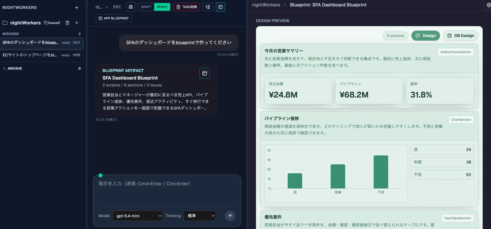

# NightWorkers


NightWorkers is a local-first autonomous development control plane. It coordinates project-scoped work sessions, runs supervisor-worker executions, and records verifiable run evidence such as events, logs, diffs, todos, test results, and final reports.



## Table of Contents
- [What NightWorkers Is](#what-nightworkers-is)
- [Why NightWorkers](#why-nightworkers)
- [Good Fit / Not Good Fit](#good-fit--not-good-fit)
- [Current Capabilities](#current-capabilities)
- [Current Limits](#current-limits)
- [Architecture](#architecture)
- [Requirements](#requirements)
- [Quick Start](#quick-start)
- [Credential-Free Demo](#credential-free-demo)
- [Five-Minute Orientation](#five-minute-orientation)
- [What You Should See First](#what-you-should-see-first)
- [Trust and Local-First Model](#trust-and-local-first-model)
- [Configuration](#configuration)
- [Development Commands](#development-commands)
- [Testing](#testing)
- [Documentation Map](#documentation-map)
- [Contributing](#contributing)
- [Security](#security)
- [License](#license)

## What NightWorkers Is
NightWorkers is not a chat UI with a task list attached. It is a local-first
control plane for autonomous development runs: you register a Project Folder,
work in a project-scoped Workbench Session, decide when a plan enters the
Implementation Queue, and inspect the run evidence that proves what happened.

The main adoption question is whether you want autonomous coding work to be
operated through durable local state: Project, Session, Queue, run events,
artifacts, diffs, todos, settings, and provider usage records.

If you are evaluating the project for the first time, start with:

1. [Feature Tour](./spec/feature-tour.md) to see the major surfaces and evidence
   each one creates.
2. [First Run Orientation](./spec/first-run-orientation.md) for the first
   throwaway-repo workflow.
3. [Adoption Checklist](./spec/adoption-checklist.md) before connecting real
   provider credentials, MCP servers, hooks, or a sensitive repository.

## Why NightWorkers
- Local-first operation with SQLite/libSQL by default, with desktop runtime
  state stored outside the repo checkout
- Structured run lifecycle with task/run/event persistence, so run outcomes do
  not depend on a live chat connection
- Model-provider aware LLM settings (OpenAI, Azure OpenAI, Bedrock, Codex SDK)
- Explicit separation between structured LLM providers and the implementation
  runtime lane such as `codex-agent`
- Non-authenticated MCP Server settings for the coding agent
- Agent Hooks settings for lifecycle command / HTTP automation
- Chat-first workbench flow with explicit Implementation Queue admission and run execution
- App Blueprint review with governed preview settings plus Plan Mode Workspace artifacts
- Clear current limits: no automatic PR/merge/deploy, no parallel multi-agent
  orchestration, and no required external memory service

## Good Fit / Not Good Fit
NightWorkers is a good fit when you want:
- Local-first autonomous coding runs with inspectable SQLite-backed state.
- Explicit approval before work enters an Implementation Queue.
- Evidence for what happened: tool calls, policy blocks, todos, diffs, tests,
  provider usage, artifacts, and final reports.
- A single-user desktop/local control plane for provider settings, MCP servers,
  Agent Hooks, and repo-scoped runs.

NightWorkers is not a good fit when you need:
- Hosted team collaboration or browser-only SaaS onboarding.
- Automatic PR creation, merge, release, or deploy as the default workflow.
- Parallel multi-agent orchestration over the same repository state.
- A hosted browser-only demo without installing the app locally.

## Current Capabilities
- Project Folder registration and per-project Session/Task management
- Dedicated Implementation Queue screen with Processor lanes, queued work, and not-queued plan-ready Sessions
- Global Processor capacity controls plus TODO Workflow gates for implementation runs
- Chat timeline inspection with run events, todo state, context output, diffs, and final reports
- DB-backed run event replay for Workbench WebSocket reattach through `runId` / `afterSeq` cursors
- Cursor-based run event API at `/api/runs/:id/events?afterSeq=...`
- Artifact pane with project tree and source file preview
- App Blueprint artifacts rendered as reviewable Blueprint Preview surfaces
- Design settings in Blueprint Preview for governed theme, density, shape, shadow, font, contrast, motion, and component variants
- Data Model artifacts in Plan Mode Workspace for canonical data structure design without applying physical database changes
- Separate adopted/not-adopted decisions for Blueprint artifacts and Design Token settings, tied to the Workbench session and source conversation message
- LLM provider settings UI and smoke-test API
- MCP Server settings UI for non-auth stdio / Streamable HTTP servers, with paste-import, immediate connection tests, ON/OFF controls, and legacy SSE compatibility
- Agent Hooks settings UI for `PreToolUse`, `PostToolUse`, `PostToolUseFailure`, `Stop`, and session lifecycle hooks
- MCP auth headers/API keys/secret-like env values are rejected; MCP tool calls stay in the runtime evidence path through the worker-tool bridge
- Agent Hook commands run through the hook runner, not recursive worker `run_command`, and failure summaries are redacted
- Health/readiness endpoints and API docs UI

## Current Limits
- No automatic PR creation/merge/deploy
- No multi-agent orchestration in parallel
- No mandatory external memory service requirement
- No hosted demo GIF/video in the repository docs yet

## Architecture
- Backend: Hono + TypeScript (`api/`)
- Frontend: React + Vite + TanStack Router (`src/`)
- Database: Drizzle ORM + SQLite/libSQL (`drizzle/`, `sqlite.db`)
- Shared schemas: Zod (`shared/schemas`)
- UI primitives: NightWorkers-owned components under `src/components/ui`

Details: [Architecture and Module Boundaries](./spec/architecture.md)

## Requirements
- Bun 1.3+
- Node.js 20+ only for the packaged desktop sidecar and Node-based tooling
- Rust toolchain and target OS build tools for desktop packaging

## Quick Start
1. Prepare local dependencies, environment, migrations, and seed data:
```bash
bun run setup
```
2. Start the app:
```bash
bun run dev
```

## Credential-Free Demo

The [Support Ops CRM deterministic demo](./demo/support-ops-crm/README.md)
creates a disposable Git Project, records Plan and Queue state, applies a fixed
implementation, runs real tests, and writes Review evidence without provider
credentials or a production repository:

```bash
bun run demo:setup
bun run demo:run
```

Inspect `.nightworkers-demo/evidence/review.json`, then clean up with
`bun run demo:reset`. CI uses `bun run demo:smoke` for the complete setup, run,
assertion, and reset lifecycle.

`setup` creates `.env` from `.env.example` only when `.env` does not already
exist, then applies migrations and seeds the local database.

Default URL: `http://localhost:39174`

After startup, use the [First Run Orientation](./spec/first-run-orientation.md).
The recommended first message is read-only:

```text
Inspect the repository structure and summarize the available test commands. Do
not edit files.
```

For the first run, prefer a throwaway repository or a repository where you can
review and discard changes before committing.

## What Happens When You Run Work
NightWorkers keeps chat, queue admission, execution, and review as separate
states:

1. Register a Project Folder.
2. Create or select a Workbench Session.
3. Send chat, planning, Blueprint, or direct execution requests.
4. Admit implementation-ready work into the Implementation Queue when you want
   automation to proceed.
5. Inspect the Run Timeline for state changes, tool calls, policy blocks, todo
   updates, diffs, test results, usage events, and final reports.
6. Review artifacts and diffs before committing anything in the target repo.

## Five-Minute Orientation
1. Open `http://localhost:39174` and confirm the Overview loads.
2. Register a Project Folder that you are comfortable using for local
   investigation. Start with a throwaway repo or a repo where you can review
   changes before committing them.
3. Create or select a Workbench Session for that project.
4. Send a read-only investigation request first, for example: "Inspect the repo
   structure and summarize the test commands without editing files."
5. Watch whether the message stays as normal Workbench chat or becomes an
   execution run. Runs create task events, todos, tool outcomes, diffs, and a
   final report.
6. Open the Artifact Pane only when the Session has produced artifacts such as
   a diff or App Blueprint.
7. Visit Settings before connecting real provider credentials, MCP servers, or
   Agent Hooks.

For a fuller step-by-step walkthrough, see
[First Run Orientation](./spec/first-run-orientation.md).

## What You Should See First
- Project Folder: the local repo root NightWorkers will use for workbench and
  worker-tool activity.
- Workbench Session: the chat-first workspace where intake, planning,
  Blueprint generation, and direct coding requests start.
- Run Timeline: persisted task events for execution state, tool outcomes, todo
  changes, diffs, test results, and final reports.
- Artifact Pane: project tree, source previews, diff artifacts, and Blueprint
  Preview when those artifacts exist.
- Implementation Queue: explicit user-approved automation work, separate from
  normal Session chat.
- Settings: LLM providers, MCP servers, Agent Hooks, and appearance.
- Overview: repository, queue, settings, usage, and warning summaries across
  the local NightWorkers workspace.

See [Feature Tour](./spec/feature-tour.md) for each surface's evidence
path and current limits.

## Trust and Local-First Model
NightWorkers stores its primary runtime state locally. Development mode uses the
repo-local database/settings/log defaults. Desktop mode uses
`NIGHTWORKERS_RUNTIME_DIR` when set; otherwise the Tauri sidecar resolves the
runtime directory from its desktop resource root. Registered Project work is
still performed relative to the registered Project repo root, not a temporary
provider or desktop resource directory.

Provider calls can include the current user request, supervisor prompt context,
StateCard continuity context when enabled, tool/result summaries, and relevant
artifact or task context. Usage records are normalized and stored locally.
Structured providers handle schema-first reasoning and generation; the runtime
lane handles repository execution. MCP servers and Agent Hooks are configured
locally, reject secret-like auth inputs in the current implementation slice,
and run through NightWorkers evidence paths instead of bypassing the ledger.

Read [Trust Model](./spec/trust-model.md) before connecting provider
credentials, MCP servers, hooks, or a repository that contains sensitive data.

## Desktop App
NightWorkers can also be built as a Tauri desktop app. The desktop shell launches
the Vite frontend in a WebView and manages the Node backend as a sidecar.

```bash
bun run desktop:build
bun run desktop:smoke
```

On macOS, the default generated app is written to:

```text
src-tauri/target/release/bundle/macos/NightWorkers.app
```

Linux and Windows package targets are prepared with platform-specific Tauri
config files. Run these on the matching OS build host:

```bash
bun run desktop:build:linux
bun run desktop:build:windows
```

Linux builds target `.deb`, `.rpm`, and AppImage artifacts. Windows builds target
x64 NSIS and MSI installers. `bun run desktop:check:cross-platform` verifies the
Linux/Windows bundle config and sidecar target metadata without launching a
non-macOS app.

Desktop runtime state is stored under the resolved runtime directory. Set
`NIGHTWORKERS_RUNTIME_DIR` to force a specific location; otherwise the packaged
app resolves it from the desktop resource root.

```text
${NIGHTWORKERS_RUNTIME_DIR}/
```

Desktop diagnostics are written under that runtime directory:

```text
logs/
```

The main files are `desktop.log` for the Tauri shell startup path, `sidecar.log`
for the bundled Node process stdout/stderr, and `api.log` for API request and
runtime events.

The default desktop build on macOS currently produces a verified `.app` artifact.
DMG creation is kept as a separate release gate via `bun run desktop:build:dmg`
because create-dmg can fail on local mount/Finder state. Signing requires
Developer ID credentials and is run separately with `bun run desktop:sign`.

## Configuration
Important environment variables:
- `DATABASE_URL`: SQLite/libSQL connection target (default local file: `sqlite.db`)
- `AUTH_MODE`: `local` / `oauth` / `both`
- `API_AUTH_REQUIRED`: opt-in protection for product APIs and the NightWorkers WebSocket. Defaults to `false` for local personal use; set `true` when intentionally exposing the app beyond localhost.
- `APP_URL`: required for OAuth and secure cookie scenarios
- `TRUST_PROXY`: set `true` behind reverse proxy
- `SESSION_QUEUE_MAX_CONCURRENCY`: legacy Session queue default retained for migration compatibility
- `CONVERSATION_CONTEXT_ENABLED`: enables the derived conversation context cache by default. Set `false` to disable StateCard build and runtime prompt injection.
- `CONVERSATION_CONTEXT_STATE_CARD_ENABLED`: requires `CONVERSATION_CONTEXT_ENABLED=true`; injects the latest compact StateCard into the runtime `latestUserMessage` only, leaving `tasks.compiled_prompt` raw.
- `CONVERSATION_CONTEXT_BUILD_ON_IDLE`: requires `CONVERSATION_CONTEXT_ENABLED=true`; refreshes the derived StateCard cache after Workbench intake and run completion.
- `NIGHTWORKERS_MCP_SETTINGS_PATH`: optional override for the MCP Server settings JSON path
- `NIGHTWORKERS_HOOKS_SETTINGS_PATH`: optional override for the Agent Hooks settings JSON path
- `NIGHTWORKERS_LLM_SETTINGS_PATH`: optional override for the LLM settings JSON path in tests or local experiments

Detailed runtime configuration:
- [Runtime Configuration Reference](./spec/configuration.md)

## Development Commands
| Command | Description |
| --- | --- |
| `bun run dev` | Start API + web in watch mode |
| `bun run build` | Build frontend and backend |
| `bun run start` | Start production backend bundle |
| `bun run desktop:dev` | Start the Tauri desktop app in development mode |
| `bun run desktop:build` | Build the default desktop artifact for the current OS |
| `bun run desktop:build:dmg` | Build a DMG release artifact as a separate gate |
| `bun run desktop:build:linux` | Build Linux `.deb`, `.rpm`, and AppImage artifacts on Linux |
| `bun run desktop:build:windows` | Build Windows NSIS and MSI installers on Windows |
| `bun run desktop:check:cross-platform` | Statically verify Linux/Windows desktop packaging readiness |
| `bun run desktop:lint` | Run Rust format and Clippy checks for the Tauri shell |
| `bun run desktop:prepare-sidecar` | Stage the Node sidecar runtime resources |
| `bun run desktop:smoke-sidecar` | Smoke-test the staged sidecar health endpoint |
| `bun run desktop:smoke` | Launch the packaged `.app` and verify API, WebSocket, logs, and shutdown |
| `bun run desktop:sign` | Sign/verify an app path when Developer ID credentials are available |
| `bun run demo:setup` | Create and register the disposable fixed-seed demo Project |
| `bun run demo:run` | Execute implementation, verification, Review, and evidence capture |
| `bun run demo:reset` | Remove all generated demo Project and runtime data |
| `bun run demo:smoke` | Run the credential-free demo lifecycle and reset it |
| `bun run release:check` | Check package, Tauri, CHANGELOG, release-note, tag, and optional manifest consistency |
| `bun run release:manifest` | After release verification, generate SHA-256 and signing/notarization artifact metadata |
| `bun run release:create` | Run release verification before a dry-run or explicit annotated tag creation |
| `bun run check:docs` | Check documented commands, local links/anchors, and completed-plan archive links |
| `bun run lint` | Run Biome checks |
| `bun run typecheck` | Run TypeScript checks |
| `bun run test` | Run Vitest |
| `bun run test:e2e` | Run Playwright E2E |
| `bun run test:e2e:agent-outcome` | Run deterministic agent outcome E2E |
| `bun run test:e2e:agent-live` | Run optional live-provider agent E2E |
| `bun run db:generate` | Generate Drizzle migrations from schema changes |
| `bun run db:migrate` | Apply Drizzle migrations |
| `bun run db:studio` | Open Drizzle Studio |
| `bun run db:seed` | Seed local development data |
| `bun run cleanup:test-data:dry-run` | Preview cleanup of TEST-prefixed local data |
| `bun run cleanup:test-data` | Delete TEST-prefixed local data |
| `bun run verify:base` | Run the base gate with static checks in parallel, then supervisor regression tests |
| `bun run verify:desktop` | Run desktop runtime tests and lint in parallel, then build the `.app` and run sidecar/packaged smoke |
| `bun run verify` | Run the same lightweight base gate as `verify:base` |
| `bun run verify:fast` | Alias for `verify:base` |
| `bun run verify:full` | Run the complete slow suite: all tests, E2E/accessibility, audit, desktop build/smoke, and opt-in live LLM checks |
| `bun run verify:e2e` | Run the credential-free Playwright smoke gate |
| `bun run verify:audit` | Enforce the High/Critical dependency audit policy |
| `bun run verify:release` | Run metadata/docs, full tests, E2E, demo, dependency, and desktop release gates |

## Testing
- Default gate: `bun run verify` runs the lightweight base gate: tracked-artifact check, TypeScript, and Biome first in parallel, then supervisor regression tests serially.
- Fast gate: `bun run verify:fast` is an alias for `verify:base`.
- Desktop gate: `bun run verify:desktop` remains separate. It runs desktop runtime tests and desktop lint first in parallel, then current-OS Tauri desktop build, staged sidecar smoke, and packaged app smoke serially.
- Full gate: `bun run verify:full` is intentionally slow and opt-in. It runs the base gate, the full non-live Vitest suite, Playwright smoke/accessibility, deterministic demo, dependency audit, desktop runtime/lint/build/smoke, then live LLM Vitest and agent E2E. Live checks still skip unless `NIGHTWORKERS_LIVE_LLM_VITEST=1` or `NIGHTWORKERS_LIVE_LLM_E2E=1` and credentials are configured.
- Dependency gate: `bun run verify:audit` fails on every unallowlisted High/Critical advisory. Temporary exceptions require an advisory ID, owner, reason, mitigation, and expiry in `config/dependency-audit-allowlist.json`.
- Release gate: `bun run verify:release` is the only release-ready entrypoint. It checks release metadata and docs and runs the deterministic full profile. Opt-in live-provider checks remain exclusive to `verify:full` / `verify:live` so release reproducibility does not depend on an external provider.
- Coverage report: `bun run test:coverage` runs the same non-E2E/non-live Vitest suite with V8 coverage and writes `coverage/coverage-summary.json`; use the summary to track statements, branches, functions, and lines toward the 80% target.
- Packaged desktop smoke: `bun run desktop:smoke` can also be run directly as the release/adoption smoke for launching the built `.app` and verifying API, WebSocket, logs, and shutdown.
- Smoke E2E: `bun run test:e2e:smoke` remains separate until local app/server prerequisites are explicitly available.
- Husky hooks: `pre-commit` and `pre-push` both run only the fast `bun run verify` gate; they never run E2E, desktop build/smoke, or live LLM calls.
- Unit/integration: Vitest
- End-to-end: Playwright (`@smoke`, `@regression` tags)
- Agent outcome E2E: `bun run test:e2e:agent-outcome` uses the deterministic `test` provider, scratch git workspaces, real API/DB/run event paths, and requires no provider credentials. Set `KEEP_E2E_WORKSPACE=1` to keep the scratch workspace after a failure.
- Live agent E2E: `bun run test:e2e:agent-live` is optional and skips unless provider credentials are configured.
- If validation fails, first identify the phase that failed: TypeScript (`bun run typecheck`), Biome (`bun run lint`), desktop packaging readiness (`bun run desktop:check:cross-platform`), Rust/Tauri (`bun run desktop:lint` / `bun run desktop:build`), sidecar or packaged smoke (`bun run desktop:smoke-sidecar` / `bun run desktop:smoke`), Vitest (`bun run test run`), coverage (`bun run test:coverage`), or Playwright (`bun run test:e2e:smoke`).
- Do not describe a red Full Vitest or coverage run as passing. Record the failing command, failing test file(s) or below-target metric, and the next repair target separately from any green narrower gate used for interim confidence.
- Recommended pre-PR validation:
```bash
bun run verify
```
Run `bun run verify:full` explicitly when the complete slow suite is warranted. Targeted `verify:e2e`, `verify:desktop`, `verify:audit`, and `verify:live` commands remain available. Release candidates must pass `bun run verify:release`.
Before a release, run `bun run verify:release`; tag creation through
`bun run release:create -- --execute` is blocked unless that command succeeds.

## Documentation Map
This repository uses the following documentation layout.

- GitHub-rendered OSS documents (root):
  - [`CONTRIBUTING.md`](./CONTRIBUTING.md)
  - [`CODE_OF_CONDUCT.md`](./CODE_OF_CONDUCT.md)
  - [`SECURITY.md`](./SECURITY.md)
  - [`SUPPORT.md`](./SUPPORT.md)
  - [`GOVERNANCE.md`](./GOVERNANCE.md)
  - [`CHANGELOG.md`](./CHANGELOG.md)
- Adoption and first-run references:
  - [`Trust Model`](./spec/trust-model.md)
  - [`First Run Orientation`](./spec/first-run-orientation.md)
  - [`Feature Tour`](./spec/feature-tour.md)
  - [`Adoption Checklist`](./spec/adoption-checklist.md)
  - [`Documentation Maintenance Checklist`](./spec/archive/documentation-maintenance-checklist.md)
  - [`Credential-Free Demo`](./demo/support-ops-crm/README.md)
  - [`0.1.0 Release Notes`](./spec/release-notes/0.1.0.md)
- Engineering specs and internal references:
  - `spec/docs/` (primary specification/reference docs)
  - [`Architecture and Module Boundaries`](./spec/architecture.md)
  - [`Runtime Configuration Reference`](./spec/configuration.md)
- `spec/public/` (public-facing specs managed outside GitHub-rendered root docs)

Note: `spec/public/` is reserved for non-GitHub-public spec artifacts. GitHub-rendered documents are intentionally kept at the repository root.

## Contributing
Please read [CONTRIBUTING.md](./CONTRIBUTING.md) before opening issues or pull requests.

## Security
Please report vulnerabilities via [SECURITY.md](./SECURITY.md).

## License
MIT
