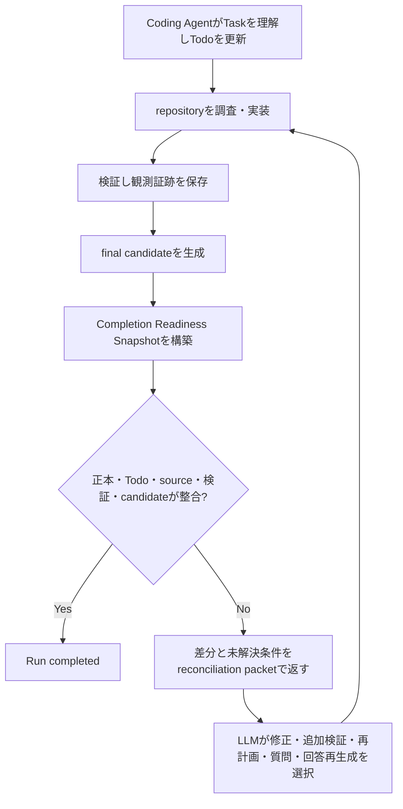

# Coding Agent Balanced Execution Plan

## Status

- Plan status: `completed`
- Created: 2026-07-19
- Target repository: `/Users/y.noguchi/Code/nightWorkers`
- Incident repository: `/Users/y.noguchi/Code/todolist`
- Related plan: `spec/docs/coding-agent-runtime-reliability-recovery-plan.md`
- Primary scope: Coding Agent completion readiness、verification reconciliation、Codex / Native runtime closeout

### Implementation result（2026-07-19）

- Phase 0: Todo終端だけで誤完了するcontroller fixtureとactive verification document統合fixtureを追加済み。
- Phase 1: Task、Run、source hash、active verification document、completion check、candidateを統合するreadiness projectionを実装済み。
- Phase 2: Coding Agent role moduleへfinalize controllerを移し、active verification document未達時の`FINALIZE_RECONCILIATION_REQUIRED`を実装済み。
- Phase 3: Codex SDK / Native APIの両laneへ同じreadiness reconciliationとprior candidate保持を接続済み。
- Phase 4: discrepancy集約、compact recovery packet、Native context compaction時のdigest・paging相当情報・構造化readiness保持を実装済み。
- Phase 5: targeted 36件、全Vitest、`bun run verify`、`bun run check:architecture`が成功。両laneのreadiness scenarioは3回以上連続成功。

## 1. 結論

Coding AgentのTodo、実装、検証、完了報告を別々の強制workflowにせず、最終回答候補が出た時点で次の正本を一つのreadiness snapshotへ集約する。

1. Task Goalと確定済み仕様
2. Todo planとcurrent state
3. 現在のworkspace source state
4. 同じsource stateに対する検証証跡
5. 直前のfinal candidate

Hostはこれらの意味を独自判定せず、相互に矛盾していないか、必要な観測が欠落していないかという構造条件だけを確認する。不足がある場合は固定文で拒否せず、差分、raw evidence参照、未解決条件、直前候補をCoding Agentへ返す。Coding Agentはそのpacketから、実装修正、追加検証、Todo再計画、`needs_human`、回答再生成のうち合理的な次actionを選ぶ。

Todoは作業記憶と進行管理、source diffは成果物、verification evidenceは観測事実、final candidateはユーザー向け判断として扱い、いずれか一つを他の代用にしない。

## 2. 現状との差

現行`RunFinalizeController`は、Todo planが存在し、`pending`、`running`、`needs_human`が残っていなければ`FINALIZE_ALLOWED`を返す。Taskにactive verification documentがあっても、`runCompletionCheck`の結果は参照しない。

そのためtodolist Runでは、必須条件8件がすべてunknown、active test discoveryなし、successful test executionなし、successful full verifyなしでも、Todoをすべて`passed`へ遷移することでRunが`completed`になった。

一方、次の基盤は既に存在するため再実装しない。

- Run-local `todoKey`とcanonical Todo ID
- request-scoped authority
- Codex State Cardとresume fallback
- command resultのexit code、raw stdout / stderr、process identity
- workspace `sourceStateHash`
- test inventoryとacceptance condition mapping
- `runCompletionCheck`とquality gate
- prior final candidateとcandidate revision event
- Codex / Native共通recovery guidance

本計画は、これらを完了reconciliationへ接続する差分に限定する。

## 3. 設計原則

### 3.1 LLMが所有する判断

- Taskの意味と実装範囲
- Todoの分割、更新、skip、追加
- どの変更と検証が十分かという評価
- 観測失敗後の次action
- ユーザーへ返す最終本文

### 3.2 Hostが所有する構造条件

- Task、Run、repository、verification documentのauthority一致
- Todo planとTodo revisionの整合
- 同時running一件、明示Todo mutation、idempotency
- 検証証跡と現在の`sourceStateHash`の一致
- active verification documentに記載されたrequired conditionが未確認のまま、`completed`と矛盾しないこと
- final candidateが最新readiness snapshotを読んだturnから生成されていること

Hostはユーザー文言やerror messageをkeyword分類せず、受入条件を追加せず、Todoを暗黙更新しない。

### 3.3 検証の適用範囲

- active verification documentがあるTaskでは、そのdocumentを正本としてreadinessを評価する。
- verification documentがないTaskでは、HostがTask種別を推測して新しいgateを作らない。Todo構造条件とLLM判断を維持する。
- `failed`または`skipped` Todoは過去の試行としてsnapshotへ残すが、それだけでTask失敗または成功を決めない。
- 特定toolの呼び出しを完了条件にしない。現在sourceに対応するevidenceが存在するかを確認する。

## 4. Target control loop



reconciliationは新しいmodeではなく、通常runtimeの次turnである。Coding Agentのtool surfaceとnative commandは維持する。

## 5. Completion Readiness contract

Coding Agent固有contractとして次のprojectionを追加する。

```ts
type CodingAgentCompletionReadiness = {
  authority: {
    taskId: string;
    runId: string;
    repositoryRoot: string;
    verificationDocumentId: string | null;
  };
  task: {
    goalDigest: string;
    specificationRefs: string[];
  };
  todo: {
    planRevision: number;
    counts: Record<string, number>;
    currentTodoId: string | null;
    todoRevisions: Record<string, number>;
  };
  workspace: {
    sourceStateHash: string;
  };
  verification: {
    applicability: "active" | "not_configured";
    checkedSourceStateHash: string | null;
    result: CompletionCheckResult | null;
  };
  candidate: {
    revision: number;
    digest: string;
  };
  discrepancies: Array<{
    code: string;
    summary: string;
    rawRef?: string;
  }>;
  satisfactionConditions: string[];
};
```

`CompletionCheckResult`と`sourceStateHash`は既存schemaとserviceを再利用する。新しい意味判定schemaを重複して作らない。

### Readiness outcome

- `ready`: Todo構造が整合し、active verification documentがある場合は現在sourceに対するcompletion checkが成功し、最新candidateがそのsnapshotより後に生成されている。
- `reconcile`: 修正可能な不足または矛盾がある。Runをterminalにせず、packetを次turnへ返す。
- `needs_human`: LLMがTodo mutationで明示した外部判断待ちを維持する。
- `failed`: runtime障害またはLLMが自力完結不能と判断した既存failure経路を維持する。

## 6. 実装フェーズ

### Phase 0: 誤完了を回帰fixtureとして固定

#### 実装

1. Todoをすべて`passed`にするが、active verification documentのrequired conditionがunknownのfixtureを追加する。
2. `completion_check.ok = false`でも現行controllerが`FINALIZE_ALLOWED`を返すbaselineを失敗testとして固定する。
3. todolist実測を抽象化し、test未発見、test未実行、full verify未実行をそれぞれ独立scenarioにする。
4. source変更後に過去のgreen evidenceがstaleになるscenarioを追加する。

#### 主な対象

- `tests/run-control/completion-preconditions.cases.ts`
- `tests/codex-agent-runtime/llm-owned-contract.cases.ts`
- `tests/native-api-runner/llm-owned-contract.cases.ts`
- quality gate tests

#### 受け入れ条件

- production変更前に、Todo終端だけで誤完了する現象が一つの原因として再現する。
- 各fixtureがTodo mutation failureやprovider failureではなく、verification未接続を理由に失敗する。

### Phase 1: Readiness projection service

#### 実装

1. `api/modules/codingAgent/application/completion-readiness.service.ts`を追加する。
2. Task / Run authority、Todo snapshot、workspace source snapshot、active verification document、`runCompletionCheck`結果、candidate revisionを一度に取得する。
3. DB rowやtool名を直接LLMへ並べず、共通recovery guidance形式のobservation、discrepancy、raw refへ正規化する。
4. 同じ`sourceStateHash`に対応しないinventory、mapping、test evidence、full verifyはstale observationとして示す。
5. verification documentがない場合は`not_configured`とし、Hostが要求を追加しない。

#### 主な対象

- `api/modules/codingAgent/application/completion-readiness.service.ts`
- `api/modules/codingAgent/context/types.ts`
- `shared/modules/codingAgent`
- `api/modules/codingAgent/verification/quality-gate.service.ts`は再利用のみ

#### 受け入れ条件

- 一つのsnapshotからTask、Todo、source、verification、candidateの関係を追跡できる。
- required conditionのmissing mapping、test未実行、full verify未実行、source staleが別codeで返る。
- projection作成でTodo、checklist、Task statusを変更しない。

### Phase 2: Finalize controllerとの接続

#### 実装

1. Coding Agent固有のfinalize controllerを`api/modules/codingAgent/application`へ置く。
2. 既存のTodo / revision precondition判定後、readiness projectionを評価する。
3. active verification documentがあり`completion_check.ok = false`なら、`FINALIZE_RECONCILIATION_REQUIRED`とsnapshotを返す。
4. 現在sourceに対応したinventory、test execution、full verify、required condition mappingが揃った場合だけ`ready`にする。
5. `not_configured`では従来のTodo構造条件とLLM判断を維持する。
6. 旧`api/services/run-control/finalize-controller.ts`にはAgent非依存composition以外を残さない。

#### 受け入れ条件

- Todo終端だけでは、active verification document付きRunを完了できない。
- HostがTodoを追加、再開、passedへ変更しない。
- failed verificationはRun failureへ自動変換されず、LLMが次actionを選べる。
- green evidence後にsourceが変わるとreconciliationへ戻る。

### Phase 3: Codex / Native runtime共通reconciliation

#### 実装

1. Codex SDK runtimeとNative API runnerのfinal candidate処理を同じapplication serviceへ接続する。
2. `buildCodingAgentCompletionRecoveryFeedback`へreadiness snapshotを追加する。
3. prior candidate、latest user request、Todo snapshot、verification discrepancy、raw evidence refを次turnへ保持する。
4. candidate revisionとreadiness revisionを関連付け、古いcandidateの誤採用を防ぐ。
5. retry turnでも通常のtool surfaceを維持し、固定された修正順やtool allowlistを追加しない。

#### 主な対象

- `api/modules/codingAgent/runtime/CodexAgentRuntime.ts`
- `api/modules/codingAgent/runtime/native-api-runner/native-api-run-coordinator.ts`
- `api/modules/codingAgent/context/recovery-guidance.ts`
- candidate event persistence

#### 受け入れ条件

- 両runtime laneが同じ不足に対して同じreadiness codeを返す。
- reconciliation後も元Taskのfinal candidateが失われない。
- LLMはpacketから新しい修正Todoを追加できる。
- reconciliation turnがTodo説明だけで終わっても、その本文だけを最終成果として採用しない。

### Phase 4: Evidence取得の誘導とwarning圧縮

#### 実装

1. System Contextへtool義務ではなく、readiness discrepancyを次actionの判断材料として扱う説明を追加する。
2. `run_check`、test inventory、condition mapping、completion checkの既存説明を、入力と返却されるevidenceの関係が分かる文言へ揃える。
3. native command結果はraw observationとして保持するが、required conditionをHostが自動充足しない。
4. 同じ原因のcontract warningをturn内で集約し、件数、最初と最後のevent ref、現在の未解決状態を一つのdiscrepancyとして返す。
5. Todo revision conflictではlatest plan revision、canonical ID、Todo revisionを一つの訂正packetで返す。

#### 受け入れ条件

- Coding Agentは不足理由と、それを確認可能にする既存能力を同時に把握できる。
- 同一原因のwarning反復がTask Goalやverification resultをcontext外へ押し出さない。
- toolを使うかnative commandを使うかはLLMが選べる。

### Phase 5: 統合回帰とrollout

#### 統合scenario

1. active verification documentと8件のrequired conditionを持つ実装Taskを開始する。
2. 妥当なTodo planを作り、部分実装後にTodoを一度すべて終端化する。
3. final candidate生成時にreadiness reconciliationへ戻ることを確認する。
4. packetから不足test、condition mapping、full verify、E2E失敗を認識する。
5. Coding Agentが修正Todoを追加し、実装と検証を更新する。
6. source変更で古いevidenceがstaleになることを確認する。
7. 現在sourceでinventory、focused test、full verifyを成功させる。
8. required conditionをすべて解決し、新しいfinal candidateで完了する。
9. 同じscenarioをCodex SDK / Native APIの両laneで実行する。

#### Rollout条件

- active verification document付きRunで、`completion_check.ok = false`かつ`completed`となる件数が0。
- verification documentなしの質問・read-only Taskに回帰がない。
- reconciliationから追加の人手介入なしで復旧できる。
- `bun run verify`がgreen。
- `bun run check:architecture`がgreen。
- 統合scenarioが両laneで3回連続成功する。
- Candidate、Todo、source hash、verification result、final reportが同じRun結果を示す。

## 7. Test matrix

| Scenario | Expected |
| --- | --- |
| Todo open | Todo snapshot付きreconciliation |
| Todo terminal、verification unknown | verification不足付きreconciliation |
| required test mappingなし | condition IDとmissing mappingを返す |
| test失敗 | raw evidence refと失敗状態を返す |
| full verifyなし | full verify不足を返す |
| green verify後にsource変更 | evidence staleとしてreconciliation |
| 現在sourceで全条件green | finalize可能 |
| verification documentなし | Hostが新条件を作らない |
| prior candidateあり | reconciliation後もcandidate保持 |
| stale Todo revision | latest canonical ID / revisionを返す |
| needs_human Todoあり | 既存needs_human outcomeを維持 |
| Codex / Native | 同じreadiness結果 |

## 8. 観測指標

- `verification_not_ready`状態から自律復旧した率
- active verification document付き誤完了件数
- source変更後のstale evidence検出率
- reconciliation一回あたりの重複warning件数
- final candidate revisionから完了までのturn数
- Todo mutation、source mutation、verification evidence、final candidateのevent相関
- 同一受入条件の再失敗率

指標はTask成功を自動判定するscoreには使わず、制御ループの偏りと復旧性を観測するために使う。

## 9. 実装Todo案

1. verification未接続による誤完了fixtureを追加する。
2. Completion Readiness contractとprojection serviceを実装する。
3. finalize controllerをCoding Agent role moduleへ移しreadinessへ接続する。
4. Codex / Native runtimeを共通reconciliationへ接続する。
5. recovery packetへTask、Todo、source、verification、candidate差分を統合する。
6. warning集約とrevision訂正guidanceを実装する。
7. targeted testと両lane統合scenarioを実行する。
8. full verifyとarchitecture checkを実行する。
9. 差分、観測指標、未解決事項をreviewして報告する。

## 10. 完了条件

本計画は次をすべて確認した時点で完了とする。

- Todo terminalだけではactive verification document付きRunが完了しない。
- verification未達時、禁止文ではなく具体的なobservations、discrepancies、raw refs、satisfaction conditionsがLLMへ返る。
- LLMがTodo、実装、検証、回答のどこを更新するか選べる。
- HostがTask意味、Todo状態、受入条件を暗黙更新しない。
- 現在sourceに対応する検証証跡だけがreadinessへ採用される。
- verification documentがないTaskへ新しい固定workflowを適用しない。
- Codex SDK / Native APIの両laneが同じcompletion contractを使う。
- targeted test、`bun run verify`、`bun run check:architecture`が成功する。
- todolist相当の統合scenarioが3回連続で正しくreconciliationから完了へ収束する。
