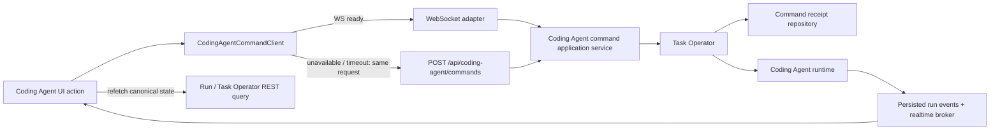

# Coding Agent Command / Realtime Transport 実装計画

## Status

- 対象: Coding Agent の start / stop / Todo resume と NightWorkers realtime
- 基準コミット: `b580bd93`
- 作成日: 2026-08-02
- 実装状態: 完了（release canary の実操作確認だけを配備時に実施）
- 実装単位: PR 1〜5相当を適用済み

## 1. 目的

Coding Agent の lifecycle command を、同じ業務契約・認可・revision・idempotency で REST と WebSocket の両方から実行できるようにする。

最終構成は次のとおりとする。

| 対象 | command | realtime / state |
| --- | --- | --- |
| Coding Agent start / stop / Todo resume | WebSocket を優先し、同一 request を REST へ fallback 可能にする | WebSocket で通知し、REST query で正本へ収束する |
| Coding Agent run event / delta / progress | command には使わない | WebSocket を主経路とし、persisted run cursor で再生する |
| Workbench のユーザー入力 | 既存 REST を維持する | 既存 WebSocket notification を維持する |
| ProjectDetail の query / mutation | 既存 REST を維持する | 必要な既存 notification だけを利用する |
| Mission Pilot UI の Play / Stop | 既存 REST を維持する | package-owned WebSocket notification を維持する |
| Mission Pilot runtime からの Coding Agent 依頼 | Task Operator Host Port を維持する | REST / WebSocket を経由させない |

## 2. 固定する実装方針

### 2.1 対象 command

この計画で transport を追加する action は次の3つだけとする。

| actionId | 入力 | Task Operator capability |
| --- | --- | --- |
| `run.implementation.start` | `request?: string` | `implementation` |
| `run.stop` | `runId: UUID` | `implementation` |
| `run.todo.resume` | `runId`, `todoId`, `expectedTodoRevision`, `userContext` | `implementation` |

action の availability、JSON schema、resource ownership、Task revision、delegated authorization は既存 Task Operator を正本とする。transport adapter に同じ判定を複製しない。

### 2.2 REST と WebSocket の関係

- REST と WebSocket は同じ command request schema と同じ application service を使う。
- WebSocket handler は decode、接続 principal の付与、application service 呼び出し、response encode だけを行う。
- WebSocket 接続の有無で Coding Agent runtime の mode や workflow を変えない。
- client は1回のユーザー操作に対して1組の `requestId` と `idempotencyKey` を生成する。
- WebSocket timeout、disconnect、REST fallback では同じ request を再送する。
- ユーザーが改めて操作した場合だけ新しい `requestId` と `idempotencyKey` を生成する。
- reconnect を理由に未完了 command を自動再送しない。

### 2.3 principal と revision

- wire payload に principal、capability、delegation を含めない。
- REST は HTTP context、WebSocket は upgrade 済み connection context から human principal を構築する。
- `expectedTaskRevision` は UI が表示した Task Operator projection の `task.revision` を送る。
- server は stale revision を最新値へ置き換えず、既存の typed revision conflict を返す。
- Todo resume は `expectedTaskRevision` に加えて `expectedTodoRevision` も検証する。

### 2.4 state の正本

- command response は command の成否と receipt を表す。
- run の最新状態は Run query、Task の最新状態は Task Operator projection を正本とする。
- `task_event_created` の再生 cursor は `runId + persisted seq` とする。
- broker の memory replay と自動採番 `seq` は persisted run cursor として扱わない。
- notification 受信後は既存 React Query cache を更新または invalidate し、正本 query へ収束させる。

### 2.5 互換性

次の既存 REST route は削除しない。

- `POST /api/tasks/:id/run`
- `POST /api/workbench/sessions/:id/run`
- `POST /api/runs/:id/stop`
- `POST /api/runs/:id/todos/:todoId/resume`

これらは既存 response shape を維持し、新しい Coding Agent command application service へ委譲する compatibility adapter に変更する。

## 3. 目標フロー



## 4. 公開 contract

### 4.1 配置

次のファイルを新規作成する。

- `shared/modules/codingAgent/coding-agent-command-contract.ts`

次のファイルから公開する。

- `shared/modules/codingAgent/index.ts`

contract 名は以下で固定する。

- `CODING_AGENT_COMMAND_PROTOCOL_VERSION`
- `CODING_AGENT_COMMAND_WS_CAPABILITY`
- `codingAgentCommandRequestV1Schema`
- `codingAgentCommandResponseV1Schema`
- `CodingAgentCommandRequestV1`
- `CodingAgentCommandResponseV1`

### 4.2 Command request

```ts
type CodingAgentCommandRequestV1 =
  | {
      version: 1;
      type: "coding_agent.command.execute";
      requestId: string;
      idempotencyKey: string;
      taskId: string;
      actionId: "run.implementation.start";
      expectedTaskRevision: number;
      arguments: { request?: string };
    }
  | {
      version: 1;
      type: "coding_agent.command.execute";
      requestId: string;
      idempotencyKey: string;
      taskId: string;
      actionId: "run.stop";
      expectedTaskRevision: number;
      arguments: { runId: string };
    }
  | {
      version: 1;
      type: "coding_agent.command.execute";
      requestId: string;
      idempotencyKey: string;
      taskId: string;
      actionId: "run.todo.resume";
      expectedTaskRevision: number;
      arguments: {
        runId: string;
        todoId: string;
        expectedTodoRevision: number;
        userContext: string;
      };
    };
```

Zod schema では次を制約する。

- `requestId`: UUID
- `idempotencyKey`: 1〜256文字
- `taskId`、`runId`、`todoId`: UUID
- revision: 0以上の整数
- `request`: trim 後1〜20,000文字
- `userContext`: trim 後1〜20,000文字
- 各 `arguments`: `.strict()`
- union 全体: `.strict()`

`run.implementation.start` の `request` を省略した場合は、server が現在の `startHumanTaskImplementation` と同じ規則で request を解決する。

1. 最新 Run 更新後の最後の user message
2. Task objective
3. `Task「<title>」を実装し、検証まで完了してください。`

この解決処理は1つの application function に移し、REST と WebSocket から共用する。

### 4.3 Command response

```ts
type CodingAgentCommandResponseV1 = {
  version: 1;
  type: "coding_agent.command.result";
  requestId: string;
  result:
    | {
        ok: true;
        receipt: TaskOperatorCommandReceipt;
        data: {
          taskId: string;
          runId: string;
        };
      }
    | {
        ok: false;
        error: TaskOperatorFailure;
      };
};
```

- `receipt.commandId` は server が既存 command receipt 作成時に発行する。
- `receipt.replayed` は同一 idempotency delivery の再取得時に `true` とする。
- REST と WebSocket は同じ response encoder を使う。
- REST は PR 1 で共通化する `TaskOperatorFailure` の status mapping で HTTP status を返す。
- WebSocket は接続を閉じず、`coding_agent.command.result` の `result.ok: false` を返す。
- command response に TaskRun 全体を埋め込まない。client は `runId` で Run query を再取得する。
- 新 REST endpoint の success は HTTP 200、failure は共通 converter の status code を使用する。legacy start route の HTTP 201 は維持する。

### 4.4 WebSocket capability

既存 `connected` response に次を追加する。

```ts
{
  type: "connected";
  timestamp: string;
  capabilities: ["coding_agent.command.v1"];
}
```

- client は capability がある場合だけ WebSocket command を使う。
- capability がない server では同じ command request を REST へ送る。
- server-first、client-second の配備順で旧 client / 新 client の双方を維持する。

## 5. Client fallback 契約

`CodingAgentCommandClient.execute` は次の順序を固定する。

1. UI intent 開始時に request を1回だけ構築する。
2. 画面の action availability 判定に使用した Task Operator projection から `expectedTaskRevision` を設定する。command 直前に revision だけを裏で再取得しない。
3. `requestId` と `idempotencyKey` を生成し、request object を pending map に保存する。
4. WebSocket が open かつ `coding_agent.command.v1` を advertise している場合は WebSocket へ送る。
5. WebSocket response を10秒待つ。
6. capability なし、接続なし、disconnect、10秒 timeout の場合は、保存した同一 request を `POST /api/coding-agent/commands` へ送る。
7. success 時は `data.runId` で Run query を取得し、既存 mutation の cache update を実行する。
8. `TASK_OPERATOR_COMMAND_IN_PROGRESS` または `TASK_OPERATOR_COMMAND_OUTCOME_UNKNOWN` の場合は新しい key で再実行せず、Task Operator projection と Run list を invalidate する。
9. revision conflict の場合は projection を refetch し、ユーザーの再操作を待つ。自動的に新 revision で再実行しない。
10. component unmount 後は response を cache mutationへ適用しないが、server command を取り消した扱いにはしない。

pending map の key は `requestId` とし、response 受信、REST fallback の `finally`、client dispose のいずれかで必ず削除する。command cancellation はこの client の責務に含めない。

## 6. 実装順序

### PR 1: 共通 contract、application service、REST endpoint

#### 変更ファイル

新規:

- `shared/modules/codingAgent/coding-agent-command-contract.ts`
- `api/modules/codingAgent/application/coding-agent-command.service.ts`
- `api/modules/commandDelivery/task-operator-command-failure.ts`
- `tests/coding-agent-command-contract.test.ts`
- `tests/coding-agent-command-http.test.ts`

更新:

- `shared/modules/codingAgent/index.ts`
- `api/modules/codingAgent/coding-agent.routes.ts`
- `api/modules/codingAgent/index.ts`
- `api/modules/taskOperator/task-operator-http-context.ts`
- `api/modules/commandDelivery/command-delivery.repository.ts`
- `api/modules/commandDelivery/index.ts`
- `api/modules/task/application/task-operator.query.ts`
- `api/modules/task/index.ts`
- `api/modules/run/application/run-operator.query.ts`
- `api/modules/run/index.ts`
- `api/modules/nightworkers/nightworkers.route-handlers.ts`
- `api/modules/nightworkers/nightworkers.routes.ts`

#### 作業

1. Section 4 の shared schema と型を追加する。
2. `humanTaskOperatorCommandContext` の input を `{ requestId?: string; idempotencyKey?: string }` に変更する。`requestId` は `input.requestId ?? crypto.randomUUID()`、`idempotencyKey` は `input.idempotencyKey ?? requestId` で決定する。
3. Task module に `readLatestTaskUserMessageAfter({ taskId, after })` を追加し、該当する最後の user message の完全な canonical content を返す。
4. Run module に `readLatestTaskRunReference(taskId)` を追加し、`{ runId, updatedAt } | null` を返す。
5. `task-operator-command-failure.ts` に AppError から `{ failure: TaskOperatorFailure, statusCode }` への変換を抽出し、command receipt 保存と REST/WS response encoder から共用する。少なくとも次の code mapping を固定する。
   - `TASK_OPERATOR_PERMISSION_DENIED` -> `permission_denied`
   - `TASK_REVISION_CONFLICT` -> `revision_conflict`
   - `TASK_RESOURCE_OWNERSHIP_MISMATCH` -> `ownership_mismatch`
   - `TASK_OPERATOR_IDEMPOTENCY_CONFLICT` -> `idempotency_conflict`
   - `TASK_OPERATOR_SCHEMA_VALIDATION` / `TASK_OPERATOR_ARGUMENT_REQUIRED` -> `schema_validation`
   - HTTP 404 -> `not_found`
   - HTTP 429 -> `resource_limit`
   - その他の既知4xx -> `domain_precondition`
   - 5xx / unknown error -> `internal`
6. `coding-agent-command.service.ts` に次を実装する。
   - request schema parse 後の action dispatch
   - server-side human principal / command context の受け取り
   - start request の既存規則による解決
   - 3 action から既存 `executeTaskOperatorCommand` への変換
   - `{ taskId, runId }` への結果正規化
   - PR 1 step 5 の共通 converter を使った failure response 生成
7. `POST /coding-agent/commands` を `codingAgentRouter` に追加する。app の `/api` mount により公開 path は `POST /api/coding-agent/commands` とする。
8. 既存4 REST handler を application service へ委譲する。
   - 既存 handler は path parameter と body を新 contract へ変換する。
   - compatibility request の `requestId` は毎回 `crypto.randomUUID()`、`idempotencyKey` は `Idempotency-Key` header、header がない場合は同じ `requestId` を使用する。
   - legacy handler は current Task revision を取得して compatibility request に設定する。
   - legacy handler は `runId` から既存 TaskRun を再取得し、現在の HTTP response shape/status を維持する。
9. `startHumanTaskImplementation` にある request 解決ロジックを application service へ移し、重複実装を残さない。

#### Test

`tests/coding-agent-command-contract.test.ts`:

- 3 action の valid/invalid schema
- principal field と未知 field の拒否
- UUID、revision、文字数上限
- response の success/failure schema

`tests/coding-agent-command-http.test.ts`:

- start / stop / Todo resume の success
- start request 省略時の3段階解決規則
- stale Task revision
- stale Todo revision
- unavailable action
- resource ownership mismatch
- same key + same input の replay
- same key + different input の idempotency conflict
- legacy 4 route の response compatibility

#### 完了条件

- 新 REST endpoint と legacy 4 route が同じ application service と Task Operator command を通る。
- 同一 delivery から Run/message が重複生成されない。
- frontend はまだ変更せず、既存 UI がそのまま動作する。
- DB migration は発生しない。

### PR 2: WebSocket command adapter

#### 変更ファイル

新規:

- `api/modules/codingAgent/adapters/coding-agent-command-websocket.adapter.ts`

更新:

- `api/modules/codingAgent/index.ts`
- `api/security/nightworkers-websocket-policy.ts`
- `api/app.ts`
- `tests/websocket-security.test.ts`

#### 作業

1. `nightWorkersWsClientMessageSchema` に shared `codingAgentCommandRequestV1Schema` を追加する。
2. WebSocket adapter に次だけを実装する。
   - connection 由来の human principal 構築
   - Section 4 request の application service 呼び出し
   - Section 4 response の encode
3. `api/app.ts` の `onMessage` から adapter を呼ぶ。Task Operator、Run service、message repository を `api/app.ts` から直接呼ばない。
4. `connected.capabilities` に `coding_agent.command.v1` を追加する。
5. binary payload、128 KiB 上限、Origin allowlist、invalid JSON の既存 policy を維持する。
6. `api/app.ts` の parse 前 log から `rawPreview` を削除し、`rawBytes` だけを記録する。parse 後の command log は `requestId`、`actionId`、`taskId`、result code、latency に限定し、`request` と `userContext` を記録しない。
7. このPRでは `chat_submit` を残し、frontend 切替前の挙動を変えない。

#### Test

`tests/websocket-security.test.ts`:

- connected capability advertisement
- 3 action の success response
- REST と WebSocket の receipt/failure parity
- same key を WS -> REST の順で送った場合の replay
- server commit 後、WebSocket response 前に切断してREST再送した場合の副作用1回
- malformed / oversized / binary payload
- Task / Run ownership mismatch
- connection が command failure で閉じないこと

#### 完了条件

- WebSocket adapter に business rule がない。
- REST と WebSocket の parity test がすべて成功する。
- production frontend はまだ REST を使用する。

### PR 3: frontend command client と WS-first 切替

#### 変更ファイル

新規:

- `src/modules/codingAgent/codingAgentCommandClient.ts`
- `src/modules/codingAgent/codingAgentCommandMutations.ts`
- `src/modules/codingAgent/useCodingAgentCommandClient.ts`
- `src/modules/nightworkers/realtime/nightWorkersRealtimeConnection.ts`
- `src/modules/nightworkers/hooks/nightWorkersMutationHelpers.ts`
- `tests/coding-agent-command-client.test.ts`

更新:

- `src/modules/codingAgent/index.ts`
- `src/modules/taskOperator/taskOperatorQueries.ts`
- `src/modules/nightworkers/hooks/useNightWorkersRealtime.ts`
- `src/modules/nightworkers/hooks/useNightWorkersMutations.ts`
- `src/modules/nightworkers/hooks/useNightWorkersWorkspace.ts`
- `src/modules/nightworkers/components/TaskConsolePage.tsx`

#### 作業

1. `taskOperatorQueries.ts` に React Query options factory を追加する。action button は同 query の projection から availability と revision を表示し、click 時はその表示済み revision を request に使う。cache に projection がない場合は action を送らず query を取得してから button を有効化する。
2. `nightWorkersRealtimeConnection.ts` に次を移す。
   - WebSocket open/close/reconnect
   - server capability の保持
   - requestId ごとの response listener
   - subscribe/unsubscribe の送信
3. `codingAgentCommandClient.ts` に Section 5 の fallback algorithm を実装する。
4. REST sender は WebSocket と同じ request object を `POST /api/coding-agent/commands` へ送る。
5. `useNightWorkersMutations` の start / stop / resume を command client 経由へ変更する。
6. Coding Agent mutation hook が success response の `runId` で `GET /api/runs/:id` を呼び、現在の mutation success handler へ TaskRun を渡す。
7. `TaskConsolePage` も Task Operator projection を読み、表示済み revision で command client を使用する。共有 WebSocket connection がない場合は自動的に REST を使用する。
8. connection reconnect 時に pending command を再送する既定動作を追加しない。
9. command 実行中の button disable は `requestId` 単位とし、realtime Run status だけから暗黙解除しない。

#### Test

`tests/coding-agent-command-client.test.ts`:

- capability ありの WebSocket success
- capability なしの REST 実行
- WebSocket disconnected の REST 実行
- WebSocket timeout 後の同一-request REST fallback
- late WebSocket response と REST response の二重 cache update 防止
- in-progress / outcome-unknown 時の query invalidation
- revision conflict 時に自動再実行しないこと
- reconnect 時に pending command を再送しないこと
- component dispose 後の response 無視と pending cleanup

#### 完了条件

- Workbench と TaskConsole の Coding Agent 3操作が共通 client を使う。
- WebSocket ready 時は WebSocket、利用不能時は REST で同じ結果になる。
- retry のたびに新しい idempotency key を生成するコードが残らない。

### PR 4: legacy chat command 削除と realtime 型付け

#### 変更ファイル

新規:

- `shared/schemas/nightworkers/realtime.schema.ts`
- `src/modules/nightworkers/realtime/nightWorkersRealtimeProjector.ts`
- `tests/nightworkers-realtime-contract.test.ts`

更新:

- `api/security/nightworkers-websocket-policy.ts`
- `api/app.ts`
- `packages/mission-pilot/src/frontend/index.ts`
- `src/composition/mission-pilot/index.ts`
- `src/modules/nightworkers/hooks/nightWorkersChatActions.ts`
- `src/modules/nightworkers/hooks/nightWorkersWorkspaceState.ts`
- `src/modules/nightworkers/hooks/useNightWorkersRealtime.ts`
- `src/modules/nightworkers/hooks/useNightWorkersWorkspace.ts`
- `tests/nightworkers-realtime-effects.test.ts`

#### 作業

1. 次の legacy contract と実装を削除する。
   - inbound `chat_submit`
   - outbound `chat_submit_enqueued`
   - `sendChatMessage`
   - `pendingChatQueueRef`
   - reconnect 時の chat command replay
2. `pendingChatRunIdRef`、`pendingAssistantTaskIdRef`、`pendingChatAbortControllerRef` は REST の `sendWorkbenchMessage` と assistant response 追跡で使用しているため削除しない。`ChatActionsInput.wsRef` だけを削除し、`chatSubmitTransportRef` から `"websocket"` 分岐を削除する。
3. Workbench の `sendWorkbenchMessage` は既存 REST route のまま維持する。
4. host-owned server message の discriminated union を `shared/schemas/nightworkers/realtime.schema.ts` に定義する。
   - `connected`
   - `subscribed`
   - `error`
   - `activity_event_created`
   - `task_llm_delta`
   - `task_event_created`
   - `task_message_created`
   - `task_run_updated`
   - `task_status_updated`
   - `questionnaire.state_changed`
   - `plan_mode.routing_changed`
   payload は現行 wire shape を変更せず、`activityEventSchema`、`taskEventSchema`、`taskMessageSchema`、`taskRunSchema`、`taskRunTodoSchema`、`taskSchema`、`questionnaireStateChangedRealtimeEventSchema`、`planModeRoutingChangedRealtimePayloadSchema` を再利用する。`task_llm_delta.payload.event` だけは既存 provider debug event が共通 schema を持たないため `z.record(z.unknown())` とし、UI が使用する `text` は必須 string とする。
5. Coding Agent command response は `shared/modules/codingAgent/coding-agent-command-contract.ts`、Mission Pilot event は `packages/mission-pilot/src/contracts/realtime.ts` を正本として維持し、host-owned schema へ複製しない。frontend composition で host、Coding Agent、Mission Pilot の3 schema を順に parse する。
6. `nightWorkersRealtimeProjector.ts` に message type ごとの React Query update/invalidation を移す。
7. `useNightWorkersRealtime.ts` は connection と projector の結合だけに縮小する。
8. parse failure と未知 message type は黙って破棄せず、payload 本文を含めずに type と byte size を `console.warn` へ記録し、active Task の次を invalidate する。既存 host / Mission Pilot event に新しい version field は追加しない。
   - Task Operator projection
   - Task messages
   - Run list / active Run details
   - questionnaire / plan routing / Mission Pilot queries
9. `task_event_created` だけが persisted `seq` を run cursor として更新する。
10. memory replay の duplicate は既存 message identity、Run event identity、resource revision で無害化する。

#### Test

`tests/nightworkers-realtime-contract.test.ts`:

- 全 host-owned message の parse
- host、Coding Agent、Mission Pilot schema の composition
- unknown type / malformed payload
- `task_event_created` の persisted cursor 更新
- notification の seq を run cursor に使わないこと
- duplicate / out-of-order event の冪等適用
- reconnect open 時の canonical query invalidation

#### 完了条件

- production code と型から `chat_submit` と `chat_submit_enqueued` が消える。
- `useNightWorkersRealtime.ts` に message type ごとの cache mutation が残らない。
- malformed realtime payload が UI crash や無限 reconnect を起こさない。

### PR 5: 配備確認と文書更新

#### 変更ファイル

- `spec/architecture.md`
- `spec/configuration.md`
- `tests/coding-agent-command-http.test.ts`

#### 作業

1. architecture 文書へ command plane と event plane の分離を記載する。
2. configuration 文書へ WebSocket capability、10秒 timeout、REST fallback、persisted run cursor を記載する。
3. `tests/coding-agent-command-http.test.ts` で `codingAgentRouter` の OpenAPI document を生成し、`POST /coding-agent/commands` の request、success response、error response schema を検証する。
4. browser、Tauri dev、packaged desktop で次を実行する。
   - start
   - stop
   - needs_human Todo resume
   - WebSocket を切断した状態で同じ3操作
   - command 送信直後の切断と再接続
5. server log で同じ idempotency key に command receipt が1件だけ存在することを確認する。
6. 旧 client から legacy REST 4 route が動作することを確認する。

#### 完了条件

- 3環境で WS-first と REST fallback が成功する。
- duplicate Run / user message が0件である。
- documentation と OpenAPI が実装と一致する。

## 7. Mission Pilot の扱い

この計画では Mission Pilot の transport と Host Port 構成を変更しない。

- UI の Play / Stop は既存 REST command を使う。
- `mission_pilot.updated` と `mission_pilot.plan_progress_updated` は package-owned WebSocket schema を使う。
- runtime action は `mission-pilot-action-command-executor.ts` から delegated Task Operator command を実行する。
- Mission Pilot runtime から `POST /api/coding-agent/commands` や `coding_agent.command.execute` を呼ばない。
- `tests/mission-pilot-package-host-ports.test.ts` と `tests/mission-pilot-delegated-authorization.test.ts` を全PRで regression test として実行する。

これにより、ユーザー向け Coding Agent transport の追加が Mission Pilot / Coding Agent の role ownership を変更しないことを保証する。

## 8. 検証マトリクス

| Scenario | 期待結果 |
| --- | --- |
| REST start | receipt 1件、message 1件、Run 1件 |
| WS start | REST と同じ receipt/data/failure contract |
| WS start 成功後に同じ request を REST 送信 | `replayed: true`、追加副作用なし |
| WS commit 後、response 前に切断 | 同一-request REST fallback で追加副作用なし |
| same key + different arguments | idempotency conflict、追加副作用なし |
| stale Task revision | revision conflict、最新 revision へ自動実行しない |
| stale Todo revision | Todo resume 拒否、message/run mutationなし |
| Run ownership mismatch | ownership failure、対象外Runの情報を返さない |
| WebSocket capability なし | 最初から REST を使用 |
| reconnect | subscription と query refetchだけを行い、commandは再送しない |
| persisted run replay | `afterSeq` より後の event を順に復元 |
| notification loss | reconnect 時の REST refetch で正本へ収束 |
| malformed server message | UI crashなし、警告、関連query invalidate |
| Mission Pilot delegated action | Host Port経由のまま、delegated principalを保持 |

## 9. Verification commands

各PRで実行する。

```bash
node scripts/run-vitest.mjs run \
  tests/websocket-security.test.ts \
  tests/services.realtime-broker.test.ts \
  tests/nightworkers-realtime-effects.test.ts \
  tests/task-operator-contract.test.ts \
  tests/task-operator-regressions.test.ts \
  tests/mission-pilot-package-host-ports.test.ts \
  tests/mission-pilot-delegated-authorization.test.ts

bun run typecheck
bun run check:architecture
bun run lint
bun run verify:fast
```

該当PRで作成済みの新規 test も同じ command に追加する。

変更前 baseline:

- Test Files: 7 passed
- Tests: 47 passed
- 実行日: 2026-08-02

## 10. 配備と rollback

### 配備順

1. PR 1: REST endpoint と compatibility adapter
2. PR 2: WebSocket adapter と capability advertisement
3. PR 3: capability-aware frontend
4. PR 4: legacy `chat_submit` 削除
5. PR 5: packaged desktop canary と文書確定

### Rollback

- 新 frontend + 旧 server: capability がないため REST を使用する。
- 旧 frontend + 新 server: legacy REST route を使用する。
- WebSocket command 障害: server の capability advertisement を外すと frontend は REST を使用する。
- realtime projector 障害: PR 4 を revert し、PR 1〜3 の command contract と REST fallback は維持する。
- command contract は version 1 を additive に追加し、既存 REST route を置換しない。
- command receipt の既存 table/schema を再利用するため、DB rollback は不要とする。

次の場合は rollout を停止し、WebSocket capability を無効化する。

- 同一 idempotency key から複数の Run または user message が作成された
- REST と WebSocket で authorization、revision、failure code が一致しない
- ack 消失 test が同一 receipt へ収束しない
- reconnect が command を自動再送した
- Mission Pilot delegated provenance が失われた
- packaged desktop で REST fallback が動作しない

## 11. Definition of Done

- [x] `run.implementation.start`、`run.stop`、`run.todo.resume` の shared request/response schema がある
- [x] REST と WebSocket が同じ Coding Agent application service を呼ぶ
- [x] application service が既存 Task Operator の認可、availability、revision、ownership、idempotency を使用する
- [x] start request 省略時の現行解決規則が維持される
- [x] client が同一 intent の requestId/idempotencyKey を WS/REST 間で再利用する
- [x] WebSocket timeout または切断後の REST fallback が副作用1回へ収束する
- [x] stale revision と outcome unknown を自動再実行しない
- [x] Workbench と TaskConsole の3操作が共通 client を使用する
- [x] ProjectDetail、Workbench intake、Mission Pilot UI command の transport を変更していない
- [x] Mission Pilot runtime が REST/WSを経由せず delegated Task Operator command を維持している
- [x] `chat_submit`、`chat_submit_enqueued`、関連 pending/replay state が削除されている
- [x] host-owned realtime message が shared schema で parse される
- [x] Mission Pilot realtime schema が package-owned のまま維持される
- [x] persisted run cursor と memory notification の seq を混同していない
- [x] focused test、全体test、typecheck、architecture check、lint、fast verification が成功する
- [x] browser smoke、Tauri build、sidecar smoke、packaged desktop smoke が成功する
- [ ] release canary で start / stop / Todo resume の WS-first と強制切断時の REST fallback を実操作確認する

自動検証結果（2026-08-02）:

- Vitest: 382 files / 2,349 tests passed
- Playwright browser smoke: 2 tests passed
- `bun run verify:base`: passed
- `bun run verify:desktop`: Tauri build、sidecar smoke、packaged desktop smoke を含め passed
- frontend/backend production build と bundle budget: passed
