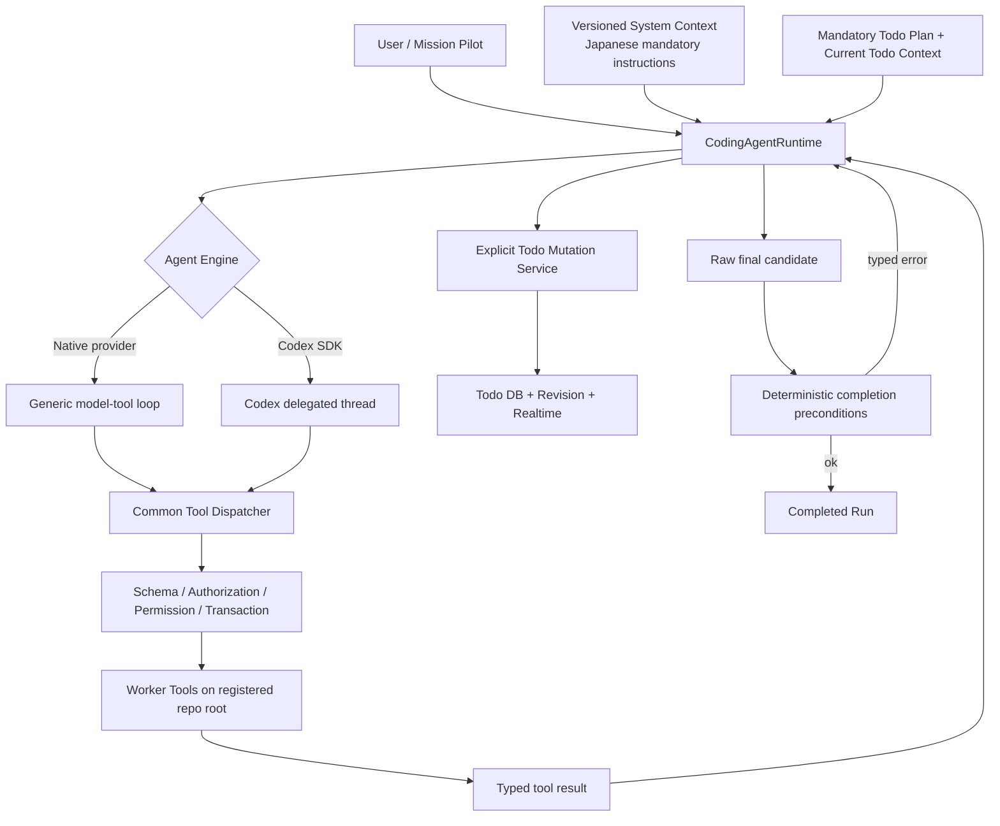

# Coding Agent System-Context Todo Refactor Plan

## Status

- Plan status: `completed`
- Document created: 2026-07-15
- Target repository: `/Users/y.noguchi/Code/nightWorkers`
- Baseline HEAD: `a4464a3aba441439d9cea9406faaccd55d61c3b6`
- Target scope: Coding Agent runtime、System Context、Todo runtime、Run Control
- Related plan: `spec/docs/mission-pilot-persistent-agent-refactor-plan.md`
- User decisions confirmed: 2026-07-15
- Implementation status: completed 2026-07-15
- Verification: `bun run verify`、`bun run test`（316 files / 1935 tests）、`bun run check:architecture`、`bun run check:docs` green

### Implementation Result

- Phase 0-7を完了し、production pathを単一Coding Agent runtimeへ切り替えた。
- version付き共通System Context、current Todo Context、ID / revision / transactionによるTodo single-writer境界を導入した。
- Native API / Codex SDKから固定startup Todo、semantic recovery、checkpoint、暗黙Todo更新、固定completion gateを削除した。
- Test / Reviewの新規runtime、prompt、mutation route、UI actionを削除し、過去履歴のread-only参照だけを残した。
- action journalとprovider session resumeにより、明示tool actionのidempotencyと同一Run再開を維持した。
- `needs_human` Todoへ人間UIから回答し、同じRun、Todo、provider sessionを分離worker内で再開する経路を接続した。
- Todo dependency cycle / open dependency、Run terminal後の更新、同時running Todoをapplication serviceとDB制約の両方で拒否するよう補強した。
- 旧Todo repository writer、別RunへのTodoコピーoption、Role Handoff / Working Context、Test / Review UI mutationを削除し、architecture checkで再導入を検出するようにした。
- semantic-control再導入を検出するarchitecture checkを追加し、旧挙動を固定していたtestを新contract testへ置換した。

この文書を、NightWorkersのCoding Agentを、実装側の固定workflowと意味推論に従う実行器から、LLMがTodoとtool結果を用いて自律的に次の行動を選ぶagentへ移行するための実装計画正本とする。

本計画の原則は次の一文に集約する。

> LLMはTaskの意味、Todo、次の行動、検証、完了可否を判断する。ホストはtool実行、安全、権限、永続化、状態整合性、resource上限だけを保証し、LLMの判断をkeyword、正規表現、固定phase、固定Todo、recovery promptで上書きしない。

TodoはすべてのCoding Agent Runで必須とする。TodoをLLMの外部作業記憶、進捗表示、局所Contextとして強化し、各Todoにversion付きSystem Contextと「今何をするべきか」という強い行動指示を含める。一方、Todo名やtask typeをホストのworkflow state machineとして利用する現行実装は削除する。

## 1. Purpose

現在のCoding Agentには、LLMがtool結果と作業状態を読んで判断する前後に、実装側が次を決めるロジックが多数存在する。

- 実行modeごとのtool強制とtool allowlist。
- 固定startup処理と固定startup Todo。
- Todo名、task type、procedure、command文字列による工程分類。
- command実行結果によるTodoの自動完了。
- Test / Review / closeoutを固定工程として扱う処理。
- final response後の自動recovery turnとcheckpoint prompt。
- schema不成立、tool callなし、finalize失敗時の固定本文への差し替え。
- Native API laneとCodex SDK laneで別々に実装された意味上の進行制御。

これらは過去の失敗を個別ロジックで補正するほど増え、LLMへ十分なContextとtool結果を渡す設計から遠ざかっている。リファクタリング後は次の状態を達成する。

1. Implementation、Test、Reviewという複数modeを廃止し、単一のCoding Agent runtimeだけを使用する。
2. Test実行や自己確認が必要かは、単一Coding AgentがTaskとTodo Contextから判断する。Reviewは独立modeとして行わない。
3. すべてのCoding Agent RunでTodoを必須とし、LLMが作成、並べ替え、開始、完了、再試行、再計画する。
4. ホストはTodoを暗黙更新しない。Todo更新は、LLMまたは人間UIからの明示commandだけで行う。
5. 各turnでは共通System Context、全体計画の短いsnapshot、現在Todoの十分なContextと行動指示をLLMへ渡す。
6. tool成功・失敗は構造化結果としてLLMへ戻し、次の行動を実装側で決めない。
7. LLM本文が存在する場合、parse、schema、completion gateの結果を理由に固定本文へ差し替えない。
8. filesystem、network、Git、外部操作、承認、認可、transaction、timeoutは引き続きホストが強制する。

## 2. Codexとの比較から固定する設計原則

### 2.1 比較対象

比較基準は、計画作成時点のローカルCodex実装 `/Users/y.noguchi/Code/codex` とする。Codex TypeScript SDKはthreadへpromptとoptionを渡してevent streamとfinal responseを返す薄い境界であり、主要なagent loopはRust coreにある。

主な比較対象:

- `codex-rs/core/src/session/turn.rs`
- `codex-rs/core/src/stream_events_utils.rs`
- `codex-rs/core/src/tools/router.rs`
- `codex-rs/core/src/tools/parallel.rs`
- `sdk/typescript/src/thread.ts`

Codexの中心loopは概ね次の形である。

```text
conversation history + current input
                |
                v
             model call
                |
        +-------+-------+
        |               |
   tool call         final text
        |               |
 execute tool           v
        |           turn complete
 typed result
        |
 append to history
        |
        +------> model call
```

toolの公開範囲、sandbox、approval、cancel、timeoutは実装側が制約する。一方、Taskの意味、どのfileを読むか、次にどのtoolを使うか、Testや自己確認が必要かは原則としてmodelが会話履歴と指示から判断する。

### 2.2 NightWorkersで採用する点

- modelとtoolの反復を小さな共通loopとして維持する。
- tool failureを可能な限りmodel-visibleなtyped resultとして会話へ戻す。
- 安全境界と意味判断を分離する。
- prompt、AGENTS、System Context、Todo Contextで行動を誘導する。
- final textが返ったら、ホストが内容を別の説明へ書き換えない。
- 新runtime開始後の同一Session内ではconversationとtool resultを継続する。legacy Sessionからは履歴を移行しない。

### 2.3 NightWorkersで独自に維持する点

NightWorkersにはTask UIと永続Runがあるため、Codexと完全に同じ内部表現へ揃える必要はない。次は製品上の価値があり、維持する。

- UIで確認できる永続Todo。
- Task eventとrealtime進捗表示。
- Project登録とrepository rootの固定。
- providerを選択できるruntime lane。
- 新runtime Session内のrestart / resumeと永続event history。
- verification結果、artifact参照、差分情報の事実としての永続化。
- ユーザー設定に基づく権限、approval、sandbox相当の制約。

ただし、これらをTaskの意味や次工程の自動決定には使わない。

## 3. Locked Product Decisions

### 3.1 単一Coding Agent behavior

新runtimeに実行modeを持たせない。Implementation、Test、Reviewのstate machineとruntime分岐を廃止し、すべてのCoding Agent作業を同じ`CodingAgentRuntime`と同じ終了contractで実行する。

Testはmodeではなく、現在Taskを完了するために必要ならLLMがTodoへ追加して実行する通常作業である。Review modeは廃止し、新runtimeにはreview workflow、review prompt、review permission profileを作らない。将来必要になった場合は旧設計を復活させず、要件からゼロベースで設計する。

既存の`executionMode`、Test / Review API、UI操作、専用prompt、専用routeはproduction pathから削除する。過去Runのmode値は履歴表示用のread-only dataとしてのみ残せる。

### 3.2 必須System Context

単一Coding Agentには、version付きの共通System Contextを与える。

```ts
type CodingAgentSystemContext = {
  version: number;
  roleInstructionsJa: string;
  taskGoal: string;
  projectRulesJa: string[];
  todoRequirementJa: string;
  failureRecoveryJa: string;
  completionRuleJa: string;
  toolContractJa: string;
  registeredRepositoryRoot: string;
};
```

System Contextは次を強く指示する。

- 最初のmodel turnでTodo planを作成し、current Todoを一件開始する。
- current Todoなしにworkspace作業を開始しない。
- current Todoのobjective、context、next actionを読んでからtoolを選ぶ。
- toolや検証が失敗したら、その結果をTodo Contextへ反映して修正・再試行する。
- 同じ方法が失敗する場合は原因を読み直し、Todoを分割または再計画する。
- 達成不能、必要情報不足、安全に継続不能の場合だけ`needs_human`へ遷移し、ユーザーへ具体的な質問を返して停止する。
- Testや自己確認の要否と方法はLLM自身が判断する。
- Evidenceの作成、添付、参照を完了条件にしない。

共通tool説明、JSON contract、回答要件、System Context文言は定数またはbuilderへまとめる。prompt文言は日本語を維持する。Task本文、Todo名、error本文のkeywordや正規表現でSystem Contextを切り替えない。

### 3.3 Todoの責務

TodoはLLMの外部作業記憶であり、次の三つを同時に満たす。

1. ユーザーが進捗を確認できる。
2. LLMが長いTaskを分割し、現在地を失わない。
3. 現在Todoへ局所Context、受け入れ条件、失敗内容、次に試す行動を集約できる。

すべてのCoding Agent RunはTodo planとcurrent Todoを持たなければならない。新Sessionの最初のmodel callだけはTodo未作成を許し、そのresponseではTodo作成以外のworker toolを実行できない。Todo作成後は、current Todoが存在しない状態でworkspaceを読む・変更するworker toolを呼び出した場合、hostは`CURRENT_TODO_REQUIRED`を返す。これはTaskの意味判断ではなく、ユーザーが決定した構造上のpreconditionである。

LLMが決めること:

- Todoの作成、分割、統合、並べ替え。
- title、objective、context、next action、acceptance criteria、dependency。
- どのTodoをcurrentにするか。
- 作業結果がTodoを満たしたか。
- 失敗後に同じ方法を修正して再試行するか、別方法へ切り替えるか、Todoを再計画するか。
- 達成不能として`needs_human`へ停止するか。
- 新しい事実を受けた再計画。

ホストが決めること:

- schema validation。
- 対象RunとTodoの存在確認。
- Todo ID、revision、transaction、idempotency。
- 一つのRunに`running`が最大一件であること。
- terminal Todoを暗黙に再openしないこと。
- dependency IDの参照整合性。
- Todoへ現在のSystem Context versionとsnapshotを関連付けること。
- current Todoなしのworker tool実行を拒否すること。
- realtime通知と監査event。
- resource上限と文字数上限。

ホストはcommand実行、file変更、Test成功、context compile、final responseを観測してTodoを自動完了してはならない。

### 3.4 Todo schema

現在の`task_run_todos`は維持し、破壊的置換ではなくadditive migrationを行う。操作上の正本は`seq`ではなく安定した`id`へ変更する。

目標schema:

```ts
type AgentTodo = {
  id: string;
  runId: string;
  seq: number; // UI表示順。操作identityには使わない
  title: string;
  objective: string | null;
  context: string | null;
  nextAction: string;
  acceptanceCriteria: string[];
  status:
    | "pending"
    | "running"
    | "passed"
    | "needs_human"
    | "skipped";
  dependsOn: string[];
  statusReason: string | null;
  lastFailure: string | null;
  attemptCount: number;
  systemContextVersion: number;
  systemContextSnapshot: CodingAgentSystemContext;
  createdBy: "agent" | "human" | "migration";
  revision: number;
  startedAt: Date | null;
  completedAt: Date | null;
  createdAt: Date;
  updatedAt: Date;
};
```

status区分は、`pending` / `running`を作業中、`needs_human`をユーザー回答待ちのpause、`passed` / `skipped`をterminalとする。`needs_human`は失敗完了として扱わず、ユーザー回答後に同じTodoを明示的にresumeできる。

既存fieldの扱い:

| Current field | Target treatment |
| --- | --- |
| `title` | 維持 |
| `description` | 互換readを維持し、`objective` / `context`へ移行 |
| `taskType` | UI分類の任意metadataへ降格。runtime分岐に使わない |
| `procedureId` / `procedureSnapshot` | 既存表示の互換readのみ。新規agent制御には使わない |
| `contextSnapshot` | current Todoのversion付きSystem Contextと作業Context snapshotとして再定義 |
| `completionGateResult` | semantic gateを廃止。必要な過去表示のみ維持 |
| `evidenceRequirementsJson` | 新runtimeでは使用しない。過去表示用のread-only fieldへ移行 |
| `evidenceRefsJson` | 新runtimeでは使用しない。過去表示用のread-only fieldへ移行 |
| `dependsOn` | Todo ID配列へ統一 |
| `statusReason` | 維持 |
| `seq` | 並び順に限定 |

### 3.5 Todo mutation contract

Todo更新は単一のapplication serviceを正本とし、LLM toolと人間UIが同じcommandを呼ぶ。

```ts
type TodoMutationCommand =
  | { op: "replace_plan"; expectedPlanRevision: number; todos: TodoDraft[] }
  | { op: "start"; todoId: string; expectedTodoRevision: number }
  | {
      op: "resume";
      todoId: string;
      expectedTodoRevision: number;
      userContext: string;
    }
  | {
      op: "transition";
      todoId: string;
      expectedTodoRevision: number;
      status: "passed" | "needs_human" | "skipped";
      reason: string;
      nextTodoId?: string;
    }
  | {
      op: "record_failure";
      todoId: string;
      expectedTodoRevision: number;
      failureSummary: string;
      nextAction: string;
    }
  | {
      op: "update_context";
      todoId: string;
      expectedTodoRevision: number;
      context: string;
      nextAction: string;
    };
```

`transition`は、LLMが指定したTodo IDだけを閉じる。`nextTodoId`がある場合は同じtransactionでそのTodoを開始できるが、ホストが次Todoを推測しない。誤ったID、stale revision、terminal Todoはtyped errorとして返す。

`record_failure`はTodoをterminalにしない。attempt count、失敗内容、次に試す方法をcurrent Todoへ保存し、同じTodoを`running`のまま維持する。固定retry回数やerror本文classifierは設けず、LLMがtool resultとTodo Contextを読んで再試行方法を選ぶ。resource上限へ達する、必要情報がない、安全に続行できない等の場合は、LLMが`needs_human`へ遷移する。

`needs_human`は完了ではなくpause状態とする。ユーザーが質問へ回答した操作を契機に、同じapplication serviceが`resume`を実行し、回答をTodo Contextへ追記して`running`へ戻す。hostは回答内容から次actionを推測せず、再開したLLMがTodoと回答を読んで判断する。

### 3.6 Todo Contextの注入

各model turnに全Todoの全文を繰り返し入れない。次の二層にする。

```text
Plan summary
  - plan revision
  - pending / running / terminal counts
  - Todo ID、順序、title、statusの短い一覧

Current Todo detail
  - id / revision
  - System Context version / snapshot
  - objective
  - context
  - next action
  - acceptance criteria
  - dependencies
  - last failure / attempt count
  - blocker / status reason
```

過去Todoの詳細はtoolで取得できるようにする。context compaction時もPlan summaryとCurrent Todo detailは必須保持し、conversationを新規固定baselineへ置換しない。

System Contextでは、すべてのCoding Agent Runについて、worker tool実行前にTodoを作成・開始し、各turnでcurrent Todoを確認し、作業中に得た重要Context、失敗、次に試す方法をcurrent Todoへ追記するよう強く指示する。hostも`CURRENT_TODO_REQUIRED`を構造的に検証するが、Todoの内容や次actionは判断しない。

### 3.7 失敗時の再試行とユーザー確認

tool、command、Test、build、編集が失敗しても、直ちにTodoまたはRunを失敗終了させない。LLMは次の順で判断する。

1. tool resultとraw errorを読む。
2. current Todoへ失敗内容と次に試す方法を記録する。
3. 入力、実装、command、前提、方法を修正して再試行する。
4. 同じ方法で解消しない場合はTodoを分割・置換・並べ替えして別経路を試す。
5. 自力で解消できない情報不足、権限不足、外部判断、安全上の問題、resource上限の場合だけ`needs_human`へ遷移する。
6. `needs_human`では、何が分からず、何を試し、ユーザーに何を判断してほしいかを具体的な質問として返してRunを停止する。

hostはtool failureからretry方法、次Todo、停止判断を選ばない。provider transport層の同一request retry、timeout、rate limit backoff、idempotencyだけは通信境界として残せる。

### 3.8 Run completion

assistantがtool callなしの本文を返した場合、その本文をfinal candidateとして保存する。Coding Agent Runでも固定`needs_human`本文へ差し替えない。

Runを`completed`へ遷移する際、次の決定的整合性だけを確認する。

- `running` Todoがない。
- `pending` Todoがない。不要になったTodoはLLMが`skipped`へ明示遷移する。
- `needs_human` Todoがない。存在する場合はRunをcompletedにせずpause状態を維持する。
- Todo revisionが読み取り時から変わっていない。
- 必須approval待ちのside effectがない。

precondition不成立時は`RUN_HAS_OPEN_TODOS`等のtyped resultと現在snapshotをmodelへ返す。modelはTodoを完了、skip、再試行、再計画するか、`needs_human`としてユーザーへ質問するかを判断する。resource budgetを超えた場合も原則`needs_human`で停止し、最後に得たLLM本文を保持・表示する。provider process自体が成立しない場合だけ`runtime_failed`を使用する。

Evidence、Test成功、Review、security scan、context compile、knowledge registrationをhostの必須completion gateにはしない。必要な確認と完了判断はSystem Context、Task Context、Todo Contextを読んだLLMが行う。

## 4. Deletion-First残置判定

既存ロジックを残す場合は、次の条件をすべて満たす必要がある。

1. Taskの意味、次工程、Todoの意味上の完了を決めない。
2. schema、authorization、permission、安全、transaction、revision、idempotency、resource、protocol、lossless persistenceのいずれかである。
3. user文言、Task本文、Todo名、command文字列、LLM本文、error本文のkeywordや正規表現を使用しない。
4. 失敗時はtyped errorを返し、別action、別mode、retry、完了を自動選択しない。
5. LLMだけを矯正する例外ではなく、人間UIまたは全runtimeに共通する正しさの境界である。
6. 削除すると起こる具体的な安全、権限、整合性、重複実行、resource問題を説明できる。
7. 単体testで成立条件と不成立条件を固定できる。

満たさないclassifier、gate、fallback、recovery、auto transitionは削除する。既存testがあること、過去の不具合対策だったこと、念のためという理由だけでは残さない。

## 5. Existing Logic Disposition

### 5.1 そのまま残す

| Area | Existing responsibility | Reason |
| --- | --- | --- |
| Project / workspace境界 | 登録Projectのrepo rootを実作業workspaceにする | filesystem安全境界 |
| worker tool schema | tool argumentとresultのschema validation | protocol整合性 |
| permission / approval | filesystem、network、Git、外部actionの許可 | 権限・安全 |
| provider transport | provider呼び出し、HTTP / SDK error、timeout | 通信境界 |
| JSON extraction / schema issue | raw本文とvalidation issueのlossless保持 | provider責務 |
| new Session persistence | 新runtime開始後のconversation、tool event、usage、resume tokenの保存 | 同一Session内の再開可能性 |
| event ledger | 起きた事実のappend-only記録 | 監査・UI表示 |
| cancellation / timeout / budget | user stop、期限、token、output上限 | resource安全 |
| DB transaction / constraint | unique、foreign key、revision、CAS | 状態整合性 |
| realtime notification | persisted stateのUI通知 | 表示整合性 |
| artifact / verification result store | artifact参照と検証結果の永続化 | UI表示用の事実保存。Todo完了条件には使わない |

### 5.2 形を変えて残す

| Current component | Target responsibility | Removed responsibility |
| --- | --- | --- |
| `NativeAgentRuntime` / native coordinator | 小さなmodel-tool loop | startup phase、mode別終了、固定recovery |
| `CodexAgentRuntime` | Codex thread / eventの薄いadapter | finalize rejection後のfresh thread、checkpoint turn |
| `native-api-tool-dispatcher.ts` | schema検証、authorization、tool実行、typed result | semantic dispatch state、次工程管理 |
| `native-api-tool-registry.ts` | permissionと実在capabilityに基づくtool catalog | mode / current Todo / taskTypeによる逐次allowlist |
| `todo-list.ts` | ID・revision指定のTodo command adapter | fixed gate merge、bootstrap禁止、seq中心操作 |
| Todo repository | atomic transition、single-running、revision | 自動next Todo選択 |
| `todo-context` | System Context、plan summary、current Todo detail、失敗と次action | procedure中心Context |
| `ledger-sink.ts` | eventとverification factの永続化 | Todo自動完了・自動開始 |
| `RunControlRepository` | action journal、idempotency、revision、dedupe | semantic phase、no-progress recovery |
| `finalize-controller.ts` | 共通Run completion precondition | verification fresh判定、次action指示 |
| verification command処理 | 通常toolとしてtyped check resultを返す | evidence生成、command文字列からのworkflow完了推論 |
| security oracle | 明示的に呼べるscan tool / result | finalize時の自動gate |
| ContextStill連携 | LLMが選べるtool | startup / closeoutでの自動実行 |
| runtime lane選択 | provider capabilityとユーザー設定によるengine選択 | execution modeによる意味上の挙動差 |

### 5.3 削除する

次は移植せず削除する。

- `native-api-startup-controller.ts`の固定startup sequence。
- `native-api-startup-todos.ts`の固定Todo生成・完了。
- `native-api-runner-routing.ts`の本文・error文字列classifier。
- implementation / test / reviewごとの`toolChoice: required`とmode分岐。
- implementationでtool callがないときの固定`needs_human` response。
- current Todoの`taskType` / `procedureId`に応じたtool公開切替。
- `todo-list-builder.ts`の固定prep、quality gate、completion report Todo。
- Task本文やtitleのregexによるmigration / E2E / feature分類。
- command文字列のregex分類を根拠とするTodo完了とquality gate完了。
- `ledger-sink.ts`からのTodo自動closeと次Todo自動start。
- `native-api-finalize.ts`からの最終Todo直接完了。
- `finalize_answer`専用tool。通常のassistant final textを終了候補にする。
- final response後に別threadを開始するCodex recovery prompt。
- current Todo完了を促すCodex checkpoint prompt。
- `RunControlPhase = active | recovery | closeout | terminal`を使うsemantic state machine。
- consecutive no-progressによる固定recovery action。
- Test完了後のReview自動開始、Review後の固定closeout。
- Test mode / Review modeのruntime route、専用prompt、専用UI action。
- LLM本文をschema error、gate error、tool不足の固定文へ差し替える処理。
- import失敗後にhostが別のimport / implementation pathを選ぶfallback。
- `new_context`時に履歴を要約なしの固定baselineへresetする処理。

### 5.4 観測用途に限定して残せるclassifier

commandやeventの分類がUIアイコン、検索、統計だけに使われる場合は、semantic controlから完全に切り離したうえで残せる。ただし次の条件を課す。

- Todo、Run status、next action、verification合否を変更しない。
- 分類不能でもraw eventをlosslessに表示・保存する。
- 分類結果をLLMへの必須Factとして扱わない。
- classifierを削除してもagent behaviorが変化しないことをtestする。

## 6. Target Architecture



Native providerとCodex SDKは内部loopの所有者が異なる。これを無理に同じ低レベルinterfaceへ押し込まない。共通化するのは、System Context、必須Todo contract、tool result、permission、persistence、completion contractである。

## 7. Implementation Phases

### Phase 0: Baselineとcharacterization

目的は、現行の重要な安全境界と、削除対象のsemantic behaviorを混同しないことである。

実施:

1. accepted baseline SHAとworktree statusを保存する。
2. Native API、Codex SDK、Todo、Run Controlの既存test一覧を分類する。
3. testを`retain-boundary`、`replace-contract`、`delete-behavior`へ分類する。
4. provider raw本文、tool failure、必須Todo、同一Session resume、permission denial、cancelのcharacterization testを追加する。
5. 現行Runについて、model call回数、host-generated recovery turn数、Todo自動更新数、固定本文差し替え数を計測する。

成果物:

- 削除対象test一覧。
- 維持する安全境界test一覧。
- before metrics。

Exit criteria:

- 既存安全境界を説明するtestがgreen。
- どのtestがsemantic controlを固定しているか文書化済み。

### Phase 1: Todo schemaとsingle-writer境界

実施:

1. `objective`、`context`、`next_action`、`acceptance_criteria_json`、`last_failure`、`attempt_count`、`system_context_version`、`created_by`、`revision`を新runtime用schemaへ追加する。
2. 新runtimeの`dependsOn`をTodo IDへ統一する。legacy dependencyは新runtimeへ変換しない。
3. `TodoMutationService`を作り、UIとLLM toolを同じserviceへ接続する。
4. Todo操作を`id + expectedRevision`へ変更する。
5. `transition + optional nextTodoId`を一transactionで実行する。
6. event ledger、startup、finalizeからのTodo mutationを停止する。
7. legacy Todoは新runtimeへbackfillせず、過去Runのread-only表示に限定する。
8. 新Sessionの最初のturnではTodo作成以外のworker toolを`CURRENT_TODO_REQUIRED`で拒否する。
9. `record_failure`でTodoをrunningのまま維持し、失敗Contextと次actionを更新できるようにする。

Exit criteria:

- Todoの書き込み経路が`TodoMutationService`だけである。
- ledger eventやcommand実行だけではTodo statusが変わらない。
- concurrent updateは片方が`TODO_REVISION_CONFLICT`になる。
- 一つのRunにrunning Todoを複数作れない。
- 新SessionでTodoなしにworkspace作業を開始できない。
- legacy Runは履歴として表示できるが、新runtime Contextへ混入しない。

### Phase 2: System Contextと共通Todo Context

実施:

1. 日本語のversion付き`CodingAgentSystemContext` builderを作成する。
2. 共通tool説明、JSON contract、回答要件、Todo必須規則、失敗再試行規則をshared builderへ集約する。
3. implementation / test / review promptを削除し、単一System Contextへ置き換える。
4. `PlanSummary`と`CurrentTodoContext`のversion付きschemaを作る。
5. Native APIとCodex SDKへ同じSystem ContextとTodo Contextを注入する。
6. current TodoにSystem Context snapshot、next action、last failure、attempt countを含める。
7. Task本文、Todo title、error本文を読んでmodeやContextを選ぶclassifierを削除する。

Exit criteria:

- 同じTask ContextとTodoに対し、両laneが同じSystem Context / Todo packetを受け取る。
- Todo変更でtool catalogが変化しない。
- mode / System Context選択にkeyword / regexが存在しない。
- prompt文言が日本語で、一箇所から再利用される。

### Phase 3: Native API agent loopの縮小

実施:

1. `native-api-run-coordinator.ts`からstartup flagsとphase routingを除去する。
2. loopを`model call -> explicit tool calls -> typed results -> model call`へ縮小する。
3. implementation / test / reviewのmode分岐と`toolChoice: required`を外す。ただし最初のturnではTodo mutation toolの実行を必須とする。
4. tool callなしのassistant本文をfinal candidateとして扱う。
5. tool parse / validation failureをmodel-visible resultへ変換する。
6. provider本文がある場合は必ず保持し、固定error responseへ差し替えない。
7. context compactionをconversation summary + Todo Context保持方式へ変更する。
8. transport retryをprovider typed errorに限定する。

Exit criteria:

- modelがtoolを呼ばずに正常終了できる。
- invalid tool argsを受けたmodelが次turnで自己修正できる。
- tool failure後の次actionをhostが選ばない。
- LLM本文がparse / gate失敗でもUIとeventへ残る。
- startup用のhost tool callがゼロになる。

### Phase 4: Codex SDK adapterの縮小

実施:

1. Codex SDKへSystem Contextと必須Todo Contextを一つのprompt packetとして渡す。
2. Codex eventをlosslessにNightWorkers eventへ投影する。
3. final response後のfresh thread recoveryを削除する。
4. current Todo checkpoint turnを削除する。
5. Codex tool eventからTodoを自動更新しない。
6. NightWorkersのpermission / Project rootをCodex thread optionへ一対一で反映する。
7. 新runtime開始後に作成されたCodex thread IDとNightWorkers Run IDのmappingだけを維持する。legacy thread IDは引き継がない。

Exit criteria:

- Codexの一つのthreadをhost都合で分断しない。
- 同じfinal responseをRunのraw final candidateとして保存する。
- Native laneと同じTodo mutation tool / completion contractを使う。
- Codex event分類不能時もraw eventが欠落しない。

### Phase 5: Run Controlとfinalizationの縮小

実施:

1. `RunControlState`からsemantic phaseとrecovery counterを除去する。
2. action identity、idempotency、revision、effect logを`ActionExecutionJournal`へ抽出する。
3. finalizationを`RunCompletionPreconditions`へ置き換える。
4. missing / open Todo、approval待ち、revision conflictだけをtyped errorで返す。
5. verification / security / ContextStillの自動実行を削除する。
6. final candidate、completion error、terminal reasonを別fieldでlossless保存する。

Exit criteria:

- finalizationが別のtool、mode、retryを開始しない。
- open Todo時にmodelが明示transitionして再度完了できる。
- budget終了時にも最後のLLM本文をユーザーが読める。
- Run完了にcommand文字列classifierが関与しない。

### Phase 6: Test / Review mode廃止とcutover

実施:

1. 新規Coding Agent Runを単一runtimeへrouteする。
2. Test / Review専用state machine、route、prompt、runtime factoryを削除する。
3. Test / Reviewの新規Run作成UIとAPI actionを削除または無効化する。
4. Testは、LLMが必要と判断した場合にcurrent RunのTodoとして追加・実行する。
5. Review modeは新runtimeに作らない。過去Runのmode情報だけread-only表示できる。
6. legacy Sessionからconversation、tool history、Todoを移行せず、新Session IDと新Run IDで開始する。
7. 短期間のrollback flagを設け、安定後にlegacy pathとflagを削除する。

Exit criteria:

- production runtimeにTest / Review modeが存在しない。
- Testが必要なTaskでも同じCoding AgentがTodoを追加して実行する。
- Review専用prompt、permission profile、tool loopが存在しない。
- legacy Session IDと履歴が新runtime promptへ含まれない。

### Phase 7: Dead code削除と文書更新

実施:

1. 5.3の削除対象file / function / testを削除する。
2. `spec/architecture.md`からTest / Review modeと固定lifecycleを除去する。
3. MCP tool descriptionからmanaged fixed gateの説明を除去する。
4. AGENTS規則と新runtime contractの整合を確認する。
5. 互換期間終了後、seq指定Todo mutationと旧field writeを削除する。
6. architecture boundary checkへsemantic classifier禁止の静的検査を追加する。

静的検査はuser文言の意味を推定しない。禁止対象directoryで、`RegExp`や`.includes()`等がTask本文、Todo title、LLM本文、error messageからruntime actionを選ぶ依存を検出するための保守用lintとする。

Exit criteria:

- legacy runtime pathとTest / Review modeがproduction bundleに含まれない。
- 固定gate、auto Todo close、recovery promptのdead codeがない。
- `bun run check:architecture`と`bun run check:docs`がgreen。
- rollback flagを削除済み。

## 8. Verification Plan

### 8.1 Todo contract tests

- 新Sessionの最初のturnでLLMが空のplanからSystem Context付きTodoを作成できる。
- Todo作成前のworker tool callが`CURRENT_TODO_REQUIRED`になる。
- current TodoのContext更新が次turnへ反映される。
- current TodoのSystem Context、next action、last failureが毎turnへ反映される。
- explicit Todo IDだけが完了する。
- seqが変わってもTodo identityが変わらない。
- stale revisionが`TODO_REVISION_CONFLICT`になる。
- ledger event、verification event、final responseではTodoが変化しない。
- `nextTodoId`未指定時にhostが次Todoを開始しない。
- tool failureを記録してもTodoはrunningのままでattempt countが増える。
- skipped / needs_humanのreasonが保持される。
- ユーザー回答による`resume`で同じTodoへ回答Contextが追記され、runningへ戻る。
- 新runtime Sessionのresume後もplan revisionとcurrent Todoが一致する。

### 8.2 Agent loop tests

- assistant final textのみで正常終了する。
- tool call、tool result、次のtool callを任意回数反復できる。
- invalid argumentsがtyped tool resultとしてmodelへ戻る。
- tool domain failure後にmodelが別actionを選べる。
- tool / Test失敗後にLLMがTodo Contextを更新して再試行できる。
- 達成不能時にLLMが`needs_human`へ遷移し、具体的な質問を返して停止する。
- provider本文とschema issueが同時に保存される。
- transport到達不能時だけprovider failureとして扱う。
- context compaction後もTask goal、Plan summary、Current Todo detailが残る。
- user cancelがtool実行と後続model callを停止する。

### 8.3 System Context / mode removal tests

- production registryにTest / Review runtimeが存在しない。
- Test / Reviewの新規Run APIが作成されない。
- Task本文に`review`、`test`、`migration`等が含まれてもruntime routeとSystem Contextが変わらない。
- Testが必要な場合は通常Todoとして追加され、同じruntimeで実行される。
- tool catalogがTodoや旧execution modeで変化しない。
- error本文の語句でretry / mode / Todo statusが変わらない。

### 8.4 Completion tests

- open Todoがある完了要求はtyped errorをmodelへ返す。
- modelが残Todoをpassed / skippedへ明示遷移した後に完了できる。
- completion precondition failureでraw final candidateを失わない。
- Evidenceの作成・参照なしでRunを完了できる。
- Testやverification結果をhostがTodo完了条件として判定しない。
- resource budget終了時に固定本文へ差し替えない。

### 8.5 Persistence / recovery tests

- 新runtime開始後のprocess restartでは、同じRun、conversation、Todo、Codex threadをresumeできる。
- tool call実行済み・result保存前のcrashをidempotency keyで復旧できる。
- Todo transitionのtransaction途中crashで二つのrunning Todoが残らない。
- event分類不能でもraw payloadから監査できる。
- legacy conversation、tool history、Todo、Codex thread IDが新Session Contextへ含まれない。
- legacy Runはread-only履歴として残り、新Session IDと新Run IDでゼロから開始できる。

### 8.6 Verification commands

各Phaseでは対象testを先に実行し、Phase完了時に次を実行する。

```bash
bun run typecheck
bun run lint
bun run check:architecture
bun run check:docs
bun run test -- tests/services.todo-runtime.test.ts
bun run test -- tests/services.todo-context.test.ts
bun run test -- tests/services.native-api-runner.test.ts
bun run test -- tests/services.codex-agent-runtime.test.ts
bun run test -- tests/run-control.test.ts
bun run verify
```

cutover前にはfull backend testと、必須Todo、失敗再試行、`needs_human`停止、Test / Review mode不存在、新Session restartのdeterministic E2Eを追加して実行する。live provider testはcredentialを必要とするため通常gateと分離し、release候補で明示実行する。

## 9. Migration and Rollback

### 9.1 Legacy Sessionは移行しない

- legacy conversation、tool history、Todo、Run Control state、Codex thread IDを新runtimeへ移さない。
- legacy RunとTodoは削除せず、過去履歴としてread-onlyで保存できる。
- 新runtime開始時に新しいSession IDとRun IDを発行する。
- 新Sessionの最初のmodel callには、現在のユーザーTask、登録Project、現在のrepository root、共通System Contextだけを渡す。
- 新Sessionは空のTodo planから開始し、最初のresponseでLLMがSystem Context付きTodoを作成する。
- repository上にlegacy Runが作成した未commit変更が残っている場合、それは会話履歴ではなく現在のworkspace FactとしてLLMが改めて調査する。
- 旧status、procedure、completion gate、Evidenceを新Todoへ写像しない。

### 9.2 Runtime cutover

1. development環境で新runtimeを有効化する。
2. deterministic fixtureで両laneを検証する。
3. Test / Review modeを無効化し、新規Runを単一Coding Agent runtimeへrouteする。
4. legacyの進行中Runを新runtimeへresumeしない。必要なTaskは新Session IDと新Run IDで最初から開始する。
5. 新runtimeをdefaultにする。
6. rollback期間終了後にlegacy path、legacy resume migration、flagを削除する。

### 9.3 Rollback条件

次のいずれかが発生した場合は、新規Runのrouteだけをlegacyへ戻せるようにする。

- workspace root外への操作が可能になる安全退行。
- Todoの二重running、terminal reopen、更新消失。
- 新runtime開始後の同一Session restartでconversationまたはTodoが欠落する。
- provider本文の消失。
- permission / approval bypass。

modelの判断品質が一度低かったことだけでsemantic gateを復活させない。まずSystem Context、Todo Context、tool description、model設定、観測可能性を改善する。

## 10. Observability

新runtimeでは、意味判断をhostへ戻さずに問題を診断できるよう次を計測する。

- Runあたりmodel turn数。
- tool call成功 / typed failure / validation failure数。
- LLMが行ったTodo create / update / transition / replan数。
- LLM commandまたは明示的な人間UI操作を伴わないhost Todo mutation数。目標`0`。
- tool失敗後の`record_failure`数、再試行数、再計画数、`needs_human`停止数。
- current Todoなしのtool call拒否数。
- completion precondition rejection数とerror code。
- fixed response replacement数。目標`0`。
- host-generated semantic recovery turn数。目標`0`。
- context compaction前後のTodo Context保持率。目標`100%`。
- 新runtime Session内のrestart / resume成功率。
- permission denialとapproval request数。

eventには「LLMがなぜその判断をしたか」をhostが推定して書かない。prompt、tool call、tool result、Todo mutation、final responseという観測可能なFactを保存する。

## 11. Non-Goals

- LLMの判断を無制限に信用してsandboxやapprovalを外すこと。
- Todoを廃止すること。
- 将来のTest / Review機能を今の設計の延長で定義すること。必要になった時点でゼロベースに設計する。
- Native providerとCodex SDKの内部実装を一つの偽の抽象化へ統合すること。
- Mission Pilot全体のリファクタリングを本計画へ取り込むこと。
- Plan Artifact generator、Questionnaire、Task UIの全面再設計。
- provider routing、料金、model selectionの全面変更。
- verification toolやsecurity scan capability自体の削除。通常toolとしてLLMが必要時に利用できる。

## 12. Definition of Done

本計画は次をすべて満たした時に完了とする。

1. production pathにTest / Review mode、専用runtime、専用prompt、専用routeが存在しない。
2. 単一Coding AgentがTestを含む必要作業をTodoとして計画・実行する。
3. すべてのCoding Agent RunでSystem Context付きTodoが必須になる。
4. LLMがTodoの作成、再計画、開始、完了、失敗再試行、skip、`needs_human`停止を所有する。
5. TodoはID・revision・transactionで安全に永続化され、UIへ進捗表示される。
6. event、command、startup、finalizeがTodoを暗黙更新しない。
7. EvidenceがTodoまたはRunの完了条件にならない。
8. Task本文、Todo名、command文字列、LLM本文、error本文のkeyword / regexがruntime actionを決めない。
9. tool catalogはpermissionとcapabilityだけで決まり、current Todoの意味で変わらない。
10. Native API loopがmodel-tool-finalの小さなloopになる。
11. Codex SDK wrapperがrecovery threadやcheckpoint turnを挿入しない。
12. LLM本文がparse、schema、gate失敗によって固定本文へ差し替えられない。
13. 安全、権限、approval、transaction、revision、idempotency、timeout、cancelが維持される。
14. legacy Session履歴を移行せず、新Session IDと新Run IDで再開できる。
15. 新runtime開始後の同一Sessionではconversation、Todo Context、event historyが継続する。
16. legacy semantic control codeと、それを固定していたtestが削除される。
17. `bun run verify`、対象integration test、deterministic E2Eがgreenになる。

## 13. Recommended Implementation Order

最初の実装PRはTodo single-writer境界に限定する。agent loopを先に単純化すると、既存のstartup、ledger、finalizeがTodoを並行更新し、LLM所有という正本が成立しないためである。

推奨PR順:

1. Todo additive schema + revision + `TodoMutationService`。
2. ledger / startup / finalizeからのTodo mutation撤去。
3. shared Japanese System Context + Todo Context packet。
4. Native API loop縮小。
5. Codex SDK wrapper縮小。
6. Run Control / finalization縮小。
7. Test / Review mode削除 + 新Session cutover。
8. legacy code、compat write、rollback flag削除とarchitecture文書更新。

各PRは削除対象ロジックを新しいCoordinator、Policy、Gateへ移植していないことをreview checklistで確認する。
