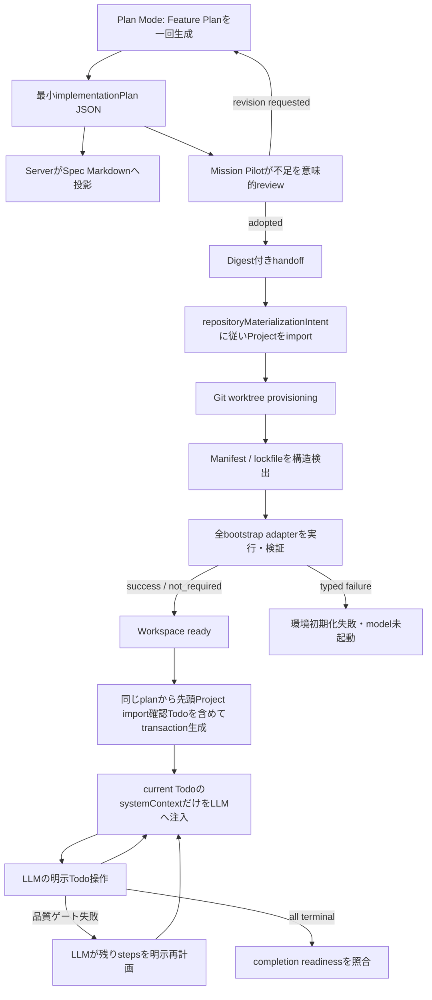

# Minimal Implementation Todo / Polyglot Worktree Bootstrap Plan

## Status

- Plan status: `planned`
- Document created: 2026-07-29
- Target repository: `/Users/y.noguchi/Code/nightWorkers`
- Baseline HEAD: `1654535dcede1980a81e98eeecf559ded4eb4a11`
- Target scope:
  - Plan Modeの実装計画とCoding Agent Todoの単一正本化
  - Todo生成contractとmodel-visible mutation結果の最小化
  - worktreeごとの複数技術スタック対応環境初期化
  - install logのsecret masking、timeout、cancel、構造化失敗
- Related documents:
  - `spec/s11t-coding-agent-guide.md`
  - `spec/docs/coding-agent-llm-owned-todo-refactor-plan.md`
  - `spec/docs/mission-pilot-coding-agent-module-separation-plan.md`

この文書を、次の二つを同時に解決する実装計画の正本とする。

1. Plan Modeで一度だけ生成した最小の実装計画JSONを、Specの「実装計画」とCoding AgentのTodoへ決定論的に投影する。
2. 専用worktreeをCoding Agentへ渡す前に、repositoryの技術スタックに応じた依存環境をNightWorkersが初期化し、失敗時はmodelを起動せず停止する。

本計画ではBunを特別扱いしない。Bun、npm、pnpm、Yarn、Python、Ruby、PHP、Go、Rust、.NET、JVMなどを同じbootstrap adapter contractで扱い、一つのrepositoryに複数stackがある場合も検出した全componentを初期化する。

## 1. Purpose

### 1.1 Todoの二つの責務

Todoは次の二つだけを確実に担う。

1. ユーザーへ現在工程、完了工程、残り工程を視覚的に表示する。
2. LLMへ現在工程の短いSystem Contextを渡し、次に行う作業を迷わせない。

TodoをTask分類、固定workflow、検証Evidence、hostの推論結果を詰め込む汎用recordにはしない。実装計画の意味情報は`title`と`systemContext`だけにし、識別子、順序、status、revision、時刻などの運用情報はserverが生成する。

### 1.2 worktree初期化の目的

現在のworktree provisioningはGit worktree作成直後に`ready`へ遷移する。依存が導入されていない状態でもQueueへ解放できるため、Coding Agentが最初のturnからinstall、package manager調査、環境障害の復旧にtokenを使う可能性がある。

変更後は、Git worktreeの作成とrepository依存環境の初期化を別stageにする。対応する全bootstrap componentが成功または構造的に`not_required`と判定された場合だけ`ready`へ遷移させる。初期化失敗は「環境初期化失敗」としてRun開始前に終了し、Coding Agentへ解決させない。

## 2. Locked Product Decisions

### 2.1 modelが生成する実装計画field

実装計画の正本schemaは次だけとする。

```json
{
  "steps": [
    {
      "title": "Todo一覧を最小contractへ移行する",
      "systemContext": "採用済み実装計画を正本としてTodoを生成し、既存の別生成経路を削除する。Plan Modeと直接Runの両方で同じcontractを使う。"
    }
  ]
}
```

modelが生成するstep fieldは厳密に二つだけである。

| field | 用途 | 制限 |
| --- | --- | --- |
| `title` | UIの工程名と短いplan summary | 1〜80文字 |
| `systemContext` | 現在工程で行うべき作業の強い指示 | 1〜600文字、通常1〜3文 |

次のfieldは追加しない。

- `key`
- `id`
- `seq`
- `covers`
- `constraints`
- `doneWhen`
- `taskType`
- `objective`
- `context`
- `nextAction`
- `acceptanceCriteria`
- `dependsOn`
- model生成のstatus、revision、timestamp

通常は2〜6 stepsを目安とし、hard limitは12 stepsとする。12を超える場合はfieldを増やさず、同じ変更境界に属する工程を一つのstepへまとめる。`systemContext`内に題名の言い換え、Task本文の再掲、共通ルールを繰り返さない。

### 2.2 単一生成と決定論的projection

Feature Plan生成時のstructured outputは、概念上次の形へ変更する。

```ts
type FeaturePlanDraft = {
  markdown: string; // 「実装計画」sectionを含めない本文
  implementationPlan: {
    steps: Array<{
      title: string;
      systemContext: string;
    }>;
  };
  repositoryMaterializationIntent: RepositoryMaterializationIntent;
};
```

`implementationPlan`以外のfieldはFeature Plan artifact固有であり、Todo stepのfieldではない。

serverは同じ`implementationPlan.steps`から次を投影する。

- Spec Markdownの`## 実装計画`。
- Plan Reviewが評価する実装工程一覧。
- Plan採用後にCoding Agent Runへ渡すimplementation handoff。
- Runの永続Todo rows。
- UIの全Todo一覧とprogress count。
- modelへ渡すplan summaryとcurrent Todo Context。

MarkdownからTodoをparseしない。TodoからMarkdownを再生成して正本を上書きしない。artifact metadataにはserver生成の`schemaVersion`、digest、source message ID、adoption revisionを保存するが、これらをmodel生成schemaへ含めない。

### 2.3 見落とし防止

field追加ではなくPlan Reviewで見落としを防ぐ。

1. Feature Plan generatorはTask、Questionnaire、採用済み設計、repository調査結果から本文とstepsを一回で生成する。
2. Mission PilotのPlan ReviewはTaskと設計に対してstepsの不足、重複、順序不整合を意味的に評価する。
3. 不足がある場合はFeature Plan全体を再生成せず、`implementationPlan.steps`の修正版を返す。
4. hostは件数、文字数、型、digest、revisionだけを検証し、Task文言のkeywordや正規表現で工程を追加しない。
5. 採用済みplanだけをCoding Agentへ渡し、Coding Agent起動時に同じ計画を再生成させない。

`repositoryMaterializationIntent`が`starter_template`または`git_import`の場合は、同じstructured outputの先頭stepをProject import専用Todoにする。starterの場合はQuestionnaireで確定したstackとDBから選んだvariant、Git importの場合はrepo URLとrefをintentと一致させる。曖昧な構成作成へ言い換えたり、機能実装と同じstepへ埋め込んだりしない。

repository materializationはprovider起動前のhost処理であるため、Coding Agentが先頭Todoを受け取る時点で実体化済みの場合がある。その場合もTodoを削除せず、bootstrap evidence、Git HEAD、Project root、選択済みstarterまたはimport元との一致を確認して明示完了し、次のproduction Todoへ進む。これにより、Questionnaireの選択、hostの副作用、ユーザーへ表示する実行順を一つのplanで追跡できる。

### 2.4 品質ゲートと完了報告

品質ゲートと完了報告は実装計画の最後に独立stepとして含める。

- production工程の後、最後から2番目を品質ゲートTodo、最後を完了報告Todoとする。
- 品質ゲートTodoはProjectの正本gateを実行し、templateを基にする場合はtemplateのverify commandを必ず含める。
- 完了報告Todoは品質ゲートの結果、最終差分、未解決事項、commit・merge状態を照合してから完了する。
- Coding Agentは必要な調査、実装、検証を各`systemContext`に従って実行し、完了候補を明示的に提出する。
- hostの品質ゲートはopen Todo、未解決approval、workspace初期化状態、設定済みの決定論的checkなど構造的preconditionを評価する。
- 品質ゲートが失敗してもhostはTodoを暗黙に追加、再開、完了しない。typed resultをLLMへ返し、LLMが明示的に残りstepsを再計画する。
- 完了報告は保存済みのTask、Todo status、verification result、変更file、既知の未解決事項からmodelが固定formatで組み立て、completion readinessとの矛盾を解消してから最終回答として返す。

### 2.5 Todo operational state

次はserverが生成し、modelへ入力させない。

- `id`
- `seq`
- `status`
- `revision`
- `attemptCount`
- `createdAt`
- `updatedAt`
- source plan digestとprovenance

Run開始時のTodo materializationは、採用済みLLM planの決定論的projectionとして一transactionで行う。hostがtool結果やfile変更から意味を推定してTodoを更新することは禁止する。

model向けTodo toolはID、seq、expected revisionを通常操作から除く。Runとprovider sessionからcurrent Todoを一意に解決し、CASとrevisionはserver内部で維持する。

最小tool setは次とする。

| tool | model input | server動作 |
| --- | --- | --- |
| `todo_plan` | `steps` | 直接Runの初回planを作成し、先頭stepを開始する |
| `todo_complete_current` | optionalな短い`note` | currentを完了し、次stepを開始する |
| `todo_block_current` | `reason` | currentを`needs_human`へ遷移する |
| `todo_replace_remaining` | `steps` | currentより後ろだけを明示的に再計画する |

通常の成功経路でmodelへ返す結果は、`progress`、`current`、`next`だけにする。全Todo、内部ID、revision、過去のSystem Contextを毎turn再送しない。revision conflictなどの異常時だけtyped errorと最新current snapshotを返す。

Plan Mode handoff Runでは`todo_plan`を呼ばせず、採用済みplanの先頭Todoから開始する。Mission Pilotが停止中の直接Runでは、最初のmodel actionを`todo_plan`に限定する。

### 2.6 System Contextの所有権

固定のTodo操作規則、tool contract、完了規則は`api/systemContexts/contexts/`の日本語TOMLを正本とする。TOML、generated catalog JSON、generated TypeScriptを同じ変更で更新する。

LLMが生成した各stepの`systemContext`はruntime inputであり、S11t catalogへ格納しない。current Todo Contextとしてdelimiter付きで注入し、固定System Contextと混同しない。

Mission PilotとCoding Agentは互いのrepository、service、routeをimportしない。最小implementation plan contract、digest、handoff envelopeは`agentsShare`またはAgent非依存の共有schemaが所有し、各roleが自身のapplication serviceで投影する。

## 3. Polyglot Workspace Bootstrap

### 3.1 基本原則

worktree bootstrapは「任意shell command機能」にしない。NightWorkersが実装、version管理したadapterだけを実行する。

- user文言やTask本文からstackを推測しない。
- repository内のmanifest、lockfile、workspace定義、明示的なProject bootstrap設定だけを構造的evidenceとして使う。
- 一つのrepositoryで複数ecosystemを検出した場合は、必要な全componentを安定した順序で実行する。
- 同一componentに競合するlockfileやpackage manager指定がある場合は推測せず、構造化エラーで停止する。
- package manager自体をcurl、shell script、OS package managerで自動導入しない。必要なexecutableがなければRun開始前に停止する。
- OS全体へpackageを導入する`apt`、`brew`、`choco`等はscope外とする。
- install scriptは各package managerの通常policyに従う。NightWorkersが一律に無効化または有効化しない。

### 3.2 adapter contract

全stack adapterは共通contractを実装する。

```ts
type WorkspaceBootstrapAdapter = {
  id: string;
  contractVersion: number;
  detect(input: DetectionInput): Promise<DetectionResult>;
  fingerprint(input: FingerprintInput): Promise<BootstrapFingerprint>;
  plan(input: PlanInput): Promise<BootstrapCommandPlan>;
  validate(input: ValidationInput): Promise<ValidationResult>;
};
```

責務は次に限定する。

- `detect`: manifest、lockfile、明示設定からcomponent rootとmanagerを判定する。
- `fingerprint`: lockfile、dependency manifest、manager config、tool version、platformをhash化する。
- `plan`: 固定executableとargv、許可env、timeout class、cache/env pathを返す。
- `validate`: install後の環境がworktreeまたはNightWorkers管理envから利用可能かを検証する。

adapterはshell文字列を返さない。`executable`と`argv[]`を分離し、shellを介さずspawnする。credential、registry URL userinfo、tokenをargvへ含めない。

### 3.3 初期対応adapter

初回cutoverで次を対象にする。commandはadapterが検出したmanager versionに対応する固定形式を選び、lockfileを更新しないmodeを必須とする。

| ecosystem | 構造的evidence | 代表的な固定command |
| --- | --- | --- |
| JavaScript / TypeScript | `packageManager`、`bun.lock` / `bun.lockb`、`package-lock.json`、`pnpm-lock.yaml`、`yarn.lock` | `bun install --frozen-lockfile`、`npm ci`、`pnpm install --frozen-lockfile`、Yarn versionに応じたimmutable/frozen install |
| Python / uv | `pyproject.toml` + `uv.lock` | `uv sync --frozen` |
| Python / Poetry | `pyproject.toml` + `poetry.lock` | installed Poetry versionに対応する非対話sync/install |
| Python / pip | hash付きrequirements lock | `python -m pip install --require-hashes -r <lock>` |
| Ruby | `Gemfile` + `Gemfile.lock` | `bundle install`をfrozen deployment設定で実行 |
| PHP | `composer.json` + `composer.lock` | `composer install --no-interaction` |
| Go | `go.mod` + `go.sum` | `go mod download` |
| Rust | `Cargo.toml` + `Cargo.lock` | `cargo fetch --locked` |
| .NET | solution/project + lock file | locked restore |
| JVM / Maven | `pom.xml` + lock/effective reproducibility policy | batch dependency restore |
| JVM / Gradle | wrapper + dependency lockfiles | wrapperによるlocked dependency resolution |

`--production`相当のoptionは付けない。test、型検査、lint、buildで必要なdev dependencyを含む完全な開発環境を作る。

lockを更新せず再現可能性を保証できないcomponentは、成功扱いにしない。例えばunhashed `requirements.txt`だけ、lockされていないNuGet/Gradle/Maven構成などは`BOOTSTRAP_LOCK_REQUIRED`で停止し、Project設定で別の既存adapterを選ぶかrepository側でlockを整備する。

上表の全adapterを一つの巨大serviceに実装しない。共通runnerとevidence schemaを先に導入し、JavaScript、Python、compiled/runtime ecosystemの順に小さなPRで追加する。未対応manifestを検出した場合は`not_required`ではなく`BOOTSTRAP_ADAPTER_UNSUPPORTED`とする。dependency manifest自体が存在しないrepositoryだけを`not_required`にできる。

### 3.4 複数componentと明示設定

検出結果は単一managerではなくcomponent一覧とする。

```ts
type BootstrapComponent = {
  adapterId: string;
  rootRelativePath: string;
  evidencePaths: string[];
};
```

この型は内部evidenceであり、LLM生成対象ではない。

- root workspace managerがsubprojectsを所有する場合はroot component一つに集約する。
- frontendとbackendが独立managerを持つ場合は二componentとして実行する。
- 同じcomponent rootで複数lockfileが競合した場合は`BOOTSTRAP_MANAGER_AMBIGUOUS`とする。
- 実行順はcomponent rootの浅い順、同じ深さでは正規化pathとadapter IDの辞書順に固定する。
- Project bootstrap設定では`adapterId`と`rootRelativePath`だけをoverrideできる。任意command、任意env、shell fragmentは保存できない。

### 3.5 NightWorkers管理path

`api/runtime/paths.ts`へ次のpathを追加する。

```text
<runtimeRoot>/workspace-bootstrap/
├── tmp/<workspaceId>/<attemptId>/
├── cache/<adapterId>/
├── environments/<workspaceId>/<componentDigest>/
└── logs/<workspaceId>/
```

- 全directoryをrepository外に置き、mode `0700`で作成する。
- `TMPDIR`、`TMP`、`TEMP`はattempt固有tmpへ設定する。
- package manager cacheはadapterごとのNightWorkers管理cacheへ設定する。
- Python virtualenv、Ruby bundle path、NuGet packages、Cargo home/target、Go module/build cache、Maven local repository、Gradle user homeなど、repository外で成立する環境は`environments`または`cache`へ置く。
- ecosystemがworktree内の配置を前提とする`node_modules`、Composer `vendor`等はworktree自身へ作成する。親checkoutや別worktreeからsymlinkしない。
- bootstrap成功、失敗、cancelの後にattempt tmpを削除する。共有cacheと有効なenvironmentはstampが参照する間維持する。
- Coding Agentが実行するcommandにも同じworkspace runtime env projectionを渡し、bootstrapで作った環境を再利用できるようにする。

### 3.6 symlink policy

親checkoutの`node_modules`をworktreeへsymlinkしない。rootの`node_modules`がsymlinkなら、NightWorkersは次の順で扱う。

1. link自身がworktree root直下の`node_modules`であることを`lstat`とcanonical path境界で確認する。
2. linkだけをunlinkしてもtargetを削除しないことを確認する。
3. NightWorkersが過去に作成したlinkだとbootstrap evidenceで証明できる場合だけlinkをunlinkして通常installへ進む。
4. provenanceを証明できないlinkは`WORKSPACE_DEPENDENCY_ROOT_SYMLINK_FORBIDDEN`でfail-closeする。

package managerがworktree-local dependency treeの内側に作る正規のsymlinkまで一律に拒否しない。禁止対象はcomponentのdependency rootを別checkoutへ向けるsymlinkである。

### 3.7 stampとskip条件

stampはrepository内fileへ書かず、`task_git_workspaces.bootstrapEvidenceJson`のversion付きschemaとして保存する。複数componentごとに次を持つ。

```ts
type BootstrapStamp = {
  schemaVersion: number;
  adapterId: string;
  adapterContractVersion: number;
  componentRoot: string;
  inputDigest: string;
  toolVersion: string;
  platform: string;
  architecture: string;
  environmentDigest: string;
  validationKind: string;
  completedAt: string;
};
```

`inputDigest`は少なくとも次を含む。

- lockfile content digest。
- root dependency manifestとworkspace配下の関連manifest digest。
- package managerまたはbuild tool設定のdigest。
- adapter contract version。
- environment projection schema version。

install/restoreをskipできるのは次をすべて満たす場合だけである。

1. 現在のfingerprintと保存済みstampが完全一致する。
2. 同じworktreeとcomponent rootに対するstampである。
3. tool version、OS、architectureが一致する。
4. adapter固有validationが成功する。
5. environment/dependency rootが存在し、root symlink禁止条件に違反しない。

JavaScript系ではworktree-local `node_modules`がdirectoryであり、root dependencyの直接かつ非optionalなentryがworktreeから解決できることを検証する。Pythonは保存済みinterpreterとenvironment、Go/Rust/.NET/JVMはinjectするcache/env pathとmanager固有metadataを検証する。単にdirectoryが存在するだけではskipしない。

### 3.8 timeout、cancel、process control

- componentごとのdefault timeoutとRun開始前bootstrap全体のtotal timeoutを設定する。
- defaultはcomponent 10分、全体20分を出発点とし、General Settingsで安全な上下限内だけ変更できるようにする。
- Queue cancel、Task cancel、application shutdownの`AbortSignal`をprocess runnerまで伝播する。
- cancel/timeout時はprocess groupへ`SIGTERM`を送り、grace period後に`SIGKILL`する。
- stdout/stderrはbyte上限を持つstreamとして読み、memoryへ無制限に保持しない。
- timeout、cancel、exit failureのどれでもpartial stampを成功stampとして保存しない。
- 失敗componentより後ろは実行せず、すでに成功したcomponent evidenceだけをdiagnosticとして保持する。workspace全体は`initialization_failed`のままとする。

### 3.9 secret masking

registry認証情報、URL credential、token、cookie、passwordをraw log、DB、event、error messageへ保存しない。

共通のsecret redaction utilityをAgent非依存のsecurity serviceへ集約し、bootstrap runnerを含む全呼び出し元が同じ実装を使う。

redactionは次の順で行う。

1. `authorization`、`cookie`、`token`、`secret`、`api-key`、`password`等の構造的keyをmaskする。
2. bootstrapへ渡したsecret env値をexact valueとして登録し、十分な長さを持つ値を出力から置換する。
3. Bearer credential、registryの`_authToken`、URL userinfo、既知package manager token形式をfallback patternでmaskする。
4. stream chunk境界を跨いだsecretも漏れないよう、bounded overlap bufferを持ってredactする。
5. redaction後のstdout/stderrだけをbyte上限付きexcerptとして保存し、raw outputは永続化しない。

process env全体、認証config本文、secret値、credential入りURLはevidenceへ保存しない。保存可能なのはsafeなexecutable名、固定argv、redacted excerpt、digest、exit code、durationだけとする。

host bootstrapとCoding Agent runtimeのenv builderを分離する。

- `buildWorkspaceBootstrapEnv`: package managerが既存registry credentialを利用できる最小envを一時的に渡すが、値は保存しない。
- `buildAgentRuntimeEnv`: registry credentialを除外し、provider呼び出しに明示的に必要なcredentialだけを別経路で渡す。

現在のCodex SDK envのように`process.env`をほぼ全量copyする経路は廃止し、allowlist + 明示的provider credentialへ変更する。`TMPDIR`とadapter runtime envはCoding Agentへ渡すが、registry tokenは渡さない。

### 3.10 lifecycleとRun admission

workspace statusを次へ変更する。

```text
planned
  -> provisioning
  -> initializing
  -> ready
  -> active

provisioning -> provision_failed
initializing -> initialization_failed
```

- Git worktree作成後は`initializing`へ遷移し、まだ`ready`にしない。
- `initialization_failed`からのretryは既存worktreeを再利用し、Git worktreeを作り直さない。
- `provisionAttempt`とは別に`initializationAttempt`と`initializedAt`を保存する。
- 全component成功、またはmanifestがなく`not_required`の場合だけ`ready`にする。
- Queueの`claimReady`は`ready`または既に`active`のworkspaceだけでtrueにできる。
- Run launcherはprovider thread作成直前にもbootstrap evidenceとworkspace statusを再確認する。
- 失敗時はユーザーへ「環境初期化失敗」、adapter、component、typed error code、redacted概要、retry可否を表示する。
- Coding Agent prompt、Todo、conversationを作らず、model call countを0のままにする。

構造化error codeは最低限次を持つ。

```text
BOOTSTRAP_ADAPTER_UNSUPPORTED
BOOTSTRAP_MANAGER_AMBIGUOUS
BOOTSTRAP_EXECUTABLE_NOT_FOUND
BOOTSTRAP_LOCK_REQUIRED
BOOTSTRAP_LOCK_MISMATCH
WORKSPACE_DEPENDENCY_ROOT_SYMLINK_FORBIDDEN
DEPENDENCY_INSTALL_TIMEOUT
DEPENDENCY_INSTALL_CANCELLED
DEPENDENCY_INSTALL_FAILED
DEPENDENCY_STATE_INVALID
```

error payloadは`stage`、`adapterId`、`componentRoot`、`exitCode`、`retryable`、`redactedStdoutExcerpt`、`redactedStderrExcerpt`を持てる。secretやenv dumpは持たない。

## 4. Target Flow



直接Coding Agent Runでは、Plan Modeの代わりに最初の`todo_plan`がB〜Eを担う。worktree bootstrapはmodel起動より前に行うため、直接Runでも環境失敗をAgentへ解決させない。

## 5. File and Ownership Disposition

### 5.1 implementation plan / Todo

主な変更候補:

- `api/modules/specification/feature-plan-content.ts`
  - Feature Plan structured outputへ最小`implementationPlan`を追加する。
- `api/modules/specification/specification-generation.service.ts`
  - structured planのschema検証、digest、metadata保存、Markdown projectionを行う。
- `api/modules/specification/specification-blueprint-renderer.ts`
  - keyword/regexによる実装工程生成を削除し、structured stepsをそのままrenderする。
- `api/modules/agentsShare/`
  - role非依存のplan schema、digest、handoff envelopeを所有する。
- `api/modules/missionPilot/mission-pilot-implementation-todo-projection.service.ts`
  - 採用済みstructured planだけをhandoffし、Markdown parseや別Todo生成を行わない。
- `api/modules/codingAgent/runtime/implementation-handoff-prompt.ts`
  - Markdown全文ではなくdigest検証済みplan summary/current stepを扱う。
- `api/modules/nightworkers/run-orchestration/start-task-run-preparation.ts`
  - planからTodoを一transactionでmaterializeする。
- `shared/modules/codingAgent/todo-contract.ts`
  - model生成step contractとserver operational stateを分離する。
- `api/mcp/nightworkers-tool-schemas.ts`
  - model-facing Todo toolをcurrent基準の最小contractへ置き換える。
- `api/modules/codingAgent/runtime/native-api-runner/native-api-tool-result-projector.ts`
  - 全Todo再投影をやめ、progress/current/nextだけを返す。
- `api/modules/codingAgent/runtime/codex-sdk/codex-sdk-runtime-prompt.ts`
  - current `systemContext` capsuleだけを注入する。
- `src/modules/todo/TodoListPane.tsx`
  - `passed + skipped`を完了数に含め、品質ゲートTodoと完了報告Todoを同じ工程一覧に表示する。
- `api/systemContexts/contexts/codingAgent/`
  - 最小tool contractへ更新し、品質ゲートTodoと完了報告Todoの実行・完了条件をcurrent Todo Contextへ反映する。
- `api/systemContexts/generated/`
  - TOMLと同じ変更でcatalog JSON/TypeScriptを再生成する。

legacy `ImplementationTodoInput`を参照するMission Pilot、Review、continuation経路は用途を棚卸しし、Plan Mode handoffから切り離す。role固有serviceを共有moduleへ移して境界を迂回しない。

### 5.2 workspace bootstrap

主な変更候補:

- `api/modules/gitworktree/task-git-workspace.service.ts`
  - Git provisioningとenvironment initializationを別遷移にする。
- `api/modules/gitworktree/workspace-bootstrap/`
  - detector、adapter registry、runner、stamp validator、error contractを配置する。
- `api/modules/gitworktree/task-git-workspace.repository.ts`
  - initialization CASとevidence更新を追加する。
- `shared/schemas/git-integration.schema.ts`
  - `initializing`、`initialization_failed`、version付きbootstrap evidenceを追加する。
- `api/db/schema-task-execution.ts`とmigration
  - initialization attempt/time、必要なevidence fieldを追加する。
- `api/modules/queue/queue-repository-readiness.service.ts`
  - bootstrap完了前のQueue解放を禁止する。
- `api/modules/nightworkers/run-orchestration/`
  - provider launch直前のworkspace bootstrap preconditionを追加する。
- `api/runtime/paths.ts`、`api/runtime/bootstrap.ts`
  - tmp/cache/environment/log pathを追加し、directory permissionを固定する。
- `api/services/security/secret-redaction.ts`
  - 既存の重複redaction実装を共通化する。
- `api/modules/codingAgent/runtime/codex-sdk/codex-sdk-runtime-config.ts`
  - Agent env allowlistとworkspace runtime envを適用する。

adapterは`gitworktree` moduleが所有するworkspace初期化実装であり、Coding Agent moduleへpackage manager分岐を置かない。Coding Agentは初期化済みworkspaceとsanitized runtime envだけを受け取る。

## 6. Implementation Phases

### Phase 0: baselineとcontract characterization

実施:

1. 現行Feature Plan structured response、Markdown handoff、Todo生成、Todo tool resultのfixtureを固定する。
2. worktreeの`planned -> provisioning -> ready`、Queue release、Run launchの現行testを分類する。
3. modelへ再送されるTodo payload bytes、Todo mutation失敗率、Run開始後のinstall command回数をbaseline計測する。
4. 既存redaction実装とCodex SDK env copy経路をsecurity ledgerへ記録する。
5. 変更対象fileと既存の未commit変更を分離し、利用者の変更を上書きしない。

Exit criteria:

- 削除する重複生成経路と維持する安全境界をtest名単位で説明できる。
- before metricsと代表fixtureが保存されている。

### Phase 1: 最小plan schemaとSpec projection

実施:

1. `steps[].title/systemContext`だけの共有schemaを追加する。
2. Feature Plan structured contractへ`implementationPlan`を追加する。
3. Feature Plan本文からmodel生成の「実装計画」sectionを除き、server rendererで同sectionを追加する。
4. plan version、digest、source message、review revisionをmetadataへ保存する。
5. Plan Reviewをstructured steps対応へ変更し、不足修正も同じschemaで返す。
6. regex/keywordベースのimplementation guidance分類を削除する。

Exit criteria:

- 一回のmodel responseからFeature Plan本文と実装stepsが得られる。
- Specに表示されたstepsとmetadataのstructured planが完全一致する。
- Markdown parseによるTodo生成が存在しない。

### Phase 2: Todo materializationと最小tool cutover

実施:

1. server operational stateとmodel-generated stepを別schemaへ分離する。
2. Plan採用/handoffのdigest検証後、stepsからTodoをtransaction生成する。
3. 直接Run用`todo_plan`とcurrent基準のcomplete/block/replan toolを追加する。
4. model-facing tool argsから通常操作のID、seq、revision、冗長fieldを削除する。
5. tool resultをprogress/current/nextへ縮小する。
6. Codex SDKとNative APIへ同じcurrent Todo Contextを注入する。
7. Codex SDK laneだけopen Todo completion guardを除外する例外を削除する。
8. UIでskippedをterminalとして数え、品質ゲートTodoと完了報告Todoを通常の工程として同じrailに表示する。

Exit criteria:

- Plan Mode handoffでTodoの再生成model callが0回である。
- 通常のTodo advanceにID/revisionが不要で、revision conflictによる初回失敗がない。
- modelへ毎turn全Todoを返さない。
- UIとLLMが同じplan revisionを参照する。

### Phase 3: System Contextとlegacy経路整理

実施:

1. Todo requirement、current Todo、tool contractを最小contractへ更新する。
2. 初期準備Todoをactive System Context compositionから外し、品質ゲートTodoと完了報告Todoの局所指示をTodo Contextで扱う。
3. completion contractは品質ゲートTodoの証跡と完了報告Todoの候補を照合し、Todoを暗黙更新しない。
4. LLM生成`systemContext`をruntime inputとしてdelimiter付き注入する。
5. TOML、catalog JSON、generated TypeScriptを一括再生成する。
6. legacy `ImplementationTodoInput`のPlan Mode write経路を削除し、必要なread-only互換だけを明示する。

Exit criteria:

- model-generated Todo ContextがS11t catalogへ入らない。
- fixed instructionの重複builderが残らない。
- `s11tnext:lint`、`s11tnext:build`、`s11tnext:check`がgreen。

### Phase 4: workspace bootstrap coreとlifecycle

実施:

1. `initializing`、`initialization_failed`、version付きevidence schemaとDB migrationを追加する。
2. adapter registry、structural detector、fingerprint、command runner、validation contractを追加する。
3. runtimeRoot配下のtmp/cache/environment/log pathとpermissionを追加する。
4. timeout、AbortSignal、process group停止、bounded outputを共通runnerへ実装する。
5. Git worktree作成後にbootstrapを実行し、全component成功時だけ`ready`へ遷移する。
6. Queue releaseとprovider launchに二重のreadiness checkを追加する。
7. `initialization_failed` retryでは既存worktreeを再利用する。

Exit criteria:

- dependency manifestがあるのにadapter未実行のworkspaceは`ready`にならない。
- bootstrap失敗時のmodel call数が0である。
- cancel/timeout後にchild processとpartial success stampが残らない。

### Phase 5: JavaScript / Python adapters

実施:

1. Bun、npm、pnpm、Yarnをlockfileと`packageManager`から構造判定する。
2. `--production`を付けず、frozen/immutable installを実行する。
3. worktree root dependencyのsymlink policyとvalidationを実装する。
4. uv、Poetry、hash付きpip lock adapterを追加する。
5. worktree外virtual environmentとCoding Agent runtime env injectionを接続する。
6. manager version、platform、architecture、manifest/lock digestをstampへ保存する。
7. exact stamp + validation成功時だけinstallをskipする。

Exit criteria:

- dev dependencyがCoding Agentのtest/typecheckから解決できる。
- 親checkoutの`node_modules`を参照しない。
- lock変更、tool version変更、OS/architecture変更、validation失敗で再installされる。

### Phase 6: Ruby / PHP / Go / Rust / .NET / JVM adapters

実施:

1. Bundler、Composer、Go modules、Cargo、NuGet、Maven、Gradle adapterを独立fileで追加する。
2. manager固有cache/environment pathをNightWorkers管理領域へ固定する。
3. lock不足または曖昧なmanagerをtyped failureにする。
4. polyglot repositoryで複数componentを決定論的順序で実行する。
5. 各adapterにfingerprintとmanager固有validationを実装する。
6. Project bootstrap overrideをadapter ID + component rootだけに限定して追加する。

Exit criteria:

- 対応するfixture repositoryがAgent起動前にrestore済みになる。
- unsupported/ambiguous componentを`not_required`として通過させない。
- arbitrary shell commandを設定または実行できない。

### Phase 7: secret redactionとenv isolation

実施:

1. 重複しているsecret sanitizerを共通redaction utilityへ統合する。
2. exact secret、構造的key、fallback pattern、chunk境界redactionをtestする。
3. bootstrap envとAgent runtime envを別builderにする。
4. Codex SDK/Native providerの`process.env`全量copyをallowlistへ置き換える。
5. raw stdout/stderr、env、auth configを永続化しないことをrepository境界で強制する。
6. UI/APIにはredacted bounded excerptだけを返す。

Exit criteria:

- fixture tokenがstdout/stderrの任意chunk分割、URL、header、manager設定形式で漏れない。
- Agent runtime envにregistry credentialが存在しない。
- bootstrapは既存registry credentialを必要時に利用できるが、値を保存しない。

### Phase 8: integration、canary、dead code削除

実施:

1. Plan Modeからbootstrap、Todo execution、quality gate、completion reportまでのdeterministic E2Eを追加する。
2. 直接Coding Agent Runの初回`todo_plan`経路をE2E検証する。
3. internal/devの代表polyglot repositoriesでcanaryする。
4. init duration、cache hit、stamp skip、失敗code、model起動前停止、Todo payload bytesを計測する。
5. legacy Todo再生成、全Todo tool projection、Git直後ready、Agent自己install誘導を削除する。
6. architecture/docs checksへmodule境界、任意command禁止、secret raw persistence禁止の検査を追加する。

Exit criteria:

- canaryでsecret leak、symlink reuse、bootstrap failure後のmodel起動が0件。
- Todoの目的を維持しながらmodel-visible Todo payloadがbaselineより削減される。
- broad verificationがgreen。

## 7. Test Matrix

### 7.1 plan / Todo

- `title/systemContext`以外のstep fieldをschemaが拒否する。
- title、systemContext、step件数の境界値。
- Feature Plan JSONとrender済みMarkdownの一致。
- Plan Review修正後のrevision/digest更新。
- stale digest handoffの拒否。
- Plan Mode RunでTodo再生成model callがない。
- 直接RunでTodo作成前のworkspace tool拒否。
- current completeとnext startのatomicity。
- concurrent mutation時にserver CASが整合性を守り、通常引数にrevisionを要求しない。
- `passed`と`skipped`をUI progressのterminal countへ含める。
- full Todo listがmodel tool resultへ含まれない。
- quality gate失敗がTodoを暗黙更新しない。
- Native API/Codex SDKで同じcurrent Todo Contextになる。

### 7.2 bootstrap core

- manifestなしrepositoryは`not_required`でready。
- 未対応manifestは`BOOTSTRAP_ADAPTER_UNSUPPORTED`。
- 同一rootの競合lockfileは`BOOTSTRAP_MANAGER_AMBIGUOUS`。
- Git作成後、bootstrap前は`initializing`。
- component失敗時は`initialization_failed`でQueue release不可。
- retryはworktreeを再作成しない。
- provider launch直前のstale/invalid evidence拒否。
- timeout、cancel、SIGTERM/SIGKILL、orphan process不存在。
- tmp/cache/environmentがrepository外かつpermission `0700`。
- output byte上限とpartial stamp不存在。

### 7.3 adapter

- Bun/npm/pnpm/Yarnでdev dependencyが解決できる。
- `--production`相当optionが全JavaScript adapterに存在しない。
- root `node_modules`がworktree-local directoryである。
- provenance不明のroot dependency symlinkをfail-closeする。
- uv/Poetry/pip environmentがAgent commandから利用できる。
- Ruby/PHP/Go/Rust/.NET/JVM fixtureのlocked restore。
- frontend + backendのpolyglot repositoryで全componentを実行する。
- exact stamp + validation成功時のskip。
- lock、manifest、manager config、tool version、adapter version、OS/architecture変更時のrerun。
- stamp一致でもenvironment破損時のrerun。

### 7.4 security

- Bearer token、Basic/URL userinfo、npm `_authToken`、generic secret envのmask。
- stdout/stderr chunk境界を跨ぐtokenのmask。
- command failure、timeout、cancelの全error pathでmask。
- DB、event、runtime log、API response、UIにraw tokenがない。
- Agent runtime envにnpm/pip/Poetry/Composer/NuGet等のregistry credentialがない。
- safe argvとdigestだけがevidenceへ残る。

### 7.5 verification commands

各Phaseではfocused testを先に実行する。System Context変更時は必ず次を実行する。

```bash
bun run s11tnext:lint
bun run s11tnext:build
bun run s11tnext:check
```

全Phase完了時は少なくとも次を実行する。

```bash
bun run typecheck
bun run lint
bun run check:architecture
bun run check:docs
bun run build:backend
bun run verify
```

外部registryを必要とするadapter integration testは通常testと分離し、local fixture cacheまたはtest registryを用いる。credentialを必要とするlive registry testはrelease canaryで明示実行し、通常CIへsecretを要求しない。

## 8. Migration, Rollout, Rollback

### 8.1 Todo migration

- 過去Runのlegacy Todoはread-only表示のため保持し、新schemaへ意味変換しない。
- 新規Plan adoptionから最小structured planを必須にする。
- rollout中に旧Feature Planを実装へ送る場合は新Run開始前に再reviewし、Mission Pilotが最小planを一回生成する。Markdown parserで自動変換しない。
- new runtimeでは全Todo投影とlegacy field writeを停止する。
- rollback期間終了後にlegacy Plan Mode Todo generatorとcompat schemaを削除する。

### 8.2 workspace migration

- 新規workspaceは最初から`initializing`を通る。
- 既存`ready`で未使用のworkspaceにbootstrap evidenceがない場合、次回Queue claim前に`initializing`へ戻して初期化する。
- 既に`active`なRunへ途中からbootstrapを強制しない。次のRunまたは明示restartから新contractを適用する。
- 既存worktreeの依存root symlinkはprovenanceを確認し、証明できない場合は自動削除せずfail-closeする。
- evidence JSONはversion付きでparseし、不明versionを成功扱いにしない。

### 8.3 canary

次の順で有効化する。

1. internal/devのBunまたはnpm単一stack repository。
2. Python単一stack repository。
3. frontend + backendのpolyglot repository。
4. Ruby/PHP/Go/Rust/.NET/JVMのfixtureと選定canary。
5. 新規workspaceのdefault。
6. legacy compatibilityとflagの削除。

観測項目:

- adapter/component別init時間。
- cache利用率とstamp skip率。
- typed failure codeとretry成功率。
- bootstrap失敗後のmodel call数。目標`0`。
- secret redaction violation。目標`0`。
- parent checkout dependency symlink利用。目標`0`。
- Run内でAgentがinstallを実行した回数。
- Todo model-visible bytes/turn。
- Todo mutation validation/revision failure率。

### 8.4 rollback

bootstrapのrollbackは新規workspaceのadapter gateを一時的に無効化できるfeature flagで行う。ただし次はrollbackしない。

- 親checkoutのdependency symlinkを作る挙動。
- registry credentialをAgent envへ渡す挙動。
- raw install outputを保存する挙動。
- install失敗をAgentへ自己解決させる挙動。

bootstrap gateを無効化した場合、新規Runを従来通り起動するのではなく、対象Projectを「環境初期化機能一時停止」としてadmission停止する。安全要件を外して可用性だけを回復しない。

Todo rollbackは新規Runのplan/Todo projectionを旧runtimeへ戻せる短期flagを持てるが、採用済みplan revisionとlegacy Todoを混在させない。rollback対象Runは新しいRun IDで開始し、進行中RunのTodo正本を切り替えない。

## 9. Token and Performance Expectations

本計画は総input tokenの大部分を占め得る反復contextを次の二箇所で減らす。

1. Plan本文とTodoを別々に生成せず、一回のstructured outputから投影する。
2. Todo mutation後に全Todoを返さず、progress/current/nextだけを返す。

さらに、worktree bootstrapをRun開始前にhostが行うことで、package manager調査、install commandの試行錯誤、環境起因の失敗log、再検証turnをCoding Agent contextへ入れない。

評価ではcached inputを含む総inputだけでなく、次を分けて計測する。

- non-cached input。
- tool result由来のmodel-visible bytes/tokens。
- Todo payloadの一意量と累積再入力量。
- bootstrapにより回避できたAgent tool call数。
- install cache hitとstamp skipによるwall time。

cache入力はprovider課金・速度上の意味が非cache入力と異なるため、UIでは`input`、`cached input`、`non-cached input`を分けて表示する。`cached input`を別途加算した独自の「総使用量」を作らず、providerが返すtotal定義を正本として併記する。

## 10. Non-Goals

- LLMへpackage managerやlockfileを推測させること。
- 任意のuser-defined shell commandをbootstrapとして実行すること。
- OS package managerでcompiler、SDK、database等を自動installすること。
- lockfileをbootstrap中に生成または更新すること。
- parent checkoutや他worktreeのdependency treeをsymlinkすること。
- registry credentialをCoding Agentへ渡すこと。
- Todoへ設計書全文、検証Evidence、内部revisionを詰め込むこと。
- hostがTask文言、Todo名、error messageから次工程を推測すること。
- quality gate失敗時にhostがTodoを暗黙更新すること。
- legacy RunのTodoやconversationを新Runへ意味変換すること。

## 11. Definition of Done

本計画は次をすべて満たした時に完了とする。

1. model生成の実装step fieldが`title`と`systemContext`だけである。
2. Plan Modeで実装計画を一度だけ生成し、SpecとTodoが同じstructured planを参照する。
3. Markdown parse、別Todo生成、keyword/regex工程分類がproduction pathに存在しない。
4. Plan ReviewがTask/設計に対するstep不足を意味的に検出できる。
5. Plan handoff RunでTodo再生成model callが0回である。
6. 通常Todo操作にID、seq、revisionが不要である。
7. modelへcurrent中心の小さいTodo resultだけを返す。
8. UIが現在工程、terminal工程数、品質ゲート、完了報告を正しく表示する。
9. materialization intentがある場合、選択済みtemplateまたはGit importが先頭Todoとして独立し、後続実装より前に含まれる。
10. 品質ゲートと完了報告がmodel生成Todoの最後から2件として独立し、この順で含まれる。
11. repositoryのmanifest/lockfileに応じた全bootstrap componentがRun開始前に処理される。
12. Bun以外の主要ecosystemも同じadapter contractで初期化できる。
13. dev dependencyを除外するoptionを使わない。
14. 親checkoutや別worktreeのdependency rootをsymlinkしない。
15. tmp/cache/environmentの配置とruntime envがNightWorkers管理pathへ固定される。
16. exact stampとvalidationが一致する場合だけbootstrapをskipする。
17. timeout、cancel、process cleanup、structured errorが全adapterで共通に働く。
18. registry credentialとsecretがlog、DB、event、API、UIへ漏れない。
19. bootstrap失敗時にworkspaceが`ready`にならず、model callが0回である。
20. Coding Agentが環境初期化失敗をTodoとして解決させられない。
21. role module境界とS11t生成物更新規則を守る。
22. focused test、architecture/docs check、`bun run verify`がgreenである。

## 12. Canonical Implementation Todo

本計画自身を実装へhandoffする際のmodel生成部分は、次の最小JSONだけとする。production工程の後に品質ゲートと完了報告を独立stepとして含める。

```json
{
  "steps": [
    {
      "title": "最小実装計画contractを導入する",
      "systemContext": "Feature Planのstructured outputへtitleとsystemContextだけのstepsを追加し、同じ正本からSpec Markdown、Plan Review、handoffを投影する。Markdown parseとkeywordによる工程生成を削除する。"
    },
    {
      "title": "Todo runtimeを単一正本へ切り替える",
      "systemContext": "採用済みplanからTodoをtransaction生成し、直接Runには同じ最小plan toolを提供する。current基準の操作とprogress/current/nextだけのtool resultへ縮小し、両provider laneとUIを揃える。"
    },
    {
      "title": "workspace bootstrap基盤を実装する",
      "systemContext": "Git provisioning後にinitializing stageを追加し、adapter registry、構造検出、fingerprint、stamp、timeout、cancel、validationを共通化する。全component成功前のQueue解放とprovider起動を禁止する。"
    },
    {
      "title": "技術スタック別adapterを追加する",
      "systemContext": "JavaScript、Python、Ruby、PHP、Go、Rust、.NET、JVMのlocked dependency restoreを独立adapterとして実装する。dev dependencyを含め、親checkoutの依存treeをsymlinkせず、polyglot repositoryでは全componentを処理する。"
    },
    {
      "title": "secretとruntime環境を隔離する",
      "systemContext": "bootstrap logの共通stream redaction、NightWorkers管理tmp/cache/environment、bootstrap用とAgent用の分離env builderを実装する。registry credentialを永続化せず、Agent runtimeへ渡さない。"
    },
    {
      "title": "migrationとcanaryを完了する",
      "systemContext": "legacy Todo/workspaceを混在させないmigrationを実施し、単一stackとpolyglot repositoryでE2Eとcanaryを行う。token、bootstrap時間、stamp skip、失敗時model未起動、secret leakゼロを計測して旧経路を削除する。"
    },
    {
      "title": "Project品質ゲートを実行する",
      "systemContext": "全production工程後にProjectの正本品質ゲートを実行し、templateを基にする場合はtemplateのverify commandを必ず通す。失敗は修正して影響範囲を再検証し、Passまたは明示blockerを確認するまで完了しない。"
    },
    {
      "title": "実装結果を完了報告する",
      "systemContext": "品質ゲート結果、最終差分、未解決事項、Todo・verification・Run・commit・merge状態を実観測と照合する。completion readinessとの矛盾を解消してからTodoを完了し、同じ内容を最終回答として返す。"
    }
  ]
}
```
