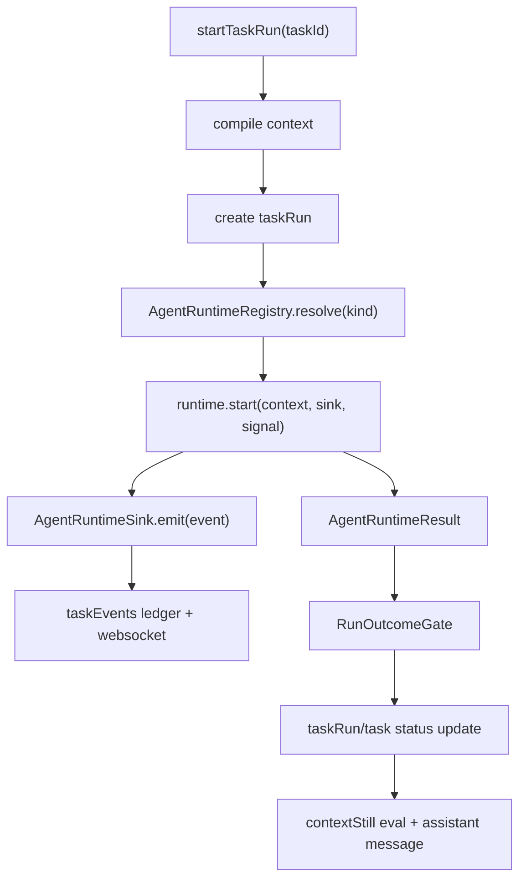

# AgentRuntime Interface 実装計画

## 目的

NightWorkers の実行基盤を `nativeLocalRunner` 固定から、差し替え可能な `AgentRuntime` 契約へ移す。

この計画のゴールは「新しい agent を作ること」ではなく、現在の native supervisor を壊さずに、将来の sandbox runner、外部 process runner、Pi/OpenHands 由来の設計知見を載せられる実行境界を作ること。

## 優先順位 1 位にする理由

個人利用の Devin / Manus を目指す場合、最初に必要なのは UI や高度な skill ではなく、実行結果を信頼できる最小の runtime contract である。

現状の `IRunner` は `start / stop / getStatus / onLog` の process runner 契約に近く、以下が contract として固定されていない。

- 実行開始から終了までの構造化 event
- terminal state と outcome gate の責務分離
- cancellation / timeout / blocked / needs_human の意味
- tool call 前後の policy hook
- final report、diff、verification、log の所在
- runner を差し替えた時に NightWorkers 側が依存してよい public surface

ここを先に固定しないと、後続の review schema、tool policy、sandbox、JSONL export、skill/plugin model がすべて個別実装に引きずられる。

## 現状の前提

### 既存コード

- `api/services/runner/types.ts` は `IRunner` と `RunnerOptions` を定義している。
- `api/services/runner/NativeLocalRunner.ts` は `IRunner` を実装し、`runSupervisorLoop`、初期 `git_status`、最終 `git_diff`、in-memory status、log callback をまとめて扱っている。
- `api/modules/nightworkers/nightworkers.service.ts` の `startTaskRun` は context compile、run 作成、runner log 購読、runner start、status polling、diff 回収、outcome gate、contextStill eval、assistant message 作成をまとめて持っている。
- `api/services/supervisor/supervisor-loop.ts` は supervisor loop 内から直接 repository event を書いている。
- `api/modules/nightworkers/nightworkers.repository.ts` は `taskRuns` と `taskEvents` の永続化、および websocket publish の中心である。
- `api/services/run-control/types.ts` は `SupervisorLoopResult` と outcome 系 type を既に持っている。

### `../pi` から参考にする点

`../pi` は package として取り込まない。参照するのは contract と設計判断のみ。

- agent lifecycle event: `agent_start`、`turn_start`、`message_start`、`message_update`、`message_end`、`tool_execution_start`、`tool_execution_update`、`tool_execution_end`、`turn_end`、`agent_end`
- `beforeToolCall` による tool 実行前 block
- `afterToolCall` による tool 結果補正、error 化、terminate hint
- `shouldStopAfterTurn` による graceful stop
- full-control example の「discovery なし、明示的 resource/config/tool selection」
- stream 関数が throw ではなく event/result に failure を encode する方針

ただし NightWorkers では、run ledger と outcome gate を product 側の source of truth とする。

## 非ゴール

- `../pi` の package を install/import しない。
- Pi adapter や OpenHands adapter をまだ作らない。
- UI redesign はしない。
- sandbox 実装はしない。
- review result schema はこの計画では定義だけに留め、実装しない。
- multi-agent routing はしない。
- DB schema の大規模変更はしない。

## 目標アーキテクチャ



責務分離は以下にする。

- `nightworkers.service`: task orchestration、context compile、run 作成、final persistence、contextStill feedback
- `AgentRuntime`: 実行 loop の開始、停止、structured event 発行、runtime result 返却
- `AgentRuntimeSink`: event を ledger に保存する boundary
- `RunOutcomeGate`: runtime result を task の最終 outcome に変換する唯一の判断地点
- `supervisor-loop`: native runtime の中核 loop。ただし段階的に repository 直書きを減らす

## Public Contract 案

### AgentRuntimeKind

```ts
export type AgentRuntimeKind =
  | 'native-local'
  | 'external-process'
  | 'future-adapter';
```

最初に実装するのは `native-local` のみ。

`external-process` と `future-adapter` は immediate implementation ではなく、type level の予約に留める。必要になるまで registry で解決可能にしない。

### AgentRunContext

```ts
export interface AgentRunContext {
  runId: string;
  taskId: string;
  repositoryId: string;
  repoRoot: string;
  compiledPrompt: string;
  latestUserMessage: string;
  timeoutSeconds: number;
  safetyPolicy?: AgentSafetyPolicy;
  contextSnapshot: {
    compiledPrompt: string;
    source: 'context-still' | 'fallback';
  };
  runtimeOptions?: Record<string, unknown>;
}
```

方針:

- `repoRoot` は検証済み directory path だけを渡す。
- `compiledPrompt` と `latestUserMessage` は分ける。
- `contextSnapshot` は runtime に渡すが、runtime が contextStill を直接呼ばない。
- `safetyPolicy` は `RunnerOptions` から移し、runtime / tool policy の共通入力にする。

### AgentRuntimeEvent

最初は既存 UI と ledger に合わせ、event type を増やしすぎない。

```ts
export type AgentRuntimeEvent =
  | { type: 'runtime_started'; message: string; payload?: unknown }
  | { type: 'turn_started'; message: string; payload?: unknown }
  | { type: 'model_response_started'; message: string; payload?: unknown }
  | { type: 'model_response_delta'; message: string; payload?: unknown }
  | { type: 'supervisor_decision'; message: string; payload?: unknown }
  | { type: 'tool_call_started'; message: string; payload?: unknown }
  | { type: 'tool_call_progress'; message: string; payload?: unknown }
  | { type: 'tool_call_finished'; message: string; payload?: unknown }
  | { type: 'verification_started'; message: string; payload?: unknown }
  | { type: 'verification_finished'; message: string; payload?: unknown }
  | { type: 'diff_collected'; message: string; payload?: unknown }
  | { type: 'runtime_finished'; message: string; payload?: unknown }
  | { type: 'runtime_error'; message: string; payload?: unknown };
```

Pi の event 名をそのままコピーしない。NightWorkers の ledger に合わせた product event に正規化する。

対応関係:

- Pi `agent_start` -> NightWorkers `runtime_started`
- Pi `turn_start` -> NightWorkers `turn_started`
- Pi `message_update` -> NightWorkers `model_response_delta`
- Pi `tool_execution_start` -> NightWorkers `tool_call_started`
- Pi `tool_execution_update` -> NightWorkers `tool_call_progress`
- Pi `tool_execution_end` -> NightWorkers `tool_call_finished`
- Pi `agent_end` -> NightWorkers `runtime_finished`

### AgentRuntimeSink

```ts
export interface AgentRuntimeSink {
  emit(event: AgentRuntimeEvent): Promise<void>;
}
```

初期実装では `taskEvents` への保存と websocket publish は既存 repository に委譲する。

sink は runtime が DB module に直接依存しないための boundary であり、JSONL export や replay は後続でこの boundary に載せる。

### AgentRuntimeResult

```ts
export interface AgentRuntimeResult {
  terminalState:
    | 'completed'
    | 'needs_review'
    | 'needs_human'
    | 'failed'
    | 'timed_out'
    | 'blocked'
    | 'cancelled';
  summary: string;
  finalReport: string;
  stoppedBy:
    | 'decision'
    | 'budget'
    | 'tool_failure'
    | 'llm_error'
    | 'missing_tool_call'
    | 'policy'
    | 'cancelled';
  riskLevel: 'low' | 'medium' | 'high';
  logContent?: string;
  diffPatch?: string;
  testResults?: unknown;
  usage?: unknown;
}
```

`AgentRuntimeResult` は final outcome ではない。最終 status は必ず `decideRunOutcome` が決める。

### AgentRuntime

```ts
export interface AgentRuntime {
  readonly kind: AgentRuntimeKind;
  start(
    context: AgentRunContext,
    sink: AgentRuntimeSink,
    signal?: AbortSignal
  ): Promise<AgentRuntimeResult>;
  stop(runId: string): Promise<void>;
}
```

`start` は fire-and-forget にしない。呼び出し元は `Promise<AgentRuntimeResult>` を await し、polling を不要にする。

ただし API endpoint の応答は既存通り即時 return するため、`nightworkers.service` 内では background async task として runtime を await する。

## 実装ステップ

### Step 1: Type を追加する

対象:

- `api/services/agent-runtime/types.ts`

追加:

- `AgentRuntimeKind`
- `AgentSafetyPolicy`
- `AgentRunContext`
- `AgentRuntimeEvent`
- `AgentRuntimeSink`
- `AgentRuntimeResult`
- `AgentRuntime`

受け入れ条件:

- 既存 runtime の挙動は変えない。
- `RunnerOptions` と重複する `safetyPolicy` は型だけ揃え、既存 `IRunner` はまだ削除しない。
- `pnpm typecheck` が通る。

### Step 2: Ledger sink を追加する

対象:

- `api/services/agent-runtime/ledger-sink.ts`

役割:

- `AgentRuntimeEvent` を既存 `repo.createTaskEvent` に変換する。
- `actor`、`type`、`eventType` の mapping を一箇所に閉じ込める。
- message は UI で読める短文、payload は詳細 JSON とする。

受け入れ条件:

- `taskEvents.seq` は repository 側の既存 auto increment に任せる。
- websocket publish は repository 経由の既存動作を維持する。
- runtime 実装が repository module を直接 import しなくても event を保存できる。

### Step 3: NativeAgentRuntime を作る

対象:

- `api/services/agent-runtime/NativeAgentRuntime.ts`

役割:

- 既存 `NativeLocalRunner.start` の中身を `AgentRuntime.start` 契約へ移す。
- 初期 `git_status`、`runSupervisorLoop`、最終 `git_diff` を実行する。
- log callback ではなく `sink.emit` で構造化 event を出す。
- `runSupervisorLoop` の戻り値を `AgentRuntimeResult` に変換する。

この step では、`runSupervisorLoop` 内の repository 直書きは完全には除去しなくてよい。まず runner-level の DB 依存を減らし、supervisor-loop の direct write は後続の小タスクに分ける。

受け入れ条件:

- 既存 native execution の成功/失敗 status が維持される。
- final `diffPatch` が `AgentRuntimeResult` に入る。
- runtime crash は throw で上位に漏らさず、`terminalState: 'failed'` の result と `runtime_error` event に正規化する。
- stop 済み run は `cancelled` として result へ正規化する。

### Step 4: Runtime registry を追加する

対象:

- `api/services/agent-runtime/registry.ts`

役割:

- `native-local` を `NativeAgentRuntime` に解決する。
- unknown kind は明示的に error にする。
- future adapter 用の placeholder は登録しない。

受け入れ条件:

- `startTaskRun` は concrete `nativeLocalRunner` ではなく registry 経由で runtime を取得する。
- workerKind は当面 `native-local` に統一する。

### Step 5: startTaskRun を AgentRuntime 契約へ移行する

対象:

- `api/modules/nightworkers/nightworkers.service.ts`

変更:

- `AgentRunContext` を組み立てる。
- `createLedgerSink(run.id)` を作る。
- background async task 内で `runtime.start(context, sink, abortSignal)` を await する。
- `getStatus` polling を削除する。
- `runtimeResult` を `decideRunOutcome` に渡す。
- `runtimeResult.diffPatch`、`logContent`、`testResults` を `taskRuns` に保存する。

受け入れ条件:

- API の `startTaskRun` は既存通り run を即時返す。
- active run 二重起動の挙動は変えない。
- context compile fallback の挙動は変えない。
- final assistant message の作成は維持する。
- contextStill `evaluateContext` は runtime から呼ばず、service 側に残す。

### Step 6: 互換 shim を残す

対象:

- `api/services/runner/NativeLocalRunner.ts`
- `api/services/runner/types.ts`

方針:

- すぐには削除しない。
- 既存 import が残っている間は `NativeAgentRuntime` を包む shim として維持する。
- `openHandsProcessRunner = nativeLocalRunner` の compatibility export は今回の実装では触らず、後続の cleanup task で削除可否を判断する。

受け入れ条件:

- 既存テストや古い import が壊れない。
- 新規コードは `api/services/agent-runtime/*` を使う。

### Step 7: テストを更新する

対象候補:

- `tests/services.supervisor.test.ts`
- `tests/services.run-control.test.ts`
- `tests/routes.nightworkers.test.ts`
- 必要なら `tests/services.agent-runtime.test.ts` を追加

確認観点:

- `AgentRuntime.start` が `AgentRuntimeResult` を返す。
- runtime event が `taskEvents` に保存される。
- `startTaskRun` が polling なしで final status を確定する。
- runtime failure が `failed` outcome と assistant message に落ちる。
- timeout / budget stop が `timed_out` または `needs_human` に正規化される。

## 最初の実装で残してよい技術的負債

- `supervisor-loop` 内の repository direct write は残してよい。
- `AbortController` による hard cancellation は最小実装でよい。
- event taxonomy は完全網羅しなくてよい。
- `usage` や token accounting は optional のままでよい。
- external process runtime は実装しない。

ただし、これらは interface が閉じていることが条件。後続 task で runtime 内部を置き換えても `nightworkers.service` の public flow が変わらない状態にする。

## 受け入れ条件

- `api/services/agent-runtime/` に runtime contract が追加されている。
- `startTaskRun` の主経路が `AgentRuntime` を使っている。
- `NativeLocalRunner` 互換 shim は残るが、新規主経路ではない。
- `startTaskRun` の `getStatus` polling が不要になっている。
- runtime result と outcome gate の責務が分離されている。
- runtime event は sink 経由で ledger に保存される。
- `../pi` 由来の設計は event/hook/explicit-control の参考に留まり、package dependency は増えない。
- 既存の run ledger、websocket publish、assistant message、contextStill eval が維持される。

## 検証コマンド

```bash
pnpm typecheck
pnpm test run tests/services.run-control.test.ts
pnpm test run tests/services.supervisor.test.ts
pnpm test run tests/routes.nightworkers.test.ts
```

runtime event の保存経路を追加した場合は、最低 1 本は DB を使った integration test を追加する。

## リスクと対策

| リスク | 対策 |
| --- | --- |
| 既存 UI が期待する eventType と新 event の mapping がずれる | ledger sink に mapping を集中させ、既存 eventType を維持する |
| `runSupervisorLoop` の repository 直書きと sink event が重複する | 最初は重複を許容し、後続 task で supervisor event emission を sink に移す |
| `start` を awaitable にすると API 応答が遅くなる | service 内では background task として await し、HTTP 応答は既存通り即時 return する |
| cancellation が中途半端になる | 初回は `cancelled` state の contract と event を固定し、hard kill は後続 task に分ける |
| 外部 runtime を意識しすぎて surface が肥大化する | `native-local` に必要な field だけを必須にし、拡張 field は optional にする |

## 後続タスクへの接続

この計画が完了したら、次の優先 task は以下に進める。

1. RunEvent taxonomy の確定と JSONL export への接続
2. ToolPolicyGate を `beforeToolCall` 相当の hook として実装
3. ReviewResult schema と outcome evidence の保存
4. Agent Outcome E2E Harness
5. skill/plugin capability model

## 完了判定

この task は、コード上で `AgentRuntime` が主経路になり、native 実行の既存 behavior が維持され、後続の runtime/sandbox/policy 作業が `IRunner` ではなく `AgentRuntime` を前提に計画できる状態になったら完了とする。
