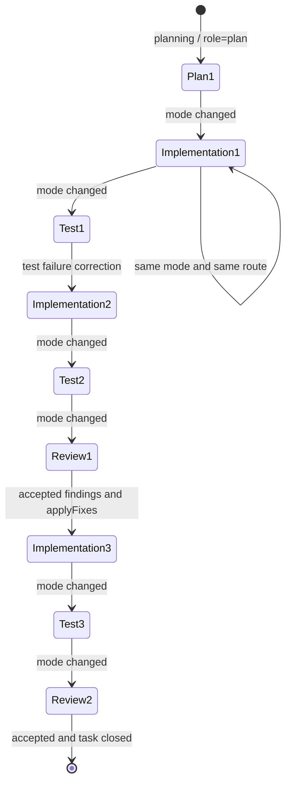

# Agent Mode Session / Usage Accounting リファクタリング実装計画

## Status

implementation-ready

- Reviewed: 2026-07-14
- Primary implementer assumption: Luna
- Execution type: `exclusive`（schema migration、runtime resume cutover、usage accounting meaningの変更を含むため）

## 目的

NightWorkers の Plan / Implementation / Test / Review を、それぞれ独立した Agent として扱える実行境界へ変更する。

同時に、provider session を再利用したときの累積 token counter を TaskRun 単位の使用量として再加算しないよう、LLM usage の保存契約を修正する。

この計画が満たすべき最終状態は次のとおり。

- 同一 `executionMode` が連続し、Role Routing も同一なら、複数 TaskRun にまたがって同じ Agent Mode Session を継続する。
- `executionMode` が変わった時点で、それまでの provider history を閉じ、新しい Agent Mode Session を開始する。
- 別モードを経由して元のモードへ戻った場合、過去の Session を再開せず、新しい epoch の Session を開始する。
- Test / Review は Implementation の provider history、reasoning、tool transcript を引き継がず、保存済み artifact と evidence だけを handoff として受け取る。
- Codex SDK が provider session 累積値を返す場合でも、`llm_usage_records` と summary には前回 checkpoint との差分だけを保存する。
- raw counter、差分、counter scope、Session ID を追跡でき、実消費と集計上の再加算を後から区別できる。

## Luna向け実行契約

この計画は Phase 0 から順番に実施する。後続 Phase の都合で先行 Phase の契約を省略しない。

実装単位:

1. Phase 0 で現行挙動と期待値を test fixture に固定する。
2. Phase 1-2 で schema、Session resolver、TaskRun association だけを完成させる。
3. Phase 3-5 で handoff と provider resume の read/write key を切り替える。
4. Phase 6 で usage の保存意味を raw snapshot から delta へ切り替える。
5. Phase 7 は独立した workflow behavior change として実装する。Phase 0-6 が green になる前に Review correction を変更しない。
6. Phase 8 の legacy `--apply` は自動テストや通常起動で実行しない。operator が dry-run report を確認した場合だけ実行する。

禁止事項:

- `executionMode` や role を user text の正規表現・keyword で決めない。
- Session lookup failure 時に task-scoped legacy history を fallback として使わない。
- Test/Review を fresh にするためだけの mode 名 hard-code を新しく追加しない。
- provider 層へ workflow transition、handoff source 選択、Session close 判断を置かない。
- Phase 7 まで Review の既存 `applyFixes` behavior を途中状態で削除しない。
- 既存の未コミット変更を上書きしない。実装開始時と各 Phase 終了時に対象 file の `git diff` を確認する。

実装中に判断が必要になった場合の優先順位:

1. 本文の Locked Decisions。
2. Data model / resolver / usage transaction contract。
3. 各 Phase の Acceptance。
4. 現行 test の互換要件。

上位契約と現行コードが衝突した場合、現行コードを暗黙に温存せず、characterization test と変更理由を残して上位契約へ合わせる。

## 今回の調査で確認した基準値

対象 Task:

- Task ID: `d5ff9682-2654-448f-9b47-ecd2a873dc5b`
- Bootstrap と Implementation の Codex thread: `019f6096-1e7d-7803-b017-1f2c759fac4a`
- Test の Codex thread: `019f60a2-795b-7b42-acc4-c0746c4b3086`

保存されていた usage:

| 区間 | input | cached input | output | 判定 |
| --- | ---: | ---: | ---: | --- |
| Bootstrap | 556,913 | 500,736 | 3,150 | 同一 provider thread の最初の snapshot |
| Implementation | 8,873,949 | 8,654,336 | 28,406 | Bootstrap を含む累積 snapshot |
| Test | 345,567 | 304,896 | 1,996 | fresh provider thread の最初の snapshot |

正しい差分:

```text
Implementation input delta = 8,873,949 - 556,913 = 8,317,036
Implementation cached delta = 8,654,336 - 500,736 = 8,153,600
Implementation output delta = 28,406 - 3,150 = 25,256
```

正しい runtime total:

```text
input = 556,913 + 8,317,036 + 345,567 = 9,219,516
cached input = 500,736 + 8,153,600 + 304,896 = 8,959,232
non-cached input = 260,284
output = 3,150 + 25,256 + 1,996 = 30,402
```

したがって 10M 近い表示の主因は実際の大量消費であり、追加で Bootstrap 分 556,913 input tokens が累積値の再加算により過大計上されていた。literal duplicate row や同一 `call_id` の二重 insert は確認されていない。

このリファクタリングは約 0.56M の再加算を修正するが、残る約 9.22M の実消費を小さく見せるものではない。実消費の削減は、正しい mode/session 別計測ができた後に別途評価する。

## 現行コードで先に解消すべきギャップ

| 重要度 | 現行箇所 | 現在の挙動 | この計画での変更 |
| --- | --- | --- | --- |
| Blocker | `api/services/agent-runtime/types.ts` | `AgentExecutionMode` と state-card projection role に `test` がない | 共通型へ `test` を追加し、Test を Implementation role として正規化しない |
| Blocker | `api/services/agent-runtime/native-api-runner/native-api-mode.ts` | `stateCardRoleForExecutionMode("test")` が `implementation` を返す | `NativeApiStateCardRole` に `test` を追加して Test 専用 projection を使う |
| Blocker | `api/services/agent-runtime/registry.ts` | fallback role が Test を Implementation として扱う | `fallbackRoleForExecutionMode("test") === "test"` にする |
| Blocker | `api/services/agent-runtime/codex-runtime-support.ts` | Codex execution mode normalization に `test` がない | Test provider state を `test` として保存する |
| Blocker | `api/services/llm-usage/repository.ts` | usage insert と summary upsert が既に一つの transaction を所有する | checkpoint read/update を同じ transaction に入れられる内部APIへ分解する |
| Blocker | `api/db/bootstrap-runtime-tables.ts` と runtime store | runtime table は migration だけでなく bootstrap/lazy ensure でも作られる | migration、Drizzle schema、bootstrap、lazy ensure の4経路を同じ列/indexに揃える |
| High | `start-task-run.ts` | TaskRun 作成時点に論理 Session ID がない | Session resolve/open と TaskRun insert を同一 transaction にする |
| High | `start-task-run.ts` | Codex Test/Review resume を mode 名で hard-disable | Session-scoped lookup により自然に fresh/reuse を決める |
| High | `native-api-session-store.ts` | completed history を task + provider + model + mode で検索 | `agentModeSessionId` を必須keyにする |
| High | `codex-sdk-usage.ts` | random UUID call ID と provider raw counter をそのまま保存 | run-local turn sequence と checkpoint delta を使う |
| High | `review-run.service.ts` | `applyFixes=true` で Review agent が編集・verify・commitする | Phase 7 で Implementation correction Session へ委譲する |

上表の Blocker を修正しないまま Session resolver だけを追加すると、DB上のSessionは分かれても Test のprompt/state/resumeが Implementation として扱われるため、完了扱いにしない。

## Locked Decisions

1. Session の正本は TaskRun ではなく、連続する `executionMode` と Role Route の区間を表す `AgentModeSession` とする。
2. 同じ mode の turn、tool retry、TaskRun retry、アプリ再起動、Repository Bootstrap から通常 Implementation への連続実行では、Role Route が同一なら同じ `AgentModeSession` を使う。
3. `executionMode` が変われば必ず新しい `AgentModeSession` を作る。
4. `implementation -> test -> implementation` は Implementation Session の再開ではなく、Implementation epoch 2 を作る。
5. TaskRun開始時に解決された実効Role Routeについて、mode が同じでも LLM role、runtime lane、provider endpoint、provider、model、thinking depth のいずれかが前runから変われば新しい Session を作る。
6. `jobType`、`executionModeSource`、user message、Todo、prompt digest の変化だけでは Session を分けない。したがって Repository Bootstrap と通常 Implementation は、連続かつ同一 route なら Session を共有できる。
7. provider thread の fallback / context rotation は、同じ論理 `AgentModeSession` 内で `runtime_session_states` を supersede できる。論理 Session と provider continuation handle は別物として扱う。
8. mode 境界では raw provider history、reasoning、tool transcript を次 Session へ渡さない。handoff は artifact、Todo/state card の確定事実、設計書参照、verification/review evidence に限定する。
9. Test / Review からの修正は、過去の Implementation Session を再開せず、新しい Implementation Session へ渡す。
10. TaskRun の `completed`、`failed`、`cancelled`、`needs_human` だけでは Session を閉じない。Session を閉じるのは mode/route transition、明示 reset、または task 全体の accepted `completed` / `archived` / deletion である。`stopTaskRun()` はSession closeではない。
11. `llm_usage_records.input_tokens` など既存の集計対象列には、その record が新たに消費した差分だけを保存する。累積 raw 値は `raw_usage_json` と checkpoint に保存する。
12. counter が累積か per-turn かは provider adapter が明示する。数値の大小だけで自動推測しない。
13. Codex SDK lane は今回の実測に基づき `provider_session_cumulative` として characterization test を固定する。Native API lane は現行どおり `per_turn` とする。
14. Session 解決に失敗した場合の安全側 fallback は fresh Session である。task + mode を使う旧 resume へ戻さない。
15. Supervisor の mode/role 方針は prompt と skill reference に置き、provider 実装には Session 判断や workflow 判断を分散させない。
16. canonical role は `shared/llm-role.ts` の値を使う。`quality_gate` / `completion` など legacy alias を Session identity に保存しない。
17. route source (`primary` / `fallback` / `override`) や settings revision が変わっても、実効 endpoint、provider、model、thinking depth が同じなら Session を分けない。
18. Session resolve/open と、その Session に属する最初の `task_runs` insert は同一 DB transaction で成功または失敗させる。run を持たない orphan active Session を作らない。
19. Native API の同一run内provider fallbackはSession transitionにしない。requested route identityは不変とし、実際に成功したprovider/modelをturnとeventへ記録する。次runでroute compatibilityを証明できなければ、同じ論理Session内でもprovider historyはfreshにする。

## 用語

### AgentModeSession

NightWorkers が管理する論理 Agent の実行区間。複数の TaskRun と、必要なら複数の provider session state を持てる。

### Mode epoch

Task 内で AgentModeSession が開かれた順番。`implementation -> test -> implementation` の場合、3つの epoch を持つ。

### Provider session state

Codex `thread_id` など、provider が会話を継続するための handle。`runtime_session_states` に保存し、必ず `agent_mode_session_id` の配下で検索する。

### Usage snapshot / delta

- snapshot: provider が返した raw token counter。
- delta: 前回 checkpoint との差。NightWorkers の集計・価格計算に使う値。

## 対象範囲

### In scope

- `AgentModeSession` の schema、resolver、mode transition state machine。
- TaskRun、Codex provider state、Native API turn、LLM usage record の Session への関連付け。
- Codex / Native API 両 lane の resume lookup を active Session 内に限定する変更。
- mode 境界 handoff の lane 共通化。
- Codex 累積 usage の checkpoint 差分化と replay-safe な usage insert。
- Test / Review の失敗・finding から新しい Implementation Session へ戻す correction loop。
- Session/usage transition event、診断 query、focused tests。
- 高信頼に再構成できる既存 usage の dry-run 付き補正手段。

### Non-goals

- model の内部 prompt caching の仕組みを変更すること。
- 全 provider を同一の server-side thread API に統一すること。
- Test / Review に Implementation の raw conversation を要約して渡すこと。
- prompt 圧縮、tool output 上限、closeout turn 数の最適化を同時に行うこと。
- 正しい usage を得る前に token budget 超過を強制停止すること。
- Mission Pilot の一回完結型 structured artifact call を長期 provider session 化すること。これらは現在どおり fresh call を維持し、必要なら後続計画で `AgentModeSession` との関連付けだけを追加する。
- UI の全面再設計。初期 slice は run detail/event と既存 usage surface で監査できればよい。

## 目標 state machine



各矢印で古い Session を `closed` にし、新しい Session を開く。同じ state 内の自己遷移だけが同じ Session/provider history を継続できる。

## Schema更新経路

NightWorkers の runtime table は Drizzle migration だけでは完成しない。Luna は次の更新経路をすべて揃える。

| 対象 | Drizzle schema | SQL migration | runtime bootstrap | lazy ensure |
| --- | --- | --- | --- | --- |
| `agent_mode_sessions` | `api/db/schema-task-execution.ts` | 必須 | `api/db/bootstrap-runtime-tables.ts` | 不要 |
| `task_runs.agent_mode_session_id` | `api/db/schema-task-execution.ts` | 必須 | `ensureColumn(...)` | 不要 |
| `runtime_session_states.agent_mode_session_id` | `api/db/schema-task-execution.ts` | fresh DB で table がない場合を考慮し、migrationだけに依存しない | `ensureColumn(...)` | `runtime-session-state.ts` の ensure も更新 |
| `native_api_turns.agent_mode_session_id` | `api/db/schema-task-execution.ts` | fresh DB で table がない場合を考慮し、migrationだけに依存しない | `ensureColumn(...)` | `native-api-session-store.ts` の ensure も更新 |
| `llm_usage_records` 追加列 | `api/db/schema-llm-usage.ts` | 必須 | `ensureColumn(...)` | 不要 |
| `llm_usage_counter_checkpoints` | `api/db/schema-llm-usage.ts` | 必須 | `api/db/bootstrap-runtime-tables.ts` | 不要 |

具体的な順序:

1. Drizzle schema を更新する。
2. 現時点の次番号を再確認して additive migration を作る。
3. `api/db/bootstrap-runtime-tables.ts` の `CREATE TABLE IF NOT EXISTS` と `ensureColumn()` を更新する。
4. `RuntimeSessionStateStore` と `NativeApiSessionStore` の standalone test が bootstrap 全体を通らず起動するため、それぞれの lazy ensure も更新する。
5. fresh DB test、旧schema fixture test、通常 application bootstrap test を通す。

migration で存在しない lazy table に無条件 `ALTER TABLE` しない。`runtime_session_states` と `native_api_turns` の既存DB更新は `PRAGMA table_info` / `ensureColumn()` を使う既存方式に合わせる。

## Data model

### 1. `agent_mode_sessions`

`api/db/schema-task-execution.ts` と次の Drizzle migration に追加する。

推奨 schema:

```text
agent_mode_sessions
  id text primary key
  task_id text not null
  repository_id text not null
  epoch integer not null
  predecessor_session_id text null
  execution_mode text not null
  llm_role text not null
  runtime_lane text not null
  provider text null
  provider_endpoint_id text null
  model text null
  thinking_depth text null
  route_fingerprint text not null
  status text not null
  close_reason text null
  opened_at integer not null
  closed_at integer null
  created_at integer not null
  updated_at integer not null
```

Status:

- `active`
- `closed`
- `invalid`

Close reason:

- `mode_changed`
- `role_route_changed`
- `route_identity_unavailable`
- `task_closed`
- `explicit_reset`
- `superseded_by_concurrent_transition`

制約:

- unique: `(task_id, epoch)`
- unique partial index: `CREATE UNIQUE INDEX ... ON agent_mode_sessions(task_id) WHERE status = 'active'`
- index: `(task_id, status, updated_at)`
- index: `(predecessor_session_id)`
- `task_id` / `repository_id` は task/repository deletion に `ON DELETE CASCADE`。
- `predecessor_session_id` は `ON DELETE SET NULL`。通常運用ではSession rowを個別削除しない。

`provider` には `ResolvedStructuredLlmRoute.providerId` の canonical 値を保存する。endpoint の kind/name や route source を provider identity の代用にしない。

`route_fingerprint` は新規 helper `buildAgentModeSessionRouteIdentity()` が次の canonical JSON から生成する。object の通常 `JSON.stringify()` 順序へ依存せず、固定field順でserializeして `digestText()` を使う。

```ts
{
  executionMode,
  llmRole,
  runtimeLane,
  provider,
  providerEndpointId,
  model,
  thinkingDepth,
}
```

role route が存在しない legacy fallback の identity:

- Codex lane: `provider="codex"`、`providerEndpointId=null`、model/thinking depth は最終 `runtimeOptions.codex` の値。modelを確定できなければ `continuationEligible=false` とする。
- Native lane: `startTaskRunInProcess()` の `runtimeLlmRoute` でprovider/modelを確定できない場合は `continuationEligible=false` とし、TaskRunごとにfresh Sessionにする。TaskRun作成後のprovider route preparation結果を使ってSession identityを後付け変更しない。

`settingsRevision`、`route.source`、`route diagnostics`、`jobType` は fingerprint に含めない。

### 2. 既存 table の関連付け

次の nullable FK を追加する。既存 row との互換性のため DB 上は nullable とし、新規 run の service contract では必須にする。

```text
task_runs.agent_mode_session_id
runtime_session_states.agent_mode_session_id
native_api_turns.agent_mode_session_id
llm_usage_records.agent_mode_session_id
```

`AgentRunContext` には snapshot から毎回parseさせず、top-level required field として `agentModeSessionId: string` を追加する。`contextSnapshot.agentModeSession` は監査/UI用の複製であり、runtime adapter のlookup正本にはしない。

既存tableからSessionへのFKは `ON DELETE SET NULL` とし、legacy/監査rowをSession cleanupで失わない。checkpointだけはSessionの派生stateなので `ON DELETE CASCADE` とする。

追加 index:

- `task_runs(agent_mode_session_id, started_at)`
- `runtime_session_states(agent_mode_session_id, status, last_seen_at)`
- `native_api_turns(agent_mode_session_id, status, finished_at)`
- `llm_usage_records(agent_mode_session_id, created_at)`

`runtime_session_states` は廃止しない。役割を「Task の active thread」から「AgentModeSession 内の provider continuation handle」へ狭める。

### 3. `llm_usage_counter_checkpoints`

provider session 累積 counter の最後の snapshot を保存する。

```text
llm_usage_counter_checkpoints
  id text primary key
  agent_mode_session_id text not null
  provider_session_key text not null
  provider text not null
  model text null
  counter_scope text not null
  raw_input_tokens integer null
  raw_cached_input_tokens integer null
  raw_output_tokens integer null
  raw_reasoning_output_tokens integer null
  source_run_id text null
  source_sequence integer null
  state_version integer not null default 0
  created_at integer not null
  updated_at integer not null
```

制約:

- unique: `(agent_mode_session_id, provider_session_key)`
- `provider_session_key` は Codex では `thread_id`。provider handle がない per-turn call では checkpoint を作らない。

### 4. Usage record の意味

`llm_usage_records` に次を追加する。

```text
usage_counter_scope text null
usage_normalization_status text null
source_sequence integer null
```

既存の `input_tokens`、`cached_input_tokens`、`output_tokens`、`reasoning_output_tokens` は delta を保存する。`raw_usage_json` は provider snapshot をそのまま保持する。
`metadata_json.usageNormalization` には次を保存する。

```ts
{
  counterScope: "provider_session_cumulative",
  status: "first_snapshot" | "delta" | "counter_reset" | "invalid_cached_delta",
  providerSessionKey: string,
  previousRaw: { inputTokens, cachedInputTokens, outputTokens, reasoningOutputTokens },
  currentRaw: { inputTokens, cachedInputTokens, outputTokens, reasoningOutputTokens },
  delta: { inputTokens, cachedInputTokens, outputTokens, reasoningOutputTokens },
}
```

## Session resolver contract

新規 `api/services/agent-runtime/agent-mode-session.ts` に Session 解決を集約する。

```ts
resolveOrOpenAgentModeSession({
  taskId,
  repositoryId,
  executionMode,
  llmRole,
  routeIdentity: {
    runtimeLane,
    provider,
    providerEndpointId,
    model,
    thinkingDepth,
    fingerprint,
    continuationEligible,
  },
}): Promise<{
  session: AgentModeSession;
  transition: "reused" | "opened";
  closeReason?: AgentModeSessionCloseReason;
  predecessorSessionId?: string;
}>
```

`resolveOrOpenAgentModeSession()` は transaction handle を受け取る repository-level 関数にし、単独で transaction を開始しない。orchestrator は Session resolve/open と TaskRun insert を一つの `withSqliteBusyRetry(() => db.transaction(...))` に入れる。

transaction 内の処理:

1. task の active Session を取得する。
2. `continuationEligible=true` かつ active Session の `execution_mode`、`llm_role`、`route_fingerprint` がすべて一致すれば reuse する。
3. 一致しなければ active Session を close する。
4. `max(epoch) + 1` で新しい Session を作る。
5. 同じ transaction で `task_runs.agent_mode_session_id` を設定して TaskRun をinsertする。
6. partial unique index 競合時は transaction 全体をrollbackする。既存の SQLite unique/busy retry helper の外側で再読込し、同じ route なら再試行する。異なる route なら `AppError(409, "AGENT_MODE_SESSION_TRANSITION_CONFLICT", ...)` としてrun startを中止し、競合相手のactive Sessionを閉じない。

Session/TaskRun 作成順序:

1. task、repo、execution root、effective Role Route、runtime lane、git baseline を transaction 外で解決する。
2. route identity/fingerprint を決定する。identity が不明なら `continuationEligible=false` とする。
3. Session resolve/open と TaskRun insert を同一 transaction で行う。
4. transaction commit 後に workspace activation、commit baseline record、Todo、run event を作る。
5. 新規 Session の場合だけ boundary handoff を作り、TaskRun context snapshot を更新する。
6. provider runtime を開始する。

TaskRun 作成後の event/handoff で失敗した場合は、既存の run failure policyでrunを `needs_human` にする。TaskRun rowを削除したり、同じ要求を別Sessionで自動再実行しない。

作成した TaskRun には必ず `agentModeSessionId` を直接保存し、`contextSnapshot.agentModeSession` にも次を写す。

```ts
{
  id,
  epoch,
  executionMode,
  llmRole,
  routeFingerprint,
  transition,
  predecessorSessionId,
}
```

## 共通 mode / role type contract

Session実装より先に、TestをImplementationへ落とす互換穴を閉じる。

変更対象:

- `api/services/agent-runtime/types.ts`
- `api/services/agent-runtime/native-api-runner/native-api-mode.ts`
- `api/services/agent-runtime/registry.ts`
- `api/services/todo-context/types.ts`
- `api/services/conversation-context/state-card-projection.ts`
- `api/services/agent-runtime/codex-runtime-support.ts`

確定する型:

```ts
type AgentExecutionMode =
  | "planning"
  | "implementation"
  | "test"
  | "review"
  | "general_answer";

type NativeApiStateCardRole =
  | "plan"
  | "implementation"
  | "test"
  | "review"
  | "general_answer";
```

必須mapping:

| executionMode | LLM role | State Card role |
| --- | --- | --- |
| `planning` | `plan` | `plan` |
| `implementation` | `implementation` | `implementation` |
| `test` | `test` | `test` |
| `review` | `review` | `review` |
| `general_answer` | `plan` | `general_answer` |

Test State Card projection は raw Implementation snapshot をそのまま渡さず、goal、target files、verification specification/evidence refs、last error をboundedに投影する。Implementation Todo、過去の実装会話、code snippet本文は除外する。

このmappingの unit test を先に追加し、`test -> implementation` へ戻る normalization を禁止する。

## Provider resume contract

### Codex SDK lane

変更対象:

- `api/modules/nightworkers/run-orchestration/runtime-routing.ts`
- `api/modules/nightworkers/run-orchestration/start-task-run.ts`
- `api/services/agent-runtime/runtime-session-state.ts`
- `api/services/agent-runtime/codex-runtime-support.ts`
- `api/services/agent-runtime/codex-sdk/codex-sdk-client.ts`
- `api/services/agent-runtime/CodexAgentRuntime.ts`

変更後:

- resume lookup は `agentModeSessionId` だけを入口にする。
- Test / Review を名前で一律 `disabled` にする現在の分岐は削除する。新しい Test / Review Session は provider state をまだ持たないため、自然に fresh start になる。
- 同一 Test Session 内の後続 TaskRun は、Test の provider thread を resume できる。
- 同一 Review Session 内の後続 TaskRunも同様に resume できる。
- mode をまたいだ provider thread ID は lookup に現れない。
- `thread.started` で得た `providerThreadId` は該当 `agentModeSessionId` 配下に保存する。
- resume failure や Run Control の context rotation は旧 `runtime_session_states` row を supersede し、同じ AgentModeSession 内で新しい provider thread を保存する。

`readCodexRuntimeExecutionMode()` には `test` を追加し、Test run が誤って `implementation` として session state を保存する互換バグを修正する。

### Native API lane

変更対象:

- `api/services/agent-runtime/native-api-runner/native-api-session-store.ts`
- `api/services/agent-runtime/native-api-runner/native-api-runner.ts`
- `api/services/agent-runtime/native-api-runner/native-api-run-coordinator.ts`

変更後:

- `createTurn()` は `agentModeSessionId` を必須で保存する。
- resume source は `taskId + provider + model + executionMode` ではなく、`agentModeSessionId + provider + model` で検索する。
- mode が戻っても古い history は再利用しない。
- legacy row に Session ID がない場合は fresh history を作り、task-scoped fallback を行わない。
- fresh system prompt、最新 user request、現在の state card は毎 run 再構築してよい。同じ Session の sanitized provider exchange だけをその後ろに接続する。

## Mode boundary handoff contract

Native API 専用の以下の責務を lane 共通 module へ移す。

- `native-api-role-handoff.ts`
- `native-api-role-working-context.ts`
- `native-api-role-context-events.ts`

推奨配置:

```text
api/services/agent-runtime/agent-mode-session/
  contracts.ts
  repository.ts
  resolver.ts
  handoff.ts
  working-context.ts
  events.ts
```

boundary handoff は新しい Session を開いたときだけ作る。同じ Session の後続 TaskRun では新しい cross-mode handoff を作らない。

ここで「handoffを作らない」は「最新stateを渡さない」という意味ではない。同じSessionの継続runはprovider historyをresumeしつつ、fresh system/runtime contract、最新user request、現在のTodo/state cardを現行どおり再構築する。cross-mode artifact と per-run working context を混同しない。

handoff に含めてよいもの:

- predecessor Session / run ID。
- completed Todo と evidence refs。
- Test verification artifact / failed check refs。
- Review finding ID、severity、location、recommendation、accepted status。
- Feature Plan / Specification の path、section、digest。
- workspace revision、diff artifact、commit/baseline refs。
- blocking open question。
- 最新のユーザー指示。

含めないもの:

- provider の message history 全文。
- reasoning item。
- command stdout/stderr 全文。
- tool transcript の逐語コピー。
- 前 role の system prompt / runtime contract。

新しい Session の Codex/Native API prompt は同じ bounded handoff renderer を使う。handoff の全文は run event/artifact に保存し、provider へ渡す projection は size limit と digest を持つ。

handoff作成順序:

1. atomic Session/TaskRun transaction の結果から `predecessorSessionId` と新しい `runId` を得る。
2. predecessor Session に属する最後の TaskRun、Todo、task event、verification/review artifact をDBから読む。
3. `RoleHandoffArtifactV1` を lane 非依存名へ移し、`fromSessionId`、`toSessionId`、`fromExecutionMode`、`toExecutionMode` を必須にする。
4. 新しい run に `context.handoff_created` event を保存する。
5. bounded working context を作り、`context.working_context_created` event を保存する。
6. event ID/seq/digest を新しい run の `contextSnapshot.roleContext` に保存する。
7. Native API は initial historyへ、Codexはruntime user promptのhandoff sectionへ同じprojectionを入れる。

既存 `compactModelVisibleText()` / conversation context token budget を再利用する。handoff専用の無制限JSON stringifyや新しい全文payload経路を作らない。

## Usage normalization contract

### Counter scope

```ts
type UsageCounterScope =
  | "per_turn"
  | "provider_session_cumulative";
```

- Native API: `per_turn`
- Codex SDK runtime: `provider_session_cumulative`
- structured LLM calls: `per_turn`

scope は usage recorder 呼び出し時の必須 metadata とする。未知の provider で scope が指定されない場合は usage を推測せず、`unavailable` warning を残す。

### Delta algorithm

同じ `agentModeSessionId + providerSessionKey` に対して:

```text
checkpoint なし:
  delta = raw
  status = first_snapshot

checkpoint あり、全 counter が前回以上:
  delta = raw - previousRaw
  status = delta

counter が減少:
  delta = raw
  status = counter_reset
  warning event を保存
```

counter reset 時に古い checkpoint との差を 0 として捨てない。新しい provider counter epoch の最初の snapshot として raw を記録する。

optional counterの扱い:

- current/previousの両方がnumberのfieldだけ単調性を比較する。
- previousが`null`でcurrentがnumberなら、そのfieldのdeltaはcurrent全量とする。
- currentが`null`ならdeltaも`null`とし、checkpointの既知値を上書きしない。
- 比較可能なfieldが1つでも減少したらfield単位差分を混在させず、snapshot全体をnew counter epochのbaselineとして扱う。
- `total_tokens` はprovider raw totalの差分を使わず、normalized input/output deltaから再計算する。

`cached delta > input delta` の場合:

- input/output delta は保存する。
- `cached_input_tokens` は `null` とし、cached/regular price split を推測しない。
- `usage_normalization_status = invalid_cached_delta` と warning を残す。

checkpoint 更新、`llm_usage_records` insert、usage summary upsert は同一 transaction で行う。どれか一つだけ成功させない。

### Transaction ownership

現行 `recordLlmUsage()` は自分で transaction を開始し、その中で `llm_usage_records` insert と `upsertLlmUsageSummaryForRecord()` を実行する。外側から別transactionでcheckpointを更新すると二重transactionまたは部分commitになるため、次の形へ分解する。

```ts
recordLlmUsage(input) // public entrypoint。per_turn callもここを使い続ける

recordLlmUsageInTransaction(tx, normalizedInput) // internal。insert + summary

normalizeAndRecordLlmUsage(input) // counter scopeを見て同一txでcheckpoint + recordを処理
```

`normalizeAndRecordLlmUsage()` の transaction順序:

1. deterministic `callId` が既に存在するか確認する。存在すれば既存recordを返し、checkpointを更新しない。
2. cumulative scope の場合、`agentModeSessionId + providerSessionKey` checkpoint を読む。
3. raw -> delta と normalization status を計算する。
4. `recordLlmUsageInTransaction()` で delta record と summary を保存する。
5. checkpoint を current raw へ更新する。
6. commit後にだけ `activity_events(kind='llm.usage')` をappendする。

SQLiteの同時writeは既存 `withSqliteBusyRetry` を使う。checkpointだけ先にcommitしたり、summary失敗後にcheckpointが進む実装は禁止する。

### Replay / duplicate safety

`CodexAgentRuntime` に run-local `providerTurnSequence` を追加し、usage `call_id` を次の決定的形式にする。

```text
codex-runtime:{runId}:{providerTurnSequence}
```

sequenceは event mapper の `model_response_finished` 件数ではなく、`thread.runStreamed(...)` を呼ぶ直前にrun全体で1ずつ増やす。agent message completion と `turn.completed` の両方が `model_response_finished` にmappingされるため、usageを持つeventだけを数える実装にしない。

`providerTurnSequence` は run開始時に同じ `runId` の `llm_usage_records.source_sequence` 最大値から初期化し、retry attempt や finalize recovery でresetしない。`turn.completed` usageを記録するとき、対応する `runStreamed` のsequenceを渡す。通常のprocess restart recoveryが新しいTaskRunを作る現行契約もcharacterization testで固定する。

同じ event を再処理した場合は `call_id` unique conflict を正常な replay として扱い、checkpoint と summary を二度進めない。random UUID による毎回別 record 化は廃止する。

`activity_events(kind = 'llm.usage')` は usage record の mirror のままとし、task/overview 集計の正本にはしない。

## Test / Review correction loop

Role を「別の人」として扱うため、Review Session 自身に finding 修正を続けさせない。

### Test failure

```text
Test Session #1
  -> failed verification evidence を確定
  -> Test Session #1 close
  -> Implementation Session #2 open
  -> failed check refs を handoff
  -> 修正後に Test Session #2 open
```

### Review finding

`applyFixes` は「Review agent が直接編集する」指定ではなく、「accepted finding を Implementation correction へ送る権限」として扱う。

```text
Review Session #1
  -> finding を確定
  -> applyFixes=false: needs_human / finding only
  -> applyFixes=true: Review Session #1 close
  -> Implementation Session #3 open
  -> accepted finding refs を handoff
  -> Test Session #3
  -> Review Session #2
```

変更対象:

- `api/modules/review/review-run.service.ts`
- `api/modules/missionPilot/mission-pilot-runtime-continuation.service.ts`
- `api/modules/missionPilot/mission-pilot-post-queue-coordinator.service.ts`
- Review/Test transition service と対応 tests。

Review prompt の `applyFixes=true` 編集許可は削除し、Review lane の tool allowlist でも実装編集を許可しない。UI option 名を初期 slice で変えない場合も、backend event に `correctionMode: implementation_session` を明示する。

## Phase別変更ファイル

| Phase | 主な変更ファイル | このPhaseでは変更しないもの |
| --- | --- | --- |
| 0 | `tests/services.runtime-session-state.test.ts`, `tests/services.codex-agent-runtime.test.ts`, `tests/services.native-api-session-store.test.ts`, usage/session routing tests | production behavior |
| 1 | `api/db/schema-task-execution.ts`, `api/db/schema-llm-usage.ts`, `api/db/bootstrap-runtime-tables.ts`, `runtime-session-state.ts`, `native-api-session-store.ts`, 新規 `agent-mode-session/*`, migration、共通mode/role型 | provider resume read path、Review workflow |
| 2 | `start-task-run.ts`, `nightworkers.runs.repository.ts`, `start-task-run-types.ts`, `agent-runtime/types.ts`, `runtime-execution.ts`, `task-archive.service.ts` | provider history selection、usage delta |
| 3 | `native-api-role-handoff.ts`, `native-api-role-working-context.ts`, `native-api-role-context-events.ts` から shared module、Codex/Native prompt assembly | resume key、Review correction |
| 4 | `runtime-routing.ts`, `codex-runtime-support.ts`, `codex-sdk-client.ts`, `CodexAgentRuntime.ts` | Native history、usage保存意味 |
| 5 | `native-api-session-store.ts`, `native-api-runner.ts`, `native-api-run-coordinator.ts` | Codex usage、Review correction |
| 6 | `codex-sdk-usage.ts`, `CodexAgentRuntime.ts`, `llm-usage/repository.ts`, `llm-usage/summary.ts`, usage schema/tests | Test/Review workflow |
| 7 | `review-run.service.ts`, Mission Pilot continuation/coordinator、Review/Test transition tests | legacy usage補正 |
| 8 | 新規 normalize script、`package.json`、legacy lookup cleanup | 未確認rowの自動更新 |

同じファイルを複数Phaseで触る場合も、先のPhaseで後続behaviorを先取りしない。特に `CodexAgentRuntime.ts` は Phase 4 ではSession keyだけ、Phase 6 ではusage source sequence/normalizationだけを変更する。

## Implementation phases

### Phase 0. Characterization tests と baseline fixture

追加・更新:

- `tests/services.runtime-session-state.test.ts`
- `tests/services.codex-agent-runtime.test.ts`
- `tests/services.native-api-session-store.test.ts`
- `tests/services.llm-usage.test.ts`
- `tests/services.llm-usage-summary.test.ts`
- `tests/nightworkers-service/services-nightworkers-02/runtime-lanes.cases.ts`
- `tests/services.agent-runtime-registry.test.ts`
- `tests/services.conversation-state-card-projection.test.ts`
- 新規 `tests/agent-mode-session-schema.test.ts`

固定する現行 evidence:

- Bootstrap と Implementation が同じ Codex thread を使った fixture。
- 2回目 snapshot が1回目を含む累積値である fixture。
- Test が別 thread である fixture。
- `llm_usage_records` に literal duplicate がない fixture。
- `activity_events` が usage record の mirror である fixture。

最初に failing test として追加する期待:

- 2回目 record が raw 全量ではなく delta になる。
- mode re-entry で旧 provider history を使わない。
- same mode/same route では Session ID が同じになる。
- `test` が common execution mode、LLM role、State Card role の全てで `test` のまま保持される。
- fresh DB/旧schemaの両方で追加列を作れる。

### Phase 1. 共通型、Additive schema、Session repository

変更:

- `agent_mode_sessions` と `llm_usage_counter_checkpoints` を追加する。
- 既存4 table に `agent_mode_session_id` を追加する。
- `runtime_session_states` の runtime bootstrap SQL と Drizzle schema を一致させる。
- `AgentExecutionMode`、`NativeApiStateCardRole`、Todo context projection role、registry fallback role に `test` を追加する。
- Test専用State Card projectionを追加する。
- repository/resolver unit test を追加する。

注意:

- 次 migration は現時点では `0042_agent_mode_sessions.sql` を想定するが、実装開始時に最新番号を再確認する。
- schema migration は additive にし、この phase では旧 row を自動推測で埋めない。
- upgrade前の `task_runs` / `runtime_session_states` / `native_api_turns` / usage row は `agent_mode_session_id=null` のまま保持する。upgrade後最初のrunは新しいSessionを開き、旧provider historyをresumeしない。

Acceptance:

- fresh DB と migrated DB の両方で同じ schema/index が存在する。
- task ごとの active Session unique 制約が並行 open を防ぐ。
- same mode/same route reuse と mode/route transition が transaction test を通る。
- Test route identity に `role=test` が保存される。
- application bootstrap、RuntimeSessionStateStore単体、NativeApiSessionStore単体の3経路で同じ列/indexになる。

### Phase 2. TaskRun start を AgentModeSession 基準へ変更

変更:

- `startTaskRunInProcess()` で route 確定後に resolver を呼ぶ。
- Session resolve/open と TaskRun insert を同一transactionで行う。
- TaskRun、top-level `AgentRunContext`、context snapshot に Session ID/epoch を保存する。
- `agent_mode_session.opened`、`agent_mode_session.reused`、`agent_mode_session.closed` event を作る。
- task 全体の accepted `completed` / `archived` / deletion、または explicit reset で active Session を close する。個々の TaskRun 終了や `stopTaskRun()` では close しない。
- `runtime-execution.ts` では `parentTaskStatus === "completed"` が確定したcloseoutだけをclose hookにする。`task-archive.service.ts` は既にclosedならidempotentに扱い、task deletionはFK cascadeに任せる。

Acceptance:

- Bootstrap -> Implementation は同じ mode/route なら同じ Session ID。
- Implementation -> Test は異なる Session ID。
- Test -> Implementation は最初の Implementation と異なる Session ID。
- same mode でも one-shot route override で model/provider が変われば新しい Session ID。
- user message や `jobType` の変化だけでは Session ID が変わらない。
- Session insertまたはTaskRun insertの片方が失敗したfixtureで、orphan active SessionもSessionなしrunも残らない。

### Phase 3. Mode boundary handoff を lane 共通化

変更:

- Native API 専用 handoff contract を shared module へ移す。
- predecessor Session の persisted evidence を source にする。
- Codex と Native API の両 runtime prompt に同じ bounded handoff projection を追加する。
- 同じ Session の継続 run では cross-mode handoff event を再生成しない。

Acceptance:

- Test/Review prompt に Implementation の provider history が存在しない。
- 必須 specification、verification、finding refs は handoff に残る。
- handoff の source Session ID、target Session ID、digest を event から追跡できる。
- handoff 生成失敗時は raw history fallback をせず `needs_human` または fresh bounded context になる。
- same Session の後続runではboundary handoff eventを増やさず、最新user request/state cardは更新される。
- CodexとNative APIのhandoff projection digestが同じ入力に対して一致する。

### Phase 4. Codex resume を active Session 配下へ切り替える

変更:

- `runtime_session_states.agent_mode_session_id` を新規 write/read の必須 key にする。
- task + mode lookup と Test/Review hard-disable 分岐を削除する。
- `readCodexRuntimeExecutionMode()` の `test` 欠落を修正する。
- provider thread fallback/supersede event に AgentModeSession ID を含める。
- `RuntimeSessionStateStore` のlookup/update APIからtask + modeだけでactive stateを得る経路を削除する。

Acceptance:

- 同じ Session の2 run目だけが `resumeThread()` を呼ぶ。
- 新しい mode Session は必ず `startThread()` を呼ぶ。
- mode re-entry で最初の mode Session の thread ID を使わない。
- Test の provider state が `execution_mode=implementation` で保存されない。
- resume failure は一度だけ fresh thread へ fallback し、別 mode state を探さない。
- route identityが不明なrunはresumeせず、理由 `route_identity_unavailable` をeventに残す。

### Phase 5. Native API resume を active Session 配下へ切り替える

変更:

- `native_api_turns.agent_mode_session_id` を新規 write の必須 field にする。
- `getLatestCompletedTurnForTask()` を Session-scoped API に置き換える。
- legacy task-scoped resume を削除する。
- Session IDなしlegacy turnを候補にしない。

Acceptance:

- 同じ Session の completed turn だけを復元する。
- previous mode、previous epoch、provider/model route 不一致の history を復元しない。
- incomplete / failed turn、壊れた tool pairing は引き続き復元しない。
- same task/mode/provider/modelでもSession IDが異なるfixtureを復元しない。

### Phase 6. Usage checkpoint / delta normalization

変更:

- usage recorder input に `agentModeSessionId`、`providerSessionKey`、`counterScope`、`sourceSequence` を追加する。
- Codex runtime が active `providerThreadId` と run-local turn sequence を usage recorder へ渡す。
- central usage service が checkpoint 差分化を行ってから `recordLlmUsage()` と summary updater を呼ぶ。
- transaction と replay-safe `call_id` を実装する。
- usage raw snapshot、delta、normalization status、Session IDをrun detail/debug eventから確認できるようにする。

Acceptance:

- fixture `556,913 -> 8,873,949` の2件目 input は `8,317,036`。
- cached/output も同じ差分契約になる。
- fresh Test thread の `345,567` はそのまま delta になる。
- task total は input `9,219,516`、cached `8,959,232`、output `30,402`。
- 同じ usage event を2回処理しても raw record、summary、checkpoint が1回だけ進む。
- counter reset と invalid cached delta が warning と metadata に残る。
- usage record insert、summary upsert、checkpoint updateをそれぞれ故意に失敗させたtestで、3者が部分commitされない。
- invalid cached deltaではinput全量をregular inputとして保守的にprice計算し、warningが残る。

### Phase 7. Test/Review correction transition

変更:

- Test failure と accepted Review finding を Implementation correction handoff に変換する。
- `applyFixes=true` でも Review run 内では編集しない。
- correction 後は新しい Test Session、Review Session を開始する。
- `buildReviewRunTodos()` から Review内の `review.apply_fixes`、`review.verify_after_fixes`、fix後commit Todoを外し、correction request artifact/eventを作るTodoへ置き換える。
- `commitChanges=true` は correction Implementation -> Test -> Review pass 後のcloseout権限として持ち越し、最初のReview Session内ではcommitしない。

Acceptance:

- Review finding を修正した run の `executionMode` と role は `implementation`。
- correction Implementation は最初の Implementation と異なる Session ID。
- correction agent は accepted finding/evidence を受け取るが Review provider history は受け取らない。
- 修正後に Test/Review を省略して closeout できない。
- `applyFixes=false` はImplementation Sessionを作らない。
- `applyFixes=true` でもaccepted findingが0件なら空のcorrection Sessionを作らない。
- Review Sessionのtool policyでsource edit/commitが拒否される。

### Phase 8. Legacy repair、observability、旧 lookup 削除

追加:

- `api/scripts/normalize-cumulative-llm-usage.ts`
- package script `llm-usage:normalize-cumulative`

command contract:

```bash
bun run llm-usage:normalize-cumulative --task-id <id> --dry-run
bun run llm-usage:normalize-cumulative --task-id <id> --apply
```

補正条件:

- run event/runtime state から同じ provider thread chain を特定できる。
- raw usage snapshot が残っている。
- chain 内の counter が単調増加、または明示的 reset event がある。
- task + mode + model が同じという理由だけでは補正しない。

`--apply` 前に対象 row、old value、new delta、根拠 thread ID を JSON report として保存する。補正後は既存の次の command で summary を再構築する。

`--dry-run` をdefaultにし、`--apply` と `--task-id` の同時指定を必須にする。application startup、migration、`bun run verify` から自動実行しない。

```bash
bun run llm-usage:backfill-summary --reset
bun run llm-usage:check-summary
```

最後に削除するもの:

- task + executionMode ベースの Codex resume lookup。
- task + provider + model + executionMode ベースの Native history lookup。
- Test/Review mode 名による fresh-session hard-code。
- Codex usage call ID の random UUID。
- Review prompt 内の直接編集許可。

## Phase exit gates

| Phase | Greenにするtest | Exit condition |
| --- | --- | --- |
| 0 | 新規characterization tests | 現行挙動testはgreen、新仕様testは意図した理由でfailしている |
| 1 | schema test、runtime session store、agent runtime registry、state-card projection | fresh/legacy/standalone bootstrapとTest role mappingがgreen |
| 2 | NightWorkers runtime lane/service tests | 全新規TaskRunにSession IDがあり、atomic failure testがgreen |
| 3 | `tests/services.native-api-role-handoff.test.ts` と新規lane parity test | boundary handoffとsame-session working context testがgreen |
| 4 | `tests/services.codex-agent-runtime.test.ts` | Codex same-session resume/mode transition/fallback testがgreen |
| 5 | `tests/services.native-api-session-store.test.ts` とNative runner tests | task-scoped historyを読まないtestがgreen |
| 6 | usage/summary/pricing tests | 調査fixture total、idempotency、transaction rollbackがgreen |
| 7 | Review workflow、Mission Pilot Test/Review transition tests | Reviewが編集せずImplementation correction loopが完結する |
| 8 | normalize script focused test、summary integrity | dry-run reportが決定的。自動`--apply`が存在しない |

Phase 1以降は各Phaseのfocused testに加えて `bun run typecheck` を実行する。Phase 7完了後に初めて全体 `bun run verify` を最終gateとして実行する。途中のunrelated failureは対象diffと分けて記録するが、最終Definition of Doneでは未解決のままにしない。

## Verification matrix

| Scenario | Expected Session | Expected provider history | Expected usage |
| --- | --- | --- | --- |
| Plan -> Implementation | new epoch | fresh | first snapshot |
| Bootstrap -> Implementation, same route | same epoch | resume | cumulative raw converted to delta |
| Implementation run retry | same epoch | resume | delta |
| Implementation -> Test | new epoch | fresh | first snapshot |
| Test run retry | same Test epoch | resume | delta |
| Test -> Implementation | new Implementation epoch | fresh + evidence handoff | first snapshot |
| Implementation -> Review | new epoch | fresh | first snapshot |
| Review -> Implementation correction | new Implementation epoch | fresh + finding handoff | first snapshot |
| same mode, model override | new epoch | fresh | first snapshot |
| Native same-run provider fallback | same logical epoch | current turn内だけclient-side historyを継続。次runはactual route互換時だけresume | per-turn record |
| provider resume failure | same logical epoch, new provider state | bounded state rehydrate | new provider counter baseline |
| duplicate usage event | unchanged | unchanged | no second record/summary increment |

Focused gate:

```bash
bunx vitest run \
  tests/services.runtime-session-state.test.ts \
  tests/agent-mode-session-schema.test.ts \
  tests/services.agent-runtime-registry.test.ts \
  tests/services.conversation-state-card-projection.test.ts \
  tests/services.codex-agent-runtime.test.ts \
  tests/services.native-api-session-store.test.ts \
  tests/services.llm-usage.test.ts \
  tests/services.llm-usage-summary.test.ts \
  tests/review-run-workflow.test.ts \
  tests/mission-pilot-test-review-transition.test.ts \
  tests/nightworkers-service/services-nightworkers-02.test.ts
```

Repository gates:

```bash
bun run typecheck
bun run verify
```

外部 provider を使う `verify:live` は標準 gate に含めない。実 provider characterization が必要な場合だけ明示的に実行し、Codex SDK version、thread ID、raw usage sequence を evidence として保存する。

任意のlive validationを行う場合、最低限次を1つのreportへ出す。

```text
taskId
agentModeSessionId / epoch / executionMode / role
providerSessionKey
raw input/cached/output
previous raw checkpoint
stored delta input/cached/output
normalization status
task total and per-session total
```

rawが累積、stored deltaが差分、task totalが各provider threadの実増分合計になっていることを確認する。token総量が高いこと自体をSession分離失敗や集計失敗と判定しない。

## Rollout order

1. additive migration と Session resolver を導入する。
2. 新規 run へ Session ID を dual-write し、既存 resume 結果との shadow comparison event を短期間残す。
3. Codex/Native の resume read を Session-scoped に切り替える。
4. usage checkpoint/delta 保存を有効にする。
5. Test/Review correction loop を切り替える。
6. legacy repair を dry-run で確認してから、必要な task だけ補正する。
7. task-scoped legacy lookup と shadow event を削除する。

切替中でも Session 解決や handoff に不確実性があれば fresh provider session を使う。旧 mode の history を流用して availability を優先しない。

## Risks and mitigations

### Session transition の並行競合

Risk: Test start と Review start などが同じ task で競合し、active Session が2件になる。

Mitigation: transaction、task ごとの active partial unique index、transition conflict event。同じrouteの競合だけ再試行し、異なるrouteの競合 loser はrun startを中止してwinner Sessionを変更しない。

### Codex SDK の usage 意味が version により変わる

Risk: SDK type は per-turn と説明していても、実 runtime では resumed thread 累積値が観測されている。将来 per-turn に変わる可能性がある。

Mitigation: counter scope を adapter contract として明示し、version/fixture characterization test を持つ。大小から自動推測しない。scope 切替は中央 usage normalizer の入力だけで行う。

### 歴史データの誤補正

Risk: task + mode だけで grouping すると、本来別 Session の usage を差し引く。

Mitigation: provider thread chain を証明できる row だけを補正し、default を dry-run にする。ambiguous row は変更しない。

### Fresh Session による context 欠落

Risk: Test/Review が必要な設計制約まで失う。

Mitigation: raw conversation ではなく、digest 付き design reference、artifact、evidence、state card を handoff 正本にする。handoff validation failure は黙って実行しない。

### token 数は直っても実消費が高い

Risk: 累積再加算修正後も約 9.22M input が残る。

Mitigation: Session/role/phase ごとの正しい delta と cached/non-cached を先に可視化する。その結果を使い、verification/closeout turn、tool payload、context rotation を別タスクで最適化する。

## Definition of Done

- AgentModeSession が永続化され、新規 TaskRun は必ず一つの Session に属する。
- mode/route transition と mode re-entry の Session ID が期待どおり分離される。
- 同じ mode/route の連続 TaskRun は同じ Session を使う。
- Codex/Native API の resume source が active AgentModeSession 外へ出ない。
- Test/Review が Implementation の raw provider history を受け取らない。
- Review/Test correction が新しい Implementation Session で実行される。
- usage の raw snapshot と delta が監査でき、summary/cost は delta だけを集計する。
- 調査 fixture の corrected total が input `9,219,516`、cached input `8,959,232`、output `30,402` になる。
- duplicate event、counter reset、resume failure、route change の focused tests が通る。
- `bun run typecheck` と `bun run verify` が通る。

## Plan artifact decisions

この計画には Feature Plan 本文に加えて、必要な data model と sequence/state flow を直接含めた。

- Included: data model。Session/usage checkpoint の永続境界が実装判断の正本になるため。
- Included: sequence/state flow。mode re-entry と correction loop の Session epoch を誤解しやすいため。
- Omitted: blueprint。初期 slice に新しい UI 設計がないため。
- Omitted: API I/O contract。新規 public HTTP endpoint を計画していないため。
- Omitted: zod schema design。今回の主変更は DB/runtime contract であり、独立した LLM JSON contract を追加しないため。
