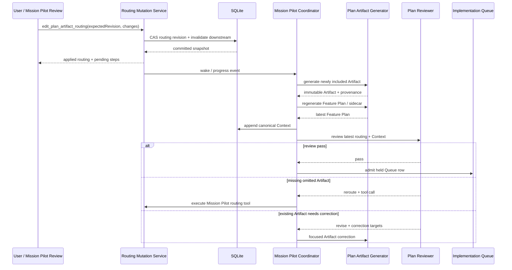

# Mission Pilot Plan Artifact Routing Edit 実装計画

## Status

- Plan status: `implemented`
- Document created: 2026-07-13
- Implementation completed: 2026-07-13
- Verification:
  - `bun run verify`
  - routing / Mission Pilot / Queue handoff / Settings / UI regression: 13 files, 120 tests
  - migration smoke test: `0039_mission_pilot_plan_routing.sql` + `0041_plan_routing_idempotency.sql`
- Target repository: `/Users/y.noguchi/Code/nightWorkers`
- Target runtime span: Plan Mode routing確定からPlan Artifact生成、self-review、Implementation Queue admission直前まで
- Triggering incident:
  - Task: `todolist 本体を実装する`
  - Mission Pilot Session: `296335c1-1c52-4190-96de-da9dc0a2643e`
  - Round 1 routingは`api_io_contract`と`zod_schema_design`を`omit`にした。
  - self-reviewは両Artifactの不足をFeature Plan correctionへ返し続けた。
  - Feature Plan correctionは別Artifactを生成できず、3回の`revise`後に`attention`で停止した。
  - `implementation_queue_entries=0`、`task_runs=0`で、Queue層には到達していなかった。
- Prerequisite implementations:
  - `spec/archive/mission-pilot-plan-mode-autonomy-implementation-plan.md`
  - `spec/archive/mission-pilot-plan-mode-progress-projection-implementation-plan.md`
  - `spec/archive/mission-pilot-plan-artifact-agent-correction-implementation-plan.md`
  - `spec/archive/mission-pilot-pre-queue-handoff-remediation-implementation-plan.md`

この文書を、Plan ModeのArtifact routingをユーザーとMission Pilotが同じ永続化・検証経路から編集し、必要なArtifactを追加生成してからFeature Plan再生成、Context更新、self-review、Queue admissionへ進むための実装正本とする。

本計画では、`questionnaire`と`feature_plan`を常に必須とする。それ以外のPlan Viewは、Queue投入前に限りtask単位で`include / omit`を編集できる。Mission Pilotへ渡す編集機能は、repository sourceを編集するworker toolではなく、NightWorkers自身のPlan routing状態だけを変更するMission Pilot専用schema-first toolとする。

## 1. 問題

### 1.1 Round 1 routingとself-reviewが分断されている

現在のRound 1は、Plan Modeで必要なViewを`include / omit`として返す。しかし、その結果は主にTask message metadataから再構成され、self-review時にroutingを更新するtyped commandを持たない。

そのため、reviewerが「omitされたArtifactが必要」と判断しても、次のどちらかしか選べない。

1. 存在しないArtifactを修正対象にする。
2. Feature Planへ「別Artifactを作成せよ」と返す。

前者は`sourceMessageId`を持てない。後者はFeature Plan generatorの責務外である。今回の実行では後者が選ばれ、Feature Planは具体化されたが、API IO ContractとZod Schemaの独立Artifactは生成されず、同じblocking findingが反復した。

### 1.2 View decisionsの正本が弱い

現在の`PlanModeWorkspace.viewDecisions`は、`planModeGate`やmessage metadataを走査して復元される。明示的なtask単位の最新revision、更新主体、更新理由、idempotency keyを持たない。

frontendの`resolvePlanWorkspaceViewDecisions()`は、生成済みArtifactがあると`omit`を`include`へ補正する。この挙動は既存表示を成立させるが、ユーザーが生成済みArtifactを明示的にOFFへ変更する契約とは両立しない。

### 1.3 routing変更後のdownstream invalidationがない

routingを変更すると、少なくとも次がstaleになる可能性がある。

- `mission_pilot_steps`
- canonical Plan Context
- latest Feature Plan
- latest plan review
- Verification sidecar
- Queue admission eligibility

現在は、これらを一つのmutationとして開始し、再生成・再レビュー完了まで追跡するcommandがない。UIだけをON/OFFにしても、backendが古いArtifactとreviewを正としてQueueへ進む危険がある。

### 1.4 Settings capabilityとtask routingの意味が混ざっている

現在のGeneral Settingsでは、`questionnaire`と`feature_plan`を含む全capabilityをOFFにできる。一方、本計画のproduct contractでは両者を常に必須にする。

また、Settings capabilityはgeneratorを利用可能にする上位設定であり、task単位の`include / omit`とは別概念である。この二層をUIとschemaで区別する必要がある。

## 2. 目的

次の状態を完成させる。

```text
Round 1 routing hypothesis
  -> durable task routing revision
  -> userまたはMission Pilotがeditable Viewを変更
  -> routing revisionをCAS更新
  -> active Plan stepsを再同期
  -> newly included Artifactを生成
  -> Feature Planを最新routingから再生成
  -> canonical Contextを更新
  -> latest routing revisionをself-review
  -> passした場合だけQueue admission
```

Mission Pilot reviewがomit中のArtifactを必要と判断した場合、既存Artifact correctionへ誤って返さず、`edit_plan_artifact_routing` toolを使って`include`へ変更する。tool適用後は新しいArtifactとFeature Planを生成し、更新後のContextを改めてreviewする。

## 3. 成功条件

次をすべて満たしたとき、本計画を完了とする。

1. `questionnaire`と`feature_plan`はSettings、task routing、Mission Pilot toolのどの経路からも`omit`にできない。
2. `blueprint`、`data_model`、`user_flow`、`api_io_contract`、`activity_flow`、`sequence_flow`、`zod_schema_design`はtask単位で編集できる。
3. Status上に全Viewが常に表示され、required、included、omitted、Settings disabled、再構築中を区別できる。
4. ユーザーはQueue投入前にeditable ViewをON/OFFできる。
5. Mission Pilotは専用toolを使い、reviewで必要と判断したomitted Viewをincludeできる。
6. ユーザーAPIとMission Pilot toolは同じdomain mutation serviceを使う。
7. routingの正本はTask message本文やfrontend local stateではなく、DBのrevision付きsnapshotになる。
8. 各revisionにsource、reason、source review、idempotency key、作成時刻が残る。
9. concurrentなユーザー操作とMission Pilot tool callはexpected revisionで競合検出される。
10. routing変更後、staleなgenerator result、Feature Plan、reviewをQueue admission根拠に使わない。
11. `omit -> include`は対象Artifact生成、Feature Plan再生成、Context更新、再レビューへ自動接続される。
12. `include -> omit`はArtifactを削除せずactive planから除外し、Feature Planとreviewを更新する。
13. 生成済みArtifactが存在するだけで、明示的な`omit`をfrontendが`include`へ戻さない。
14. omitted Artifactは履歴・provenanceとして保持されるが、active Feature Plan入力とreviewArtifactsから除外される。
15. routing変更中にAPI processが再起動しても、最新revisionとstep状態から安全に再開できる。
16. Queue row、Queue handoff、TaskRunのいずれかが存在した後はroutingを変更できない。
17. passing reviewはrouting revision、Context revision/digest、Feature Plan sourceを一致させる。
18. held Queue rowのhandoff evidenceにrouting revisionとincluded View snapshotが残る。
19. reviewのrouting tool callはArtifact correction試行回数を消費しない。
20. routing tool loopには独立した上限と重複防止があり、include/omitの無限往復を起こさない。
21. native provider tool calling非対応のMission Pilot routeでも動作する。
22. provider層にMission Pilot固有のtool判断、SystemContext、runtime分岐を追加しない。
23. ユーザー文言のkeyword、正規表現、固定phraseからViewを切り替えない。
24. focused tests、typecheck、Biome、docs check、repo verify、live provider検証が成功する。

## 4. Locked Decisions

### 4.1 Required / editable contract

Required fixed ON:

- `questionnaire`
- `feature_plan`

Editable per task:

- `blueprint`
- `data_model`
- `user_flow`
- `api_io_contract`
- `activity_flow`
- `sequence_flow`
- `zod_schema_design`

Rules:

1. Required ViewはUIに表示するが、toggleはdisabledにして`必須`と表示する。
2. Required ViewをOFFにするAPI/tool inputはschemaまたはdomain validationで拒否する。
3. non-required ViewのGeneral Settings capabilityはgenerator利用可否の上限として維持する。
4. Settings capabilityがOFFのViewはtask routing rowを表示するが、toggleをdisabledにしてSettings理由を表示する。
5. `questionnaire`と`feature_plan`は保存済みSettingsがfalseでもruntimeではtrueへ正規化する。
6. Settings画面では両者をrequired fixed ONとして表示し、編集可能checkboxから外す。

### 4.2 Mission Pilot tool boundary

1. tool名は`edit_plan_artifact_routing`とする。
2. 一般Supervisorの`prompt-tool-registry`やcoding-agent worker tool catalogには追加しない。
3. repository fileを編集する`apply_patch`等とは別のNightWorkers domain toolとする。
4. Mission Pilot plan reviewer専用tool registryにだけ登録する。
5. provider-native tool callingを必須にしない。
6. `callStructuredJsonLLM()`のschema-first responseでtool envelopeを返し、coordinatorがschema validation後にdispatchする。
7. tool description、system prompt、error guidanceは日本語を維持する。
8. providerはtoolの意味を判断せず、JSON生成・抽出・schema validationに責務を限定する。
9. Mission Pilot review remediation中のtoolは、原則として`omit -> include`だけを自動適用する。
10. `include -> omit`はユーザー操作で許可する。Mission Pilotが不要化を提案する場合はadvisoryに留め、自動削減でreviewを通しやすくしない。

### 4.3 Mutation and freeze boundary

1. routing編集はpre-Queue mutationである。
2. Queue entry、`queue_handoff_json`、TaskRun、terminal Taskのいずれかが存在したら編集を拒否する。
3. user toggleとMission Pilot toolは同じ`applyPlanArtifactRoutingChange()`を呼ぶ。
4. mutationは`expectedRoutingRevision`によるCASを必須にする。
5. same idempotency keyは同じresultへ収束する。
6. routing変更時、Questionnaire回答を再生成しない。
7. routing変更時、Artifact messageをdeleteまたはin-place updateしない。
8. 新しいArtifactとFeature Planはimmutable versionとして追加する。
9. routing変更時点でpassing reviewを物理削除しない。revision mismatchによりstaleとして扱う。
10. Queue admissionはlatest routing revisionに対するpassだけを受理する。

### 4.4 Review semantics

1. reviewerはactive included Artifactだけを採点する。
2. omitted Artifactが存在しないこと自体をFeature Planの減点理由にしない。
3. omitted Artifactが実装に必要と判断した場合は`reroute`とtool callを返す。
4. `reroute`とArtifact `revise`を同じreview responseで混在させない。
5. tool適用後は古いFeature Planをcorrectionせず、included Artifact生成後にFeature Planを再生成する。
6. APIで表現できるHTTP request / response / error validationは`api_io_contract`に統合し、同じ目的で`zod_schema_design`を重複includeしない。
7. `zod_schema_design`はLLM JSON、MCP / worker tool input、provider adapter、local config等、OpenAPI endpoint外のvalidation contractが主題の場合に選ぶ。
8. routing cycleとArtifact correction cycleは別カウンターとする。
9. routing cycle上限到達時は`attention`へ停止し、requested View、最新revision、tool resultを表示する。

## 5. Scope

### 5.1 含む

- required / editable Plan View schema。
- task単位のdurable routing revision。
- initial Round 1 routingからのsnapshot作成。
- existing Sessionのcompatibility backfill。
- routing read / mutation API。
- Mission Pilot専用schema-first tool registry / dispatcher。
- plan review schemaの`reroute` / tool call対応。
- Artifact generation、Feature Plan再生成、Context更新、review再実行の接続。
- routing revisionによるstale result rejection。
- `mission_pilot_steps`のinclude / omit再同期。
- Plan Mode Workspace read modelへのrouting projection。
- Status上の全View表示、required lock、ON/OFF toggle、source/reason表示。
- General Settings上のQuestionnaire / Feature Plan required化。
- realtime invalidationとrestart recovery。
- Queue admission evidenceへのrouting revision追加。
- Pilot Thought上のrouting変更・再構築・停止理由表示。
- backend、frontend、integration、E2E、live provider検証。

### 5.2 含まない

- Questionnaire本文・回答内容の再設計。
- Feature Plan body section contractの変更。
- Plan Artifact generator prompt全体の再設計。
- Artifact本文のin-place editor。
- Queue投入後のrouting変更。
- Implementation / Test Mode / Review Modeの変更。
- coding-agent worker tool catalogへのrouting tool公開。
- target repositoryのsource codeをrouting toolから編集する機能。
- provider固有のMission Pilot tool SystemContext。
- user prompt keyword / regexによるView分類。
- review score thresholdの引き下げ。
- review上限の撤廃。
- omitted Artifactの物理削除。
- Mission Pilot専用の新規dashboard。

## 6. Plan View Decisions for This Implementation

| View | Decision | Reason |
| --- | --- | --- |
| questionnaire | include / required | required固定契約と既存回答checkpointを回帰検証するため |
| feature_plan | include / required | 本書が実装正本であり、routing変更後の再生成対象でもあるため |
| blueprint | include | Status上のtoggle、required表示、source/reason表示を設計するため |
| data_model | include | routing revisionとaudit persistenceを追加するため |
| user_flow | include | user toggleとMission Pilot toolが同じmutationへ収束する操作経路を確認するため |
| api_io_contract | include | routing read / mutation APIとerror contractを追加するため |
| activity_flow | omit | lifecycleは本書のstate/sequence記述で十分で、独立した活動図を正本にしないため |
| sequence_flow | include | user/tool mutationから再生成・再レビュー・Queueまで複数serviceの順序が重要なため |
| zod_schema_design | include | Mission Pilot schema-first tool input/outputがOpenAPI endpoint外のvalidation contractだから |

## 7. Target Domain Model

### 7.1 Shared view sets

`shared/schemas/plan-mode-routing.schema.ts`を追加し、required / editable setを一か所に集約する。

```ts
const requiredPlanModeViews = [
  "questionnaire",
  "feature_plan",
] as const;

const editablePlanModeViews = [
  "blueprint",
  "data_model",
  "user_flow",
  "api_io_contract",
  "activity_flow",
  "sequence_flow",
  "zod_schema_design",
] as const;
```

`dedicatedDesignViewSchema`は`feature_plan`を含まないため、routing用には全Plan Viewを表す新しい`planModeRoutableViewSchema`を正本にする。既存Artifact kind、regeneration target、capability enumは用途別に維持し、文字列unionをcall siteごとに再定義しない。

### 7.2 Routing snapshot

```ts
type PlanArtifactRoutingDecision = {
  view: PlanModeRoutableView;
  decision: "include" | "omit";
  required: boolean;
  capabilityEnabled: boolean;
  reason: string;
};

type PlanArtifactRoutingSnapshot = {
  taskId: string;
  sessionId: string;
  revision: number;
  decisions: PlanArtifactRoutingDecision[];
  source:
    | "initial_routing"
    | "user"
    | "mission_pilot_review"
    | "compatibility_backfill"
    | "recovery";
  sourceId: string | null;
  reason: string;
  createdAt: string;
};
```

Rules:

- snapshotは9 Viewを重複なく1件ずつ持つ。
- required Viewは常に`include / required=true / capabilityEnabled=true`。
- editable ViewはGeneral Settings capabilityとtask decisionを別fieldで返す。
- `source`はserver側caller contextから決め、HTTP bodyやLLM argumentsに自由入力させない。
- `reason`は空文字を許可しない。
- read modelはlatest durable snapshotだけをactive routingとして返す。

### 7.3 Persistence

`mission_pilot_sessions`へ追加する。

```text
plan_routing_revision integer default 0 not null
```

新規table:

```text
mission_pilot_plan_routing_revisions
  id text primary key
  session_id text not null
  revision integer not null
  decisions_json text not null
  source text not null
  source_id text
  reason text not null
  idempotency_key text not null
  created_at integer not null
```

Indexes:

```text
unique(session_id, revision)
unique(session_id, idempotency_key)
index(session_id, created_at)
```

`mission_pilot_plan_reviews`へ`routing_revision integer default 0 not null`を追加する。`mission_pilot_steps.evidence_json`、Feature Plan message metadata、Context snapshot、Queue handoff JSONにもrouting revisionを保存する。

正式migrationと`api/db/mission-pilot-schema-bootstrap.ts`を同じ変更で更新する。別計画が次migration番号を予約している可能性があるため、実装開始時に`drizzle/migrations/meta/_journal.json`を再確認し、固定番号を本書では予約しない。

### 7.4 Initial snapshot / compatibility backfill

新規Session:

1. Round 1の`planModeGate.dedicatedViews`をrouting hypothesisとして受け取る。
2. required Viewを強制includeする。
3. editable Viewの不足項目をSettings defaultとrouting ruleから補完する。
4. revision `1`を`source=initial_routing`で保存する。
5. message metadataはdiagnostic provenanceとして残すが、以降の正本にしない。

既存Session:

1. latest message metadataのview decisionsを読む。
2. 現在生成済みで明示的overrideのないArtifact kindは、現行UI互換のためincludeとしてimportする。
3. required Viewを強制includeする。
4. revision `1`を`source=compatibility_backfill`で保存する。
5. backfill後はmessage scan fallbackを使わない。
6. backfillはidempotentにし、起動のたびにrevisionを増やさない。

## 8. Shared Mutation Service

`api/modules/planMode/plan-mode-routing.service.ts`を追加する。

```ts
type ApplyPlanArtifactRoutingChangeInput = {
  taskId: string;
  expectedRoutingRevision: number;
  changes: Array<{
    view: EditablePlanModeView;
    decision: "include" | "omit";
    reason: string;
  }>;
  idempotencyKey: string;
  actor:
    | { kind: "user"; userActionId: string }
    | { kind: "mission_pilot"; reviewId: string; toolCallId: string };
};
```

処理順:

1. Task、Mission Pilot Session、latest routing snapshotを読む。
2. `assertPlanArtifactRoutingMutable()`でpre-Queue状態を確認する。
3. expected revision、Session version、idempotency keyを検証する。
4. required View変更、Settings disabled include、duplicate View、空reasonを拒否する。
5. Mission Pilot actorの場合、self-review remediationでは`omit -> include`だけを許可する。
6. effective changeがなければ`noop`を返し、revisionを増やさない。
7. transaction内でfull snapshot、Session routing revision、Session versionを更新する。
8. affected stepとFeature Plan stepを再同期する。
9. canonical Contextへ`plan.routing` snapshotをappendする。
10. latest pass reviewをrevision mismatchでstaleにする。
11. DB commit後にprogress / workspace realtime eventを発行する。
12. Sessionがplayingならcoordinatorをwakeし、stoppedなら次回Play checkpointとして保持する。

Result:

```ts
type ApplyPlanArtifactRoutingChangeResult = {
  status: "applied" | "noop";
  routing: PlanArtifactRoutingSnapshot;
  invalidated: {
    featurePlan: boolean;
    review: boolean;
    contextRevision: number;
  };
  pendingStepKeys: string[];
};
```

Error contract:

- `PLAN_ROUTING_REQUIRED_VIEW`
- `PLAN_ROUTING_CAPABILITY_DISABLED`
- `PLAN_ROUTING_REVISION_CONFLICT`
- `PLAN_ROUTING_LOCKED_AFTER_QUEUE`
- `PLAN_ROUTING_UNEXPECTED_TASK_RUN`
- `PLAN_ROUTING_INVALID_MISSION_PILOT_CHANGE`
- `PLAN_ROUTING_REBUILD_IN_PROGRESS`

固定文言でLLM本文を置換しない。API errorはcodeと短いmessageを返し、Mission Pilot attentionにはtool validation/resultの実際の理由を残す。

## 9. Mission Pilot Tool Contract

### 9.1 Tool definition

`api/modules/missionPilot/mission-pilot-plan-tool-registry.ts`に専用registryを追加する。

```ts
const editPlanArtifactRoutingTool = {
  name: "edit_plan_artifact_routing",
  description:
    "現在omitされているPlan ArtifactがQueue投入前の実装判断に必要な場合、task routingをincludeへ変更します。QuestionnaireとFeature Planは常に必須で、このtoolの対象外です。既存Artifact本文の修正には使いません。",
  inputSchema: {
    type: "object",
    additionalProperties: false,
    required: ["expectedRoutingRevision", "changes"],
    properties: {
      expectedRoutingRevision: { type: "integer", minimum: 1 },
      changes: {
        type: "array",
        minItems: 1,
        items: {
          type: "object",
          additionalProperties: false,
          required: ["view", "decision", "reason"],
          properties: {
            view: { enum: editablePlanModeViews },
            decision: { const: "include" },
            reason: { type: "string", minLength: 1 },
          },
        },
      },
    },
  },
};
```

Mission Pilotへ渡すtool schemaはshared Zod schemaから生成し、手書きJSON Schemaとのdriftを作らない。

### 9.2 Review response

`missionPilotPlanReviewSchema`を次のactionへ拡張する。

```ts
type MissionPilotPlanReviewVerdict =
  | "pass"
  | "revise"
  | "reroute"
  | "reject";

type MissionPilotPlanToolCall = {
  id: string;
  name: "edit_plan_artifact_routing";
  arguments: EditPlanArtifactRoutingToolInput;
};
```

Schema invariants:

- `pass`: `revisionTargets=[]`、`toolCall=null`。
- `revise`: below-threshold active Artifactごとに既存correction targetを1件返し、`toolCall=null`。
- `reroute`: `toolCall`を1件返し、`revisionTargets=[]`。
- `reject`: `revisionTargets=[]`、`toolCall=null`。
- `reroute`は現在omitのeditable Viewだけをincludeできる。
- 存在しないArtifactへ`sourceMessageId`を捏造しない。
- active included ArtifactはsourceMessageId単位で採点する。
- omitted Artifactはscore対象に含めない。

### 9.3 Provider-compatible tool turn

現在のMission Pilot structured routeにはCodex等、provider-native tool turnを利用できない経路がある。したがって、本計画では`callProviderToolTurn()`を必須にしない。

実行方式:

1. reviewer system promptへ日本語tool descriptionとstrict response contractを含める。
2. `callStructuredJsonLLM()`が`mission_pilot_plan_review` JSONを返す。
3. `normalizeMissionPilotPlanReview()`が`reroute / toolCall` invariantを検証する。
4. coordinatorが`executeMissionPilotPlanToolCall()`へdispatchする。
5. dispatcherがshared mutation serviceを呼ぶ。
6. tool resultをPlan review record、Mission Pilot event、Pilot Thoughtへ保存する。
7. coordinatorは新routingからArtifact pipelineを再開する。
8. 次のreviewは新しいrouting / Contextを入力にする。

この方式はtool semanticsを維持しつつ、provider層へMission Pilot専用runtime判断を追加しない。

### 9.4 Loop bounds

- Artifact scored review上限: 既存`MAX_REVIEW_ATTEMPTS`を維持する。
- Mission Pilot routing tool上限: 1 pipeline executionあたり3 effective revisions。
- `noop`とidempotent replayは上限へ加算しない。
- 同じViewの反復includeはnoopへ収束する。
- Mission Pilotはself-review remediation中にincludeをomitへ戻せない。
- routing上限、revision conflict再読込上限、tool validation失敗上限を別々に記録する。

## 10. Routing Change Lifecycle

### 10.1 OFF -> ON

1. routing snapshotをincludeへ更新する。
2. 対象stepを`pending`へする。
3. 対象Artifactが過去に存在しても再生成する。
4. Artifact resultへrouting revisionを保存する。
5. source/context revision一致後にstepへadoptする。
6. Feature Plan stepを`pending`へ戻す。
7. latest included Artifact setからFeature Planを再生成する。
8. Verification sidecarを再生成する。
9. canonical Contextを更新する。
10. latest routing revisionをreviewする。

### 10.2 ON -> OFF

1. user actorだけが実行できる。
2. 生成中stepがある場合、revisionを更新してresultをstaleにし、採用しない。
3. 対象stepを`skipped`へ遷移する。
4. 既存Artifact message / Activity Artifactは削除しない。
5. active Feature Plan inputとreviewArtifactsから対象kindを除外する。
6. Feature PlanとVerification sidecarを再生成する。
7. canonical Contextへomit decisionとreasonを残す。
8. reviewを再実行する。

### 10.3 Step transition changes

現在の`synchronizePlanSteps()`は`running / completed`を維持するため、routing mutation専用の明示的transitionを追加する。

許可するtransition:

```text
pending   -> skipped   (user omit)
failed    -> skipped   (user omit)
completed -> skipped   (user omit; artifactは履歴保持)
skipped   -> pending   (userまたはMission Pilot include)
completed -> pending   (routing revision変更により再生成が必要な場合)
```

`artifact_message_id`は履歴参照として残すか、`evidence_json.excludedArtifactMessageId`へ移す。active adoptionはrouting revisionとlatest source message IDで判定し、statusだけに依存しない。

### 10.4 Sequence



## 11. API Contract

### 11.1 Read routing

```text
GET /api/tasks/:id/plan-mode/routing
```

Response:

```ts
type PlanArtifactRoutingResponse = {
  routing: PlanArtifactRoutingSnapshot;
  mutable: boolean;
  lockedReason: string | null;
  rebuild: {
    status: "idle" | "pending" | "running" | "failed";
    pendingStepKeys: string[];
  };
};
```

### 11.2 User mutation

```text
PATCH /api/tasks/:id/plan-mode/routing
```

Request:

```json
{
  "expectedRoutingRevision": 2,
  "idempotencyKey": "user-action-uuid",
  "changes": [
    {
      "view": "api_io_contract",
      "decision": "include",
      "reason": "API契約を実装前に確認する"
    }
  ]
}
```

Rules:

- `source`、`sourceId`、actor kindはserverが認証済みrequest contextから付ける。
- 競合は409とlatest routing projectionを返す。
- Queue lockは409、schema errorは400、Task/Session不存在は404。
- success responseはworkspace、plan progress、routingの最新projectionへ収束できる情報を返す。

### 11.3 Workspace projection

`PlanModeWorkspace`へ次を追加する。

```ts
routing: PlanArtifactRoutingSnapshot;
```

既存`viewDecisions`は互換期間中、`routing.decisions`から導出して返す。message metadata scanはbackfill用途に限定し、通常read pathから外す。

Artifact arraysは履歴を保持する。active Feature Plan生成とreviewではroutingを明示的にfilterし、UIはomitted kindの既存Artifactへ`現在のPlanから除外`を表示する。

## 12. UI / UX

### 12.1 Status routing editor

`ViewDecisionSummary`をread-only badge一覧から`PlanViewRoutingEditor`へ発展させる。

各row:

- View label
- ON/OFF switch
- required / optional badge
- capability state
- decision reason
- source (`Initial routing` / `User` / `Mission Pilot review`)
- current step status
- generated / excluded / rebuilding state

Behavior:

- 9 Viewを常に同じ順序で表示する。
- Questionnaire / Feature PlanはON固定、`必須`badge、disabled switch。
- editable Viewはpre-Queueかつcapability enabledの場合だけ切替可能。
- mutation中は対象switchとQueue actionをdisabledにする。
- optimistic success表示を正本にせず、mutation response後にrouting / workspace / progressをrefetchする。
- 409時はlatest revisionを再取得し、ユーザーの変更を勝手に再送しない。
- omittedだが過去Artifactがある場合、`生成履歴あり・現在は除外`を表示する。
- Queue投入後は全switchをread-onlyにし、locked reasonを表示する。
- `role="switch"`、keyboard操作、focus ring、accessible labelを付ける。

### 12.2 General Settings

- QuestionnaireとFeature Planはcheckboxをdisabled fixed ONにするか、editable listから分離して`Plan Mode必須`として表示する。
- save時に両fieldをtrueへ正規化する。
- 他7 capabilityの既存checkboxは維持する。
- capability OFFはtask routingのOFFとは異なることをhelp textで説明する。

### 12.3 Pilot Thought

次をMission Pilot execution eventとして表示する。

- reviewerがrouting変更を要求した理由。
- tool名、対象View、old/new decision、routing revision。
- Artifact再生成開始・完了。
- Feature Plan / review invalidation。
- revision conflictと再読込。
- routing cycle上限またはvalidation failureによるattention。

Plan Artifact本文をPilot Thoughtへ重複表示しない。既存Plan Mode Artifact paneを参照先にする。

## 13. Review and Queue Gate

### 13.1 Review input

reviewerへ渡す。

- routing revision
- active included / omitted Viewと理由
- capability state
- active Artifact sourceMessageId
- Feature Plan routing revision
- canonical Context revision / digest
- available Mission Pilot tools

review promptへ明記する。

- active included Artifactだけを採点する。
- omitted Artifactを必要と判断した場合、Feature Planへ生成要求を押し込まずrouting toolを使う。
- API endpointのHTTP validationはAPI IO Contractで扱い、Zod Schema Designを重複要求しない。
- routing toolはexisting Artifact correctionではない。
- Questionnaire / Feature Planをtool対象にしない。

### 13.2 Queue admission

`admitToQueue()`は既存条件に加えて次を確認する。

1. latest routing snapshotが存在する。
2. required Viewがincludeである。
3. included Viewのrequired stepがcompletedである。
4. omitted Viewのstepがskippedまたは非activeである。
5. Feature Plan message metadataのrouting revisionがlatestと一致する。
6. latest reviewのrouting revision、Context revision/digest、Feature Plan sourceが一致する。
7. pending/failed routing rebuildがない。
8. 未適用のrouting tool callがない。

Queue handoff JSONへ追加する。

```ts
planRouting: {
  revision: number;
  includedViews: PlanModeRoutableView[];
  omittedViews: PlanModeRoutableView[];
  featurePlanMessageId: string;
  reviewId: string;
}
```

## 14. Recovery and Concurrency

### 14.1 User change during generation

- user mutationはrouting revisionを先にcommitする。
- old revisionで開始済みgenerator resultはmessageとして保存できてもactive Contextへadoptしない。
- coordinatorはrevision mismatchを検出し、該当resultをsuperseded evidenceとして残す。
- latest revisionのstepを再claimする。

### 14.2 User / Mission Pilot race

- 両者ともexpected revisionを必須にする。
- first commitだけが成功する。
- loserはlatest snapshotを再取得する。
- Mission Pilotは最新状態でも同じ変更が必要か次reviewで再判断する。
- user requestをserverが自動mergeしない。

### 14.3 Restart recovery

- startup recoveryはrouting revision、step evidence routing revision、Feature Plan metadata、latest reviewを比較する。
- routing revisionが先行していれば、Artifact generationまたはFeature Plan regenerationから再開する。
- passing reviewだけが古ければreviewから再開する。
- Queue rowが既に存在すればrouting mutationを再実行しない。
- idempotency keyで同じtool call / user requestへ収束する。

## 15. Implementation Phases

### Phase 0. Baseline and contract tests

Goal: 現在の失敗をdeterministic fixtureで固定する。

Tasks:

- Round 1がAPI IO / Zodをomitし、reviewerがFeature Planへ不足を返すfixtureを追加する。
- current `resolvePlanWorkspaceViewDecisions()`が生成済みArtifactをincludeへ強制するtestを特定する。
- required ViewをSettingsでfalseにできるbaselineを固定する。
- Queue row / TaskRun未作成のreview-gate failureを再現する。

Exit:

- 変更前の失敗がfocused testで再現される。
- 置き換える期待が明示される。

### Phase 1. Shared routing schema and required policy

Goal: required / editable Viewの唯一の型契約を作る。

Files:

- `shared/schemas/plan-mode-routing.schema.ts`
- `shared/schemas/plan-mode-artifact.schema.ts`
- `shared/plan-mode-execution.ts`
- `src/modules/settings/SettingsForms.ts`
- `src/modules/settings/SettingsPlanModePanel.tsx`

Tasks:

- required / editable constantsとZod schemaを追加する。
- General Settings merge/saveでrequired capabilityをtrueへ正規化する。
- `buildPlanModeExecutionSteps()`がQuestionnaire / Feature Planを常にrequired includeにする。
- existing call siteの手書きView unionを共有型へ寄せる。

Exit:

- required Viewをomitできないschema/unit testがpassする。
- Settings UIがrequired fixed ONを表示する。

### Phase 2. Durable routing persistence and backfill

Goal: message metadataからDB revisionへ正本を移す。

Files:

- `api/db/mission-pilot-schema.ts`
- `api/db/mission-pilot-schema-bootstrap.ts`
- next available `drizzle/migrations/*.sql`
- `api/modules/missionPilot/mission-pilot-plan.repository.ts`
- `api/modules/specification/plan-mode-workspace.service.ts`

Tasks:

- Session routing revisionとrouting revisions tableを追加する。
- atomic snapshot create/read/CAS repositoryを追加する。
- new Session initial snapshotを作る。
- existing Session compatibility backfillをidempotentに実装する。
- workspace routing projectionをDBから返す。
- normal read pathのmessage metadata scanを削除する。

Exit:

- restart後も同じrevision / decisions / source / reasonが返る。
- backfillを複数回実行してもrevisionが増えない。

### Phase 3. Shared mutation service and HTTP API

Goal: userとMission Pilotが共有する単一mutation boundaryを作る。

Files:

- `api/modules/planMode/plan-mode-routing.service.ts`
- `api/modules/planMode/plan-mode-routing-route-definitions.ts`
- `api/modules/planMode/plan-mode-routing.routes.ts`
- app router registration
- shared request / response schema

Tasks:

- mutability guardをQueue row / handoff / TaskRunまで強化する。
- expected revision、idempotency、required/capability validationを実装する。
- routing revision commitとContext appendをtransactionalに接続する。
- GET / PATCH endpointを追加する。
- realtime publishはcommit後だけ行う。

Exit:

- user mutationがrevisionを1回だけ増やす。
- stale revision、required OFF、Queue後mutationが拒否される。

### Phase 4. Step resynchronization and downstream invalidation

Goal: routing変更をPlan pipelineへ安全に反映する。

Files:

- `api/modules/missionPilot/mission-pilot-plan.repository.ts`
- `api/modules/missionPilot/mission-pilot-plan-coordinator.service.ts`
- `api/modules/missionPilot/mission-pilot-plan-support.ts`
- Plan Artifact generators / metadata schemas

Tasks:

- routing mutation専用step transitionを追加する。
- generator start/adoptでrouting revisionを検証する。
- included Viewを生成し、omitted Viewをactive inputから外す。
- Feature Planとsidecarをpending / regenerateする。
- latest reviewをrevision mismatchでstaleにする。
- stopped Sessionでは次回Play checkpoint、playing Sessionではwakeする。

Exit:

- OFF->ONとON->OFFの両方で最新Feature Planがroutingに一致する。
- stale generator resultがContextへ採用されない。

### Phase 5. Mission Pilot tool and review schema

Goal: reviewerがmissing omitted Artifactをtoolでincludeできるようにする。

Files:

- `shared/schemas/mission-pilot-plan-review.schema.ts`
- `shared/schemas/mission-pilot-plan-tool.schema.ts`
- `api/modules/missionPilot/mission-pilot-plan-tool-registry.ts`
- `api/modules/missionPilot/mission-pilot-plan-tool-dispatcher.ts`
- `api/modules/missionPilot/mission-pilot-plan-coordinator.service.ts`

Tasks:

- `reroute` verdictとstrict tool envelopeを追加する。
- tool definitionを日本語でrenderする。
- review promptへactive/omitted routingとtool usage ruleを追加する。
- dispatcherをshared mutation serviceへ接続する。
- routing tool cycleをArtifact correction attemptsから分離する。
- Mission Pilot toolはomit->includeだけ許可する。
- tool resultをreview/event/progressへ保存する。

Exit:

- Codex structured-output routeでもtool envelopeが実行される。
- missing Artifactに偽sourceMessageIdを作らない。
- reroute後に新Artifactを生成して再レビューへ進む。

### Phase 6. Review / Queue gate alignment

Goal: active routingだけをreviewし、同じrevisionのpassだけをQueueへ渡す。

Files:

- `api/modules/missionPilot/mission-pilot-plan-coordinator.service.ts`
- review artifact collector / normalizer
- queue handoff schema / service

Tasks:

- reviewArtifactsをactive routingでfilterする。
- omitted View不足はreroute、existing Artifact不足はreviseへ分離する。
- review recordへrouting revisionを保存する。
- Queue admissionへrouting / Context / Feature Plan / review一致条件を追加する。
- handoff evidenceへrouting snapshotを保存する。

Exit:

- old routing passでQueueへ入れない。
- reroute/correction pending中はQueue rowが0件のままになる。
- latest pass後にだけheld Queue rowがexactly-onceで作られる。

### Phase 7. User routing editor

Goal: 表示済みView decisionsを安全なON/OFF UIへ置き換える。

Files:

- `src/modules/planMode/workspace-panels/PlanWorkspaceStatusView.tsx`
- new `PlanViewRoutingEditor.tsx`
- `src/modules/planMode/PlanModeWorkspaceViewer.tsx`
- routing API command / query hooks
- Japanese / English dictionaries

Tasks:

- 全9 Viewを常時表示する。
- required fixed ONとeditable switchを実装する。
- capability OFF、Queue lock、mutation中、rebuild状態を表示する。
- source/reasonとexcluded historyを表示する。
- response後にrouting/workspace/progress queryをrefetchする。
- 生成済みArtifactによるinclude強制補正を削除する。

Exit:

- user toggleとDB revisionが一致する。
- reload / reconnect /別window後もserver projectionへ収束する。
- required switchは操作できない。

### Phase 8. Recovery, observability, and diagnostics

Goal: race/restart/上限到達を説明可能にする。

Tasks:

- routing revision mismatch recoveryを追加する。
- user/tool raceの409 / reread経路を固定する。
- Pilot Thoughtへrouting eventを追加する。
- progress responseへrouting revision / rebuild stateを追加する。
- routing cycle上限のattention code / diagnostic payloadを追加する。
- API restart後のresume testを追加する。

Exit:

- stop reason、requested View、revision、最後のtool result、Queue未追加をUI/API/DBで追える。

### Phase 9. Verification and live acceptance

Goal: deterministic gateと今回相当のlive provider flowを完了する。

Tasks:

- focused backend/frontend testsを実行する。
- typecheck、Biome、docs、verifyを実行する。
- live Mission Pilotでinitial omit -> reviewer tool include -> Artifact生成 -> Feature Plan再生成 -> review pass -> held Queue rowを観測する。
- userが同じViewをOFF/ONし、Context/reviewが更新されることを観測する。
- Queue後にtoggleがlockedされることを確認する。
- 結果を本書Statusへ追記し、完了後にarchiveする。

Exit:

- DB、activity events、Pilot Thought、Plan Status、Queue rowが同じrouting revisionを示す。
- target repositoryにTaskRunを直接作らず、held Queue rowまで到達する。

## 16. Test Matrix

### 16.1 Shared schema / execution plan

- Questionnaire / Feature Planは常にinclude。
- required OFF requestはparse/domain validation failure。
- editable Viewだけがmutation inputに入る。
- routing snapshotは9 Viewを重複なく持つ。
- Settings falseでもrequired capabilityはtrueへ正規化される。
- API IOとZodの役割重複をreview prompt testで防ぐ。

### 16.2 Repository / service

- initial snapshot creation。
- compatibility backfill idempotency。
- expected revision success / conflict。
- idempotency replay。
- user ON/OFF。
- Mission Pilot include success / omit rejection。
- Queue row / handoff / TaskRun / terminal Task lock。
- completed step -> skipped -> pending transition。
- stale generator result rejection。
- routing revision付きContext append。

### 16.3 Mission Pilot review

- omitted API Contractが必要なら`reroute` + tool call。
- existing Feature Plan不足なら`revise` + correction target。
- rerouteとrevisionTargets混在をreject。
- missing ArtifactへsourceMessageIdを要求しない。
- omitted Artifactをscoreしない。
- routing tool callがscored review attemptsを消費しない。
- routing cycle上限でattention。
- native tool unsupported providerでもschema-first toolが動く。

### 16.4 Frontend

- 全View表示。
- required固定ON。
- editable toggle。
- capability OFF reason。
- excluded generated Artifact表示。
- mutation pending / error / conflict。
- refresh / reconnect convergence。
- Queue後lock。
- keyboard / accessible label。

### 16.5 Integration / E2E

Scenario A: Mission Pilot reroute

1. initial routingで`api_io_contract=omit`。
2. Artifact / Feature Plan生成。
3. reviewがAPI Contract必要と判断。
4. Mission Pilotがtoolでinclude。
5. API Contract生成。
6. Feature Plan / Context更新。
7. next review pass。
8. held Queue row作成。

Scenario B: User override before review

1. userがomitted ViewをON。
2. Mission Pilot execution中でもCAS mutation成功。
3. old generator resultをstale reject。
4. latest routingから再開。

Scenario C: User excludes generated View

1. completed ViewをOFF。
2. Artifactは履歴保持。
3. active Feature Plan / review inputから除外。
4. new Feature Plan / review pass。

Scenario D: Freeze

1. held Queue row作成。
2. user PATCHとMission Pilot toolを両方拒否。
3. Queue handoff routing evidenceは不変。

Scenario E: Recovery

1. routing revision commit後、Artifact生成前にprocess restart。
2. recoveryがpending stepから再開。
3. duplicate Artifact / routing revision / Queue rowを作らない。

## 17. Verification Commands

実装時に現行scriptsを再確認し、まずfocused gateを実行する。

```bash
bun run test tests/plan-mode-execution.test.ts
bun run test tests/mission-pilot-plan-pipeline.test.ts
bun run test tests/mission-pilot-plan-coordinator.test.ts
bun run test tests/plan-mode-workspace-model.test.ts
bun run test tests/plan-mode-workspace-viewer.test.tsx
bun run test tests/specification-status-view.test.tsx
bun run typecheck
bun run check:docs
bun run verify
```

migrationを追加するため、repo-native migration/bootstrap verificationも実行する。`verify:full`はbroader deterministic gate、`verify:live`はexternal providerを使う明示的live gateとして分け、通常の`verify`成功と混同しない。

Live acceptanceでは少なくとも次のDB queryを使う。

```sql
select id, plan_routing_revision, phase, desired_state, context_revision,
       last_error_code, last_error_message
from mission_pilot_sessions
where task_id = ?;

select revision, source, source_id, reason, decisions_json, created_at
from mission_pilot_plan_routing_revisions
where session_id = ?
order by revision;

select step_key, status, attempt, context_revision, evidence_json
from mission_pilot_steps
where session_id = ?
order by ordinal;

select attempt, verdict, routing_revision, context_revision, review_json
from mission_pilot_plan_reviews
where session_id = ?
order by attempt;

select id, status, claim_ready, mission_pilot_admission_key
from implementation_queue_entries
where task_id = ?;
```

## 18. Risks and Mitigations

### Risk 1: routing editorが表示だけ変える

Mitigation:

- DB snapshotを正本にする。
- workspace、steps、Feature Plan、review、Queue gateが同じrevisionを読む。
- server refetch前にsuccess表示を確定しない。

### Risk 2: Mission PilotがArtifactを減らしてreviewを通す

Mitigation:

- Mission Pilot remediation toolはomit->includeだけ許可する。
- include->omitはuser actorに限定する。
- review advisoryで不要化提案はできるが自動適用しない。

### Risk 3: routing変更が無限loopする

Mitigation:

- routing tool cycleを最大3 effective revisionsに制限する。
- idempotent/noopをcountしない。
- Mission Pilot remediationはmonotonic includeにする。
- Artifact correction attemptと別counterにする。

### Risk 4: existing Artifactがomitを打ち消す

Mitigation:

- generated Artifactによるfrontend include補正を削除する。
- Artifact existenceとactive routing decisionを別fieldにする。
- historyは保持するがreview inputから除外する。

### Risk 5: user操作とgenerator adoptionがraceする

Mitigation:

- expected routing revisionとSession versionを検証する。
- result adoptionにもrouting revisionを要求する。
- stale resultは保存できてもcanonical Contextへ採用しない。

### Risk 6: native tool非対応providerで動かない

Mitigation:

- provider-native tool callを必須にしない。
- structured JSON tool envelopeを使う。
- provider層ではなくMission Pilot coordinatorがdispatchする。

### Risk 7: migration番号が別作業と衝突する

Mitigation:

- 本書でmigration番号を固定しない。
- 実装開始時にjournalと作業ツリーを再確認する。
- formal migration、Drizzle schema、runtime bootstrapを同時更新する。

### Risk 8: required化がmanual Plan Modeを壊す

Mitigation:

- Questionnaire / Feature Planの既存生成・回答checkpointを維持する。
- unanswered blocking questionを勝手に完了しない。
- manual Plan ModeとMission Pilotの両方でrequired contract testを追加する。

## 19. Non-blocking Assumptions

- Mission Pilot Sessionはuniversal task modelにより対象Taskへ既に存在する。
- General Settingsのnon-required capabilityはgenerator availabilityの上限として維持する。
- user routing mutationの認証主体は現在のlocal app user contextを使い、新しいaccount modelは追加しない。
- omitted Artifactの履歴表示は既存Artifact paneを再利用し、新しいhistory dashboardは作らない。
- API IO ContractとZod Schema Designの選択基準はSupervisor planning referenceと同じ契約を使う。

## 20. First Implementation Step

最初にPhase 0とPhase 1を実施する。

1. 今回の`api_io_contract / zod_schema_design omit -> Feature Plan correction反復`をfocused fixtureへ固定する。
2. required / editable View constantsとschemaを追加する。
3. `buildPlanModeExecutionSteps()`、Settings normalization、review schemaのrequired invariantをtestで先に固定する。
4. その後にDB migrationとmutation serviceへ進む。

DBやUIから先に実装すると、routing正本とtool policyが再び分散するため、shared contractと失敗fixtureを最初のgateとする。

## 21. Handoff

実装Roleは次を誤解してはならない。

- 本変更はreview threshold緩和ではなく、missing Artifactを正しいrouting mutationへ戻す機能である。
- Mission Pilot toolはrepository source編集toolではない。
- QuestionnaireとFeature Planは常に必須である。
- userとMission Pilotは同じdomain mutation serviceを使うが、Mission Pilotはremediation中にomitできない。
- routing変更後はArtifact生成だけで完了せず、Feature Plan、Context、review、Queue gateまで最新revisionへ揃える。
- Queue投入後のrouting変更を許可しない。
- prompt文言は日本語を維持する。
- migration番号は実装開始時の最新journalから決める。

Required verification gate:

```text
focused routing / Mission Pilot / UI tests
  -> typecheck
  -> changed-file Biome
  -> check:docs
  -> verify
  -> explicit live provider acceptance
```
