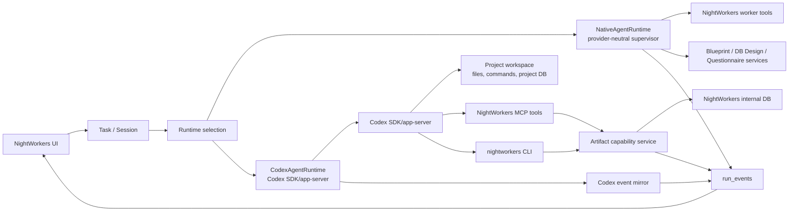

# Codex Agent Runtime Lane 実装計画

## Objective

Codex SDK を supervisor decision provider として無理に閉じ込めるのではなく、Codex の native coding-agent runtime を活かす専用 lane を追加する。既存の Azure OpenAI / OpenAI API / Bedrock / fixture 向け provider-neutral supervisor は残し、Codex SDK 利用時だけ OpenClaw 型の app-server / harness 境界に寄せる。

Blueprint、Blueprint DB Design、Design Questionnaire、Decision Review は NightWorkers 独自の成果物機能として維持する。ただし Codex lane では supervisor 内部専用 toolCall として扱わせず、Codex が呼べる NightWorkers MCP / CLI capability に落とし込む。Codex の発言だけに依存せず、Codex runtime event、tool activity、file change、diff、verification、NightWorkers MCP / CLI structured report を run evidence として保存・表示する。

## Background

`ACTIVE_LLM_PROVIDER=codex` を現在の structured decision provider として使うと、Codex SDK runtime が native activity を開始し、`codex.mcp_tool_call` が `Provider activity rejected: codex.mcp_tool_call` として失敗する。これは単なる global MCP / AGENTS.md の注入問題だけではない。Codex SDK は Codex agent runtime を操作する API であり、純粋な JSON completion provider ではない。

OpenClaw では Codex を app-server / harness として扱い、Codex-owned AGENTS.md、native tool surface、MCP projection、hook relay、tool result extension を制御対象にしている。一方で provider-style completion が必要な箇所では Responses transport を別経路で扱っている。NightWorkers も同じ分離が必要である。

## Current Boundaries

- `api/services/agent-runtime/types.ts`
  - `AgentRuntime` abstraction と `AgentRuntimeEvent` がある。
  - 現在の `AgentRuntimeKind` は `native-local` / `external-process` / `future-adapter`。
- `api/services/agent-runtime/registry.ts`
  - `resolveAgentRuntime('native-local')` だけを解決する。
  - `CodexAgentRuntime` を追加する最初の接続点。
- `api/services/agent-runtime/NativeAgentRuntime.ts`
  - `runSupervisorLoop` を呼ぶ既存 runtime。
  - SessionStart / UserPromptSubmit / SessionEnd hooks を NightWorkers hook runner 経由で実行する。
- `api/services/agent-runtime/ledger-sink.ts`
  - `AgentRuntimeEvent` を canonical `run_events` に変換する。
  - Codex lane は新しい event type を増やす前に、まず既存の `tool.call_*`、`model.*`、`hook.*`、`git.diff_collected` に payload を追加して表現する。
- `api/modules/nightworkers/nightworkers.service.ts`
  - `startTaskRun` が run 作成、prompt/context snapshot 作成、runtime 起動、run finalization をまとめて行っている。
  - 現在は `workerKind: 'native-local'` と `resolveAgentRuntime('native-local')` が hardcoded されている。
  - Codex lane の最初の実装では、この hardcode を runtime lane resolution に置き換える。
- `api/services/supervisor/llm-provider/codex.ts`
  - Codex SDK stream 上の `agent_message` 以外を provider activity として拒否する。
  - structured decision provider としての hardening は Azure/OpenAI/Bedrock 型 provider と互換に残せる。
- `api/services/supervisor/llm-provider/request.ts`
  - 現在 `providerId === 'codex'` を `providerClass: 'agent_runtime'` として扱う。
  - ただしこの `agent_runtime` は provider capability policy 上の分類であり、本計画の `codex-agent` runtime lane とは分離して扱う。
- `api/services/run-events/types.ts`
  - `run_events` は `tool.call_*`、`model.*`、`hook.*`、`git.diff_collected`、`verification.*` を既に表現できる。
- `api/services/blueprints/*`
  - Blueprint / DB Design の service helper がある。
- `spec/design-questionnaire-implementation-plan.md`
  - Questionnaire は source Blueprint artifact と dedicated editable state を持つ前提。

## Document Review Findings

この計画は方向性としては実装可能だが、初版のままだと次の点が実装者に曖昧だった。

- `CodexAgentRuntime` をどこに接続するかが明示不足だった。
  - 対応: `agent-runtime/registry.ts` と `nightworkers.service.ts` の hardcoded `native-local` を実装入口として明記する。
- Phase 1 が大きすぎ、最初の PR で何を完成とするかが不明だった。
  - 対応: "Implementation Slice 1" を追加し、MCP/CLI なしの fake Codex stream skeleton を最初の到達点にする。
- MCP / CLI tool の引数と戻り値が tool 名だけで、schema 化に着手しづらかった。
  - 対応: minimum request / response contract を追加する。
- Codex SDK event shape の不確実性が残っていた。
  - 対応: event mapper は raw unknown event を redacted diagnostic として保存し、known item だけ canonical event に昇格する設計を明記する。
- Completion gate の入力が抽象的だった。
  - 対応: required evidence と fallback 判定を明記する。

## Implementation Slice 1

最初の実装 PR は Codex の全機能をつなげない。まず runtime lane と event capture の最小縦断を作る。

Goal:

- `codex-agent` lane を選べる。
- Fake Codex stream で `CodexAgentRuntime` が起動し、assistant delta と completion を `run_events` に保存できる。
- 既存 `native-local` lane と provider-neutral supervisor の挙動を変えない。

Files to touch:

- `api/services/agent-runtime/types.ts`
  - `AgentRuntimeKind` に `codex-agent` を追加する。
  - 必要なら `AgentRunContext.runtimeOptions.codex` の型 helper を追加する。
- `api/services/agent-runtime/CodexAgentRuntime.ts`
  - 新規。Codex SDK client factory を注入できる形で実装する。
  - Phase 1 では fake stream test を優先し、NightWorkers MCP は未接続でよい。
- `api/services/agent-runtime/codex-event-mapper.ts`
  - 新規。Codex event / item を `AgentRuntimeEvent` に変換する pure function を置く。
- `api/services/agent-runtime/registry.ts`
  - `codex-agent` を解決する。
- `api/modules/nightworkers/nightworkers.service.ts`
  - run 作成時の `workerKind` と `resolveAgentRuntime(...)` を runtime lane 変数から決める。
  - 初期値は必ず `native-local`。
- `api/services/settings/general-settings.ts` または既存 runtime settings owner
  - runtime lane 設定の保存場所を決める。最初は feature flag / env でもよい。
- `tests/services.codex-agent-runtime.test.ts`
  - fake stream, cancellation, failure mapping。
- `tests/services.agent-runtime-registry.test.ts`
  - `native-local` と `codex-agent` resolution。

Do not touch in Slice 1:

- Blueprint / Design DB / Questionnaire write tools。
- NightWorkers MCP server projection。
- AGENTS.md auto-update。
- Codex global MCP projection。

Slice 1 acceptance:

- `pnpm test run tests/services.codex-agent-runtime.test.ts tests/services.agent-runtime-registry.test.ts`
- `pnpm test run tests/services.supervisor-llm-provider.test.ts`
- Existing `startTaskRun` with default settings still creates `workerKind: 'native-local'`。
- `codex-agent` fake run creates at least `run.runtime_started`, `turn.started`, `model.response_delta`, `model.response_finished`, `run.runtime_finished`。

## Design Decisions

### Decision: Codex SDK becomes a runtime lane, not the default supervisor provider

Rationale: Codex SDK は native MCP / tool / file activity を自然に発生させる。これを provider layer で拒否し続けると、Codex の強みを潰しつつ intake failure だけが残る。

Implementation:

- Keep existing `codex` provider hardening for backward compatibility and explicit structured-provider use.
- Add a new runtime kind, initially `codex-agent`.
- Route implementation runs to `CodexAgentRuntime` only when settings / task selection explicitly choose Codex agent lane.
- Keep Blueprint / design workflows on provider-neutral supervisor unless the user explicitly starts Codex implementation work.

### Decision: NightWorkers control-plane DB is never edited directly by Codex

Rationale: `task_messages`、`task_runs`、`run_events`、artifact metadata、adoption state、queue state を Codex が SQL で直接更新すると source refs と audit trail が壊れる。

Scope:

- Direct DB access prohibition applies to NightWorkers internal DB only.
- Project workspace DBs, migrations, seeds, local SQLite/Postgres used by the target application remain normal coding-agent resources.
- Production or external cloud DBs still require the existing credential / policy boundary.

### Decision: Blueprint / Design DB / Questionnaire become NightWorkers MCP and CLI capabilities

Rationale: Codex app-server works well when domain abilities are exposed as tools. AGENTS.md can instruct when to call them, while NightWorkers services keep source-of-truth ownership.

Implementation:

- Add one shared service layer for artifact capability operations.
- Expose that service through:
  - NightWorkers MCP server tools for Codex native MCP use.
  - `nightworkers` CLI commands for shell-based use and debugging.
  - Existing HTTP routes where UI already depends on them.
- MCP / CLI must create drafts or reports through NightWorkers APIs, never by editing DB files.

### Decision: Codex completion is judged from events and evidence, not assistant prose alone

Rationale: Codex may say work is done while verification failed, or may hit a tool / permission / MCP issue that is clearer in event stream than final prose.

Implementation:

- Mirror Codex SDK / app-server events into `run_events`.
- Collect post-run git status / diff and verification result.
- Provide structured NightWorkers reporting tools:
  - `nightworkers.report_status`
  - `nightworkers.record_implementation_evidence`
  - `nightworkers.request_human_review`
- Final run state is derived from structured report + runtime events + git/verify evidence.

## Proposed Architecture



## NightWorkers MCP Tool Surface

Initial namespace: `nightworkers`.

Read tools:

- `nightworkers.get_task_context`
  - Returns task, repository, current run, relevant artifact refs, and safe workspace metadata.
- `nightworkers.list_artifacts`
  - Lists Blueprint, DB Design, Questionnaire, Decision Review, implementation plan refs.
- `nightworkers.get_blueprint`
  - Reads a Blueprint artifact by message ID or latest/adopted selector.
- `nightworkers.get_design_db`
  - Reads DB Design for a Blueprint or task.
- `nightworkers.get_questionnaire`
  - Reads questionnaire session, questions, answer progress, and review state.

Draft / write tools:

- `nightworkers.create_blueprint_draft`
  - Creates a draft task message or draft artifact with source refs.
- `nightworkers.create_design_db_draft`
  - Creates a DB Design draft tied to a Blueprint source message.
- `nightworkers.start_questionnaire`
  - Starts a questionnaire from a source Blueprint artifact.
- `nightworkers.publish_decision_review_draft`
  - Creates a review draft from questionnaire answers.
- `nightworkers.record_implementation_evidence`
  - Records structured evidence: changed files, commands run, verify result, known risks.
- `nightworkers.report_status`
  - Records `completed` / `needs_review` / `blocked` / `failed` with machine-readable reason.
- `nightworkers.request_human_review`
  - Marks run/task as requiring human review without pretending completion.

Safety requirements:

- Every tool requires `taskId` and validates repository ownership.
- Writes require source refs when derived from artifacts.
- Draft creation never mutates source Blueprint messages.
- Adoption remains a UI/API action unless an explicit trusted automation setting enables it.
- Tool responses must be compact enough for Codex context and include stable IDs.

Minimum MCP contracts:

| Tool | Required input | Success response | Write behavior |
| --- | --- | --- | --- |
| `nightworkers.get_task_context` | `taskId`, optional `runId` | `{ task, repository, currentRun, artifactRefs, guidance }` | none |
| `nightworkers.list_artifacts` | `taskId`, optional `kind[]` | `{ artifacts: ArtifactRef[] }` | none |
| `nightworkers.get_blueprint` | `taskId`, one of `messageId` / `latest` / `adopted` | `{ artifactRef, blueprint, markdown, adoptionState }` | none |
| `nightworkers.get_design_db` | `taskId`, optional `blueprintMessageId` | `{ artifactRef, designDb, sourceBlueprintRef }` | none |
| `nightworkers.get_questionnaire` | `taskId`, `sessionId` | `{ session, questionSet, answers, reviewState }` | none |
| `nightworkers.create_blueprint_draft` | `taskId`, `runId`, `source`, `blueprint`, optional `markdown` | `{ artifactRef, messageId, status: "draft" }` | creates draft message/artifact |
| `nightworkers.create_design_db_draft` | `taskId`, `runId`, `blueprintMessageId`, `designDb` | `{ artifactRef, messageId, status: "draft" }` | creates draft message/artifact |
| `nightworkers.start_questionnaire` | `taskId`, `runId`, `blueprintMessageId` | `{ sessionId, status, questionCount }` | creates questionnaire session |
| `nightworkers.publish_decision_review_draft` | `taskId`, `runId`, `sessionId`, `markdown`, `sourceRefs` | `{ artifactRef, messageId, status: "draft" }` | creates draft review message |
| `nightworkers.record_implementation_evidence` | `taskId`, `runId`, `changedFiles`, `commands`, `verification`, `risks` | `{ eventId, accepted: true }` | creates run evidence event |
| `nightworkers.report_status` | `taskId`, `runId`, `state`, `reason`, optional `evidenceRefs` | `{ eventId, state }` | creates status event |
| `nightworkers.request_human_review` | `taskId`, `runId`, `reason`, optional `evidenceRefs` | `{ eventId, status: "needs_review" }` | creates review request event |

Shared types:

```ts
type ArtifactRef = {
  kind: "blueprint" | "db-design" | "questionnaire" | "decision-review" | "implementation-reference";
  id: string;
  taskId: string;
  messageId?: string;
  sessionId?: string;
  runId?: string;
  title: string;
  createdAt: string;
  sourceRefs: Array<{ kind: string; id: string }>;
};

type CapabilityError = {
  code:
    | "TASK_NOT_FOUND"
    | "RUN_NOT_FOUND"
    | "REPOSITORY_MISMATCH"
    | "SOURCE_ARTIFACT_REQUIRED"
    | "SOURCE_ARTIFACT_NOT_FOUND"
    | "VALIDATION_FAILED"
    | "WRITE_NOT_ALLOWED";
  message: string;
  recoverable: boolean;
};
```

MCP responses must use structured errors that Codex can report to the user. Do not return stack traces or raw SQL errors.

## CLI Surface

Command name: `nightworkers`.

Initial commands:

```bash
nightworkers task context --task <task-id>
nightworkers artifacts list --task <task-id>
nightworkers blueprint get --task <task-id> [--latest|--adopted|--message <id>]
nightworkers blueprint draft --task <task-id> --source <message-id> --file <json-or-md>
nightworkers design-db get --task <task-id> [--blueprint <message-id>]
nightworkers design-db draft --task <task-id> --blueprint <message-id> --file <json-or-md>
nightworkers questionnaire start --task <task-id> --blueprint <message-id>
nightworkers questionnaire get --task <task-id> --session <session-id>
nightworkers decision-review draft --task <task-id> --questionnaire <session-id> --file <md>
nightworkers run evidence --run <run-id> --file <json>
nightworkers run status --run <run-id> --state completed|needs_review|blocked|failed --reason <text>
```

Implementation notes:

- CLI should call the same service layer as MCP.
- In desktop/dev mode it can use local backend origin discovery.
- In packaged mode it should use app data config or an explicit `NIGHTWORKERS_API_ORIGIN`.
- CLI output must support `--json` for Codex-friendly parsing.
- CLI and MCP must share schemas from `api/services/nightworkers-capabilities/contracts.ts`.
- CLI write commands must support `--dry-run` by Phase 5 completion.

CLI response contract:

```ts
type NightWorkersCliResponse<T> =
  | { ok: true; data: T; diagnostics?: Array<{ level: "info" | "warning"; message: string }> }
  | { ok: false; error: CapabilityError; diagnostics?: Array<{ level: "warning" | "error"; message: string }> };
```

## AGENTS.md Strategy

NightWorkers should generate or expose a project-level Codex guidance block that tells Codex how to use the NightWorkers tools.

Example guidance:

```md
## NightWorkers project workflow

- Treat the Project Folder as the implementation workspace.
- Do not edit NightWorkers internal DB files directly.
- Use NightWorkers MCP or `nightworkers` CLI to inspect task artifacts.
- Before major UI or product-structure changes, inspect the latest Blueprint.
- Before schema, persistence, API contract, or data-model changes, inspect Design DB.
- If requirements are missing, start or resume the Spec Questionnaire instead of guessing.
- When implementation is done, run verification and call `nightworkers.record_implementation_evidence`.
- If blocked, call `nightworkers.report_status` with `blocked` and include concrete evidence.
```

Important boundary:

- This guidance is for Codex agent lane only.
- The existing structured supervisor prompt should not inherit native Codex lifecycle instructions that trigger tool execution in provider-only calls.

## Codex Event Capture

Add a `CodexAgentRuntime` that consumes Codex SDK/app-server stream and maps native events to NightWorkers events.

Initial implementation target:

- Use the installed `@openai/codex-sdk` stream API already used by `api/services/supervisor/llm-provider/codex.ts`.
- Do not depend on Codex app-server plugin APIs in the first implementation. The app-server style thread config / hook relay can be a later adapter behind the same `CodexAgentRuntime` interface.
- Build mapper tests from captured representative SDK events:
  - `item.started` / `item.updated` / `item.completed` with `agent_message`
  - `item.*` with `mcp_tool_call`
  - command / file-change item types if exposed by current SDK
  - `turn.completed`
  - `turn.failed`
  - `error`

Event mapping:

| Codex event / item | NightWorkers event |
| --- | --- |
| turn started | `turn.started` |
| assistant text delta | `model.response_delta` |
| assistant message completed | `model.response_finished` |
| command execution started | `tool.call_started` |
| command execution output/progress | `tool.call_progress` |
| command execution completed | `tool.call_finished` |
| MCP tool call started | `tool.call_started` |
| MCP tool call completed | `tool.call_finished` |
| file change / patch | `git.diff_collected` or `tool.call_finished` with file refs |
| approval / hook denial | `hook.blocked` or `safety.policy_violation` |
| turn completed | `turn.finished` |
| turn failed | `system.error` and `run.runtime_finished` |
| usage | `model.response_finished.data.usage` and usage repository if normalizable |

Payload requirements:

- Preserve raw provider event excerpt in `data.providerEvent` with redaction.
- Include `providerItemId`, `toolName`, `command`, `cwd`, `exitCode`, `durationMs` where available.
- Store large stdout/stderr as command artifacts, not inline event payloads.
- Redact tokens, Authorization headers, cookies, and known secret env keys.
- Unknown provider event types must emit `system.warning` only when useful to diagnose; otherwise keep them in runtime debug logs to avoid timeline noise.
- `mcp_tool_call` is no longer rejected in `codex-agent` lane. It is recorded as tool activity. The same item remains rejected in structured provider mode.

Completion state:

- `completed`: structured status report says completed, no blocking runtime error, and verify policy passes.
- `needs_review`: diff exists or Codex requests review, but verification is incomplete or risk is non-low.
- `blocked`: Codex reports blocked or event stream shows missing permission / unavailable MCP / repeated failure.
- `failed`: runtime crashed, app-server failed, or required final evidence is absent.
- `cancelled` / `timed_out`: runtime cancellation / timeout.

## Codex Runtime Configuration

Initial runtime should mirror OpenClaw principles without copying implementation:

- Keep Codex app-server / SDK in a dedicated runtime adapter.
- Pass registered project repo root as working directory.
- Project files and project DB resources are available according to sandbox/profile.
- NightWorkers internal DB path is denied in Codex sandbox/policy and omitted from prompts.
- Project / global AGENTS.md can be loaded natively by Codex in this lane.
- NightWorkers MCP server is explicitly registered in Codex thread config.
- Existing global Codex MCP servers can be projected only if user settings allow it.
- Hooks are handled in two layers:
  - Codex native hooks / hook relay for Codex tool activity.
  - NightWorkers hooks for task lifecycle and evidence transitions.

Settings:

- Add runtime mode setting:
  - `native-supervisor`
  - `codex-agent`
  - later: `auto`
- Add Codex lane settings:
  - model
  - sandbox mode
  - approval policy
  - network policy
  - global MCP projection enabled
  - NightWorkers MCP enabled
  - event capture verbosity
  - verify command policy

Runtime lane resolution:

```ts
type RuntimeLane = "native-supervisor" | "codex-agent";

type RuntimeLaneResolution = {
  lane: RuntimeLane;
  workerKind: "native-local" | "codex-agent";
  source: "task" | "queue" | "settings" | "env_default";
  diagnostics: Array<{ level: "info" | "warning"; message: string }>;
};
```

Resolution order:

1. Explicit task/queue runtime option.
2. Repository-specific setting, if added later.
3. Global settings runtime lane.
4. Environment override for development smoke tests.
5. Default `native-supervisor`.

Initial implementation may use only global settings + env override, but the resolver function should accept task/queue inputs so later UI work does not rewrite orchestration.

## Data Model Additions

Prefer extending existing structures before adding tables.

`task_runs.context_snapshot` additions:

```ts
{
  runtimeLane?: "native-supervisor" | "codex-agent";
  runtimeLaneResolution?: {
    workerKind: "native-local" | "codex-agent";
    source: "task" | "queue" | "settings" | "env_default";
    diagnostics?: Array<{ level: "info" | "warning"; message: string }>;
  };
  codex?: {
    model?: string;
    sandboxMode?: string;
    approvalPolicy?: string;
    mcpServers?: Array<{ name: string; source: "nightworkers" | "codex_global" | "project" }>;
    agentsGuidanceDigest?: string;
  };
}
```

Run creation:

- `task_runs.worker_kind` must be set to `native-local` or `codex-agent`.
- `run.created.data.runtimeLane` and `run.prompt_prepared.data.runtimeLane` should be set for diagnostics.
- Existing rows without `runtimeLane` are treated as `native-supervisor`.

`run_events.data` additions:

```ts
{
  provider?: "codex";
  providerItemId?: string;
  providerEventType?: string;
  toolName?: string;
  command?: string;
  cwd?: string;
  exitCode?: number;
  artifactPath?: string;
  sourceRefs?: Array<{ kind: string; id: string }>;
}
```

Optional table if event payloads become too large:

`run_event_artifacts`

| Column | Purpose |
| --- | --- |
| `id` | artifact id |
| `run_id` | owner run |
| `event_id` | source event |
| `kind` | stdout, stderr, diff, provider_event, report |
| `path` | local artifact path or blob key |
| `sha256` | integrity |
| `bytes` | size |
| `created_at` | timestamp |

## UI Changes

Thread timeline:

- Show Codex progress as normal activity, not opaque assistant prose only.
- Collapse noisy command/MCP progress by default.
- Surface blocked/permission/MCP failures as diagnostic rows.
- Link `record_implementation_evidence` reports to final summary.

Artifact pane / Blueprint Workspace:

- Show artifacts created by Codex via NightWorkers MCP / CLI with the same source refs as native supervisor artifacts.
- Mark generated drafts as `draft` until UI adoption.
- Show source run and Codex event evidence for artifacts created during Codex runs.

Settings:

- Separate "LLM Provider" from "Runtime Lane".
- Codex SDK should appear under runtime/coding-agent settings, not only provider settings.
- Keep provider-neutral Codex structured mode as advanced/legacy if retained.

## Implementation Phases

### Phase 0: Rename and document current Codex provider boundary

Goal: Make the current behavior explicit before adding a new lane.

Tasks:

- Add a short code comment or setting label that current `api/services/supervisor/llm-provider/codex.ts` is "structured provider mode".
- Update docs/settings labels to distinguish:
  - `codex structured provider`
  - `codex agent runtime`
- Keep current `codex` provider hardening and diagnostics.
- Add warning in settings if user selects Codex structured provider for execution-heavy tasks.
- Add or update tests around `buildNormalizedSupervisorLlmRequest` so `providerClass: 'agent_runtime'` does not imply the new runtime lane.

Verification:

- Existing provider-neutral supervisor tests pass.
- `codex.mcp_tool_call` rejection diagnostics still include server/tool details.
- Settings copy makes the two Codex paths visibly distinct.

### Phase 1: Add CodexAgentRuntime skeleton

Goal: Codex SDK can run as an `AgentRuntime` without using supervisor loop.

Tasks:

- Extend `AgentRuntimeKind` with `codex-agent`.
- Add `api/services/agent-runtime/CodexAgentRuntime.ts`.
- Add `api/services/agent-runtime/codex-event-mapper.ts`.
- Add `api/services/agent-runtime/runtime-lane.ts` for resolution from task/queue/settings/env.
- Implement start/stop lifecycle, timeout, cancellation, basic `runtime_started` / `turn_started` / `runtime_finished`.
- Use project repo root as working directory.
- Do not expose NightWorkers MCP yet.
- Update `api/services/agent-runtime/registry.ts` to resolve `codex-agent`.
- Replace hardcoded `native-local` in `api/modules/nightworkers/nightworkers.service.ts` with `resolveRuntimeLane(...)`.
- Persist `workerKind` and `contextSnapshot.runtimeLane`.

Verification:

- Unit test maps a fake Codex assistant turn to `model.response_delta` / `model.response_finished`.
- Cancellation returns `cancelled`.
- Runtime failure returns `failed` and emits `system.error`.
- Default `startTaskRun` still uses `native-local`.
- Env/test override can force `codex-agent` and stores `task_runs.worker_kind = 'codex-agent'`.

### Phase 2: Codex event mirror

Goal: Capture useful native Codex activity as run evidence.

Tasks:

- Add event mapper for Codex SDK/app-server events.
- Map command/MCP/file/usage/failure events to `run_events`.
- Store large command output as artifacts.
- Add redaction helper for provider event payloads.
- Extend `AgentRuntimeEvent` only if existing event variants cannot carry required payloads.
- Keep unknown Codex events as redacted diagnostics rather than failing the run.
- Add fixture builders for representative Codex events so tests do not require live Codex.

Verification:

- Fake stream with command execution creates `tool.call_started` and `tool.call_finished`.
- Fake MCP call creates events with server/tool names.
- Secret-looking headers/env values are redacted.
- Replay/import handles new event payloads.

### Phase 3: NightWorkers artifact capability service

Goal: One service powers MCP, CLI, and HTTP for Blueprint/Design DB/Questionnaire operations.

Tasks:

- Add `api/services/nightworkers-capabilities/`.
- Add `contracts.ts` with zod schemas and exported TypeScript types.
- Add `artifact-reader.ts` for task context and artifact refs.
- Add `artifact-writer.ts` for draft/report writes.
- Add `ownership.ts` for task/run/repository validation.
- Implement read operations for task context, artifacts, Blueprint, DB Design, Questionnaire.
- Implement draft/report write operations with source ref validation.
- Ensure all writes go through repository APIs and create run evidence where applicable.
- Reuse existing Blueprint helpers from `api/services/blueprints/*`; do not duplicate schema validation.
- If Questionnaire tables are not implemented yet, return a structured `VALIDATION_FAILED` or `WRITE_NOT_ALLOWED` diagnostic for those tools behind a feature flag.

Verification:

- Creating a Blueprint draft does not mutate source Blueprint message.
- DB Design draft requires a valid Blueprint source ref.
- Questionnaire start requires a source Blueprint.
- Evidence report attaches to run/task and is visible in run events.

### Phase 4: MCP server for NightWorkers capabilities

Goal: Codex can call NightWorkers artifact features as native MCP tools.

Tasks:

- Add NightWorkers MCP server module or route backed by capability service.
- Register tools listed in this plan.
- Add auth/session binding appropriate for local desktop and dev server.
- Project the NightWorkers MCP server into Codex agent runtime thread config.
- Add config builder module, for example `api/services/agent-runtime/codex-mcp-config.ts`.
- The first projection should include only the NightWorkers MCP server. Global Codex MCP projection remains disabled until separately tested.

Verification:

- Codex runtime config includes `nightworkers` MCP server when enabled.
- MCP tool calls validate `taskId` / `runId`.
- Tool errors are structured and recoverable.
- Global Codex MCP projection remains opt-in or separately controlled.

### Phase 5: CLI wrapper

Goal: Provide shell-accessible capability tools for Codex and humans.

Tasks:

- Add CLI entry under existing package scripts/bin convention.
- Support `--json`.
- Reuse capability service or backend API client.
- Add endpoint discovery for desktop/dev.
- Add `--dry-run` for write commands.
- Add explicit `NIGHTWORKERS_API_ORIGIN` and `NIGHTWORKERS_RUN_ID` support for Codex-launched shell commands.

Verification:

- `nightworkers artifacts list --task <id> --json` returns stable schema.
- `nightworkers run status --run <id> ...` records a structured status event.
- CLI fails closed when task/repo ownership validation fails.

### Phase 6: AGENTS.md generation and guidance

Goal: Codex knows how to use NightWorkers MCP/CLI without hardcoded prompt heuristics.

Tasks:

- Add a generated guidance snippet for Codex agent lane.
- Offer to write/update project AGENTS.md or provide thread-scoped developer instructions.
- Include concrete rules for Blueprint, Design DB, Questionnaire, evidence reporting.
- Do not inject these native-agent lifecycle instructions into provider-neutral supervisor calls.
- Add a digest to `task_runs.context_snapshot.codex.agentsGuidanceDigest`.
- If writing AGENTS.md, preserve user content and insert/update a bounded NightWorkers section only.

Verification:

- Codex agent lane receives NightWorkers guidance.
- Structured provider calls do not include native MCP execution instructions.
- Guidance includes "do not edit NightWorkers internal DB directly".
- Re-running guidance generation is idempotent.

### Phase 7: Completion and evidence gate

Goal: Finish state is determined from evidence, not prose alone.

Tasks:

- Add `CodexRunOutcomeGate`.
- Read structured status report, final assistant message, runtime errors, verification events, git diff, and evidence reports.
- Decide terminal state and risk level.
- Feed result into existing task/run finalization.
- Add `api/services/agent-runtime/codex-outcome-gate.ts`.
- Keep return shape as `AgentRuntimeResult` so `nightworkers.service.ts` finalization does not fork.

Required evidence:

- For code-changing tasks, one of:
  - git diff / file-change evidence,
  - structured explanation that no file change was required,
  - blocked/failed status with reason.
- For completed status, one of:
  - verification event,
  - structured explanation why verification was not applicable.
- For Blueprint / Design DB / Questionnaire drafts, source refs and created artifact refs.

Verification:

- Assistant says "done" but verify failed => `needs_review` or `failed`.
- Structured `blocked` report => `blocked`.
- Diff exists and no evidence report => `needs_review`.
- No diff for code task and no explicit explanation => `needs_human`.
- Completed report with no verify and no explanation cannot become `completed`.

### Phase 8: UI integration

Goal: Preserve NightWorkers development experience while exposing Codex richness.

Tasks:

- Add runtime lane selector in settings/task start controls.
- Render Codex tool/command/MCP events in timeline.
- Show Codex-created artifact drafts in Artifact Pane / Blueprint Workspace.
- Add diagnostic view for Codex MCP/hook/permission failures.
- Add compact badges for runtime lane and structured evidence reports.
- Keep default views quiet by collapsing repeated `tool.call_progress` events.

Verification:

- Existing Blueprint Preview and DB Design tests pass.
- Codex run with MCP-created Blueprint draft appears in Artifact Pane.
- Timeline remains readable for long Codex command streams.

## Migration and Compatibility

- No destructive migration is required initially.
- Existing tasks/runs stay readable.
- Existing `ACTIVE_LLM_PROVIDER=codex` behavior remains available but clearly labeled as structured provider mode.
- New `codex-agent` lane can be feature-flagged until event capture and evidence gate stabilize.
- Existing `codex-global-config-runtime-bridge-plan.md` remains useful for provider-neutral mode, but Codex agent lane should prefer native Codex config projection where appropriate.

## Security and Policy

- NightWorkers internal DB and app-data files are denied from Codex workspace operations.
- MCP / CLI writes require task/run/repository validation.
- Tool output and provider events are redacted before persistence.
- Large outputs are artifact files with hash/size metadata.
- Adoption actions remain explicit unless a future trusted automation policy is added.
- Hook behavior must be visible in `run_events`; silent hook denial is not acceptable.

## Verification Matrix

Commands:

```bash
pnpm typecheck
pnpm lint
pnpm test run tests/services.supervisor-llm-provider.test.ts
pnpm test run tests/services.supervisor-artifact-contract.test.ts
pnpm test run tests/nightworkers.workbench-selectors.test.ts
pnpm verify
```

New tests to add:

- `tests/services.codex-agent-runtime.test.ts`
- `tests/services.codex-event-mapper.test.ts`
- `tests/services.nightworkers-capabilities.test.ts`
- `tests/services.nightworkers-mcp.test.ts`
- `tests/cli.nightworkers-capabilities.test.ts`
- `tests/codex-agent-outcome-gate.test.ts`

Manual smoke:

1. Start a task in `native-supervisor` lane and confirm existing Blueprint generation works.
2. Start a task in `codex-agent` lane with NightWorkers MCP enabled.
3. Ask Codex to inspect latest Blueprint, implement a small change, run verify, and record evidence.
4. Confirm timeline shows Codex command/MCP events.
5. Confirm final state is derived from evidence report and verify result.
6. Confirm NightWorkers internal DB was not modified except through service/API writes.

## Risks

| Risk | Impact | Mitigation |
| --- | --- | --- |
| Codex SDK event shapes drift | Runtime evidence breaks | Keep mapper versioned, preserve unknown events as redacted diagnostics |
| MCP/CLI duplicates existing HTTP behavior | Maintenance cost | Share one capability service layer |
| Codex floods timeline with low-value events | Poor UX | Collapse progress, store large output as artifacts |
| Codex creates artifacts without source refs | Ambiguous source of truth | Reject write tools without task/run/source validation |
| Codex native AGENTS.md conflicts with NightWorkers rules | Unsafe behavior | Generate clear NightWorkers guidance and deny internal DB paths |
| Completion relies on assistant prose | False success | Outcome gate requires evidence/verify/status report |

## Acceptance Criteria

- Codex SDK can be selected as a full coding-agent runtime lane without `codex.mcp_tool_call` intake failure.
- Existing provider-neutral supervisor path remains usable for Azure OpenAI / OpenAI API / Bedrock and structured artifact workflows.
- Blueprint / DB Design / Design Questionnaire / Decision Review are available to Codex through NightWorkers MCP or CLI.
- Codex runtime events are mirrored into `run_events` with enough detail to diagnose progress, tool failures, MCP calls, verification, and completion.
- NightWorkers internal DB is only mutated through NightWorkers services/API/MCP/CLI validation.
- UI preserves artifact pane, Blueprint Workspace, timeline, and queue development experience.
