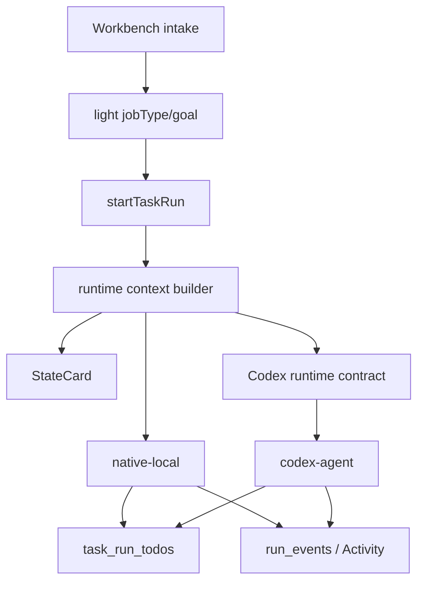

# Codex Lane Runtime Contract 実装計画

## 目的

Codex lane を NightWorkers native supervisor の延長として扱わず、Codex の実装力を活かす専用 runtime lane として整理する。StateCard は Codex SDK が文脈を取り違えないための continuity guardrail として残す。一方で、Round1/Round2 decision loop、LLM による SKILL 読み込み、jobType ごとの worker tool 強制は Codex lane の実行制御から外す。

NightWorkers が握る責務は、run の入口、StateCard、進捗台帳、成果物 source refs、Activity/Timeline、final 前の軽い整合性チェックに寄せる。Codex が握る責務は、実装判断、ファイル編集、検証、細かい作業順の最適化に寄せる。

## 現状

`startTaskRun(...)` は runtime lane を解決する前後で、全 lane 共通の runtime prompt を作っている。`api/modules/nightworkers/nightworkers.service.ts` では最新 user message を取得し、StateCard を `buildPromptWithStateCardParts(...)` で混ぜた `runtimeLatestUserMessage` を runtime に渡している。

`native-local` は `api/services/agent-runtime/NativeAgentRuntime.ts` から `runSupervisorLoop(...)` に入り、Round1/Round2、`read_skill`、`replace_todo_list`、`start_todo`、`complete_todo`、`finalize_answer` の制御を使う。

`codex-agent` は `api/services/agent-runtime/CodexAgentRuntime.ts` で Codex SDK thread を開始し、`thread.runStreamed(context.latestUserMessage || context.compiledPrompt)` にそのまま渡す。つまり Codex 実行中は NightWorkers の Round2/SKILL/Todo tool gate は通らない。これは Codex の native coding-agent としては自然だが、NightWorkers の「TodoList を作って順番にやっつける」進捗体験とはずれる。

直近の修正で `planning` / `docs` intake は run に進むようになったが、Codex lane の中で TodoList 作成・更新を期待する契約はまだない。

## レビュー結果

この計画は方向性としては実装可能だが、初版のままだと次の点が実装着手時に曖昧だった。

- 最初の PR でどこまで入れるかが広すぎる。
- Codex が Todo を更新する capability を MCP にするか CLI にするか決まっていない。
- `task_run_todos` の既存 repository 関数をどう包むかが未定義だった。
- `completeOpenTodosForTerminalRun(...)` が open Todo を自動 `passed` にする既存挙動と、Codex lane の「未完了 Todo を diagnostic として残す」方針が衝突する。
- Codex lane の contract kind をどこから決めるか、つまり intake metadata / StateCard classification / task message の優先順位が未定義だった。

したがって、実装は下の Slice を一気に進めず、まず Slice 1 で runtime contract の注入と診断保存だけを完成させる。Todo 更新 capability は Slice 2 で入れる。

## Implementation Slices

### Slice 1: Codex prompt contract と diagnostic の最小縦断

最初の実装単位。MCP/CLI はまだ追加しない。Codex が Todo を更新できなくても、少なくとも Codex lane に StateCard + runtime contract が渡り、run に contract metadata が残り、未完了 Todo の自動 passed 化が Codex lane では起きない状態にする。

変更対象:

- `api/modules/nightworkers/nightworkers.service.ts`
- 新規: `api/services/agent-runtime/codex-runtime-contract.ts`
- `api/services/agent-runtime/types.ts`
- `tests/services.nightworkers-service.test.ts`
- `tests/services.codex-agent-runtime.test.ts`

実装内容:

1. `CodexRuntimeContractKind` を追加する。
   - `none`
   - `todo_recommended`
   - `todo_required_soft`
2. `CodexRuntimeContractSnapshot` を追加する。
   - `kind`
   - `jobType`
   - `digest`
   - `charCount`
   - `todoPolicy`
3. `buildCodexRuntimeContract(input)` を実装する。
   - input: `{ jobType?: string | null; goal?: string | null; runtimeLane: string }`
   - output: `{ kind, text, snapshot }`
4. `startTaskRun(...)` で latest intake metadata を取得する helper を追加する。
   - 既存の `task_messages.metadataJson.intent === "run_started"` の `intakeJobSelection` を最優先にする。
   - 次に `metadataJson.intent === "intake"` の `jobSelection` を見る。
   - 見つからなければ StateCard classification は参照せず `null` にする。StateCard は continuity であり、runtime policy source にはしない。
5. `runtimeLaneResolution.workerKind === "codex-agent"` の場合だけ、StateCard 付き latest user message の末尾に Codex contract を追加する。
6. `task_runs.context_snapshot.codexRuntimeContract` に snapshot を保存する。
7. `completeOpenTodosForTerminalRun(...)` を lane-aware にする。
   - native-local は従来どおり completed/needs_review で open Todo を `passed` にできる。
   - codex-agent かつ `todo_required_soft` の場合、open Todo を自動 `passed` にしない。
   - 代わりに `run_events` へ `codex.todo_diagnostic` 相当の payload を持つ warning/checkpoint event を残す。

Slice 1 の非ゴール:

- Codex から Todo を作成・更新する MCP/CLI はまだ作らない。
- reminder timer はまだ入れない。
- UI の新規コンポーネントは作らない。既存 Activity に diagnostic event が出るだけでよい。
- Round1/Round2/SKILL の削除はまだしない。

Slice 1 のテスト:

- `tests/services.nightworkers-service.test.ts`
  - Codex lane の `runtime.start(...)` に渡る `latestUserMessage` が `<STATE_CARD>` と `[NightWorkers Run Contract]` を含む。
  - `task_runs.context_snapshot.codexRuntimeContract.kind` が `planning` で `todo_required_soft` になる。
  - `minor_code_edit` では `todo_required_soft` にならない。
  - codex-agent の completed run で open Todo が自動 `passed` にならず、diagnostic event が作られる。
  - native-local の既存 Todo 自動完了挙動は壊れない。
- `tests/services.codex-agent-runtime.test.ts`
  - Codex runtime は受け取った `latestUserMessage` をそのまま `thread.runStreamed(...)` に渡す。

### Slice 2: backend-owned Todo update capability

Codex が実際に Todo を更新できる最小 capability を作る。最初は MCP ではなく HTTP/route + CLI のどちらか一方に寄せる。既存 desktop app 内で Codex SDK から確実に呼べる経路が未確定なら、まず backend route を source of truth として作り、MCP/CLI は adapter として後続にする。

推奨順:

1. service 関数
2. API route
3. Codex runtime guidance への呼び出し例追加
4. MCP/CLI adapter

変更対象:

- `api/modules/nightworkers/nightworkers.service.ts`
- `api/modules/nightworkers/nightworkers.routes.ts`
- `api/modules/nightworkers/nightworkers.repository.ts`
- `tests/routes.nightworkers.test.ts`
- `tests/routes.nightworkers-workbench.test.ts`

service API:

```ts
export async function replaceRunTodosFromRuntime(input: {
  runId: string;
  todos: Array<{
    seq: number;
    title: string;
    description?: string | null;
    taskType?: string;
    dependsOn?: Array<string | number> | null;
  }>;
  source: 'codex-agent' | 'native-local' | 'api';
})

export async function updateRunTodoFromRuntime(input: {
  runId: string;
  seq?: number;
  todoId?: string;
  status?: 'pending' | 'running' | 'passed' | 'failed' | 'skipped' | 'needs_human';
  statusReason?: string | null;
  source: 'codex-agent' | 'native-local' | 'api';
})
```

route 案:

- `GET /api/workbench/runs/:runId/todos`
- `PUT /api/workbench/runs/:runId/todos`
- `PATCH /api/workbench/runs/:runId/todos/:todoId`

制約:

- `runId` の task/repository ownership を backend で確認する。
- `seq` は 1 始まり、重複不可。
- `title` は空不可。
- `taskType` 未指定時は `codex_step` にする。
- `replace` 時は最初の Todo を `running`、残りを `pending` にする。
- status 更新時、1 つを `running` にしたら他の running は `pending` に戻す。
- completed status では `completedAt` を入れる。
- すべての更新で `run_events` に `todo.updated` 相当の event を残す。

Slice 2 の非ゴール:

- Codex SDK thread に MCP server を登録すること。
- global Codex MCP projection。
- Todo 更新を run 成否の hard gate にすること。

### Slice 3: Codex MCP/CLI adapter と reminder

Slice 2 の service/route が固まってから、Codex が使いやすい adapter を足す。

候補:

- NightWorkers MCP tools:
  - `nightworkers.todo.list`
  - `nightworkers.todo.replace`
  - `nightworkers.todo.update`
- CLI:
  - `nightworkers run todo list --run-id "$NIGHTWORKERS_RUN_ID" --json`
  - `nightworkers run todo replace --run-id "$NIGHTWORKERS_RUN_ID" --file todos.json`
  - `nightworkers run todo update --run-id "$NIGHTWORKERS_RUN_ID" --seq 2 --status passed`

この Slice で初めて `CodexAgentRuntime` の thread options / environment に `NIGHTWORKERS_RUN_ID`、API origin、MCP tool availability を渡す。

## 方針

Codex lane では、NightWorkers supervisor loop を再現しない。代わりに Codex 専用の runtime contract を prompt/thread context に渡す。

### 残すもの

- StateCard の自動注入
- Codex SDK native activity の event mirror
- post-run git diff collection
- Workbench Activity/Timeline 表示
- `task_run_todos` を run-internal progress ledger として使う考え方
- final 前の軽い Todo 整合性チェック

### Codex lane から外すもの

- Round2 decision JSON loop
- Codex に対する `read_skill` / `search_skill` 強制
- jobType ごとの NightWorkers worker tool catalog
- `finalize_answer` を Codex 実行の唯一の終了手段にする設計
- Codex のファイル編集順を NightWorkers が細かく制御する設計

### 残すが軽量化するもの

- Round1 相当の jobType/goal 判定
  - Workbench intake、UI、run contract 選択、StateCard classification には使う。
  - Codex 実行中の行動制御には使わない。
- SKILL 相当の知識
  - Codex lane では tool で読ませるのではなく、必要最小限の static guidance / run contract に落とす。
  - 長い SKILL 本文は Codex prompt に自動注入しない。

## Runtime Contract

Codex lane に渡す contract は短く、命令ではなく作業様式の契約にする。

### 共通 contract

- 最新 user message を主要求として扱う。
- `<STATE_CARD>` がある場合は、過去の決定、現在の objective、関連ファイル、直前の結果として参照する。
- Repository の読み書きは project root を基準にする。
- 実行結果は、変更ファイル、実行した検証、未完了事項を明示して返す。
- NightWorkers internal DB や app-data を直接編集しない。

### Todo contract 対象

TodoList を要求する対象は次に限定する。

- `planning`
- `docs`
- `major_code_edit`
- `blueprint` / `ui_ux` のうち Codex lane で実装に進めるもの

`minor_code_edit`、軽い `general_answer`、単発の確認では Todo 必須にしない。

### Todo contract 内容

- まとまった作業では最初に 3-7 個程度の Todo を作る。
- Todo は「調査」「設計/方針」「実装」「検証」「報告」のような実作業単位にする。
- Todo の内部でのファイル編集順や検証方法は Codex が決めてよい。
- 作業が進んだら active Todo を更新する。
- final response 前に open Todo が残っている場合は、未完了理由を明示する。

初期実装では強制ブロックしない。warning/reminder と Activity 表示から始める。

## アーキテクチャ



## UI / Activity 方針

Todo 更新は Activity と Timeline で見えるようにする。ただし Codex の command/file/diff activity より大きく見せすぎない。

- Todo created: compact activity
- Todo started/completed: compact activity
- Todo reminder: warning style
- Open Todo at final: final report 補助情報

Debug mode でなくても、最低限の Todo 状態は見えるようにする。

## Data Model

既存の `task_run_todos` を使う。新規 table は不要。

追加する可能性がある metadata:

- `task_runs.context_snapshot.codexRuntimeContract`
  - `kind`
  - `digest`
  - `charCount`
  - `todoPolicy`
- `run_events.payload_json.codexTodoDiagnostic`
  - `todoCount`
  - `openTodoCount`
  - `lastTodoUpdateAt`
  - `reminderEmitted`

## 検証コマンド

実装時は最低限次を実行する。

```bash
pnpm exec vitest run tests/services.nightworkers-service.test.ts
pnpm exec vitest run tests/services.codex-agent-runtime.test.ts
pnpm exec vitest run tests/routes.nightworkers-workbench.test.ts
pnpm verify
```

Todo CLI/MCP を追加した場合は、該当 route/CLI test を追加して単体実行する。

## リスクと対策

| リスク | 内容 | 対策 |
| --- | --- | --- |
| Codex の実装力を削ぐ | Todo 更新を細かく強制しすぎる | 初期は soft contract と reminder に留める |
| Todo が形骸化する | Codex が最後にまとめて Todo を作るだけになる | 長時間未更新 reminder と final diagnostic を残す |
| prompt が肥大化する | StateCard + contract + guidance が重なる | contract は 10 行以内を目安にし、SKILL 本文は入れない |
| source of truth が壊れる | Codex が DB を直接編集する | MCP/CLI/API 経由だけを許可し、runId ownership を backend で検証する |
| native-local と Codex の挙動差が混乱を生む | 片方は Round2 gate、片方は soft contract | settings / run event / Timeline で lane 名と contract を明示する |

## 完了条件

- Codex lane で StateCard が残る。
- Codex lane で Round2/SKILL 読み込みを実行前提にしない。
- `planning` / `docs` / `major_code_edit` の Codex run に Todo contract が渡る。
- Codex が Todo を作成・更新できる backend-owned capability がある。
- Todo がない/未完了でも即失敗にはせず、Activity/diagnostic として見える。
- `pnpm verify` が通る。
