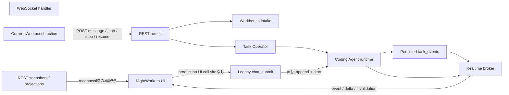
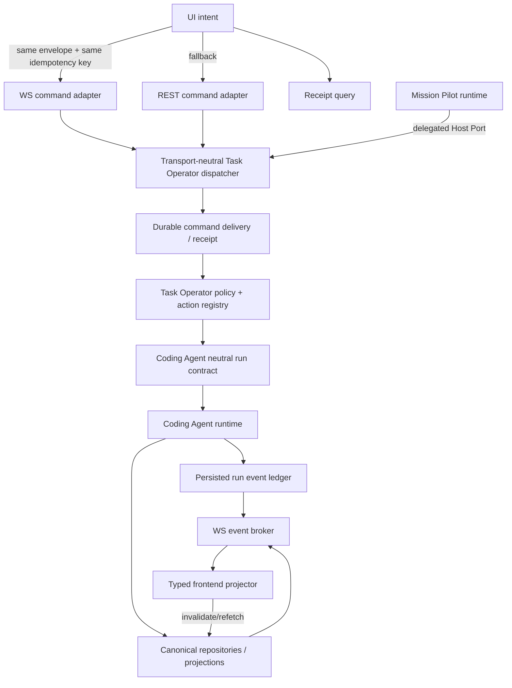

# Coding Agent Command / Realtime Transport 統合実装計画

## Status

- 種別: 実装計画
- 対象: NightWorkers UI、Task Operator、Coding Agent、Mission Pilot、WebSocket realtime
- 作成日: 2026-08-02
- 基準コミット: `b580bd93`
- 実装状態: 未着手
- この文書の目的: 現在の REST / WebSocket 利用実態を再検証し、Coding Agent 操作を安全に両 transport へ公開する段階的な実装計画を固定する

## 1. 結論

通信方式を全面的に WebSocket へ統一しない。

採用する構成は次のとおりとする。

| 対象 | command 入力 | state / event 出力 | 正本 |
| --- | --- | --- | --- |
| ProjectDetail の通常操作・query | REST | 必要な場合のみ WS invalidation | REST query / repository |
| Workbench のユーザー入力・Mission Pilot の計画操作 | REST を基本とする | WS notification + REST refetch | user-intake application command / repository |
| Coding Agent の明示的 lifecycle 操作（start / stop / Todo resume） | 同一 Task Operator command を REST と WS の両方から実行可能にする | WS progress/event + REST snapshot/cursor fallback | Task Operator command receipt / Task / Run |
| Coding Agent の進捗・delta・run event | command に使用しない | WS を主経路とし、再接続時は永続 event cursor または REST snapshot を使用する | `task_events` と各 projection |
| Mission Pilot UI の Play / Stop | REST | WS notification + REST refetch | Mission Pilot application service / repository |
| Mission Pilot runtime から Coding Agent への依頼 | REST/WS を経由しない | application event / Host Port | Task Operator Host Port と構造的 provenance |

したがって統一対象は transport そのものではなく、次の3点である。

1. Coding Agent lifecycle command の意味、認可、revision、idempotency、receipt
2. REST と WS が呼び出す server-side command dispatcher
3. WS event の schema、cursor、再接続後の収束規則

REST は互換経路・fallback・snapshot query として残す。WS は低遅延な command adapter と realtime notification に限定し、独自の business logic を持たせない。

## 2. 再調査した現在の実態

### 2.1 現行データフロー



### 2.2 UI からの command 入力

- 現在の Workbench のメッセージ送信は `sendWorkbenchMessage` から `POST /api/workbench/sessions/:id/messages` を呼んでいる。入力経路は REST である。
- Coding Agent の start / stop / Todo resume も REST route を呼んでいる。
- `sendChatMessage` は WebSocket の `chat_submit` を送信できるが、production UI に call site がない。現行の主経路ではない。
- Composer の intent は現在 `intake` に固定されており、通常のユーザー入力と Coding Agent lifecycle command は意味的に別経路である。

主な確認箇所:

- `src/modules/nightworkers/components/Composer.tsx`
- `src/modules/nightworkers/components/NightWorkersShellThreadPanel.tsx`
- `src/modules/nightworkers/hooks/nightWorkersChatActions.ts`
- `src/modules/nightworkers/nightWorkersCommands.ts`

### 2.3 REST の Coding Agent lifecycle

REST の start / stop / Todo resume は単に runtime を直接操作しているわけではない。`nightworkers.route-handlers.ts` から Task Operator projection を読み、`executeTaskOperatorCommand` を経由している。

Task Operator は現在も次を検証している。

- principal の capability
- action registry と JSON schema
- current Task revision
- action availability
- resource ownership
- idempotency receipt と input digest
- delegated Mission Pilot provenance

さらに Coding Agent の start handler は Task、repository、artifact revision/digest を再検証してから runtime を起動する。このため「REST 経路は Task Operator を迂回している」という仮説は誤りである。

一方、REST route は server が取得した最新 Task revision をそのまま command に渡しており、ユーザーが画面を見て判断した時点の revision を wire boundary で検証できていない。これは transport 統合時に是正すべき gap である。

主な確認箇所:

- `api/modules/nightworkers/nightworkers.route-handlers.ts`
- `api/modules/taskOperator/application/task-operator.command.ts`
- `api/modules/taskOperator/application/task-operator-implementation-start.ts`
- `api/modules/commandDelivery/command-delivery.repository.ts`
- `api/modules/codingAgent/application/coding-agent-run.handler.ts`
- `api/modules/agentsShare/contracts/coding-agent-run.ts`

### 2.4 WebSocket の command 入力

現行 inbound schema は `subscribe_task`、`unsubscribe_task`、`chat_submit` を受け付ける。

`chat_submit` は次を直接実行している。

1. stale run recovery
2. Task message append
3. `startTaskRun`
4. `chat_submit_enqueued` 応答

この経路には Task Operator command と同等の以下の契約がない。

- action registry / capability 検証
- client decision 時点の expected Task revision
- durable idempotency receipt
- 同一 key・異なる引数の conflict
- artifact / repository reference の明示
- user-direct / Mission Pilot handoff の構造的 provenance
- ack 消失後の command status 照会

したがって `chat_submit` を Coding Agent command の正規経路として拡張してはならない。新しい WS adapter は Task Operator と command-delivery repository を再利用し、`api/app.ts` に business logic を追加しない。

主な確認箇所:

- `api/security/nightworkers-websocket-policy.ts`
- `api/app.ts`
- `api/services/realtime/nightworkers-ws.ts`

### 2.5 WebSocket の realtime 出力と再接続

frontend は単一 WebSocket を開き、active session と最新 run cursor を購読する。run event は永続化された `task_events` を `afterSeq` で再取得できる。

ただし、すべての realtime message が同じ耐久性を持つわけではない。

- run event: persisted cursor replay がある
- 一部の UI notification: broker memory replay のみ
- projection update: notification を契機に REST query を invalidate/refetch する
- broker の fallback task sequence: process memory 上の順序であり、永続 run sequence と同一ではない
- frontend inbound type: versioned discriminated union ではなく optional field の集合
- malformed/unknown payload: 現状は catch で黙って破棄される箇所がある

よって「WS に流れる state はすべて durable で、1本の sequence で厳密に replay できる」という仮説も誤りである。run stream と projection invalidation を区別する必要がある。

主な確認箇所:

- `api/services/realtime/nightworkers-ws.ts`
- `src/modules/nightworkers/hooks/useNightWorkersRealtime.ts`
- `src/modules/nightworkers/hooks/useLatestRunSubscription.ts`
- `spec/configuration.md`

### 2.6 Mission Pilot

Mission Pilot UI の Play / Stop は REST、state update は `mission_pilot.updated` 等の WS notification で処理している。この構成は目標と一致しており、WS-only に変更する必要はない。

Mission Pilot runtime の action execution は production 経路では delegated principal を付与して Task Operator を呼び、Coding Agent へ handoff している。これは HTTP や WS に依存しない正しい application boundary である。

ただし composition には次の潜在的な不整合がある。

- structured `MissionPilotHostPorts` と runtime `bindings` が併存している
- `mission-pilot-dependencies.ts` の `taskOperator.execute` adapter は input principal を使用せず human context を組み立てる
- 同 adapter の `events.subscribe` が no-op である
- 現在の production runtime は主として別の runtime bindings を使用しているため、上記の不整合は顕在化していない

この二重経路は transport 改修とは別フェーズで正本を一つにする。Mission Pilot package から NightWorkers private source を import したり、内部実行を REST/WS 化したりしない。

主な確認箇所:

- `packages/mission-pilot/src/frontend/missionPilotCommands.ts`
- `packages/mission-pilot/src/contracts/realtime.ts`
- `packages/mission-pilot/src/frontend/realtime.ts`
- `packages/mission-pilot/src/backend/runtime/agent/mission-pilot-action-command-executor.ts`
- `api/composition/mission-pilot/mission-pilot-dependencies.ts`
- `api/composition/mission-pilot/mission-pilot-runtime-bindings.ts`

## 3. 仮説の判定

| ID | 仮説 | 判定 | 根拠と計画への反映 |
| --- | --- | --- | --- |
| H1 | 現在の主要な Workbench chat 入力は WS ベースである | 棄却 | production UI は REST message route を使用し、WS は主として出力通知に使用している |
| H2 | REST の Coding Agent start / stop / resume は Task Operator を迂回している | 棄却 | 3操作とも Task Operator command を経由する |
| H3 | `chat_submit` は現行 UI の主 command 経路である | 棄却 | production UI に call site がない |
| H4 | `chat_submit` は REST lifecycle と同じ安全性を持つ | 棄却 | revision、receipt、capability、provenance 等が同等ではない |
| H5 | Coding Agent 操作は WS-only に統一すべきである | 修正採用 | 同一 command を WS-first + REST fallback にする。WS 固有の副作用処理は持たせない |
| H6 | ProjectDetail のボタン操作は REST のままでよい | 採用 | request/response と snapshot query に適し、低遅延 stream の利点が小さい |
| H7 | Mission Pilot は REST と WS の両方を持つべきである | 条件付き採用 | UI は REST command + WS notification。runtime 内部は Host Port / application command とし、transport を経由しない |
| H8 | 現行 WS event はすべて durable replay 可能である | 棄却 | persisted run cursor、memory replay、REST refetch が混在する |
| H9 | REST/WS 共通の公開 command envelope が既にある | 部分採用 | server 内部の Task Operator input/receipt は存在するが、transport 共通 wire contract はない |
| H10 | Mission Pilot Host Port は現在1系統に統一されている | 棄却 | structured host と bindings が併存し、一部 adapter は不完全である |
| H11 | ただちに全 event 用 durable outbox が必要である | 保留 | 現行の persisted run ledger + snapshot refetch で要件を満たせる可能性が高い。厳密な no-loss 要件と観測結果を導入条件にする |
| H12 | Workbench intake もすべて Task Operator action に変えるべきである | 棄却 | intake/plan routing と実装 lifecycle は所有権が異なる。intake は専用 application command の idempotency を強化する |

## 4. 解決すべき gap

### G1. transport 共通 command contract がない

Task Operator の server-side command は存在するが、REST と WS が同じ wire envelope、result、failure、receipt を共有していない。

### G2. retry 単位の idempotency が client に保持されない

frontend は lifecycle REST call ごとに新しい `Idempotency-Key` を生成する。通信結果が不明な retry で同じユーザー操作を識別できない。

### G3. expected revision がユーザー判断と結び付いていない

REST route が current revision を再取得して command に渡すため、古い projection を見たユーザー操作を server が stale decision として拒否できない。

### G4. WS handler が business logic を持つ

`chat_submit` が `api/app.ts` で message append と runtime start を直接行う。transport adapter と application command の境界が崩れている。

### G5. WS ack 消失時の収束方法がない

server commit 後、client ack 前に切断した場合、client が command receipt を照会して同じ操作へ収束する標準手順がない。

### G6. realtime contract と再生意味論が曖昧

run sequence、broker memory sequence、projection revision が同じ optional `seq` の形で扱われる。frontend の parse failure も可観測でない。

### G7. frontend realtime hook の責務が集中している

connection、subscription、inbound parse、React Query invalidation、chat command pending state、replay が1つの hook に集約されている。

### G8. Mission Pilot composition の正本が二重化している

production で利用する runtime bindings と、未完成の structured Host Port adapter が併存し、将来誤った adapter が利用される危険がある。

## 5. 固定する設計契約

### 5.1 command plane と event plane を分離する

- command は明示的な1回の intent であり、idempotency と receipt を持つ。
- event は確定済み state の通知または persisted run stream である。
- WS 接続の有無で command の業務意味を変えない。
- WS notification を command 成功の唯一の証拠にしない。
- UI は notification 受信後、必要に応じて正本 query を refetch する。

### 5.2 Coding Agent lifecycle の正本は Task Operator とする

- start / stop / Todo resume は既存 action registry と availability を使う。
- REST adapter と WS adapter は同じ application dispatcher を呼ぶ。
- transport ごとの action allowlist、mode、固定 workflow を追加しない。
- Coding Agent runtime 自体に WS mode / REST mode を追加しない。
- Todo は LLM または人間の明示 command だけで更新する。

### 5.3 principal は server が接続情報から決定する

- wire payload に実行 principal を持たせない。
- REST は既存 HTTP context、WS は upgrade 済み session/auth context から principal を構築する。
- Mission Pilot delegated principal は runtime Host Port の構造的 provenance からのみ構築する。
- human と Mission Pilot の区別を prompt 文言や keyword から推定しない。

### 5.4 idempotency key は transport をまたいで同じ intent に再利用する

- key の生成単位は「クリック1回」または「送信1回」とする。
- timeout、disconnect、REST fallback では同じ key を使う。
- ユーザーが明示的に再実行した場合だけ新しい key を生成する。
- 同じ principal + key + 同じ input digest は既存 receipt を返す。
- 同じ principal + key + 異なる input digest は conflict を返す。

### 5.5 expected Task revision は client projection に由来する

- command envelope は、ユーザーが見た Task Operator projection の revision を必須とする。
- server は command 開始時に current revision と比較する。
- stale の場合は自動的に最新 revision へ置換せず、typed conflict と最新 projection 取得方法を返す。

### 5.6 realtime stream の順序を偽装しない

- run event は `runId + persisted seq` を cursor とする。
- projection notification は `resourceRef + revision` または digest を持たせる。
- memory-only notification に durable sequence を装わない。
- 異種 stream 全体へ単一 task sequence を割り当てない。
- duplicate delivery は許容し、client は event identity / revision で冪等に処理する。

### 5.7 Workbench intake は lifecycle command と分離する

- user message intake は `SubmitTaskUserIntakeCommand` 相当の application port を正本にする。
- prompt、requestId、idempotencyKey、actor/provenance を保持する。
- intake を Task Operator の lifecycle action へ見せかけない。
- Workbench intake は REST 基本のままでよいが、retry 時に同一 key を使用する。

### 5.8 Mission Pilot の内部実行は transport 非依存とする

- UI control は REST + WS でよい。
- runtime から Task Operator への依頼は Host Port / application command を使う。
- Mission Pilot package は NightWorkers private route/service/repository を import しない。
- Mission Pilot と Coding Agent の role ownership を移動しない。

## 6. 目標アーキテクチャ



## 7. Wire contract 案

実装時は既存 `shared/modules/taskOperator` schema と command receipt を拡張し、定数・schema・parse function を REST/WS で再利用する。

### 7.1 Command execute

```ts
type TaskOperatorCommandEnvelopeV1 = {
  version: 1;
  type: "task_operator.command.execute";
  requestId: string;
  idempotencyKey: string;
  taskId: string;
  actionId: string;
  expectedTaskRevision: number;
  arguments: unknown;
};
```

設計上の注意:

- `principal`、capability、transport 名を payload に含めない。
- `requestId` と `idempotencyKey` は client が retry 間で保持する。正本の重複排除は principal + idempotency key + digest で行う。
- `commandId` は client input にせず、server が durable receipt 作成時に発行する。
- `actionId` は既存 Task Operator catalog から取得する。Coding Agent 専用 allowlist を wire 層へ複製しない。
- `arguments` は action registry の既存 JSON schema で検証する。
- version 不一致は typed unsupported-version failure を返し、接続自体を壊さない。

### 7.2 Command response

```ts
type TaskOperatorCommandResponseV1 =
  | {
      version: 1;
      type: "task_operator.command.accepted";
      requestId: string;
      commandId: string;
      replayed: boolean;
      resourceRefs: readonly ResourceRef[];
    }
  | {
      version: 1;
      type: "task_operator.command.rejected";
      requestId: string;
      commandId?: string;
      failure: TaskOperatorCommandFailure;
    };
```

`accepted` は runtime 完了を意味しない。command が durable receipt とともに受理・実行済みであることを意味する。長時間の Coding Agent 実行結果は run event / snapshot で追跡する。

### 7.3 Receipt query

- `commandId` または idempotency identity で status を取得できる read API を追加する。
- actor ownership を必ず検証する。
- status は少なくとも `executing`、`succeeded`、`failed`、`outcome_unknown` を表せる既存 model に合わせる。
- WS ack を失った client は receipt query を先に行い、未確定の場合のみ同じ idempotency key で REST fallback を実行する。

### 7.4 Realtime event

```ts
type RealtimeEventEnvelopeV1 = {
  version: 1;
  eventId: string;
  type: string;
  occurredAt: string;
  stream:
    | { kind: "run"; taskId: string; runId: string; seq: number }
    | { kind: "projection"; resourceType: string; resourceId: string; revision?: number };
  payload: unknown;
};
```

実装では `type` ごとの discriminated union と Zod schema を定義する。上記は envelope の説明用であり、`payload: unknown` のまま frontend へ公開しない。

## 8. 実装フェーズ

各フェーズは個別にレビュー可能とし、前フェーズの acceptance を満たしてから次へ進む。

### Phase 0: baseline と契約の固定

目的: behavior を変えず、移行前の証拠と採用契約を固定する。

実施内容:

1. 本文書の仮説判定と非目標を ADR または architecture 文書へ反映する。
2. 現行 REST route、WS inbound/outbound type、Task Operator action、Mission Pilot Host Port の対応表をテスト fixture から生成または定数化する。
3. 現行の focused test を baseline として記録する。
4. browser / packaged desktop / Tauri dev の3環境で現在の接続 URL、Origin、再接続挙動を確認する。
5. command latency、disconnect、receipt replay、malformed event を記録できる構造化 log 項目を定義する。prompt 本文は log しない。

Acceptance:

- behavior diff がない。
- 既存 focused test 47件が成功する。
- action 名、route、event type が複数箇所へ手書きで複製されない方針がレビュー承認される。

失敗時:

- 現行挙動と文書が一致しない場合は実装へ進まず、仮説表を更新する。

### Phase 1: transport-neutral command contract と REST parity

目的: WS を追加する前に、REST 経路だけで共通 contract と retry safety を成立させる。

実施内容:

1. `shared/modules/taskOperator` に versioned command envelope、response、failure schema と parse function を追加する。
2. `api/modules/taskOperator/application` に REST/WS 共通 dispatcher を追加するか、既存 `executeTaskOperatorCommand` の直前に単一 adapter function を置く。
3. principal 構築を adapter の責務にし、dispatcher input へ server-side principal を渡す。
4. versioned envelope をそのまま受ける共通 REST endpoint `POST /api/task-operator/commands` を追加する。principal は HTTP context から補い、body からは受け取らない。
5. 既存 start / stop / Todo resume REST route も共通 dispatcher へ接続する。互換性のため既存 path と response shape は維持し、旧 client の server-current-revision 補完は compatibility adapter 内に隔離する。
6. frontend の REST 経路を共通 endpoint へ切り替え、Task Operator projection の revision と、ユーザー intent ごとに固定した requestId / idempotency key を送る。受理後は server 発行の commandId を保持する。
7. `commandDelivery` に actor-scoped receipt query を追加する。
8. Workbench message route は専用 user-intake command へ接続し、retry 時に同じ idempotency key を使用する。Task Operator action へ統合しない。

候補ファイル:

- `shared/modules/taskOperator/task-operator.schema.ts`
- `shared/modules/taskOperator/index.ts`
- `api/modules/taskOperator/application/task-operator.command.ts`
- `api/modules/taskOperator/task-operator.routes.ts`
- `api/modules/nightworkers/nightworkers.route-handlers.ts`
- `api/modules/commandDelivery/command-delivery.repository.ts`
- `src/modules/taskOperator/taskOperatorQueries.ts`
- `src/modules/nightworkers/nightWorkersCommands.ts`
- `api/modules/agentsShare/contracts/task-user-intake.ts`
- `api/modules/nightworkers/nightworkers.user-intake.handler.ts`

Acceptance:

- REST の同一 key・同一 input retry が同じ receipt を返し、run/message を重複生成しない。
- 同一 key・異なる input が `TASK_OPERATOR_IDEMPOTENCY_CONFLICT` 相当で拒否される。
- stale expected revision が typed conflict になる。
- 共通 REST endpoint と既存3 route が同じ dispatcher、authorization、receipt を使用する。
- existing route consumer に破壊的変更がない。
- user-intake と lifecycle action の ownership が混在しない。

失敗時:

- REST の互換 route を維持したまま frontend の共通 endpoint 利用だけを戻せること。
- receipt schema の migration が必要な場合、旧 receipt を読み取り可能な additive migration に限定する。

### Phase 2: WebSocket command adapter

目的: REST と同じ Task Operator command を WS から安全に実行可能にする。

実施内容:

1. WS inbound schema に `task_operator.command.execute` を追加する。
2. WS session から human principal を構築し、Phase 1 の共通 dispatcher を呼ぶ薄い adapter を実装する。
3. accepted / rejected response を `requestId` へ相関させ、accepted receipt の `commandId` を保存する。
4. server commit 後の ack 消失を再現する test hook を設け、receipt query と同一-key retry を検証する。
5. byte limit、origin allowlist、rate/connection policy、task ownership を既存 security boundary で維持する。
6. WS handler から application business logic を分離し、`api/app.ts` は decode、auth context、dispatch、encode に限定する。
7. legacy `chat_submit` は互換期間中のみ残し、新規 UI では使用しない。利用計測がゼロであることを確認して Phase 6 で削除する。

配置ルール:

- Task Operator 固有 adapter は `api/modules/taskOperator` 配下に置く。
- Agent 固有 business logic を `api/services` や `api/app.ts` に置かない。
- shared 側には wire contract と純粋 utility だけを置き、route/repository を置かない。

Acceptance:

- 同一 envelope を REST と WS のどちらで送っても、同一 authorization、revision、schema、idempotency 結果になる。
- WS -> disconnect -> REST retry でも副作用が1回だけである。
- forbidden action、別 Task resource、別 actor receipt の参照が拒否される。
- malformed payload が接続全体を crash させず typed rejection になる。

失敗時:

- frontend はまだ REST のみを使用するため、WS adapter を無効化または revert しても利用者影響がない。

### Phase 3: frontend transport client の分割と WS-first 導入

目的: 明示的 Coding Agent lifecycle command だけを WS-first にし、確実な REST fallback を提供する。

実施内容:

1. `useNightWorkersRealtime` から connection lifecycle、subscription、protocol parse、query projection、command pending 管理を分離する。
2. versioned schema で inbound message を parse する transport client を作る。
3. requestId ごとの pending promise と timeout を実装し、受理後は commandId で receipt を追跡する。
4. start / stop / Todo resume は次の順序で実行する。
   1. intent ごとに requestId と idempotency key を生成・保持し、accepted 後は server 発行の commandId も保持する。
   2. current Task Operator projection revision を envelope に設定する。
   3. WS が ready なら送信する。
   4. timeout/disconnect 時は receipt query を行う。
   5. 未確定時だけ同じ key で REST fallback を行う。
5. ProjectDetail の通常操作、Workbench intake、Mission Pilot UI control はこの切替対象にしない。
6. frontend 上の transport 表示は診断情報に限定し、business state として扱わない。

候補ファイル:

- `src/modules/nightworkers/hooks/useNightWorkersRealtime.ts`
- `src/modules/nightworkers/hooks/useLatestRunSubscription.ts`
- `src/modules/nightworkers/hooks/nightWorkersChatActions.ts`
- `src/modules/nightworkers/nightWorkersCommands.ts`
- `src/modules/nightworkers/realtime/connection.ts`（新規候補）
- `src/modules/nightworkers/realtime/protocol.ts`（新規候補）
- `src/modules/nightworkers/realtime/taskOperatorCommandClient.ts`（新規候補）

Acceptance:

- WS ready 時は lifecycle command が WS で受理される。
- WS unavailable、timeout、ack lost の全ケースで REST fallback が重複副作用なく完了する。
- ユーザーが別 intent として再実行した場合のみ新規 command になる。
- reconnect により pending command が勝手に再実行されない。
- Workbench message の prompt queue と Task Operator command receipt を混同しない。

失敗時:

- client の transport selection を REST に戻すだけで復旧できる。
- server の共通 dispatcher、receipt、REST route はそのまま利用可能である。

### Phase 4: typed realtime contract と再接続収束

目的: WS を正本 state ではなく、型付き run stream / projection invalidation として一貫させる。

実施内容:

1. outbound event を versioned discriminated union として定義する。
2. run event には persisted `runId + seq` を付け、既存 `/api/runs/:id/events?afterSeq=` と意味を合わせる。
3. task/message/questionnaire/plan/Mission Pilot state の notification は canonical resource revision/digest を付け、frontend が query invalidate/refetch する。
4. memory replay だけの event はその性質を schema/test で明示する。
5. frontend は unknown version / parse failure を構造化 log し、影響する query を安全側に refetch する。黙って破棄しない。
6. duplicate/out-of-order event を eventId、run seq、resource revision で冪等処理する。
7. reconnect 時は subscription ack、persisted replay、snapshot refetch の順序を固定する。
8. `mission_pilot.plan_progress.updated`、task message、questionnaire、plan routing の再接続収束 test を追加する。

Acceptance:

- run event は任意の既知 `afterSeq` から欠落なく再取得でき、duplicate が UI を壊さない。
- projection notification が失われても reconnect 時の REST refetch で正本へ収束する。
- unknown event version と malformed event が観測可能である。
- 異種 stream を1つの task seq で比較するコードがない。

Durable outbox 導入 gate:

次のいずれかが実測または明示要件として成立した場合に限り、別 ADR で outbox を計画する。

- snapshot refetch では復元できない event がある
- process crash 直前の notification loss を許容できない
- subscriber が全 event の監査 replay を必要とする
- persisted mutation と broker publish の atomicity が product requirement になる

### Phase 5: Mission Pilot Host Port の一本化

目的: transport 改修後に dormant な誤経路が利用されないよう、Mission Pilot composition の正本を一つにする。

実施内容:

1. `MissionPilotBackendDependencies.host` と `bindings` の利用箇所を列挙し、production runtime が必要とする単一 Host Port contract を決める。
2. structured `taskOperator.execute` を正本にする場合は input principal/provenance を保持し、human context への置換をやめる。
3. `events.subscribe` を実配線するか、不要なら contract と adapter を削除する。no-op 実装を残さない。
4. package-owned Host Port と `api/composition/mission-pilot` adapter の contract test を追加する。
5. delegated Mission Pilot action と user-direct action が同じ Task Operator policy を通り、provenance で区別されることを検証する。
6. Mission Pilot 内部 runtime から REST route または WS message を呼ばないことを architecture check に追加する。

候補ファイル:

- `packages/mission-pilot/src/contracts/host-ports.ts`
- `packages/mission-pilot/src/backend/host-bindings.ts`
- `packages/mission-pilot/src/backend/runtime/agent/mission-pilot-action-command-executor.ts`
- `api/composition/mission-pilot/mission-pilot-dependencies.ts`
- `api/composition/mission-pilot/mission-pilot-host-ports.ts`
- `api/composition/mission-pilot/mission-pilot-runtime-bindings.ts`

Acceptance:

- production で使う Host Port implementation が一意である。
- delegated principal が adapter 境界で失われない。
- event subscription に no-op production implementation がない。
- Mission Pilot package boundary test と delegated authorization test が成功する。

失敗時:

- runtime bindings の現行 production 経路を維持し、structured adapter の利用開始を止める。
- このフェーズを理由に REST/WS command adapter の rollout を止める必要はない。ただし dormant adapter を新規利用してはならない。

### Phase 6: canary、既存経路削除、文書更新

目的: REST fallback を維持したまま WS-first を段階投入し、使われない危険経路を削除する。

実施内容:

1. 開発環境で WS command を有効化し、command result と receipt parity を観測する。
2. browser、Tauri dev、packaged desktop の順に canary を行う。
3. ack latency、timeout、fallback rate、idempotency replay、conflict、duplicate run/message を計測する。
4. legacy `chat_submit` の利用がないことを確認する。
5. `chat_submit` inbound schema、server handler、`sendChatMessage`、pending chat replay queue を削除する。
6. architecture/configuration/API 文書を最終構成へ更新する。
7. REST lifecycle route は fallback と automation 用に残し、deprecation しない。

Canary promotion 条件:

- duplicate Coding Agent run/message が0件
- WS と REST の typed failure parity が一致
- ack lost test が receipt/fallback で収束
- WS unavailable 時の操作成功率が REST-only baseline を下回らない
- reconnect 後に active Task / Run / Mission Pilot projection が正本へ収束

Rollback:

- frontend の lifecycle transport selection を REST-only へ戻す。
- REST route、dispatcher、receipt repository は削除しないため、server rollback を伴わず復旧できる。
- wire version は additive に追加し、旧 client を破壊する置換をしない。
- DB migration がある場合は additive column/table のみとし、rollback 中も旧 reader が動作する形にする。

## 9. File disposition

| 領域 | 方針 |
| --- | --- |
| `shared/modules/taskOperator` | versioned wire schema、共通 failure/result、純粋 parse utility を所有する |
| `api/modules/taskOperator` | command dispatcher、policy、action registry、WS adapter を所有する |
| `api/modules/commandDelivery` | idempotency receipt と actor-scoped status query を所有する |
| `api/modules/nightworkers` | HTTP route mapping と user-intake application adapter を所有する。Coding Agent 固有 logic は置かない |
| `api/modules/codingAgent` | neutral run contract の handler、runtime orchestration を維持する。transport 分岐を置かない |
| `api/services/realtime` | connection/broker の Agent 非依存 infrastructure に限定する |
| `api/app.ts` | WS upgrade、接続 context、transport adapter 呼び出しに縮小する |
| `src/modules/taskOperator` | projection と command client の Task Operator 側 entry point を所有する |
| `src/modules/nightworkers/realtime` | connection、subscription、protocol、projector を分離して所有する |
| `packages/mission-pilot` | package-owned contracts/runtime/frontend を維持し、NightWorkers private source を参照しない |
| `api/composition/mission-pilot` | package Host Port と NightWorkers application command/event の配線だけを所有する |

## 10. 検証計画

### 10.1 Contract / command parity matrix

| Scenario | REST | WS | 期待結果 |
| --- | --- | --- | --- |
| valid start | 実行 | 実行 | 同じ receipt shape、Task/Run mutation |
| valid stop | 実行 | 実行 | 同じ authorization と terminal state |
| valid Todo resume | 実行 | 実行 | 同じ Todo revision rule |
| stale Task revision | 拒否 | 拒否 | 同じ typed conflict |
| schema invalid | 拒否 | 拒否 | 同じ validation failure |
| capability missing | 拒否 | 拒否 | 同じ authorization failure |
| resource ownership mismatch | 拒否 | 拒否 | 情報漏えいなし |
| same key + same input | replay | replay | 副作用1回、`replayed: true` |
| same key + different input | conflict | conflict | 副作用なし |
| WS commit 後 ack loss -> REST retry | fallback | 最初の実行 | 既存 receipt を返し、副作用1回 |
| delegated Mission Pilot | Host Port | 対象外 | provenance 保持、human と同じ policy |

### 10.2 Realtime / reconnect matrix

| Scenario | 期待結果 |
| --- | --- |
| known run cursor から reconnect | persisted event を `afterSeq` 以降 replay |
| duplicate run event | frontend state が二重適用されない |
| projection notification loss | reconnect 時の REST refetch で収束 |
| broker process restart | memory-only replay に依存せず snapshot で収束 |
| unknown wire version | log + typed handling + 必要な refetch |
| malformed event | UI crash なし、観測可能、正本再取得 |
| active Task 切替 | 旧 subscription を解除し、新 Task/run cursor だけを購読 |
| Mission Pilot plan progress 中の reconnect | progress query で最新 revision/digest へ収束 |

### 10.3 Security

- WS Origin allowlist と browser/Tauri の許可 origin
- max message bytes と schema depth/size
- unauthenticated / expired session
- actor が所有しない Task、Run、receipt
- commandId と idempotency key の推測攻撃
- same key conflict による input 情報漏えい
- connection flood、pending command 上限、timeout cleanup
- prompt、artifact 内容、secret を構造化 log に記録しないこと

### 10.4 Verification commands

変更フェーズごとに最低限次を実行する。

```bash
node scripts/run-vitest.mjs run \
  tests/websocket-security.test.ts \
  tests/services.realtime-broker.test.ts \
  tests/nightworkers-realtime-effects.test.ts \
  tests/task-operator-contract.test.ts \
  tests/task-operator-regressions.test.ts \
  tests/mission-pilot-package-host-ports.test.ts \
  tests/mission-pilot-delegated-authorization.test.ts

bun run typecheck
bun run check:architecture
bun run lint
bun run verify:fast
```

追加する focused test の候補:

- `tests/task-operator-transport-parity.test.ts`
- `tests/task-operator-command-receipt.test.ts`
- `tests/websocket-command-reconnect.test.ts`
- `tests/nightworkers-realtime-contract.test.ts`
- `tests/mission-pilot-host-port-composition.test.ts`

実際のファイル名は既存 test naming に合わせて確定する。

### 10.5 変更前 baseline

2026-08-02 に上記 focused 7 suites を再実行した結果:

- Test Files: 7 passed
- Tests: 47 passed
- Duration: 11.09s

この baseline が崩れた状態で transport rollout を開始しない。

## 11. Observability

command ごとに次を記録する。

- protocol version
- requestId / commandId
- actionId
- actor kind と非機密 actor reference
- transport (`rest` / `websocket`)
- accepted / rejected / replayed / outcome_unknown
- expected revision と observed revision
- latency、ack latency、fallback reason
- resource reference

記録しないもの:

- prompt 本文
- artifact 本文
- credential、cookie、authorization header
- provider の secret response

dashboard/判定指標:

- WS command acceptance rate
- REST fallback rate
- receipt replay rate
- idempotency conflict rate
- ack timeout rate
- duplicate run/message count
- realtime parse failure / unknown version count
- reconnect 後の snapshot refetch failure

## 12. 非目標

- 全 REST API の WebSocket 化
- ProjectDetail query/mutation の一括置換
- Mission Pilot runtime 内部通信の HTTP/WS 化
- Coding Agent への新しい mode、固定 workflow、tool allowlist の追加
- user prompt keyword による role/action 判定
- Task Operator を迂回する WS 専用 command
- broker memory sequence を durable global order とみなすこと
- 要件・計測なしの global durable outbox 導入
- transport 改修を理由に Mission Pilot と Coding Agent の ownership を統合すること

## 13. Stop conditions

次のいずれかが起きた場合は rollout を停止し、REST-only へ戻す。

- 同一 idempotency key から複数の Coding Agent run または message が作られる
- WS と REST で authorization / revision / schema の判定が異なる
- Mission Pilot delegated principal または provenance が失われる
- reconnect 後に persisted run cursor から欠落を復元できない
- stale command が最新 revision に暗黙昇格して実行される
- unknown/malformed event が UI crash または無限 reconnect を引き起こす
- packaged desktop の Origin / proxy 条件で REST fallback も利用不能になる
- module boundary check を回避するために Agent 固有 logic を shared/services/app へ移す必要が生じる

## 14. Definition of Done

- [ ] Coding Agent start / stop / Todo resume が同じ Task Operator command contract を REST と WS で実行できる
- [ ] REST/WS の authorization、revision、schema、idempotency、failure が parity test で一致する
- [ ] client が1 intent の requestId/idempotency key と、受理後の commandId を ack・retry・fallback 間で保持する
- [ ] WS ack 消失後も receipt query または同一-key REST fallback で副作用1回へ収束する
- [ ] ProjectDetail と Workbench intake の REST 基本方針が維持される
- [ ] Workbench intake が専用 application command と idempotency を使用する
- [ ] Coding Agent progress/event は typed WS contract と persisted cursor / snapshot fallback を持つ
- [ ] run seq、projection revision、memory replay の意味が schema と test で区別される
- [ ] `useNightWorkersRealtime` の connection / protocol / projection / command pending 責務が分離される
- [ ] legacy `chat_submit` と production call site のない client API が削除される
- [ ] Mission Pilot UI は REST command + WS notification、runtime は Host Port の境界を維持する
- [ ] Mission Pilot production Host Port が一意で、principal を失う adapter と no-op subscription が残らない
- [ ] architecture、typecheck、lint、focused、fast verification が成功する
- [ ] browser、Tauri dev、packaged desktop の canary と REST-only rollback が確認される

## 15. 推奨着手順

最初の実装 PR は Phase 1 のうち、次だけに限定する。

1. 共通 command envelope/result schema
2. REST lifecycle route の共通 dispatcher 接続
3. expected Task revision の client 送信
4. intent 単位の idempotency key 保持
5. receipt query と REST retry test

この PR では WS command を UI から使用しない。REST 単独で parity と retry safety を成立させた後、Phase 2 の WS adapter を別 PR として追加する。これにより transport 変更と command semantics 変更を同時に行わず、各段階で安全に rollback できる。
