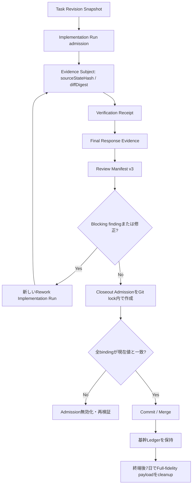

# Evidence・Review・Closeout整合性と記録保持 実装計画

## Status

- Plan status: `proposed`
- Document created: 2026-07-29
- Target repository: `/Users/y.noguchi/Code/nightWorkers`
- Baseline branch: `main`
- Baseline HEAD: `00e33d6d9768f10d14358fded45bd9a55999f7d6`
- Baseline worktree: dirty
- Primary scope:
  - Task revision、Coding Agent Run、Diff、Verification、Review、Rework、再Verification、Git closeoutの一貫したEvidence binding
  - final responseのEvidence化
  - closeout直前のserver-side admission
  - Coding Agent完全記録の既定7日保持
  - 設定画面からの保持期間変更
  - 期限切れ記録のpreview付き即時cleanup
  - SQLiteの肥大化抑制とdisk space回収
- Related documents:
  - `spec/trust-model.md`
  - `spec/configuration.md`
  - `spec/docs/coding-agent-balanced-execution-plan.md`
  - `spec/multi-language-test-evidence-quality-gate-implementation-plan.md`
  - `spec/docs/coding-agent-runtime-reliability-recovery-plan.md`
  - `spec/docs/mission-pilot-coding-agent-module-separation-plan.md`
  - `spec/docs/project-worktree-authority-and-secret-boundary-implementation-plan.md`

現在のworktreeには本計画と無関係な未コミット変更が存在する。本計画の実装ではそれらを
ユーザー所有の変更として扱い、復元、上書き、取り込み、再設計を行わない。migration番号と
schema bootstrap変更は、実装開始時点の最新状態から採番し直す。

## 1. 結論

NightWorkersの完了根拠を、Task IDや時刻だけで関連付けた可変recordの集合ではなく、
同一の`EvidenceSubjectSnapshot`へ結び付いた型付きEvidence Ledgerとして扱う。

正本となる関係は次のとおりとする。

```text
Task revision
  -> Coding Agent implementation Run
  -> workspace source state / Diff
  -> Verification
  -> final response
  -> Review
  -> 必要なら新しいRework Run
  -> 再Verification
  -> 再Review
  -> Closeout Admission
  -> Git commit / merge
```

Evidenceの正しさと保存期間は別の軸で管理する。

- 正しさ: `current | stale | foreign | failed | missing`
- 詳細の保持状態: `full | compacted | purging | purged`

完全な実行記録は既定7日保持する。ただしTask、Run、source、Verification、Review、
final response、closeout、Git結果を結ぶ小さな基幹Ledgerは自動削除しない。進行中、
Review待ち、再検証待ち、closeout待ちのEvidenceは7日を超えても保護する。

大容量本文を基幹recordと同じSQLite行へ持ち続けず、digest付きpayloadとしてruntime
artifact領域へ分離する。cleanupはpayloadだけを期限削除し、基幹Ledgerを残す。

## 2. 目的

変更後は次を満たす。

1. Taskのどのrevisionを実装したRunか一意に分かる。
2. Verification、Review、final response、closeoutが同一Run、同一workspace source state、
   同一verification documentに対するものか構造的に照合できる。
3. Diffが変わった時点で、それ以前のVerificationとReviewをstaleにする。
4. Review指摘によりsourceが変わった場合は、新しいRework Runとして保存し、
   再Verificationと再Reviewなしでcloseoutできない。
5. merge target、target HEAD、merge strategy、integration policyが変わったら
   merge previewとそのCI evidenceを無効化する。
6. 別RunのEvidenceを現在Runの完了根拠にできない。
7. final response本文を型付きEvidenceとして保存し、Reviewとcloseoutの対象へ含める。
8. Git closeoutは直前に作成したimmutableなCloseout Admissionだけを使用する。
9. Coding Agentが生成した完全記録を既定7日保持し、設定画面で1〜365日の範囲に変更できる。
10. 設定画面から、期限切れ対象をpreviewして直ちにcleanupできる。
11. cleanup後も過去のcloseout根拠、commit SHA、Review verdict、Verification結果要約を追跡できる。
12. SQLiteのDELETEだけで完了扱いにせず、WALとfree pageの回収結果も観測できる。

## 3. 非目的

本計画では次を行わない。

- Coding Agentへ意味別mode、固定workflow、tool allowlistを追加しない。
- Task本文、Todo名、command、error messageをkeywordや正規表現で分類して完了可否を決めない。
- HostがReview結果からTodoを暗黙更新しない。
- Review Agentへ実装workspaceの編集所有権を与えない。
- Mission PilotへCoding Agentのrepository編集・検証所有権を移さない。
- Evidenceの物理的deduplicateを、別Run Evidenceの論理的再利用として扱わない。
- 保持期間変更の保存操作だけで、確認なしに即時削除しない。
- 通常cleanupでTask、Task revision、Run、commit、merge、closeoutの親recordをcascade削除しない。
- `VACUUM`を毎回の定期cleanupで無条件実行しない。
- 自動cleanupに「保護中記録も強制削除する」overrideを追加しない。
- Taskの明示削除、Project削除、法的保持、export archiveの一般機能を本計画へ広げない。

## 4. 現行実装で維持する基盤

### 4.1 Workspace source state

Coding Agent verificationは`sourceStateHash`を生成し、inventory、test execution、
Full Verifyが同じsource stateかをQuality Gateで照合できる。このhash計算と
`WorkspaceSourceSnapshot`は再利用する。

### 4.2 Completion Readiness

`api/modules/codingAgent/application/completion-readiness.service.ts`はTask、Todo、workspace、
verification、final candidateの不足を一つのprojectionへ集約する。このprojectionを
Evidence freshnessのconsumerとし、別の意味判定を重複実装しない。

### 4.3 Review target manifest

Reviewはsource implementation Run、diff digest、final report digest、verification snapshotを
含むversion 2 manifestを持つ。これをversion 3へ拡張し、Task revision、
`EvidenceSubjectSnapshot`、final response Evidenceを追加する。

### 4.4 Git mutation lockとmerge CAS

repository単位のGit mutation lock、commit ownership record、merge record version、
source commit、target HEADの再確認は維持する。Closeout Admissionはこのlock内で
Git操作直前に作成・再確認する。

### 4.5 Runtime retention

`api/services/runtime-retention/runtime-retention.service.ts`には次が存在する。

- 多重sweepのcoalescing
- 1,000行単位のbatch delete
- runtime log sweep
- LLM usageの期限削除
- cleanup結果の監査record
- startup cleanupと定期cleanup

既存serviceはagent非依存schedulerとcleanup participantのcompositionへ限定し、
Coding Agent固有の削除可能性判定を直接持たせない。

### 4.6 Runtime artifact root

`getRuntimePaths().artifactsDir`が管理対象artifact rootとして存在する。大容量Evidence
payloadはこのroot配下へ置き、workspace、任意のtemporary directory、任意のabsolute pathを
payload storeとして扱わない。

## 5. 現行の不足

### 5.1 Task revisionが明示されていない

`tasks`には現在内容のrevision番号とappend-only snapshotがない。`updatedAt`だけでは、
Run開始時のTask本文、objective、acceptance criteriaを再現できない。

### 5.2 RunがTask revisionを固定していない

`task_runs`にはTodo plan revisionはあるが、実装対象にしたTask revision snapshotがない。
Task変更後も、既存RunのEvidenceが現在Taskのものに見える可能性がある。

### 5.3 Verification queryがRunを十分に限定しない

Quality Gateは現在source hashを確認するが、Evidence取得の起点がTaskとverification
documentであり、current implementation Runというauthorityが弱い。同じsource hashを持つ
別RunのEvidenceを誤採用できる余地がある。

### 5.4 ChecklistがEvidenceの正本と混在している

verification checklist rowがstatus、evidence ID、reasonを可変fieldとして持つ。checklistを
append-only Evidenceから再計算するprojectionではなく正本として読む経路が残ると、
古いEvidence IDや手動更新済みstatusを完了根拠にできる。

### 5.5 normal closeoutがReviewとVerificationをfail-closeしない

normal closeoutはReview、Verification、Securityの状態を表示するが、Git readinessと
`canCommit`が分離している。未完了Review、stale Verification、blocking findingがあっても
commit可能とする既存testがある。

### 5.6 final responseが型付きEvidenceではない

final report本文とcandidate revisionはRun、event、runtime laneごとに扱いが分散している。
Review manifest、Verification snapshot、source stateとの一意なbindingがない。

### 5.7 完全記録がSQLite行へinline保存される

次のような大容量fieldが基幹recordと同じSQLite行に存在する。

- `task_runs.context_snapshot`
- `task_runs.log_content`
- `task_runs.diff_patch`
- `task_runs.test_results`
- `native_api_turns.history_json`
- `native_api_turns.provider_debug_json`
- `native_api_tool_calls.arguments_json`
- `native_api_tool_calls.result_json`
- `native_api_tool_calls.model_visible_output`
- `activity_artifacts.content_text`
- `activity_events.payload_json`
- verification raw stdout / stderr artifact
- Review artifact JSON

親recordを期限削除するとFK cascadeで基幹Evidenceまで失い、inline fieldだけを残すと
SQLiteが増え続ける。

### 5.8 保持期間は設定可能なAPIになっていない

`DataRetentionSettings`は存在するが、route schemaは日数を7、3、30、90へ固定している。
設定画面にも保持期間、現在サイズ、cleanup preview、即時cleanupがない。

### 5.9 schedulerが設定変更を即時反映しない

retention timerのintervalはserver起動時に一度だけ読み込まれる。設定保存後に次回実行時刻を
再計算する仕組みがない。

### 5.10 DELETEだけではdatabase fileが縮まらない

現在のdatabase bootstrapはforeign key、busy timeout、WALを設定するが、
incremental auto vacuumを設定していない。DELETE後のfree pageとWALを観測・回収しないと、
logical sizeが減ってもfile sizeが維持される。

## 6. 用語

### 6.1 Task Revision

Taskのtitle、description、objective、acceptance criteria、確定済み仕様参照をimmutableに
snapshotしたもの。意味のあるTask変更のたびにrevisionを増やす。

### 6.2 Implementation Run

Coding Agentが登録済みrepositoryで調査、編集、command実行、検証、final response生成を行う
Run。Review修正は元Runを書き換えず、新しいimplementation Runとして保存する。

### 6.3 Evidence Subject

Evidenceが何に対する観測かを表すimmutable snapshot。Task revision、implementation Run、
workspace source state、verification documentを結び付ける。

### 6.4 Evidence Receipt

Verification、Review、final response、Security、closeoutの型付き基幹record。結果、digest、
subject ID、時刻を持つ。raw payloadが期限削除されても残る。

### 6.5 Full-fidelity Payload

LLM transcript、tool input/output、stdout/stderr、完全diff、個別test case、debug payload、
context snapshot等の大容量データ。既定7日保持の対象。

### 6.6 Closeout Admission

Git操作直前に現在のTask revision、source、Verification、Review、final response、
Security、finding、staged diffを再確認して作るimmutable snapshot。commit／mergeは
admission IDとrevisionを必要とする。

## 7. Target invariants

| 変更・状態 | 必須結果 |
| --- | --- |
| Task revisionが変わる | 以前のRun由来Evidenceは現在Taskの根拠として`stale` |
| implementation Runが違う | current closeoutでは`foreign`。同じsource hashでも利用禁止 |
| `sourceStateHash`またはdiff digestが変わる | Verification、Review、final response、closeout admissionを無効化 |
| verification document revision／digestが変わる | checklist、mapping、Verification receipt、completion checkを再計算 |
| Review指摘でsourceを修正する | 新しいRework implementation Runを作成し、再Verificationと再Reviewを要求 |
| final response candidateが変わる | 以前のReviewとcloseout admissionを無効化 |
| blocking findingが未解決 | `canCommit=false` |
| Security evidenceがrequiredかつ未完了／stale | `canCommit=false` |
| merge target branchが変わる | preview、decision、CI evidenceを無効化 |
| target HEADが変わる | previewを無効化し再作成を要求 |
| merge strategy／integration policy revisionが変わる | previewを無効化 |
| closeout admission後にhookがsourceを変える | admissionを無効化し、再Verificationと再Reviewを要求 |
| Full-fidelity payloadが期限削除される | Receiptとbindingは維持し、UIは`purged`を表示 |
| closeout待ちEvidenceが7日を超える | payloadを削除せず保護 |
| closeout前に必要payloadが既にpurged | fail-closeし、新しいRun／再検証を要求 |

Evidence freshnessは保存時のbooleanではなく、現在のauthorityとbindingからread時に導出する。
historical receiptのverdict、binding、digestはappend-onlyとし、staleになっても削除・上書き
しない。retention lifecycle metadataだけはpayload削除時に更新できる。

## 8. Target control flow



Hostはこの順序を新しいCoding Agent modeや固定tool workflowとして強制しない。各Evidenceを
保存するapplication commandのpreconditionと、finalize／closeoutの構造条件として強制する。

## 9. Ownershipとmodule境界

### 9.1 `api/modules/taskOperator`

- Task mutationのrevision CAS
- Task revision snapshotの作成
- Task revision digest
- user、Mission Pilot、その他callerを同じTask commandへ通す

### 9.2 `api/modules/agentsShare`

両roleで同じ意味を持つ次のcontractと純粋関数だけを置く。

- `EvidenceSubjectBinding`
- Evidence freshness enumと比較関数
- digest inputのcanonicalization
- typed evidence reference

route、repository、role判定、cleanup実行は置かない。

### 9.3 `api/modules/codingAgent`

- implementation Run admission時のTask revision binding
- workspace source snapshotからのEvidence Subject作成
- Verification receiptのcurrent Run binding
- final response Evidenceの作成
- completion readinessでのfreshness projection
- Coding Agent full-fidelity payloadの保持対象分類

### 9.4 `api/modules/review`

- Review Target Manifest version 3
- subject、Verification、final responseのbinding確認
- Review verdictとfinding receipt
- Reviewをread-onlyに保つ
- correctionを新しいimplementation Runへ依頼するcommand
- Review固有payloadの保持対象分類

### 9.5 `api/modules/missionPilot`

- handoffしたimplementation Runの構造的provenance
- current subjectに対するVerification／Review結果の評価
- rework Run作成と次actionの判断
- closeoutを直接実装せず、agent-independent closeout commandを利用

### 9.6 `api/modules/evidenceLedger`

Agent非依存の共有application boundaryとして追加する。

- Evidence Subject persistence
- Receipt header persistence
- payload metadataとpayload store port
- freshness query
- retention participant port

role固有の意味判定、route、Review workflow、Coding Agent toolは置かない。

### 9.7 `api/modules/gitCloseout`

Agent非依存のCloseout Admission application serviceを置く。

- admission snapshot作成
- Git mutation lock内の直前再確認
- admission consume／invalidate
- commit／merge commandへのexpected admission revision適用

既存NightWorkers routeはこのpublic commandを呼ぶcomposition adapterとする。新しい
Agent固有closeout logicを`api/modules/nightworkers`へ追加しない。

### 9.8 `api/services/runtime-retention`

- scheduler
- cleanup participantのcomposition
- cleanup lease
- preview／execute jobの共通制御
- runtime artifact rootの安全な削除
- WAL checkpoint／page reclaim
- audit

Coding Agent、Review、Mission Pilotのtableや状態をkeywordで分類しない。各moduleが返す
typed cleanup candidateを処理する。

### 9.9 Frontend

- Coding Agent Evidenceの表示modelとfreshness projection:
  `src/modules/codingAgent`
- Review固有表示:
  `src/modules/review`
- 保持期間、cleanup status、preview、実行:
  `src/modules/settings`
- NightWorkers timelineは公開された表示modelを利用するだけとする。

## 10. Canonical contracts

### 10.1 Task Revision Snapshot

```ts
type TaskRevisionSnapshot = {
  id: string;
  taskId: string;
  revision: number;
  digest: string;
  title: string;
  description: string | null;
  objective: string | null;
  acceptanceCriteria: string | null;
  specificationRefs: string[];
  createdBy: string | null;
  createdAt: string;
};
```

- `tasks.revision`とsnapshot作成を同一transactionで行う。
- digestはfield順を固定したcanonical JSONから生成する。
- `updatedAt`をrevisionの代用にしない。
- status、queue position、lease等、実装意味を変えない運用fieldはTask revision対象に含めない。
- どのfieldがrevision対象かをTask Operator contractで固定する。

### 10.2 Evidence Subject Snapshot

```ts
type EvidenceSubjectBinding = {
  id: string;
  version: 1;
  taskId: string;
  taskRevisionId: string;
  taskRevision: number;
  taskDigest: string;
  implementationRunId: string;
  workspaceId: string;
  workspaceAllocationVersion: number;
  baseHead: string;
  sourceStateHash: string;
  diffDigest: string;
  verificationDocumentId: string | null;
  verificationDocumentDigest: string | null;
  createdAt: string;
};
```

- 一つのimplementation Run内でsourceが変わるたびに新しいsubjectを作成できる。
- `implementationRunId + sourceStateHash + verificationDocumentDigest`を同一性の中心にする。
- 同じsource hashを別Runで観測しても、subject IDは共有しない。
- `baseHead`、workspace ID、allocation versionを含め、別workspaceの偶然一致を除外する。
- diffがない場合も空文字列のcanonical digestを保存し、`null`と混同しない。

### 10.3 Receipt header

Verification、Review、Security、final response、closeoutのtyped tableは共通headerを持つ。

```ts
type EvidenceReceiptHeader = {
  id: string;
  subjectId: string;
  kind:
    | "verification"
    | "final_response"
    | "review"
    | "security"
    | "closeout";
  schemaVersion: number;
  resultDigest: string;
  payloadId: string | null;
  payloadDigest: string | null;
  payloadByteLength: number | null;
  payloadPurgedAt: string | null;
  createdAt: string;
};
```

一つの巨大な汎用Evidence JSON tableは作らない。headerの意味を共有し、Verification、
Review、final response、Security、closeoutの結果fieldはそれぞれの型付きtableが所有する。
receiptのverdict、binding、digestはappend-onlyとし、`payloadPurgedAt`だけをretention
lifecycle metadataとして更新可能にする。

### 10.4 Freshness projection

```ts
type EvidenceFreshness =
  | { status: "current" }
  | { status: "stale"; reasons: string[] }
  | { status: "foreign"; reasons: string[] }
  | { status: "failed"; reasons: string[] }
  | { status: "missing"; reasons: string[] };
```

比較順序は次のとおりとする。

1. task ID
2. task revision ID／digest
3. implementation Run ID
4. workspace ID／allocation version
5. base HEAD
6. source state hash
7. diff digest
8. verification document ID／digest
9. receipt固有result

TaskまたはRunが違う場合は`foreign`、同じauthorityでsource等が古い場合は`stale`とする。
UI文言ではなくenumとreason codeで判断する。

### 10.5 Final Response Evidence

```ts
type FinalResponseEvidence = EvidenceReceiptHeader & {
  kind: "final_response";
  implementationRunId: string;
  candidateRevision: number;
  content: string;
  contentDigest: string;
  readinessSnapshotDigest: string;
  verificationReceiptIds: string[];
};
```

- final response本文は基幹Evidenceとして自動削除しない。
- 大容量attachment、tool result、生成途中candidateはpayloadとして7日保持する。
- Native API runtimeとCodex SDK runtimeは同じ`FinalizeCandidateCommand`を呼ぶ。
- candidate revisionが変わればReviewとCloseout Admissionを無効化する。
- schema parse failure時もprovider本文を保持する既存原則を維持する。

### 10.6 Review Target Manifest version 3

```ts
type ReviewTargetManifestV3 = {
  version: 3;
  digest: string;
  taskId: string;
  subjectId: string;
  taskRevisionId: string;
  implementationRunId: string;
  sourceStateHash: string;
  diffDigest: string;
  verificationReceiptIds: string[];
  verificationSnapshotDigest: string;
  finalResponseEvidenceId: string;
  finalResponseDigest: string;
  targetFiles: Array<{
    path: string;
    diffDigest: string;
    diffBytes: number;
  }>;
};
```

- Review開始時とReview完了時の両方でmanifestを再検証する。
- source Runの`diffPatch`や`finalReport`を時刻で推測しない。
- Review中にsourceまたはfinal responseが変わった場合はReview結果を保存しても`stale`とする。
- version 2 manifestはhistorical表示だけに使い、新しいcloseout authorityにしない。

### 10.7 Rework lineage

```ts
type ReworkRunProvenance = {
  sourceReviewReceiptId: string;
  sourceImplementationRunId: string;
  sourceSubjectId: string;
  blockingFindingIds: string[];
};
```

- Review runtimeはrepositoryを編集しない。
- 修正は新しいCoding Agent implementation Runへhandoffする。
- 新Runは元Review findingをcontextとして読めるが、元RunのVerificationを継承しない。
- 新sourceに対するVerification、final response、Reviewを新規作成する。
- finding dispositionは、修正Runと再Review receiptへ参照が付いた場合に解決可能とする。

### 10.8 Closeout Admission

```ts
type CloseoutAdmissionSnapshot = {
  id: string;
  revision: number;
  status: "current" | "invalidated" | "consumed";
  subjectId: string;
  taskRevisionId: string;
  implementationRunId: string;
  sourceStateHash: string;
  diffDigest: string;
  finalResponseEvidenceId: string;
  verificationReceiptIds: string[];
  reviewReceiptId: string;
  securityReceiptId: string | null;
  unresolvedBlockingFindingIds: string[];
  stagedDiffDigest: string;
  repositoryHead: string;
  mergePreviewBindingDigest: string | null;
  createdAt: string;
  consumedAt: string | null;
  invalidatedAt: string | null;
  invalidationReason: string | null;
};
```

`canCommit`は次の論理積とする。

```text
gitReady
AND taskRevisionCurrent
AND subjectCurrent
AND verificationCurrentAndPassed
AND finalResponseCurrent
AND reviewCurrentAndApproved
AND noUnresolvedBlockingFinding
AND securityCurrentOrExplicitlyNotRequired
AND stagedDiffMatchesReviewedDiff
AND mergePreviewCurrentWhenRequired
```

Git commit／merge commandは`admissionId`と`expectedAdmissionRevision`を受け取る。
admissionをGit mutation lock外で再利用しない。

### 10.9 Merge Preview Binding

```ts
type MergePreviewBinding = {
  sourceCommitSha: string;
  targetBranch: string;
  targetHeadSha: string;
  strategy: string;
  integrationPolicyRevision: number;
  ciEvidenceDigest: string | null;
};
```

いずれかが変わった場合は、同一transactionでpreview、decision、CI evidenceをclearし、
record versionを増やす。

## 11. Retention policy

### 11.1 設定

既存`GeneralSettings.dataRetention`へ次を追加する。

```ts
type DataRetentionSettings = RuntimeLogRetentionConfig & {
  codingAgentFullRecordDays: number;
  usageDataDays: number;
  auditEventDays: number;
  sweepIntervalMinutes: number;
};
```

規則:

- `codingAgentFullRecordDays`の既定値は`7`。
- 設定可能範囲は1〜365日。
- `0`、負数、非整数、上限超過はschema validationで拒否する。
- 設定欠落時は7日へnormalizeする。
- 設定保存はcleanupを実行しない。
- 短縮後は次回scheduled sweepまたは明示cleanupで新しいcutoffを使用する。
- 延長しても既にpurgedのpayloadは復元しない。
- run-linked provider transcriptを含む完全記録はこの単一設定に従う。
- 全体API logやusage集計等、同じ情報の正本ではない運用データは既存の個別設定を維持する。

### 11.2 恒久保持する基幹record

次は自動retentionの削除対象にしない。

- repositoryとTaskのidentity
- Task revision snapshot
- implementation Run identity、status、開始・終了時刻、provenance
- Evidence Subject Snapshot
- Verification receiptのcheck kind、command digest、runner、exit code、pass/fail要約
- Review verdict、finding severity、disposition、manifest digest
- final response本文、candidate revision、content digest
- Security verdictの要約
- Closeout Admission
- commit SHA、merge SHA、source／target branch、target HEAD
- core receipt payloadのdigest、byte length、purged timestamp
- Run単位の削除済みdetail件数、byte数、manifest digest
- cleanupの最新集計状態

TaskまたはProjectをユーザーが明示削除する既存操作は別であり、自動retentionとは区別する。

### 11.3 既定7日保持する完全記録

次は`codingAgentFullRecordDays`の対象とする。

- provider request／response transcript
- Native turn historyとprovider debug
- tool arguments、tool result、model-visible output
- action／activity eventの大容量payload
- command raw stdout／stderr
- Run log
- 完全diff patchと中間diff
- test inventoryのcase明細
- test executionのcase明細とfailure detail
- Verification parsed report
- Review artifactのraw JSON
- Security toolのraw result
- context snapshotとcompaction前history
- final responseの生成途中candidate
- run-linkedの中間assistant／system／tool message本文とmetadata
- run-linked attachmentと生成artifact

### 11.4 retention anchor

`expiresAt`は保存時に固定せず、policyとRun状態からeligibility queryで計算する。

| Run／Task状態 | retention anchor |
| --- | --- |
| `failed`、`timed_out`、`cancelled` | `run.finishedAt` |
| superseded historical Run | `run.finishedAt` |
| closeout済み | `closeoutAdmission.consumedAt` |
| merge済み | `mergedAt` |
| completedだがReview／closeout待ち | 保護。期限なし |
| `running`、`verifying`、`needs_review` | 保護。期限なし |
| `blocked`、`needs_human` | 保護。明示cancel／再開まで期限なし |

stuck `running`をretentionが独自にterminalへ変更しない。既存のRun recovery／timeout処理で
terminalが確定してからretention対象にする。

### 11.5 payload availabilityとcloseout

- closeout前に必要なcurrent payloadは保護する。
- closeout完了後はCloseout AdmissionとReceiptが歴史上の完了根拠になる。
- payloadがpurged済みの未closeout Runは後からcommit可能にしない。
- purged Runを再開する場合は新しいimplementation Runを作成し、再Verificationと再Reviewを行う。
- payloadの物理的有無からEvidence freshnessを推測しない。

## 12. Payload storage

### 12.1 保存構造

SQLiteにはpayload metadataだけを保存し、大容量本文は
`${NIGHTWORKERS_RUNTIME_DIR}/artifacts/evidence/`配下のcontent-addressed storeへ保存する。

```ts
type EvidencePayload = {
  id: string;
  ownerKind:
    | "coding_agent"
    | "verification"
    | "review"
    | "security";
  ownerId: string;
  subjectId: string | null;
  kind: string;
  contentDigest: string;
  relativePath: string;
  mediaType: string;
  compression: "gzip" | "none";
  byteLength: number;
  storedByteLength: number;
  state: "full" | "compacted" | "purging" | "purged";
  createdAt: string;
  purgedAt: string | null;
};
```

規則:

- DBへabsolute pathをauthorityとして保存しない。
- `relativePath`をruntime artifact rootへ解決し、realpathとsymlink escapeを検証する。
- 書き込みはtemporary file、fsync、atomic renameの順に行う。
- digestと実byte数を保存後に再検証する。
- 読み出し時もdigest mismatchをtyped failureにする。
- 同じdigestの物理fileをdeduplicateしてよいが、owner rowとsubject bindingは共有しない。
- physical objectはactive ownerが一件もなくなった場合だけ削除する。
- payload本文をapplication logへ出さない。
- core receiptに属するpayloadを削除した場合は、receiptの`payloadDigest`、
  `payloadByteLength`、`payloadPurgedAt`を残し、payload metadata rowは削除可能とする。
- tool call、turn、activity event等のdetail-only payloadは、削除後にpayload metadata rowと
  detail rowを残し続けない。削除件数、byte数、manifest digestをRun単位へ集約する。

### 12.2 cleanup state machine

filesystemとSQLiteを一つのtransactionにできないため、idempotentな二段階削除を行う。

```text
full
  -> purging   DB transactionで削除対象をclaim
  -> file delete
  -> purged    core receiptまたはRun集計へdigest、byte length、purgedAtを反映
  -> compacted payload metadataとdetail-only rowを削除
```

- crash後に`purging`が残った場合はstartup sweepが再開する。
- fileが既にない場合もdigestとclaimが一致すればidempotent successとする。
- DB更新前にfileだけを削除しない。
- `purging`中のpayloadはcloseout authorityにしない。
- `purged`はcleanup job内の中間状態として利用できるが、detail-only payload一件ごとの
  tombstoneを永久保持しない。

### 12.3 backup

- SQLite backupには基幹Ledgerとpayload metadataを含める。
- 完全なruntime backupを作る場合はpayload directoryとmanifestを同じsnapshotへ含める。
- SQLiteだけをrestoreしてpayload fileがない場合、availabilityを`purged`または`missing`として
  表示し、Evidence freshnessを勝手に`current`へ補正しない。

## 13. Cleanup application

### 13.1 Cleanup Preview

```http
POST /api/settings/data-retention/cleanup/preview
```

response:

```ts
type RetentionCleanupPreview = {
  previewId: string;
  settingsRevision: number;
  policyDigest: string;
  cutoffAt: string;
  expiresAt: string;
  databaseBytesBefore: number;
  walBytesBefore: number;
  deletable: {
    payloads: number;
    detailRows: number;
    estimatedPayloadBytes: number;
    estimatedDatabaseBytes: number;
  };
  protected: {
    activeRuns: number;
    reviewPendingRuns: number;
    closeoutPendingRuns: number;
    needsHumanRuns: number;
  };
  categories: Array<{
    kind: string;
    records: number;
    estimatedBytes: number;
  }>;
};
```

- previewはread-only。
- raw本文、path、command、secretをresponseへ含めない。
- preview有効期間は15分。
- preview作成後にsettings revisionまたはcandidate setが変わればexecuteを拒否する。

### 13.2 Immediate Cleanup

```http
POST /api/settings/data-retention/cleanup
```

request:

```ts
type ExecuteRetentionCleanup = {
  previewId: string;
  expectedSettingsRevision: number;
  idempotencyKey: string;
  reclaimDiskSpace: "incremental" | "skip";
};
```

実行条件:

1. server-side operator authorityを確認する。
2. idempotency receiptを確認する。
3. cleanup leaseを取得する。
4. preview ID、期限、settings revision、policy digestを確認する。
5. candidateを再計算し、preview範囲を超える削除をしない。
6. candidateごとにRun、Review、closeout、Git mutation状態を再確認する。
7. 1,000件以下のbatchで`purging`へclaimする。
8. artifact fileを安全なruntime root内で削除する。
9. metadataを`purged`へ更新し、不要なdetail child rowを削除する。
10. `PRAGMA foreign_key_check`相当の整合検査を実行する。
11. WAL checkpointと要求されたpage reclaimを実行する。
12. 削除件数、byte数、保護件数、失敗を監査recordへ保存する。
13. downstream mutationとdisk reclaimの結果を確認後にだけjobを`completed`にする。

cleanup中に一部file削除が失敗した場合はjobを`partial`または`failed`にし、
未完了payloadを`purging`のまま再開可能にする。削除済みpayloadをrollbackで復元できるとは
表現しない。

### 13.3 Scheduled cleanup

- schedulerは固定`setInterval`ではなく、現在settingsから`nextRunAt`を再計算する。
- settings保存後にschedulerへreloadを通知する。
- server起動時は未完了`purging` jobを先にreconcileする。
- scheduled cleanupもImmediate Cleanupと同じapplication serviceを使う。
- scheduled cleanupは内部previewを作成し、監査可能なpolicy snapshotを残す。
- active sweepがある場合は同じPromiseへcoalesceする。

### 13.4 Cleanup audit

既存`runtime_retention_audit_events`を拡張するか、互換projectionを持つ
`retention_cleanup_jobs`を追加する。

保存項目:

- trigger: `startup | scheduled | manual`
- status: `previewed | running | completed | partial | failed`
- settings revisionとpolicy digest
- startedAt／finishedAt
- rows／payloads／bytes deleted
- protected counts
- DB／WAL bytes before／after
- checkpoint／vacuum result
- error codeとredacted summary
- idempotency key digest

cleanup job明細は`auditEventDays`で削除可能とし、最新cleanup日時と累積counterは
single-rowの`retention_state`へ保持する。監査eventを永久に追加し続けない。

## 14. SQLite space reclamation

### 14.1 通常sweep

- batch DELETE後にWAL checkpointを行う。
- `page_count`、`freelist_count`、DB file size、WAL file sizeを前後で記録する。
- 毎回full `VACUUM`を行わない。

### 14.2 Incremental vacuum

- 起動時に`auto_vacuum` capabilityを確認する。
- 新規DBは`INCREMENTAL`を有効にした状態で作成する。
- 既存DBの切替はmaintenance migrationとして扱い、backup作成と空き容量確認後に一度だけ
  必要なrebuildを行う。
- libSQL／SQLite runtimeが安全に対応できない場合はcleanup自体を失敗させず、
  `reclaimUnsupported`をstatusへ返す。

### 14.3 Full optimization

full `VACUUM`が必要な場合は「ストレージを最適化」という別の明示操作にする。

- active Run、queue worker、Git mutation、cleanup jobがない時だけ実行する。
- 必要なtemporary disk capacityを事前確認する。
- server-side lockを取得する。
- timeoutとprogressを表示する。
- immediate cleanupの既定処理には含めない。

## 15. Database schema plan

### 15.1 新規table

| table | 所有 | 目的 |
| --- | --- | --- |
| `task_revision_snapshots` | Task Operator | immutable Task revision |
| `evidence_subject_snapshots` | Evidence Ledger | Task、Run、workspace、source、verificationのbinding |
| `final_response_evidence` | Coding Agent | final response本文とcandidate revision |
| `closeout_admissions` | Git Closeout | immutable admissionとconsume／invalidate |
| `evidence_payloads` | Evidence Ledger | runtime artifact payload metadata |
| `retention_cleanup_jobs` | Runtime Retention | preview、execute、idempotency、監査 |
| `retention_state` | Runtime Retention | last run、next run、累積counter |

### 15.2 既存table拡張

| table | 追加・変更 |
| --- | --- |
| `tasks` | `revision`、`current_revision_snapshot_id` |
| `task_runs` | `task_revision_snapshot_id`、`task_digest`、`admission_subject_id`、`details_purged_at`、削除済み件数／byte数／manifest digest |
| `verification_evidence_runs` | `subject_id`、typed receipt header、payload refs |
| `verification_evidence_cases` | payloadまたは期限削除可能detailとして分類 |
| `verification_checklist_items` | statusをread model扱いにし、binding revisionを保存 |
| `review_sessions` | `target_subject_id`、`target_manifest_digest`、receipt ID |
| `review_artifacts` | raw JSONをpayloadへ分離 |
| `review_findings` | subject／review receipt、resolution receipt refs |
| `task_run_commit_records` | `closeout_admission_id`、admission revision |
| `task_run_merge_records` | merge preview binding digest、closeout admission ID |
| `native_api_turns` | large JSONをpayloadへ分離し、digest／availabilityを保持 |
| `native_api_tool_calls` | arguments／result／model outputをpayloadへ分離 |
| `activity_artifacts` | contentをpayloadへ分離 |
| `activity_events` | 大容量payloadをpayload refへ分離 |

### 15.3 FK方針

- core receiptからpayloadへのFKは`ON DELETE SET NULL`または明示state transitionとする。
- payloadからsubject、ownerへの参照は、core parent削除を引き起こさない方向にする。
- automatic cleanupで`task_runs`をDELETEしない。
- Review receipt、Verification receipt、Closeout AdmissionからsubjectへのFKは
  `ON DELETE RESTRICT`相当とする。
- Taskの明示削除だけが、既存の所有範囲に従いcoreをcascade削除できる。

### 15.4 Index

最低限次を追加する。

- task revision: `(task_id, revision)` unique
- subject: `(implementation_run_id, created_at)`
- subject current lookup:
  `(task_id, task_revision_id, implementation_run_id, source_state_hash)`
- receipt: `(subject_id, created_at)`
- payload cleanup: `(state, created_at)`
- payload owner: `(owner_kind, owner_id)`
- payload digest: `(content_digest)`
- closeout admission: `(implementation_run_id, status, revision)`
- cleanup job: `(status, created_at)`

retention queryは既存の時刻indexだけでなく、terminal stateとowner lookupを使う。

## 16. Migration and cutover

### 16.1 Migration原則

- migration前にruntime database backupを作成する。
- schema bootstrapとDrizzle migrationを同じ契約へ保つ。
- migration番号は実装時のjournalから採番する。
- inline payloadを移す前にdigestとbyte lengthを計算する。
- copy、digest検証、owner ref更新が完了するまで元columnをclearしない。
- filesystem write失敗時は元SQLite本文を残す。
- migrationは再実行可能なidempotency markerを持つ。

### 16.2 Legacy Evidence

既存Evidenceは次に分類する。

- 十分なRun、source hash、verification document bindingがある:
  `binding_version=1`へbackfill
- RunはあるがTask revision snapshotがない:
  migration時点のTaskを`legacy_snapshot`として結ぶ
- sourceまたはRunが一意に確定できない:
  `legacy_unbound`

`legacy_unbound`はhistorical UIで表示できるが、新しいcloseout authorityにしない。
既存のtimestamp proximityだけでcurrent Evidenceへ昇格しない。

### 16.3 Inline payload migration

対象columnを段階的に移す。

1. 新規writeをpayload storeへdual-writeする。
2. payload readをpayload優先、legacy inline fallbackにする。
3. backfill workerでlegacy inline dataをpayload化する。
4. digest、byte length、read parityを検証する。
5. new writeからinline writeを停止する。
6. shadow cleanupで削除候補だけを計測する。
7. production cleanupを有効化する。
8. 十分な互換期間後にlegacy fallbackを削除する。

### 16.4 初回cleanupの安全策

feature rollout直後に古い記録を無告知で削除しない。

- 最初のreleaseはshadow previewのみとする。
- 設定画面へ対象件数、推定byte、導入予定日を表示する。
- production deletionを有効化するreleaseで、既定7日を適用する。
- manual immediate cleanupはproduction deletion有効化後だけ提供する。
- cleanup実行前のpreviewは常に必要とする。

### 16.5 Compatibility

- Review manifest version 2 readerはhistorical表示用に維持する。
- version 2からversion 3を推測生成してcloseoutしない。
- old checklist statusはread modelとして表示できるが、新しいadmissionではreceiptから再計算する。
- Native APIとCodex SDKの一方だけを先行してfinal response Evidence化しない。

## 17. API plan

### 17.1 Settings

```http
GET  /api/settings/general
POST /api/settings/general
```

- `codingAgentFullRecordDays`をresponse／request schemaへ追加する。
- optional legacy inputはnormalizeして7日を補う。
- POST成功後にRetention Schedulerへsettings revision reload eventを渡す。
- settings保存とcleanup実行を同一requestにしない。

### 17.2 Retention status

```http
GET /api/settings/data-retention/status
```

response:

- effective policy
- settings revision
- DB／WAL／payload directory size
- last cleanup result
- next scheduled cleanup
- full／purging／purged payload counts
- protected Run counts
- incremental reclaim capability

### 17.3 Cleanup preview／execute

```http
POST /api/settings/data-retention/cleanup/preview
POST /api/settings/data-retention/cleanup
GET  /api/settings/data-retention/cleanup/:jobId
```

- OpenAPI schemaを定義する。
- executeはidempotency key、settings revision、preview IDを必須にする。
- long-running reclaimはjob status pollingとする。
- error responseはraw pathやpayload本文を含めない。

### 17.4 Evidence query

既存Run、Verification、Review、closeout responseへ次を追加する。

```ts
{
  subjectId: string | null;
  freshness: EvidenceFreshness;
  payloadAvailability: "full" | "compacted" | "purging" | "purged";
  retention: {
    protected: boolean;
    reason: string | null;
    eligibleAt: string | null;
  };
}
```

Frontendがevent順序やtimestampからstaleを推測しないよう、server projectionを正本にする。

## 18. UI plan

### 18.1 Settings「データ管理」

設定画面へ独立した「データ管理」sectionを追加する。

表示:

- Coding Agent完全記録の保持期間
- 既定値7日
- 「基幹Evidence、final response、Git結果は自動削除されません」の説明
- database size
- WAL size
- Evidence payload size
- 最終cleanup時刻と結果
- 次回cleanup予定
- 保護中record数
- 期限切れ候補数と推定削減量

操作:

- 保持期間の保存
- 「削除対象を確認」
- 「期限切れデータを今すぐ削除」
- cleanup jobのprogress／retry
- capabilityがある場合の「ストレージを最適化」

### 18.2 Cleanup confirmation

確認dialogには次を表示する。

- cutoff
- 種別ごとの件数と推定byte
- 保護されるRun件数
- 基幹Ledgerが残ること
- 削除した完全記録は復元できないこと
- 設定変更だけでは削除されないこと
- 実行ボタン

自由入力の確認文字列は不要とし、preview revisionによるserver-side確認を正本にする。

### 18.3 Evidence表示

Run timeline、Verification、Review、Git closeoutに共通badgeを表示する。

- `Current`
- `Stale`
- `Different run`
- `Failed`
- `Missing`
- `Details retained until YYYY-MM-DD`
- `Details protected`
- `Details deleted; receipt retained`

`purged`を`missing Evidence`と同じ表示にしない。closeout済みhistorical receiptは、
詳細削除後も「closeout時点ではcurrentだった」ことをCloseout Admissionから表示する。

### 18.4 Closeout

- Git readinessだけでcommit buttonを有効化しない。
- Verification、Review、final response、finding、Security、staged diffの各条件を表示する。
- `canCommit=false`のreason codeを個別に表示する。
- stale原因がsource変更なら「再検証」、Review修正後なら「再Review」を案内する。
- UI button状態はserverのCloseout Admission projectionへ従う。

## 19. Implementation phases

### Phase 0: Baselineと誤closeout回帰test

#### 実装

1. 現在のTask revision、Run、Verification、Review、closeout queryをfixture化する。
2. 別Runの同一source hash Evidenceが採用されるscenarioを追加する。
3. Verification後にdiffが変わるscenarioを追加する。
4. Review後にsourceが変わるscenarioを追加する。
5. final response変更後に旧Reviewが残るscenarioを追加する。
6. target branch／target HEAD変更後に旧previewが残るscenarioを追加する。
7. Review running／failed、stale Verification、blocking findingでも
   `canCommit=true`になる既存expectationを失敗fixtureとして固定する。
8. SQLite table別row count、page count、freelist、file sizeのbaseline helperを追加する。

#### 主な対象

- `tests/nightworkers-git-closeout.test.ts`
- `tests/coding-agent-completion-readiness.test.ts`
- `tests/coding-agent-evidence-check-query.test.ts`
- `tests/services.review-files.test.ts`
- `tests/mission-pilot-closeout.test.ts`
- `tests/runtime-retention.service.test.ts`

#### 受け入れ条件

- production変更前に各不整合を単一原因で再現できる。
- closeout failureがGit failureではなくEvidence mismatchであることを確認できる。
- baseline storage計測がisolated Vitest DBだけを対象にする。

### Phase 1: Task revisionとEvidence Subject

#### 実装

1. `tasks.revision`と`task_revision_snapshots`を追加する。
2. Task Operator mutationをrevision CASとsnapshot作成へ統一する。
3. Run開始時にTask revision snapshot IDとdigestを保存する。
4. `EvidenceSubjectBinding` contractとcanonical digest utilityを`agentsShare`へ追加する。
5. `evidence_subject_snapshots` repositoryをagent-independent moduleへ追加する。
6. source snapshot確定時にcurrent subjectを作成する。
7. Verification evidence queryを`subjectId`とcurrent implementation Runへ限定する。
8. checklistをEvidenceから再計算するprojectionへ変更する。

#### 主な対象

- `api/db/schema-base.ts`
- `api/db/schema-task-execution.ts`
- `api/db/verification-schema.ts`
- `api/db/*schema-bootstrap.ts`
- `api/modules/taskOperator`
- `api/modules/agentsShare`
- `api/modules/evidenceLedger`
- `api/modules/codingAgent/application`
- `api/modules/codingAgent/verification`

#### 受け入れ条件

- Task変更後に旧Run Evidenceが`stale`になる。
- 同じsource hashでも別Run Evidenceは`foreign`になる。
- checklist rowを直接更新しても、receiptがなければcompletion checkを通らない。
- read-only freshness queryはTask、Todo、checklist statusを変更しない。

### Phase 2: Final Response EvidenceとReview Manifest v3

#### 実装

1. `final_response_evidence`を追加する。
2. Native APIとCodex SDKのcandidate確定を同じapplication commandへ接続する。
3. candidate revision、content digest、readiness digest、subject IDを保存する。
4. Review Target Manifest version 3を追加する。
5. Review開始／完了時にsubject、Verification receipt、final responseを再確認する。
6. Review correctionを新しいimplementation Runのprovenanceへ結ぶ。
7. source修正後に元Reviewをcurrent扱いしない。

#### 主な対象

- `api/modules/codingAgent/application`
- `api/modules/codingAgent/runtime/CodexAgentRuntime.ts`
- `api/modules/codingAgent/runtime/native-api-runner`
- `api/modules/review/review-target-manifest.ts`
- `api/modules/review/review-run.service.ts`
- `api/modules/review/review-files.service.ts`
- Review persistence schema

#### 受け入れ条件

- 両runtime laneが同じfinal response Evidence contractを使う。
- final response変更後に旧Reviewが`stale`になる。
- Reviewがsourceを直接変更しない。
- rework後は新Verificationと新Reviewなしでcloseoutできない。

### Phase 3: Closeout Admission

#### 実装

1. `api/modules/gitCloseout`と`closeout_admissions`を追加する。
2. normal closeoutとMission Pilot closeoutを同じadmission evaluatorへ接続する。
3. Git mutation lock内でTask revision、subject、Verification、Review、Security、
   finding、final response、staged diffを再取得する。
4. `canCommit`を全required conditionの論理積へ変更する。
5. commit／merge commandへadmission IDとexpected revisionを要求する。
6. hook mutation後にsourceとstaged diffを再計算する。
7. mutationがあればadmissionをinvalidateし、再Verificationへ戻す。
8. merge preview bindingをtarget branch、target HEAD、strategy、policy revision、
   CI digestへ拡張する。

#### 主な対象

- `api/modules/gitCloseout`
- `api/modules/nightworkers/nightworkers.git-closeout.service.ts`
- `api/modules/nightworkers/nightworkers.git-merge.service.ts`
- `api/modules/missionPilot/mission-pilot-closeout.service.ts`
- `api/modules/review/review-closeout-evidence.service.ts`
- `tests/nightworkers-git-closeout.test.ts`

#### 受け入れ条件

- Review running／failedで`canCommit=false`。
- stale Verificationで`canCommit=false`。
- unresolved blocking findingで`canCommit=false`。
- Git lock取得後にsourceが変わればcommitしない。
- merge target／HEAD変更後に旧previewを実行できない。
- normal pathとMission Pilot pathが同じ不変条件を満たす。

### Phase 4: Full-fidelity payload分離

#### 実装

1. `evidence_payloads` schemaとfilesystem payload storeを追加する。
2. runtime artifact root検証、atomic write、digest検証を実装する。
3. Run log、diff、turn history、tool payload、activity payloadを順次分離する。
4. Verification raw output、case detail、Review artifact raw JSONを分離する。
5. core receiptにpayload digest、byte length、availabilityを残す。
6. legacy inline fallbackを持つreaderを追加する。
7. idempotent backfill workerとparity checkを追加する。
8. backup manifestへpayload directoryを追加する。

#### 主な対象

- `api/modules/evidenceLedger`
- `api/modules/codingAgent`
- `api/modules/review`
- `api/services/runtime-retention`
- `api/runtime/paths.ts`
- DB schema／bootstrap／migration
- runtime backup

#### 受け入れ条件

- 新規大容量payloadがSQLite inline列へ重複保存されない。
- payload fileのdigest mismatchを検出できる。
- payload write失敗時にcore receiptだけを成功扱いにしない。
- legacy dataを失わずに新readerへ移行できる。
- arbitrary pathやsymlink escapeを削除対象にできない。

### Phase 5: Retention settingsとcleanup backend

#### 実装

1. `codingAgentFullRecordDays=7`をbackend／frontend defaultへ追加する。
2. route schemaを1〜365日の可変値へ変更する。
3. settings revisionとscheduler reloadを接続する。
4. retention participant contractを追加する。
5. eligibility queryと保護条件を実装する。
6. cleanup preview／execute／status APIを追加する。
7. cleanup job、idempotency、lease、crash recoveryを実装する。
8. `purging -> purged` state machineを実装する。
9. DB／WAL／payload bytesと削除結果を監査する。
10. foreign key check、checkpoint、incremental reclaim capabilityを接続する。

#### 主な対象

- `api/services/settings/general-settings.ts`
- `api/routes/settings-route-definitions.ts`
- `api/routes/settings.ts`
- `api/services/runtime-retention`
- `api/modules/codingAgent/retention`
- `api/modules/review/retention`
- `api/modules/evidenceLedger`
- `api/server.ts`

#### 受け入れ条件

- defaultが7日。
- 設定保存だけでは削除されない。
- 保持期間変更後にschedulerがserver再起動なしで更新される。
- active／Review待ち／closeout待ち／needs_human Runは削除されない。
- expired terminal Runのpayloadだけが削除される。
- manual executeはpreview、revision、idempotency keyなしでは動かない。
- cleanup後もCloseout AdmissionとReceipt queryが成立する。

### Phase 6: Settings UIとEvidence表示

#### 実装

1. 設定画面へ「データ管理」sectionを追加する。
2. 保持期間field、説明、size、last／next cleanupを表示する。
3. cleanup preview dialogを追加する。
4. immediate cleanup job progressと結果を表示する。
5. Evidence freshnessとpayload availability badgeを追加する。
6. closeout buttonをserver admissionへ接続する。
7. purged historical recordとmissing current Evidenceを区別する。

#### 主な対象

- `src/modules/settings`
- `src/modules/codingAgent`
- `src/modules/review`
- NightWorkers timeline consumer
- i18n resource
- frontend tests

#### 受け入れ条件

- 7日が初期表示され、1〜365日を保存できる。
- cleanup前に対象件数と推定byteが表示される。
- 保護中recordを削除対象として表示しない。
- cleanup完了後にsizeとavailabilityが再取得される。
- keyboard操作、focus、screen reader labelを含む。

### Phase 7: Shadow rollout、production cleanup、legacy撤去

#### 実装

1. production相当databaseでshadow previewを実行する。
2. query latency、candidate件数、protected件数、推定削減量を記録する。
3. auto deleteを無効のまま1 release観測する。
4. cleanup production flagを有効化する。
5. scheduled cleanupとmanual cleanupのcanaryを実行する。
6. payload read parityが安定した後にlegacy inline writeを停止する。
7. 十分な互換期間後にlegacy fallbackとunused columnを別migrationで削除する。

#### 受け入れ条件

- shadow previewと実削除のcandidate差分が説明できる。
- closeout中または未完了Evidenceの削除が0件。
- cleanup partial failureから再実行して収束する。
- DB／WAL／payload disk usageが期待どおり減る。
- legacy reader撤去前にfallback hitが0である。

## 20. Test plan

### 20.1 Unit

- canonical Task revision digestがfield順に依存しない。
- Evidence SubjectのRun、source、document比較。
- `current / stale / foreign / failed / missing`の各分岐。
- retention anchorとterminal／protected state。
- payload relative pathとsymlink escape拒否。
- preview policy digest。
- merge preview binding digest。
- final response candidate revision比較。

### 20.2 Repository／schema

- Task revision snapshotがappend-only。
- current Task revisionとのCAS。
- subjectからtyped receiptを追跡できる。
- payload DELETEがcore receiptをcascade削除しない。
- `task_runs`をautomatic cleanupが削除しない。
- indexesがeligibility queryへ使われる。
- migration再実行が重複rowを作らない。
- `PRAGMA foreign_key_check`が空。

### 20.3 Verification／Review／Closeout matrix

| Scenario | Expected |
| --- | --- |
| 同じRun、同じsource、passed Verification | current |
| 別Run、同じsource hash | foreign |
| 同じRunでdiff変更 | old Verification stale |
| Verification後にverification document変更 | old Verification stale |
| final response変更 | old Review stale |
| Review修正で新Run作成 | 元Run Evidenceを新Runへ継承しない |
| rework後にVerification未実行 | canCommit false |
| rework後にReview未実行 | canCommit false |
| blocking finding未解決 | canCommit false |
| Review running／failed | canCommit false |
| Security requiredでstale | canCommit false |
| hookがstaged diff変更 | admission invalidated |
| target branch変更 | preview invalidated |
| target HEAD変更 | preview invalidated |
| closeout済みpayload purged | historical closeout query成功 |
| closeout前payload purged | fail-close、再Run要求 |

### 20.4 Retention matrix

| Scenario | Expected |
| --- | --- |
| terminalから6日23時間 | full |
| terminalから7日超 | cleanup candidate |
| 30日前のrunning Run | protected |
| 30日前のneeds_human Run | protected |
| closeout待ちcompleted Run | protected |
| failed Runから8日 | candidate |
| closeout済みから8日 | payload purged、receipt retained |
| retentionを7日から30日へ変更 | 未削除payloadのeligible date延長 |
| retentionを30日から7日へ変更 | 保存だけでは削除しない |
| preview後にsettings変更 | execute 409 |
| 同じidempotency keyで再実行 | 同一結果 |
| cleanup中にprocess crash | startupでpurgingを再開 |
| shared physical digestにactive ownerあり | fileを削除しない |
| fileが既にないpurging row | idempotentにpurgedへ収束 |

### 20.5 Frontend

- default 7日。
- invalid retention dayを保存できない。
- previewなしでは実行buttonを出さない。
- confirmationに非復元性と基幹保持を表示する。
- protected countを表示する。
- progress、partial、failed、completedを表示する。
- purgedとmissingを区別する。
- stale reasonを表示する。
- closeout buttonがadmissionに従う。

### 20.6 E2E

1. Task作成。
2. implementation Run実行。
3. Verification保存。
4. final response保存。
5. Review完了。
6. source変更によりEvidenceがstaleになることを確認。
7. rework Run、再Verification、再Review。
8. Closeout Admissionとcommit。
9. clockを7日超へ進める。
10. Settingsからpreview。
11. immediate cleanup。
12. 完全記録がpurgedになり、final response、Review verdict、Verification summary、
    commit SHAが残ることを確認。

別scenarioで、Review待ちRunが7日超でもcleanupされないことを確認する。

## 21. Verification commands

各Phaseでtargeted testを実行し、最終的に次を実行する。

```bash
bun run test -- tests/coding-agent-completion-readiness.test.ts
bun run test -- tests/coding-agent-evidence-check-query.test.ts
bun run test -- tests/nightworkers-git-closeout.test.ts
bun run test -- tests/mission-pilot-closeout.test.ts
bun run test -- tests/runtime-retention.service.test.ts
bun run test -- tests/routes.settings-general.test.ts
bun run test -- tests/settings-panels-render.test.tsx
bun run typecheck
bun run check:architecture
bun run check:docs
bun run verify
```

追加予定test:

```text
tests/task-revision-snapshot.test.ts
tests/evidence-subject-binding.test.ts
tests/final-response-evidence.test.ts
tests/review-target-manifest-v3.test.ts
tests/closeout-admission.test.ts
tests/evidence-payload-store.test.ts
tests/evidence-retention.service.test.ts
tests/routes.data-retention.test.ts
tests/settings-data-retention-panel.test.tsx
tests/e2e/evidence-retention.spec.ts
```

SQLite file sizeのassertionはfilesystemとSQLite runtimeの差で不安定になり得るため、
通常testではrow count、payload byte count、`freelist_count`、checkpoint resultを正本にする。
file size縮小はdesktop integration testで許容範囲を持って確認する。

## 22. Observability

### 22.1 Metrics

- Evidence freshness status count
- stale reason count
- closeout admission created／invalidated／consumed
- invalidation reason count
- full／purging／purged payload count
- payload bytes by kind
- protected payload count
- cleanup candidate／deleted／failed count
- cleanup duration
- DB／WAL／artifact bytes before／after
- payload read fallback hit
- legacy unbound evidence count

### 22.2 Structured events

- `evidence.subject_created`
- `evidence.receipt_recorded`
- `evidence.became_stale`
- `final_response.recorded`
- `review.manifest_invalidated`
- `closeout.admission_created`
- `closeout.admission_invalidated`
- `closeout.admission_consumed`
- `retention.cleanup_previewed`
- `retention.cleanup_started`
- `retention.cleanup_completed`
- `retention.cleanup_partial`
- `retention.cleanup_failed`
- `retention.payload_purged`

event payloadへraw evidence、command output、absolute path、secretを入れない。

## 23. Failure recovery

### 23.1 Evidence write failure

- Receiptとpayloadの両方が必要な操作は、payload writeとdigest確認後にReceiptをcommitする。
- Receiptだけが先に作られた場合は`missing`としてfail-closeする。
- provider本文は既存のruntime resultに保持し、固定本文へ差し替えない。

### 23.2 Review mismatch

- Review完了時にmanifest mismatchを検出した場合はReview receiptをcurrent承認にしない。
- raw Review結果はhistorical payloadとして保存できる。
- 新しいsubjectに対するReviewを要求する。

### 23.3 Closeout mismatch

- admission作成後のTask、source、finding、staged diff変化でadmissionをinvalidateする。
- commit command failure後に同じadmissionを無条件再利用しない。
- repository stateを再取得し、新revisionのadmissionを作る。

### 23.4 Cleanup partial failure

- `purging` rowを残し、startupまたはmanual retryで再開する。
- 完了済みfile deleteを再実行しても失敗しない。
- cleanup jobは未確認のdownstream mutationが残る間`completed`にしない。
- 基幹receiptをrollbackのために削除しない。

### 23.5 Disk pressure

- payload write前にruntime volumeの空き容量を確認する。
- disk full時はEvidence保存を成功扱いにしない。
- cleanupは空き容量が少なくてもbatch deleteを継続できる設計にする。
- full VACUUMに必要な追加容量がなければ拒否し、通常cleanupだけを行う。

## 24. Rollout

### Stage 1: Integrity fail-close

- Task revision、subject、Verification Run binding
- final response Evidence
- Review Manifest v3
- Closeout Admission
- `canCommit`のfail-close

retention削除はまだ有効にしない。

### Stage 2: Payload dual-write

- runtime artifact payload store
- new write dual-write
- reader fallback
- parity metric
- legacy backfill

### Stage 3: Shadow retention

- default 7日設定
- status／preview API
- settings UI
- candidate計測
- deletion disabled

### Stage 4: Manual cleanup canary

- 少数のterminal／closeout済みRunでmanual cleanup
- Receipt、Review、closeout query確認
- DB／WAL／artifact bytes確認
- crash recovery確認

### Stage 5: Scheduled cleanup

- production deletion有効化
- startup／scheduled cleanup
- dynamic scheduler reload
- incremental reclaim

### Stage 6: Legacy removal

- fallback hit 0を確認
- inline write停止
- legacy column cleanup
- obsolete timestamp-based closeout resolver撤去

各Stageは前StageのVerification成功と監査結果確認後に進める。

## 25. Risks and mitigations

| Risk | Mitigation |
| --- | --- |
| 別Run Evidenceの誤採用 | subjectへimplementation Run IDを必須化し、queryをsubject IDで限定 |
| Task変更の見落とし | Task Operatorでrevision CASとsnapshotを一元化 |
| Review修正後の再検証漏れ | 修正を新Run化し、source変更で旧subjectをstale化 |
| final responseだけ古い | candidate revisionとcontent digestをReview manifestへ含める |
| closeout直前のsource変更 | Git mutation lock内でadmissionを再計算 |
| cleanupによるcascade削除 | core／payload分離、automatic cleanupで親Runを削除しない |
| 7日経過で進行中作業が壊れる | current／pending Evidenceを保護 |
| needs_humanが永久保護される | retentionは状態を変えず、UIから明示cancel／resumeを促す |
| DELETE後もDB fileが縮まらない | WAL checkpoint、incremental vacuum、別操作のfull optimization |
| filesystemとDBの不整合 | `full -> purging -> purged`のidempotent state machine |
| deduplicateがcross-run再利用に見える | physical objectとlogical Evidence ownerを分離 |
| 設定短縮で大量削除 | 保存と削除を分離し、previewを必須化 |
| migration途中のdata loss | copy、digest parity、ref更新後にのみlegacy clear |
| cleanup audit自体が増え続ける | auditEventDaysで明細削除し、single-row summaryだけ残す |

## 26. Completion criteria

本計画は次をすべて満たした場合に完了とする。

1. Task revisionからGit closeoutまで同一subjectを追跡できる。
2. 別Run Evidenceがcurrent Runの完了根拠にならない。
3. diff変更でVerification、Review、final response、admissionがstaleになる。
4. Review修正後に再Verificationと再Reviewなしでcloseoutできない。
5. merge target／HEAD／strategy／policy変更でpreviewが無効化される。
6. normal closeoutとMission Pilot closeoutが同じadmission不変条件を使う。
7. final responseが型付きEvidenceとしてReviewとcloseoutへ含まれる。
8. Coding Agent完全記録の既定保持期間が7日。
9. 設定画面から1〜365日に変更できる。
10. 設定保存だけでは削除されない。
11. preview後に期限切れ記録を直ちにcleanupできる。
12. active、Review待ち、再検証待ち、closeout待ち、needs_human記録をcleanupしない。
13. cleanup後も基幹Receipt、final response、Review verdict、commit／merge SHAを読める。
14. cleanupのpartial failureから再実行して収束できる。
15. SQLite、WAL、payload directoryの削減結果を観測できる。
16. migrationでlegacy dataを失わず、legacy unbound Evidenceをcloseout authorityにしない。
17. targeted test、typecheck、architecture check、docs check、全体verifyが成功する。
18. 未確認のdownstream mutationを残したworker jobを完了扱いにしない。

## 27. 推奨着手順

最初の実装PRは次に限定する。

1. Phase 0の回帰test。
2. Task revision snapshot。
3. Evidence Subject contractとpersistence。
4. Verification queryのcurrent Run限定。
5. normal closeoutの`canCommit`をReview／Verification／findingでfail-close。

このPRではpayload移行やcleanupをまだ有効化しない。Evidence authorityを固定してから、
後続PRでfinal response、Review Manifest v3、Closeout Admission、payload分離、retentionの順に
進める。
