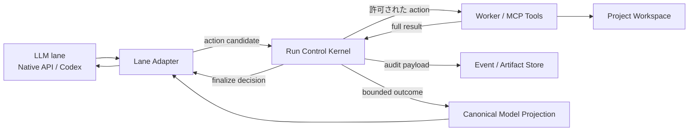

# モデル非依存 Run Control Kernel 実装計画

## Status

planning

## Purpose

NightWorkers を、特定のプロジェクト構成、言語、フレームワーク、Git の有無、既存プロジェクト編集か新規作成かに依存せず、異なる能力の LLM でも同じ完了条件を守れるコーディングエージェント基盤へ改善する。

今回観測された問題は、個々のプロンプト文言や特定ツールの使い方だけではなく、以下の制御がモデル自身の判断に寄り過ぎていることに起因する。

- 同じ状態で同じ観測や確認を繰り返しても実行が継続する
- ツールの業務上の失敗と、通信・実行基盤の失敗が混同される
- Todo の完了と、実際の編集・検証・判断根拠が結び付いていない
- 完了可能な状態になった後も、集計、再確認、評価、Todo 更新が反復する
- ツールの完全な出力や過去の反復履歴がモデルコンテキストへ蓄積する
- Native API lane と Codex lane で終了条件と回復制御の強さが異なる
- 強いモデルの自律判断を前提にした prompt-only の規則が、軽量モデルや local LLM では安定しない

本計画では、モデルにプロジェクト固有の調査・編集方法を選ばせる一方で、進捗、証跡、反復、コンテキスト、終了状態だけをサーバー側の共通状態機械で制御する。

目標は「どのモデルでも同じ確率でタスクを完遂すること」ではない。モデルの能力が低い場合でも、証跡不足や未完了状態を成功として通さず、同じ品質ゲートを満たした場合だけ完了とすることである。

## Current Baseline

### 既存の強み

- Supervisor の built-in skill と phase / mode / work kind / overlay reference に、調査、編集、検証、証跡、Todo、終了に関する運用規則が存在する
- Native API lane には dispatch state、finalize guard、closeout controller、context window の更新機構がある
- task event、tool result、Todo、LLM usage、diff、commit record を保存する基盤がある
- tool result の model-visible projection と長さ制限の基礎実装がある
- Codex lane には実行後監査と Todo checkpoint がある

### 現在の構造上の問題

1. 規則の多くが prompt に存在するだけで、違反時に実行を止める共通制御がない。
2. Native API lane の finalize guard と Codex lane の post-hoc audit が別実装であり、同じタスクでも lane により終了挙動が変わる。
3. ツール実行の `ok` が、通信成功、コマンド実行成功、期待結果達成を一つの真偽値に畳み込んでいる。
4. model-visible payload の本文を短縮しても、structured payload やツール固有の例外から完全なデータが残り得る。
5. Todo 完了、workspace の変化、検証証跡、最終回答が共通の revision で結ばれていない。
6. 同じ引数のツール実行でも、workspace や Todo が変わっていなければ再利用可能かどうかを判断する仕組みがない。
7. コンテキストの縮約が「過去の会話を要約する」発想に寄っており、現在状態を正規化して置換する共通契約になっていない。

### 今回の観測から得られた設計要件

- 同じ状態での Todo 一覧、評価、確認、失敗した検証の反復は、モデルへ注意するだけでは抑止できない
- 検証成功後の closeout だけで大きな追加トークンを消費し得るため、完了判定はモデルターンの外側で確定させる必要がある
- ツール結果を毎回会話履歴へ積む構造では、軽量モデルほど過去情報の再読と再判断が増える
- 個別の失敗コマンドを hard-code するのではなく、「同じ進捗 revision で同じ action を繰り返した」という汎用条件で制御する必要がある

## Locked Decisions

1. 特定の import 導線、snapshot 形式、リポジトリ構成、言語、フレームワーク、DB、package manager を主経路として設計しない。
2. ユーザー文言の正規表現や keyword 判定で workflow、ツール、回復方法を選ばない。
3. モデルは任意の調査・編集・コマンドを選べる。Run Control Kernel は「何を実装するか」ではなく、「状態が進んだか」「証跡があるか」「反復しているか」「終了できるか」だけを制御する。
4. Supervisor の方針は prompt / skill reference に置き、llm-provider へ用途別の実行判断を追加しない。
5. llm-provider の責務は provider 呼び出し、応答抽出、schema 検証、最小限の互換正規化に限定する。
6. Native API lane と Codex lane は同じ Run Control state、tool outcome、finalize guard を使用する。
7. 完全なツール出力は監査用 event / artifact として保存し、モデルにはサイズ制限された canonical projection だけを渡す。
8. transport の成否と、ツールが返した domain outcome を別フィールドにする。
9. モデルの自己申告、自然言語の「完了」、Todo の `done` だけではタスク完了としない。
10. 弱いモデル向けに完了条件を下げない。満たせない場合は recovery または人間判断待ちで終了する。
11. verify 固有の解析や project-side verify の変更は優先度を下げる。まず全ツールに効く反復・証跡・終了・コンテキスト制御を実装する。
12. 既存の project runtime と worker tool を作業対象の真実とし、Supervisor や provider の一時ディレクトリを workspace として扱わない。

## Out of Scope

- 任意言語の compiler / test runner 出力を完全に構造化すること
- 任意プロジェクトに最適な調査コマンドや編集順序をサーバー側で決定すること
- project-side の verify script やテスト構成を NightWorkers が書き換えること
- framework、言語、package manager を固定分類して専用フローへ分岐すること
- すべてのモデルで同じ完遂率や実行時間を保証すること
- モデルのコード生成ミスをすべて未然に防ぐこと
- 本計画だけで Review Mode、Test Mode、Plan Mode の UI を全面再設計すること
- 実行ログや監査用の完全 payload を削除すること

## Architecture

### 全体像



Run Control Kernel は provider の一部ではなく、agent runtime と tool dispatch の間に置く。各 lane は既存の provider / Codex SDK 呼び出しを維持し、共通 adapter を通じて Kernel の状態遷移を利用する。

### 推奨モジュール構成

```text
api/services/run-control/
  contracts.ts
  run-control-state.ts
  run-control-reducer.ts
  action-identity.ts
  tool-outcome-envelope.ts
  loop-guard.ts
  finalize-controller.ts
  context-projector.ts
  context-epoch-controller.ts
  persistence.ts
  metrics.ts

api/services/agent-runtime/shared/
  run-control-lane-adapter.ts
  run-state-card.ts
```

既存の Native API closeout、model-visible projection、Codex audit に同等機能がある場合、新規実装を並立させ続けない。characterization test を追加したうえで共通モジュールへ移し、lane 固有コードを adapter に縮小する。

## Core Data Contracts

### RunControlState

```ts
type RunControlPhase =
  | "active"
  | "recovery"
  | "closeout"
  | "terminal";

type RunTerminalReason =
  | "completed"
  | "blocked"
  | "cancelled"
  | "needs_human"
  | "runtime_failed";

interface RunControlState {
  version: 1;
  runId: string;
  phase: RunControlPhase;
  progressRevision: number;
  workspaceRevision: number;
  workflowRevision: number;
  todoRevision: number;
  evidenceRevision: number;
  contextEpoch: number;
  lastMutationSequence: number | null;
  lastEvidenceSequence: number | null;
  consecutiveNoProgressTurns: number;
  terminalReason: RunTerminalReason | null;
  stateVersion: number;
}
```

`progressRevision` はモデルの文章量や tool call 数ではなく、workspace、workflow、Todo、証跡、外部状態のいずれかに意味のある変化が生じたときだけ進める。

`stateVersion` は同一 run の並行 tool dispatch や二重 finalize を防ぐ optimistic concurrency control に使用する。

### ToolOutcomeEnvelope

```ts
type TransportStatus = "completed" | "failed" | "cancelled";

type DomainOutcome =
  | "succeeded"
  | "failed"
  | "blocked"
  | "no_change"
  | "unknown";

type RunEffect =
  | "observation"
  | "workspace_mutation"
  | "workflow_mutation"
  | "verification"
  | "external_mutation"
  | "none"
  | "unknown";

interface ToolOutcomeEnvelope {
  version: 1;
  runId: string;
  toolName: string;
  invocationId: string;
  actionKey: string;
  transportStatus: TransportStatus;
  domainOutcome: DomainOutcome;
  effect: RunEffect;
  effectConfidence: "declared" | "observed" | "inferred" | "unknown";
  progressRevisionBefore: number;
  progressRevisionAfter: number;
  invocationDigest: string;
  resultDigest: string;
  evidenceRefs: string[];
  artifactRefs: string[];
  retryPolicy: "immediate" | "after_progress" | "never";
  modelView: unknown;
}
```

### effect の決定規則

1. NightWorkers の first-party tool は manifest で effect を宣言する。
2. worker command は既存の command classification と、実行前後の diff / status / artifact の観測結果を組み合わせる。
3. 宣言と観測が矛盾する場合、観測結果を優先し、矛盾を監査 event に残す。
4. effect を安全に判定できない場合は `unknown` とし、誤って反復を遮断しないよう progress を保守的に進める。
5. ユーザー文言から effect を推測しない。

### Action Identity

`actionKey` は以下から生成する。

- tool name
- schema に基づき正規化した引数
- project / workspace identity
- action の意味を変える明示的な scope

timestamp、invocation ID、表示順だけで異なる値は除外する。秘密情報は digest の入力前に redaction し、平文を永続化しない。

同じ `actionKey` でも `progressRevision` が変わった場合は別の有効な再観測として扱う。

## Persistence

### task_run_control_states

run ごとの canonical state を一行で保存する。

| column | purpose |
| --- | --- |
| `run_id` | PK / task run FK |
| `version` | contract version |
| `phase` | current control phase |
| `progress_revision` | aggregate progress revision |
| `workspace_revision` | workspace mutation revision |
| `workflow_revision` | approval / mode / routing revision |
| `todo_revision` | Todo state revision |
| `evidence_revision` | evidence revision |
| `context_epoch` | replaceable context generation |
| `last_mutation_sequence` | last mutation event sequence |
| `last_evidence_sequence` | last evidence event sequence |
| `consecutive_no_progress_turns` | recovery threshold input |
| `terminal_reason` | immutable terminal result |
| `state_version` | optimistic lock version |
| `created_at`, `updated_at` | audit timestamps |

### task_run_action_records

tool action と、その時点の progress revision を保存する。

| column | purpose |
| --- | --- |
| `id` | action record ID |
| `run_id` | task run FK |
| `sequence` | ordered action sequence |
| `tool_name` | normalized tool name |
| `normalized_args_digest` | redacted argument digest |
| `action_key` | semantic action identity |
| `progress_revision` | revision before execution |
| `transport_status` | infrastructure outcome |
| `domain_outcome` | task-level outcome |
| `effect` | observed effect class |
| `result_digest` | full-result digest |
| `evidence_refs_json` | evidence references |
| `artifact_refs_json` | artifact references |
| `repeat_count` | reused / rejected repetitions |
| `created_at`, `updated_at` | audit timestamps |

`(run_id, action_key, progress_revision)` を action identity の一意性境界とする。実際に再実行を許可した場合も、親 action record と再実行理由を event に残す。

### task_events との関係

- `task_run_control_states` は運用上の canonical current state
- `task_run_action_records` は再実行判断に使う canonical action history
- `task_events` は追記型の監査・再構築用ログ
- 完全な tool result は既存 event / artifact storage に保存し、新規 table へ重複保存しない

state 更新、action record 追加、対応 event 追加は可能な限り同一 transaction で行う。

## Runtime Behavior

### Action 実行前

1. lane adapter がモデルの tool call を共通 action candidate に変換する。
2. Kernel が最新 `RunControlState` を取得する。
3. terminal state なら tool call を実行せず、確定済み terminal result を返す。
4. 引数を schema に基づき正規化し、`actionKey` を計算する。
5. 同じ `progressRevision` に同じ action の再利用可能な結果があるか確認する。
6. 再利用可能なら tool を再実行せず、保存済み結果から最新 canonical projection を返す。
7. 再利用不可なら tool を実行する。

### Action 実行後

1. transport と domain outcome を分離して envelope を生成する。
2. 完全な結果を event / artifact として保存する。
3. diff、Todo transition、evidence、workflow transition から effect を確定する。
4. effect に応じて各 revision と `progressRevision` を更新する。
5. action record と control event を保存する。
6. bounded `modelView` を lane へ返す。
7. no-progress threshold または closeout 条件に達した場合、次の control phase を確定する。

## Loop Guard and Recovery

### 汎用 no-progress 判定

以下を no-progress とする。

- 同じ `progressRevision` で同じ action を再要求した
- tool は実行されたが `effect=none` かつ、新しい evidence / artifact / workflow state がない
- モデルターンが tool call、Todo transition、final candidate のいずれも生成しなかった
- 同じ失敗結果を、修正、入力変更、scope 変更なしで再取得した

別ファイルの観測、異なる引数、workspace 更新後の再観測、ユーザー入力後の再実行は同一反復として扱わない。

### 段階的制御

| condition | behavior |
| --- | --- |
| 同じ action の初回重複 | 保存済み projection を返し、再実行しない |
| 連続 2 turn の no-progress | `recovery` phase へ移行する |
| recovery 後も同じ action | 拒否し、別の進捗種別を要求する |
| recovery で進捗なし | `needs_human` または `blocked` candidate を許可する |

閾値は server setting として変更可能にするが、モデルや provider ごとに完了品質を変えない。

### Recovery State Card

recovery では特定コマンドを指示せず、次のいずれかを一つ選ぶよう求める。

- 未観測の根拠を得る
- workspace を変更する
- workflow / approval / scope を更新する
- 新しい証跡を生成する
- 明示的な blocker と必要な人間入力を提示する

state card には、直前の action key、結果 digest、現在 revision、拒否理由を含める。過去の完全出力は再送しない。

## Transport and Domain Outcome Separation

### 原則

tool protocol が正常に応答し、その結果として test failure、lint failure、対象なし、承認待ちを返した場合、transport は `completed` である。

例:

| situation | transport | domain |
| --- | --- | --- |
| MCP 接続失敗 | failed | unknown |
| command process を起動できない | failed | unknown |
| test command が実行され failing tests を返す | completed | failed |
| diff がなく編集不要と判断できる | completed | no_change / succeeded |
| approval が必要 | completed | blocked |

これにより、正常に取得した失敗証跡を `codex_mcp_degraded` のような基盤障害として扱わない。

### Retry Policy

- transport failure: backoff と provider / runtime policy に従う
- domain failure + workspace mutation 前: 原則 `after_progress`
- observation: 同じ revision では再利用可能
- non-idempotent external mutation: 原則 `never`、明示的 idempotency key がある場合だけ再試行可能

## Evidence-Bound Todo

### 目的

Todo をモデルの自己報告リストではなく、run state と証跡を結ぶ軽量な実行契約にする。ただし、すべての短いタスクへ Todo 作成を強制しない。

### Contract Extension

```ts
interface TodoEvidenceRequirement {
  kind:
    | "observation"
    | "workspace_mutation"
    | "verification"
    | "decision"
    | "approval";
  freshness: "after_todo_start" | "after_last_mutation" | "any";
  minimumCount?: number;
}

interface TodoCompletionInput {
  todoId: string;
  status: "done";
  evidenceRefs: string[];
}
```

Todo definition は必要な evidence kind を宣言できる。完了時に Kernel が以下を検証する。

- evidence ref が同じ run に存在する
- Todo 開始後または最後の mutation 後という freshness 条件を満たす
- required evidence kind と一致する
- superseded / invalidated された evidence ではない

### Rollout

1. observe: 証跡なし完了を記録するが拒否しない
2. enforce-managed: managed gate や server-defined Todo だけ拒否する
3. enforce-general: nontrivial Todo に適用する

既存 Todo payload との互換期間を設け、段階ごとの違反率を計測してから enforce を進める。

## Controller-Owned Closeout

### 原則

モデルは最終回答の candidate を生成するだけで、run を terminal にしない。共通 `finalize-controller` が terminal transition を所有する。

### Finalize Guard

最低限、以下を同一 transaction の直前状態で確認する。

1. open / in-progress Todo が残っていない
2. managed gate の evidence が存在する
3. required evidence が最後の workspace mutation より古くない
4. contextStill compile を使用した場合、対応する compile evaluation が一度だけ保存済みである
5. workflow / approval / commit decision が未解決でない
6. lane 固有の completion check が必要な場合、成功証跡がある
7. run がすでに terminal でない、または同じ terminal result の idempotent replay である

### Guard Failure

guard failure 時は final answer を破棄せず candidate artifact として保存し、不足項目だけを recovery state card としてモデルへ返す。過去ログ全体を再投入しない。

### Guard Success

1. terminal state と final artifact を原子的に保存する
2. lane の provider loop を停止する
3. 以後の tool call と provider turn を拒否する
4. UI / event stream へ確定済み terminal result を一度だけ通知する

### Lane 統合

- Native API lane の既存 finalize guard / closeout controller を共通 controller へ移す
- Codex lane の一回限りの Todo checkpoint と post-hoc warning を、同じ finalize guard の事前制御へ置き換える
- Codex audit は異常検知と可観測性のため残すが、完了制御の主経路にはしない

## Canonical Model Projection

### 原則

モデルが見る tool result は `content` と `structuredContent` の両方で同じ canonical projection を使用する。片方だけを短縮して完全 payload がもう片方に残る構造を禁止する。

### Projection 内容

- outcome summary
- action / result digest
- relevant changed path summary
- diagnostic の件数と代表例
- evidence / artifact reference
- pagination / continuation token
- retry policy
- 現在の progress revision

完全な raw content、巨大なファイル一覧、全 Todo history、全 diagnostic は artifact ref から必要な範囲だけ再取得させる。

### Size Policy

- limit は特定モデル名や project stack ではなく、runtime の context window と server setting から決める
- model-visible tool result は context window の一定割合以下に抑える
- server hard maximum を超えない
- 構造化 adapter がある tool は意味単位で切る
- adapter がない出力は head / tail、件数、digest、artifact ref を返す
- projection 自体が失敗した場合も full payload へフォールバックせず、bounded text fallback を返す

既存の tool 固有 full-retention 例外は廃止する。監査用 full payload の保存は維持する。

## Replaceable Context and Context Epochs

### Run State Card

Run State Card はプロジェクトの snapshot ではない。任意プロジェクトに共通する、現在の実行状態だけを保持する。

```ts
interface RunStateCard {
  objectiveDigest: string;
  specificationRefs: string[];
  constraints: string[];
  phase: RunControlPhase;
  activeTodoSummary: unknown;
  revisions: {
    progress: number;
    workspace: number;
    workflow: number;
    todo: number;
    evidence: number;
  };
  changedPathSummary: string[];
  evidenceRefs: string[];
  recentFailureDigests: string[];
  unresolvedRisks: string[];
  recoveryRequirement: string | null;
}
```

### Context 構成

各 epoch のモデルコンテキストは以下で構成する。

- current system / skill instructions
- 最新 Run State Card
- 未解決のユーザー要求と仕様参照
- 直近の因果関係がある action / outcome window
- モデルが明示的に再取得した artifact excerpt

同じ Todo list、同じ失敗出力、superseded された state card、古い full tool result を累積しない。

### Epoch Rotation

rotation は project 種別ではなく以下で発火する。

- context window 使用率
- model-visible history の累積量
- recovery phase への移行
- workflow / mode の大きな遷移

Native API lane は既存 context window 更新を共通 controller へ寄せる。Codex lane は threshold 到達時に新しい thread / session を作り、Run State Card で rehydrate し、旧 session を superseded として記録する。

rotation に失敗した場合は現在 session を維持し、監査 event を出す。完全履歴を再注入するフォールバックは行わない。

## Implementation Phases

### Phase 0: Characterization and Measurement

#### Tasks

- Native API lane と Codex lane の現在の finalize、Todo、tool result、audit 挙動を characterization test で固定する
- 重複観測、domain failure、Todo 完了、検証後 closeout、巨大 structured payload を再現する deterministic fixture を作る
- `llm_usage_records` と task events から、現状指標を抽出する集計 helper を追加する
- model requested、runtime lane、provider が返す actual model identifier を別項目で扱う。actual が取得できない場合は推測せず `unknown` とする

#### Acceptance

- 実 LLM を呼ばず、今回の主要な失敗パターンを再現できる
- lane 間の挙動差がテスト名と assertion で可視化される
- 以後の phase で token / turn / duplicate action の差分を比較できる

### Phase 1: Contracts, State Reducer, and Persistence

#### Tasks

- `RunControlState`、`ToolOutcomeEnvelope`、action identity の型を追加する
- state reducer を pure function として実装する
- control state / action record の migration、repository、transaction API を追加する
- optimistic concurrency と idempotent terminal transition を実装する
- task event へ control transition event を追加する

#### Acceptance

- reducer の入力と出力が lane、provider、project 種別に依存しない
- process restart 後も action dedupe と terminal state を復元できる
- 二重 finalize と並行 action 更新が state version conflict で検出される

### Phase 2: Tool Outcome and Canonical Projection

#### Tasks

- first-party tool manifest へ effect / retry metadata を追加する
- existing tool result を envelope に正規化する adapter を追加する
- transport status と domain outcome を分離する
- MCP `content` / `structuredContent` と Native API tool response を同じ projector へ統合する
- raw payload の tool 固有例外を削除し、artifact ref を導入する
- bounded fallback と truncation metrics を追加する

#### Acceptance

- test failure は transport degradation として記録されない
- full payload が model-visible `content` / `structuredContent` のどちらにも残らない
- full audit payload は従来どおり調査可能である
- projector failure 時も hard maximum を超えない

### Phase 3: Shared Finalize Controller

#### Tasks

- Native API closeout の現行 guard を共通 controller へ移す
- Todo、evidence freshness、workflow、context evaluation を一つの guard result にまとめる
- terminal transition と final artifact 保存を原子的にする
- terminal 後の provider turn / tool call を拒否する
- Native API lane を先に共通 controller へ接続し、既存挙動を維持する

#### Acceptance

- finalize 成功後に追加 model step が発生しない
- guard failure は不足条件だけを返し、全履歴を再送しない
- context evaluation は run ごとに idempotent に一度だけ保存される
- Native API の既存 closeout regression test が維持される

### Phase 4: Codex Lane Integration

#### Tasks

- Codex tool dispatch を lane adapter 経由にする
- Codex lane も共通 action record、projection、finalize controller を使用する
- 一回限りの Todo checkpoint を共通 guard へ置き換える
- audit warning を transport / domain / control violation に分類する
- Codex session ID と context epoch の対応を保存する

#### Acceptance

- 同一 fixture に対し Native API と Codex が同じ finalize decision を返す
- Codex でも terminal 後に追加 thread turn が発生しない
- domain failure が MCP degradation warning にならない
- lane 固有差は provider protocol と session transport に限定される

### Phase 5: Loop Guard and Recovery

#### Tasks

- action identity と progress revision を使った result reuse を実装する
- no-progress turn の検出と recovery state card を追加する
- observe / enforce mode を server setting で切り替えられるようにする
- non-idempotent action の再試行禁止を実装する
- guard の false positive、reuse、recovery、human escalation metrics を追加する

#### Acceptance

- 同じ revision の同じ observation は再実行されず、保存済み projection が返る
- workspace / workflow 更新後は同じ observation を再実行できる
- effect unknown の tool を誤って永久遮断しない
- 反復から抜けられない run は無制限に継続せず、明示的な terminal candidate へ進む

### Phase 6: Context Projector and Epoch Rotation

#### Tasks

- Run State Card builder を追加する
- causal recent window と superseded history の境界を定義する
- Native API の context refresh を共通 epoch controller へ移す
- Codex session rotation と rehydration を実装する
- context epoch、projected chars、retained events、dropped events を計測する

#### Acceptance

- 同じ Todo / tool output が epoch を越えて重複注入されない
- rotation 後も objective、constraint、active Todo、evidence、changed path を復元できる
- project snapshot の有無や形式に依存しない
- context 使用量が増え続ける構造から、epoch ごとの上限がある構造へ変わる

### Phase 7: Evidence-Bound Todo

#### Tasks

- Todo schema に evidence requirement / refs を追加する
- Todo transition と evidence freshness の validator を実装する
- observe mode で既存 run の違反率を測定する
- managed Todo から段階的に enforce する
- UI / transcript では証跡概要を表示し、巨大 payload を展開しない

#### Acceptance

- 証跡要件がある Todo は自己申告だけで完了できない
- 最後の mutation より古い verification evidence を使って完了できない
- 単純タスクでは Todo 作成自体を強制しない
- local LLM と hosted LLM で同じ validator が適用される

### Phase 8: Generic Verification Recovery

この phase は前段より優先度を下げる。

#### Tasks

- 同じ verification action と同じ failure digest の反復を loop guard に統合する
- workspace progress なしの verification 再実行を `after_progress` まで保留する
- failure output の言語固有解釈を必須にせず、digest と effect で汎用的に扱う
- project-side verify command の選択や定義は既存 workflow / project に委ねる

#### Acceptance

- 同じ状態で同じ failing verification を無制限に再実行しない
- 修正後の再検証は妨げない
- Hono、SQLite、TypeScript、特定 test runner を前提にしない

### Phase 9: Model-Parity Evaluation and Rollout Completion

#### Tasks

- hosted strong model、ChatGPT 5.4 mini 相当、local Qwen 系で同一 fixture を実行する harness を追加する
- 成功率と品質を分離して集計する
- observe mode の閾値を実測から確定する
- lane 固有の旧 guard、projection、closeout code を削除する
- operational dashboard / run detail へ control metrics を追加する

#### Acceptance

- モデルごとに完遂率の差は表示されるが、完了扱いの evidence 条件は同一である
- 軽量モデルが強いモデルより少ない証跡で成功扱いにならない
- false completion、duplicate action、closeout turn、model-visible payload が baseline より減少する
- rollback setting と migration compatibility が確認される

## Model-Parity Benchmark

### Fixture Categories

特定の標準経路を定義せず、異なる性質を持つ fixture 群で評価する。

- 既存リポジトリの小規模 bug fix
- 既存リポジトリの複数ファイル feature
- user-owned dirty tree を保持する変更
- Git を使用しない workspace
- 空または最小 workspace からの新規作成
- 複数言語 / 複数 toolchain の repository
- approval / workflow transition を含むタスク
- tool output が大きいタスク
- failing verification から修正へ進むタスク
- 実装せず blocker を報告すべきタスク

fixture はアーキテクチャの分岐条件には使わず、汎用制御の回帰検証にだけ使う。

### Quality Metrics

- required evidence pass rate
- false completion rate
- stale evidence acceptance rate
- user-owned change preservation rate
- reviewer finding severity distribution
- required behavior / acceptance assertion pass rate
- blocker accuracy

### Efficiency Metrics

- provider model steps
- input / output tokens
- model-visible tool result characters
- duplicate action count
- reused action count
- no-progress turns
- context epoch count
- verification-to-terminal turns
- closeout token share
- Todo list / update repetition

### Reliability Metrics

- transport failure count
- domain failure count
- misclassified degradation count
- finalize guard rejection reasons
- state version conflicts
- projection fallback count
- context rotation failures

同品質の判定は、同じ acceptance assertion と evidence gate を通過したかで行う。文章の流暢さやモデルの自己評価は指標にしない。

## Verification Plan

### New Tests

```text
tests/run-control/run-control-reducer.cases.ts
tests/run-control/action-identity.cases.ts
tests/run-control/tool-outcome-envelope.cases.ts
tests/run-control/loop-guard.cases.ts
tests/run-control/finalize-controller.cases.ts
tests/run-control/context-projector.cases.ts
tests/run-control/context-epoch-controller.cases.ts
tests/run-control/evidence-bound-todo.cases.ts
tests/run-control/lane-parity.cases.ts
```

### Existing Test Areas to Extend

- Native API runner / dispatcher / closeout controller tests
- CodexAgentRuntime lifecycle / audit / Todo checkpoint tests
- model-visible payload / native tool result projector tests
- MCP manifest / MCP tool result tests
- supervisor regression tests
- task event / database migration / repository tests
- run detail / usage aggregation tests

### Targeted Commands

各 phase では変更対象に近いテストを先に実行する。

```bash
bun run test run tests/run-control
bun run test:supervisor-regression
bun run typecheck
bun run verify:base
bun run verify:desktop
```

全 phase 統合後の最終 gate:

```bash
bun run verify:full
```

project-side verification の内容は本計画で固定しない。上記は NightWorkers 自身の変更を検証する gate である。

## Rollout Strategy

### Temporary Migration Settings

移行期間だけ以下の制御を server setting で切り替えられるようにする。恒久的な env 分岐を増やさず、安定後は既定値と不要な分岐を整理する。

- Run Control Kernel: disabled / observe / enforce
- Loop Guard: observe / enforce
- Evidence Todo: off / observe / managed / enforce
- Context Epoch Rotation: disabled / enabled
- Canonical Projection: observe / enforce

### Stages

1. control state と metrics を observe-only で保存する
2. canonical projection と outcome separation を有効化する
3. Native API lane で shared finalize を enforce する
4. Codex lane で shared finalize を enforce する
5. loop guard を observation tool から段階的に enforce する
6. context epoch rotation を lane ごとに有効化する
7. Evidence Todo を managed item から enforce する
8. 旧 lane 固有制御を削除する

### Failure Policy

| failure | policy |
| --- | --- |
| control persistence failure | tool 実行は警告付きで継続可能、finalize は fail closed |
| loop guard 判定 failure | fail open で実行し、監査 event を残す |
| projection failure | bounded fallback、full payload は返さない |
| context rotation failure | current epoch を維持し、履歴再注入はしない |
| finalize transaction conflict | state 再読込後に idempotent retry |
| evidence validator failure | finalize / Todo completion は fail closed |

## Risks and Mitigations

### 正当な再実行を重複と誤判定する

`progressRevision`、正規化引数、workspace identity を action key に含める。effect が不明な tool は保守的に progress を進め、observe mode の実測後に enforce する。

### Context rotation で重要情報を失う

Run State Card の contract test、evidence / artifact ref、specification ref を使い、自由文要約だけに依存しない。rotation 前後で finalize decision が一致する parity test を追加する。

### Payload 短縮でエラー原因が見えなくなる

代表 diagnostic、件数、head / tail、digest、artifact ref を必須にする。モデルは必要な artifact excerpt を範囲指定で再取得できるようにする。

### 弱いモデルを制約し過ぎて進めなくなる

Kernel は具体的なコマンドやファイルを指定しない。recovery では進捗の種類だけを示し、モデルが別の調査・編集方法を選べる状態を保つ。

### DB 書き込みと event 数が増える

state は一行更新、action record は digest と refs に限定する。完全 payload は既存 storage を再利用し、重複保存しない。

### Lane 移行中に挙動が分岐する

同一 fixture の lane parity test を phase ごとに必須化し、adapter 外へ lane 固有の finalize / loop policy を追加しない。

### 並行 tool call が revision を競合する

`stateVersion` と transaction を使用する。non-idempotent action は lease / idempotency key を必須とし、競合時の自動再実行を禁止する。

### 既存 run の互換性

control state がない既存 run は event から安全に初期化する。復元不能な項目は推測せず unknown とし、過去 run へ enforce-only の guard を遡及適用しない。

## Completion Criteria

以下をすべて満たした時点で本計画を完了とする。

1. Native API lane と Codex lane が同じ Run Control state reducer、ToolOutcomeEnvelope、finalize controller を使用している。
2. terminal transition 後に追加 provider turn または tool call が発生しない。
3. 同じ progress revision の同じ observation は再実行されず、canonical projection が再利用される。
4. test / lint / verification failure が transport degradation として誤分類されない。
5. model-visible `content` と `structuredContent` の双方に full payload が残らない。
6. 完全な監査 payload は event / artifact から引き続き取得できる。
7. Run State Card と context epoch により、反復履歴が無制限に累積しない。
8. evidence requirement がある Todo と finalize は、存在・種類・freshness をサーバー側で検証する。
9. project snapshot、言語、framework、Git、既存 / 新規 project を前提とする分岐が Kernel に存在しない。
10. hosted strong model、5.4 mini 相当、local Qwen 系に同じ acceptance / evidence gate が適用される。
11. model-parity benchmark で品質と完遂率が別々に報告される。
12. duplicate action、closeout turn、model-visible payload、false completion が baseline より減少する。
13. targeted tests、typecheck、`verify:base`、`verify:desktop`、`verify:full` が成功する。
14. migration settings、rollback、既存 run compatibility が確認される。

## Recommended Implementation Order

実装効果と依存関係から、次の順序を推奨する。

1. characterization / metrics
2. state contract / persistence / outcome separation
3. canonical model projection
4. shared finalize controller
5. Codex lane parity
6. loop guard / recovery
7. context epoch rotation
8. Evidence Todo
9. generic verification recovery
10. model-parity benchmark と旧実装削除

最初の価値提供点は shared finalize と canonical projection である。ここまでで、完了後の余分なターン、巨大 payload の再読、domain failure の誤分類を削減できる。その後、loop guard と context epoch により長時間 run の反復とコンテキスト肥大を抑え、Evidence Todo で成功品質をモデル能力から分離する。
