# NightWorkers 品質改善 / Tauri 配布準備 実装計画

## Status

- Plan status: `in_progress`
- Document created: 2026-07-14
- Target repository: `/Users/y.noguchi/Code/nightWorkers`
- Baseline HEAD: `b0dae7098740e1eba834556e38033fca46865ed7`
- Primary release target: macOS ARM64 signed limited beta
- Secondary targets: Windows x64 / Linux x64 after native package verification
- Implementation authorization: started

実装進捗（2026-07-14）:

- Phase 1 gate は `bun run verify`、full Vitest、deterministic E2E coverage（45/45）、
  Accessibility を通過した。
- Phase 2 の現行 desktop gate は `bun run verify:desktop` を通過した。
- release metadata、documentation consistency、dependency audit、desktop build / smokeを含む
  `bun run verify:release` を通過した。
- Phase 3 / 6 / 8 のproduction CSP、DevTools無効化、migration前backup、bundle budget、
  third-party notice、SBOM、updater設定とrelease attestationは実装済みで、release regression
  testでも検証した。
- `bun run test:coverage` はbackend coverage workerが完走結果を返さず停止したため、Phase 7の
  global coverage再確立は未完了として扱う（既存summaryのbranch 63.12%は目標75%未達）。
- macOS signing / notarization / staple と Windows / Linux のnative installer実行は、対応する
  GitHub Actions runner と release secrets を必要とするため、実release workflowでの証明を残す。

この文書を、NightWorkers の現行機能を広げず、品質 gate、Tauri sidecar、
security、署名、cross-platform packaging、保守性を配布可能な状態へ収束させるための
実装正本とする。

本計画は、既存の `scripts/verify.mjs`、Tauri shell、Node backend sidecar、
SQLite runtime、GitHub Actions、release attestation を置き換える計画ではない。
現行境界を維持し、確認済みの失敗と配布上の不足を修復する。

## 1. 目的

次の状態を達成する。

1. fast gate、full test、E2E、Accessibility、Desktop、release gate がそれぞれ
   何を証明するか明確で、成功していない gate を release-ready と扱わない。
2. macOS / Windows / Linux の sidecar が、build host に偶然存在する Node dynamic
   library や `sqlite3` CLI に依存せず起動する。
3. macOS ARM64 の `.app` / DMG を署名・notarize・stapleし、同一SHAの検証済み
   artifactとして限定β配布できる。
4. Tauri production build で CSP が有効になり、DevTools が無効になる。
5. Windows x64 と Linux x64 は、installerのnative build、install、launch、shutdownを
   実runner上で確認してからsupport matrixへ追加する。
6. bundle size、coverage、oversized source、第三者license、support導線に測定可能な
   quality budgetを持たせる。

## 2. 現状ベースライン

### 2.1 Repository state

評価時点のworktreeには、Mission Pilot plan reviewに関する既存の未コミット変更がある。
品質改善実装では、これらを暗黙に取り込んだり破棄したりしない。

```text
M api/modules/missionPilot/mission-pilot-plan-review.service.ts
M shared/schemas/mission-pilot-plan-review.schema.ts
M tests/mission-pilot-plan-coordinator.test.ts
M tests/mission-pilot-plan-pipeline.test.ts
```

実装開始時には、accepted baseline SHAまたは専用worktreeを確定し、以下の診断結果を
artifactまたはPR本文へ保存する。

```bash
git rev-parse HEAD
git status --short --branch
node scripts/verify.mjs base --list
node scripts/verify.mjs desktop --list
node scripts/verify.mjs release --list
```

### 2.2 Verification baseline

2026-07-14の診断結果:

| Gate | Result | Evidence |
| --- | --- | --- |
| `bun run verify` | pass | tracked artifact、architecture、typecheck、Biome、Supervisor regression |
| `bun run verify:audit` | pass | High / Critical finding なし |
| `bun run verify:desktop` | local pass | runtime test、Rust lint、build、sidecar smoke、packaged smoke |
| `bun run release:check` | pass | version / changelog / release note metadata |
| `bun run check:docs` | pass | 12 documents |
| `bun run demo:smoke` | pass | deterministic demo lifecycle |
| full Vitest | fail | 304 files pass / 8 fail、2133 tests pass / 10 fail |
| deterministic E2E | fail | 43 tests中5 pass / 18 fail / 20 not run |
| Accessibility | fail | 4 tests中1 pass / 1 fail / 2 not run |

既存のcoverage summaryは次の値だが、full testが失敗しているため、最新成功値としては
扱わない。

| Metric | Existing summary |
| --- | ---: |
| Statements | 75.31% |
| Branches | 63.12% |
| Functions | 77.17% |
| Lines | 78.02% |

### 2.3 Desktop baseline

| Item | Current observation |
| --- | --- |
| local macOS `.app` | build / packaged smoke成功 |
| app size | 約508 MiB |
| staged Node | 約124 MiB |
| staged `node_modules` | 約306 MiB |
| generated DMG | 約194 MiB |
| local signature | ad-hoc、TeamIdentifierなし |
| Gatekeeper assessment | fail |
| latest macOS CI | staged Nodeが`libnode.127.dylib`を解決できずsidecar smoke失敗 |
| latest Windows CI | production bootstrapが外部`sqlite3` CLIを要求して失敗 |
| Linux / Windows package | configは存在するがinstaller build / launch smoke未実施 |

## 3. 問題

### 3.1 Fast gateとrelease truthが分離している

`bun run verify`は高速で有用だが、full Vitest、E2E、Accessibility、Desktop packageを
含まない。現在はmainのfast gateが成功する一方、releaseに必要なworkflowが失敗している。

### 3.2 E2E fixtureとscenario catalogが現行contractに追従していない

- isolated repositoryが環境依存で`master`を作り、fixtureは`main`を要求する。
- Project登録が`GIT_INTEGRATION_TARGET_INVALID`となり、後続scenarioが連鎖停止する。
- Mission Pilot scenarioがcatalog未登録である。
- 1 testに複数scenario tagがあり、scenario未指定testもある。
- required scenarioが1件unmappedである。
- Accessibility testが現行navigation / localeと一致しない`Settings` linkを要求する。

### 3.3 Sidecar stagingがbuild host依存である

`scripts/desktop/prepare-sidecar.mjs`は、現在の`process.execPath`を単体copyする。
Node distributionのversion、dynamic library、license、target tripleを固定していない。

また、production bootstrap pathの
`api/services/settings/application-settings-store.ts`は`sqlite3` CLIを同期実行する。
macOS開発機では偶然動作するが、Windows packaged runtimeでは成立しない。

### 3.4 Tauri production hardeningが未完了である

- `app.security.csp`が`null`。
- production windowでも`devtools: true`。
- Tauri crateが常時`devtools` featureを含む。
- release workflowはsigning / notarizationを`not_requested`としてartifactを作成できる。

### 3.5 Cross-platform supportの表明と検証深度が一致しない

Linux / Windows configとbuild commandは存在するが、CI matrixはsidecar readinessまでで、
installerをbuild、install、launchしていない。release workflowが公開するcandidateも
macOS ARM64のみである。

### 3.6 Quality debtを止めるbudgetが弱い

- production sourceに600行上限直前のfileが多数ある。
- bundleが508 MiBあり、target外native prebuildもstagingされる。
- Node binaryを配布するが、Node distributionのlicense / notice同梱を検証していない。
- `SUPPORT.md`がGitHub Discussionsを案内する一方、repositoryではDiscussionsが無効。
- security reportのprivate contactが具体化されていない。
- desktop runtime directoryのdocument記述とTauriの`app_data_dir`実装が一致しない。

## 4. 目標状態

```mermaid
flowchart LR
    S["Accepted clean SHA"]
    B["Base / Full Vitest"]
    E["Deterministic E2E"]
    A["Accessibility"]
    D["Self-contained sidecar"]
    H["Tauri security hardening"]
    P["Signed macOS package"]
    N["Notarization / staple"]
    T["Same-SHA attestation"]
    R["Limited beta release"]

    S --> B
    B --> E
    E --> A
    A --> D
    D --> H
    H --> P
    P --> N
    N --> T
    T --> R
```



Windows / Linuxは上記macOS限定βの完成後、各OSのnative package gateを独立して通し、
同一releaseへ段階追加する。

## 5. Locked Decisions

1. 最初の外部配布対象はmacOS ARM64限定βとする。
2. Windows x64 / Linux x64は、native installer smokeが成功するまで「設定済み」以上の
   supportを表明しない。
3. Node backend sidecar境界は維持し、本計画でRust backendへ全面移植しない。
4. application settingsから外部`sqlite3` CLI依存を除去する。`sqlite3` executableの
   同梱で延命しない。
5. sidecar Nodeはbuild hostの`process.execPath`をそのままcopyせず、versionとtargetを
   固定した再配布可能なruntimeを使用する。
6. test failureは、runtime contractを確認してから実装修正またはtest修正へ分類する。
   assertion削除、snapshot一括更新、retry増加だけでgreenにしない。
7. E2E repositoryのdefault branchはfixture側で明示し、開発機のglobal Git configに
   依存させない。
8. production Tauri packageではCSPを必須化し、DevToolsを無効化する。
9. 公式release artifactはsigning / notarizationが`verified`でなければpublishしない。
10. `verify:live`はcredential不要のrelease gateへ追加しない。
11. migration rollbackはdown migrationを暗黙実行せず、runtime backupと旧version復元を
    基本とする。
12. 実装作業中にproduct feature、Mission Pilot workflow、Queue semanticsを変更しない。
13. version bump、tag作成、GitHub Release公開は、別途ユーザーが明示的に許可するまで
    dry-runに留める。

## 6. Scope

### 6.1 含む

- full Vitest failureの修復。
- E2E repository fixture、scenario catalog、Accessibility fixtureの修復。
- verify / release gateの契約testとCI required check整合。
- application settingsのin-process SQLite access。
- pinned Node sidecar runtimeとtarget manifest。
- Tauri CSP / production DevTools hardening。
- macOS nested binary signing、notarization、stapling、Gatekeeper verification。
- Windows / Linux native package build・install・launch smoke。
- bundle size budgetとtarget外dependency pruning。
- automatic pre-migration backupとrollback verification。
- third-party notice、SBOM、support / security / runtime directory文書の整合。
- oversized production sourceの限定的な分割。

### 6.2 含まない

- 新しいMission Pilot機能。
- UI全体のredesign。
- hosted multi-user service化。
- Node sidecarのRust全面置換。
- Queueのmulti-process化。
- provider credentialを使用するrelease必須test。
- automatic PR / merge / deploy。
- App Store / Microsoft Storeへのsubmission。
- telemetryやcloud crash reportingの強制導入。
- 既存未コミット変更の暗黙commit、破棄、取り込み。

## 7. Plan View Decisions

本計画の主artifactはこのFeature Planだけとする。

| View | Decision | Reason |
| --- | --- | --- |
| questionnaire | omit | 実装開始を止めるproduct choiceはなく、配布対象をmacOS ARM64限定βとして固定したため |
| feature_plan | include / required | 本書を実装正本とするため |
| blueprint | omit | UI redesignを行わず、設定・診断表示の局所変更だけを扱うため |
| data_model | omit | 新table / columnを前提にせず、既存SQLite accessとbackupを扱うため |
| user_flow | omit | 新しいproduct journeyを追加しないため |
| api_io_contract | omit | 新しいpublic HTTP endpointを前提にしないため |
| activity_flow | omit | release gate順序は本書のphaseとverification matrixで十分なため |
| sequence_flow | omit | service間runtime sequenceの新規contractを追加しないため |
| zod_schema_design | omit | provider / MCP / worker toolの新規JSON contractを追加しないため |

## 8. 実装Phase

## Phase 0: Baseline固定と作業分離

### Q0-01 Accepted baselineを固定する

#### Implementation

1. 既存Mission Pilot変更のownerと状態を確認する。
2. 品質改善を専用branch / worktreeで開始する。
3. `git rev-parse HEAD`と`git status --short`を記録する。
4. gateは共有`test-results`やbuild stagingの干渉を避け、baselineでは直列実行する。
5. latest GitHub Actions run URLとfailure logを保存する。

#### Acceptance

- 品質改善のdiffに既存4ファイルが意図せず混入しない。
- 比較元SHA、worktree状態、CI run IDが追跡できる。

#### Verification

```bash
git status --short --branch
git diff --name-only
gh run list --limit 10
```

### Q0-02 Gate ownership表を固定する

#### Implementation

`scripts/verify.mjs`のtask setとCI workflowを照合し、次を文書・testで固定する。

| Gate | Must prove |
| --- | --- |
| `verify` | fast static / architecture / Supervisor regression |
| `verify:full` | credential-free full local regression |
| `verify:e2e` | required deterministic scenario success |
| Accessibility workflow | required accessibility scenario success |
| `verify:desktop` | current hostのbuild / sidecar / packaged smoke |
| Desktop matrix | target別sidecar / package integrity |
| `verify:release` | metadataを含む全release prerequisite |

#### Acceptance

- fast gateをfull / release passと誤表示しない。
- testがtask追加・削除による契約driftを検出する。

#### Verification

```bash
node scripts/verify.mjs base --list
node scripts/verify.mjs full --list
node scripts/verify.mjs release --list
bun run test run tests/verify-script.test.ts
```

## Phase 1: Test truthとrelease gateの復旧

依存: Phase 0

### Q1-01 Full Vitest failureを分類・修復する

#### Implementation

10件のfailureを次の単位で再実行し、runtime contractと比較する。

1. Artifact export / Artifact Pane component移動後のtest importとstyle contract。
2. Project Detail SSR表示expectation。
3. Quality coverage parse errorのpublic message contract。
4. Codex warning catalogと実際のemission contract。
5. verify task setのarchitecture task追加。
6. Workbench general-answer route event contract。

実装が正しくtestが古い場合は、現行component / service boundaryを参照するtestへ更新する。
runtime回帰である場合は、test expectationを弱めず実装を修正する。

#### Candidate Files

- `tests/artifact-export-menu.test.tsx`
- `tests/artifact-pane-smoke.test.tsx`
- `tests/frontend-utility-components.test.tsx`
- `tests/quality-backend.test.ts`
- `tests/services.codex-agent-runtime.test.ts`
- `tests/verify-script.test.ts`
- `tests/nightworkers-workbench-routes/routes-workbench-01.test.ts`
- 対応するproduction module

#### Acceptance

- focused failure 10件が全成功する。
- full Vitestが0 failureで完了する。
- test削除やskip増加で成功させていない。

#### Verification

```bash
bun run test run <focused test files>
bun run test run
```

### Q1-02 E2E Git branch fixtureを決定論化する

#### Implementation

1. 全E2E fixture repositoryを`git init --initial-branch=main`相当で作成する。
2. Git version差を吸収する共通fixture helperへ集約する。
3. branch名を固定できない環境では、作成直後に`git branch -M main`を実行する。
4. global `init.defaultBranch`変更は行わない。
5. Project登録前にfixture branchをassertし、失敗理由を局所化する。

#### Acceptance

- clean HOME / isolated Git configでもProject登録が201になる。
- `GIT_INTEGRATION_TARGET_INVALID`がfixture branch差で発生しない。
- macOS / Linux CIで同じbranch contractになる。

#### Verification

```bash
bun run test:e2e:smoke
bun run verify:e2e
```

### Q1-03 Scenario catalogを現行suiteへ同期する

#### Implementation

1. Mission Pilot 3 scenarioをcatalogへ登録する。
2. Git closeout testの複数scenario tagを1 test / 1 primary scenarioへ分割するか、
   catalogが明示的に許すmappingへ変更する。
3. Mermaid testsへobservational scenarioを割り当てるか、catalog対象外を明示する。
4. `NW-E2E-SETTINGS-001`へ実testをmappingする。
5. unknown、missing、duplicate、unmappedを0にする。
6. required coverage率ではなくrequired execution passをrelease条件にする。

#### Acceptance

- catalog validation errorが0。
- required scenarioがすべて実行され成功する。
- `executed pass rate=100%`。
- retry後のみ成功するP0 scenarioが0。

#### Verification

```bash
bun run test run tests/e2e-scenario-coverage.test.ts
bun run verify:e2e
```

### Q1-04 Accessibility gateを現行navigationへ同期する

#### Implementation

1. `Settings`英語固定locatorを現行locale / accessible name contractへ合わせる。
2. 日本語・英語それぞれのnavigationを独立assertする。
3. 最初のfailureで後続3件の欠陥を隠さないよう、fixture依存を分離する。
4. focus visibility、reduced motion、localized names、modal focus returnを全件実行する。

#### Acceptance

- required 4件がすべて実行され成功する。
- serious / critical Axe violationが0。
- retryなしで成功する。

#### Verification

```bash
node scripts/verify.mjs accessibility
```

### Phase 1 Gate

```bash
bun run verify
bun run test run
bun run verify:e2e
node scripts/verify.mjs accessibility
```

Phase 1 Gateが成功しない限り、Desktop packaging修正をrelease-readyと報告しない。

## Phase 2: Self-contained Desktop sidecar

依存: Phase 1

### Q2-01 Production pathから`sqlite3` CLI依存を除去する

#### Implementation

1. `application-settings-store.ts`のtable作成、read、write、bundle write、migration recordを
   既存のSQLite client / write gate経由へ移す。
2. production service import時にchild processを起動しない。
3. transaction、busy timeout、revision increment、public / secret atomic writeを維持する。
4. CLI用maintenance scriptの`sqlite3`利用はproduction sidecar import graphと分離する。
5. Windows上でPATHに`sqlite3`がなくてもbootstrapできるtestを追加する。

#### Acceptance

- packaged backend startupが`sqlite3` executableを要求しない。
- public / secret setting bundleが同一transactionで更新される。
- existing settings migrationとmaskingに回帰がない。

#### Verification

```bash
bun run test run tests/services.application-settings-store.test.ts
bun run test:desktop-runtime
bun run build:backend:desktop
bun run desktop:smoke-sidecar
```

### Q2-02 Node runtimeをversion / target固定する

#### Implementation

1. desktop sidecarが使用するNode major / exact versionを設定の正本へ置く。
2. CIでNode runtime sourceを取得・checksum検証する。
3. macOS / Windows / Linuxのtarget別runtimeをstageする。
4. `process.execPath`単体copyを削除する。
5. Nodeに必要なdynamic library、license、noticeをruntime単位で同梱する。
6. manifestへNode version、target、source、SHA-256、必要library一覧を記録する。
7. backend `target=node20`と実runtime versionの不整合を解消する。

#### Acceptance

- clean CI runnerでhost Node layoutに依存せずsidecarが起動する。
- macOSで`libnode.*.dylib`欠落がない。
- manifest targetとrunner targetが一致する。
- runtime checksum差分をgateが拒否する。

#### Verification

```bash
bun run desktop:prepare-sidecar
bun run desktop:verify-target
bun run desktop:smoke-sidecar
otool -L scripts/desktop/staged/node/bin/node
```

Windows / Linuxでは`dumpbin`または`ldd`相当のtarget別dependency checkを使用する。

### Q2-03 Native package stagingをtarget限定する

#### Implementation

1. libSQL、Codex、argon2のruntime必要fileをtarget別に列挙する。
2. target外prebuild、source、build fixture、不要CLIをstageしない。
3. package export / license fileを保持する。
4. stage後にrequired module import smokeを行う。

#### Acceptance

- 対象target以外のnative `.node` / executableがpackageへ入らない。
- libSQL、argon2、Codex runtime importがpackaged sidecarで成功する。
- pruning前後でdesktop smokeに回帰がない。

#### Verification

```bash
bun run desktop:prepare-sidecar
node scripts/desktop/verify-target-manifest.mjs
bun run desktop:smoke-sidecar
du -sh scripts/desktop/staged
```

### Phase 2 Gate

```bash
bun run verify:desktop
```

加えて、macOS / Windows / Linux runner上のsidecar readinessが全成功する。

## Phase 3: Tauri production security hardening

依存: Phase 2

### Q3-01 Production / development configを分離する

#### Implementation

1. production `tauri.conf.json`でDevToolsを無効にする。
2. development専用configまたはdebug build条件でのみDevToolsを許可する。
3. production buildがTauri `devtools` featureを含まない構成を検討・適用する。
4. production artifactのconfig inspection testを追加する。

#### Acceptance

- production packageでDevToolsを開けない。
- `desktop:dev`では必要なdebug手段を維持する。
- production config driftをtestが検出する。

#### Verification

```bash
bun run desktop:lint
bun run desktop:build
bun run desktop:smoke
```

### Q3-02 CSPを有効化する

#### Implementation

1. bundled asset、Tauri IPC、dynamic loopback API / WebSocket、font、image exportに必要な
   sourceだけを許可するCSPを定義する。
2. remote script / remote styleを許可しない。
3. markdown、Mermaid、image export、WebSocket reconnectをpackaged appで確認する。
4. CSP violationをdesktop logまたはtest failureで観測できるようにする。

#### Acceptance

- production `app.security.csp`が`null`ではない。
- inline / eval許可は必要性を説明できる最小値である。
- 主要画面、artifact preview、API / WebSocketがCSP下で動作する。

#### Verification

```bash
bun run test:desktop-runtime
bun run desktop:build
bun run desktop:smoke
```

### Q3-03 Loopback API boundaryを回帰検証する

#### Implementation

1. packaged productionで`127.0.0.1`以外へbindしないことを維持する。
2. wildcard CORS、Vite development origin、non-loopback unauthenticated bindを拒否する。
3. CSRF / Origin / WebSocket origin testをrelease gateへ残す。
4. local process threatはOS userと同等権限としてtrust modelへ明記する。

#### Acceptance

- production packageのAPI auth無効化がloopback限定contractから逸脱しない。
- browser cross-origin mutationが拒否される。

#### Verification

```bash
bun run test run tests/listen-security.test.ts tests/config-listen-security.test.ts tests/routes.security-hardening.test.ts tests/hono-security-regressions.test.ts
```

## Phase 4: Signed macOS ARM64 limited beta

依存: Phase 1、Phase 2、Phase 3

### Q4-01 Tauri native signing / notarizationをrelease workflowへ接続する

#### Implementation

1. `APPLE_SIGNING_IDENTITY`またはTauriがサポートする署名設定をCIへ接続する。
2. App Store Connect APIまたはnotarytool credentialをrelease environment secretとして管理する。
3. `.app`内部のTauri executable、Node、Codex、native addonを正しい順序で署名する。
4. hardened runtimeと必要entitlementを最小化する。
5. notarization、stapling、validationを自動化する。
6. `--deep`だけに依存する後付け署名scriptを正本にしない。

#### Acceptance

- `codesign --verify --deep --strict`が成功する。
- `spctl --assess --type execute`が成功する。
- `xcrun stapler validate`が成功する。
- manifestのsigning / notarizationが`verified`である。

#### Verification

```bash
codesign --verify --deep --strict --verbose=4 <NightWorkers.app>
spctl --assess --type execute --verbose=4 <NightWorkers.app>
xcrun stapler validate <NightWorkers.app-or-dmg>
```

### Q4-02 Release workflowをfail-closeにする

#### Implementation

1. official tag releaseでは`not_requested`を許可しない。
2. candidate / dry-runとofficial artifactのmanifest policyを分ける。
3. Base、Full、E2E、Accessibility、Desktop、package、signing、notarizationの
   same-SHA evidenceをattestationへ含める。
4. required check欠落、SHA不一致、artifact再buildを拒否する。
5. release environment approval後は既存artifactをpublishし、再buildしない。

#### Acceptance

- いずれかのrequired gate失敗時にpublish jobが実行されない。
- unsigned / unnotarized artifactがofficial releaseへ入らない。
- manifest、attestation、artifact digestが一致する。

#### Verification

```bash
bun run verify:release
bun run release:create
```

`release:create`はこのPhaseでもdry-runとし、明示的な公開許可なしにtagを作成しない。

### Q4-03 Clean-install smokeを追加する

#### Implementation

1. build workspace外のclean macOS user contextでinstallする。
2. quarantine属性を持つdownload相当artifactから起動する。
3. first-run DB、JWT secret、settings、logsが`app_data_dir`へ作られることを確認する。
4. Project登録、Overview、Queue endpoint、WebSocket、shutdown、relaunchを確認する。
5. uninstall時のapp bundleとruntime dataの扱いを文書化する。

#### Acceptance

- 開発checkout、system Node、system `sqlite3`なしで起動する。
- 初回起動と2回目起動が成功する。
- runtime dataがbundle resource directoryへ書かれない。

## Milestone A Completion

Phase 0〜4の完了で「macOS ARM64 signed limited beta ready」とする。
単なるlocal `desktop:smoke`成功ではこの表現を使用しない。

## Phase 5: Windows x64 / Linux x64 package readiness

依存: Milestone A

### Q5-01 Windows installer gate

#### Implementation

1. Windows runnerでNSIS / MSIを実buildする。
2. clean Windows VMまたはrunnerでsilent install、launch、readiness、shutdownを確認する。
3. WebView2 bootstrap behaviorを確認する。
4. Authenticode signingとSmartScreen向けpublisher identityを設定する。
5. uninstall後のprogram fileとruntime data policyを確認する。

#### Acceptance

- NSIS / MSIが両方build成功するか、正式support対象を一方に絞り理由を記録する。
- system Node / `sqlite3`なしで起動する。
- signed installerの検証が成功する。

### Q5-02 Linux installer gate

#### Implementation

1. Linux runnerでdeb / rpm / AppImageを実buildする。
2. 対応distribution matrixを固定する。
3. Xvfb等のGUI環境でinstall / launch / readiness / shutdownを確認する。
4. WebKitGTK、system library、desktop entry、icon、uninstallを確認する。
5. AppImage以外のpackage manager dependencyをmetadataへ反映する。

#### Acceptance

- support対象artifactがclean環境で起動する。
- missing shared libraryをCIが検出する。
- 未検証distributionをsupport表へ追加しない。

### Q5-03 Support matrixをruntime truthへ同期する

#### Acceptance

- README、release note、artifact manifest、CI matrixが同じtargetを表す。
- platform別known limitationとrollbackが記載される。

## Phase 6: Bundle、migration、supply-chain quality

依存: Phase 2。Milestone Aと並行可能だが、signing前に最終artifact内容を固定する。

### Q6-01 Bundle size budget

#### Implementation

1. Tauri binary、Node、Codex、native modules、backend bundle、frontend assetsを個別計測する。
2. target外native prebuildと不要sourceを除去する。
3. frontendのMermaid / chart chunkをlazy-load境界で確認する。
4. artifact sizeをmanifestとCI summaryへ記録する。
5. baseline比20%以上の削減を目標とする。達成できない場合は、component別budgetと理由を
   plan reviewへ戻し、未測定のまま完了扱いにしない。

#### Acceptance

- size内訳が再現可能である。
- pruningによるruntime欠落がない。
- app / compressed artifactがbaselineより縮小するか、承認済みbudget内に収まる。

### Q6-02 Migration backup / rollback

#### Implementation

1. schema migration前にSQLite、settings、secrets metadataのconsistent backupを作成する。
2. backup rotation上限を設定する。
3. migration failure時に元DBを壊さず起動を停止する。
4. old app + backup restoreのrollback smokeを用意する。

#### Acceptance

- migration途中失敗fixtureから元runtimeを復元できる。
- backup pathとrestore手順がrelease noteから確認できる。

### Q6-03 Third-party notice / SBOM

#### Implementation

1. Node、Codex、libSQL、argon2とbundled frontend dependencyのlicenseを収集する。
2. application bundleへTHIRD_PARTY_NOTICESを同梱する。
3. SBOMをartifact manifestと同じrelease bundleへ含める。
4. notice欠落をCIで検出する。

#### Acceptance

- Node runtimeを含む全直接bundled componentにlicense evidenceがある。
- SBOMとartifact SHAが同一release provenanceへ紐づく。

## Phase 7: Maintainability / adoption quality

依存: Milestone A。release blocker修正より先に実施しない。

### Q7-01 Oversized sourceの限定分割

#### Implementation

1. production sourceのうち、変更頻度と責務数が高い上位5fileだけを対象にする。
2. hook / service / view / repository責務を既存module境界へ抽出する。
3. behavior changeを混ぜず、before / after focused testを維持する。
4. large-source baselineを縮小し、新規600行直前fileの増加を可視化する。

#### Acceptance

- 対象fileの責務数とline countが減る。
- public import contractとruntime behaviorに回帰がない。
- baseline exceptionを増やさない。

### Q7-02 Coverage budgetを再確立する

#### Implementation

1. 全test green後にcoverageを再計測する。
2. global値だけでなく、queue、closeout、security、desktop bootstrap等のcritical branchを
   個別budgetで管理する。
3. coverageのためだけの実装到達不能testを追加しない。

#### Initial Target

| Metric | Target |
| --- | ---: |
| Statements | 80%以上 |
| Branches | 75%以上 |
| Functions | 80%以上 |
| Lines | 80%以上 |
| Critical branch gates | 既存thresholdをすべてpass |

#### Verification

```bash
bun run test:coverage
```

### Q7-03 Support / security / docs整合

#### Implementation

1. Discussionsを有効化するか、`SUPPORT.md`を実際の導線へ変更する。
2. security reportのprivate contactを具体化する。
3. desktop runtime defaultをTauri `app_data_dir`と一致させる。
4. macOS ARM64限定βとWindows / Linuxの検証済み範囲を文書へ反映する。
5. `README.md`、`README.ja.md`、configuration、trust model、adoption checklist、
   release note、GitHub Pagesを同時更新する。

#### Acceptance

- 文書化されたsupport channelが実際に利用可能である。
- code pathとruntime directory説明が一致する。
- 未検証platformをsupportedと表現しない。

#### Verification

```bash
bun run check:docs
```

## Phase 8: Signed updater

依存: Milestone A、Phase 6

初回限定βの必須条件にはしないが、継続配布前に実装する。

### Q8-01 Tauri updater

#### Implementation

1. Tauri updater pluginと最小capabilityを追加する。
2. HTTPS endpoint、public key、signed updater artifactを設定する。
3. update checkは明示的なuser actionまたは設定済みpolicyで行う。
4. download、signature verification、install、restart、failure recoveryを確認する。
5. DB migration backupとupdate install順を固定する。

#### Acceptance

- unsigned / altered updater artifactを拒否する。
- current version以下へのdowngradeを既定で拒否する。
- update failure後も現行appを起動できる。
- update前backupからrollbackできる。

## 9. Verification Matrix

| Milestone | Required commands / evidence |
| --- | --- |
| Phase 1 | `bun run verify`、full Vitest、`verify:e2e`、Accessibility |
| Phase 2 | 3 OS sidecar readiness、target manifest、native dependency inspection |
| Phase 3 | desktop runtime tests、production config inspection、packaged smoke |
| Milestone A | `verify:release`、codesign、spctl、notary、stapler、clean-install smoke |
| Phase 5 | Windows / Linux native package build、install、launch、shutdown |
| Phase 6 | size report、migration rollback、license notice、SBOM |
| Phase 7 | architecture check、coverage、docs consistency |
| Phase 8 | signed update / tamper / rollback E2E |

最終release candidateでは、共有build outputやPlaywright artifactの衝突を避け、
repository標準のordered release gateを使用する。

```bash
bun run verify:release
```

`release-ready`表示だけで完了とせず、同一SHAに対するAccessibility、Desktop matrix、
signing、notarization、clean-install evidenceを照合する。

## 10. Risk Notes

### 10.1 Node redistribution

Node runtime取得元、license、dynamic library layout、native addon ABIがplatformごとに異なる。
host runtime copyを修正する際は、sidecar起動だけでなく再配布条件とtarget integrityを確認する。

### 10.2 Native module pruning

size削減で必要な`.node` fileやCodex resourceを落とすと、buildは成功してもruntimeで失敗する。
target別import smokeをpruningと同じchangeに含める。

### 10.3 Signing nested binaries

Node、Codex、native addonを含むため、outer `.app`だけの署名では不十分になり得る。
notarization後の実artifactをGatekeeperで確認する。

### 10.4 Test-only green

E2Eのbranch fixtureはtest infrastructure問題だが、実runtimeのProject branch validationを
弱めて解決してはならない。fixtureを現行contractへ合わせる。

### 10.5 Scope expansion

quality stabilization中にMission Pilot、Queue、Review semanticsを変更すると、baselineと
release candidateの比較が無効になる。新機能は別計画へ分離する。

## 11. Rollback Conditions

1. in-process SQLite移行でpublic / secret atomic writeを維持できない場合、CLI同梱へ逃げず、
   shared DB wrapperとtransaction境界を再設計してPhase 2を未完了のまま止める。
2. pinned Node distributionでnative addon compatibilityが成立しない場合、Node versionを
   任意に動かさず、Node / addon target matrixを固定して再buildする。
3. CSPにより主要artifact / API / WebSocketが壊れる場合、CSPを`null`へ戻して完了扱いにせず、
   violation sourceを特定して最小allowlistを追加する。
4. signing / notarizationが失敗した場合、`not_requested` artifactをofficial releaseへ昇格しない。
5. Windows / Linux package smokeが不安定な場合、そのplatformをsupport matrixから外したまま
   原因を修正し、macOSの成功で隠さない。
6. coverage目標が未達の場合、数値を削除せずcurrent resultと不足moduleを記録する。

## 12. Completion Criteria

### Milestone A: macOS ARM64 signed limited beta

次をすべて満たす。

- full Vitest、E2E、Accessibility、Desktop、dependency auditが成功する。
- production sidecarがsystem Node / `sqlite3`に依存しない。
- production CSPが有効でDevToolsが無効である。
- `.app` / DMGが署名・notarize・staple済みである。
- clean-install / first-run / relaunch / shutdown smokeが成功する。
- same-SHA attestation、manifest、SBOM、third-party noticeが揃う。
- docsがmacOS ARM64限定βの実際のsupport範囲を表す。

### Milestone B: Windows / Linux distribution ready

次を追加で満たす。

- Windows installerとLinux packageがnative runnerでbuildされる。
- clean environmentのinstall / launch / shutdownが成功する。
- platform signing / dependency policyを満たす。
- support matrixとartifact manifestが検証済みtargetだけを表す。

### Milestone C: Sustainable release quality

次を追加で満たす。

- coverage budgetを満たす。
- selected oversized sourceが分割され、baseline exceptionが増えていない。
- bundle sizeが承認済みbudget内である。
- migration rollbackが検証済みである。
- signed updaterがtamperとrollback testを通る。
- support / security contactが実際に利用可能である。

## 13. First Implementation Handoff

最初のimplementation stepはPhase 0ではなく、accepted worktreeを固定した直後の
`Q1-01 Full Vitest failure分類`とする。

理由:

1. release gateが壊れたままsidecarやsigningを変更しても、回帰判定できない。
2. focused failureは実装回帰とtest driftを分けやすい。
3. Phase 1完了後、Desktop self-contained化の変更をfull regressionで評価できる。

Implementation Roleへ渡す必須参照:

- 本書 `Phase 0`、`Phase 1`、`Locked Decisions`
- `scripts/verify.mjs`
- `tests/verify-script.test.ts`
- `tests/e2e/scenario-catalog.json`
- `scripts/e2e-environment.mjs`
- `scripts/run-playwright.mjs`
- latest failing GitHub Actions logs

Blocking questionnaire itemはない。配布対象をmacOS ARM64限定βから変更する場合だけ、
Phase 4開始前に本書のLocked Decisionsとsupport matrixを更新する。
