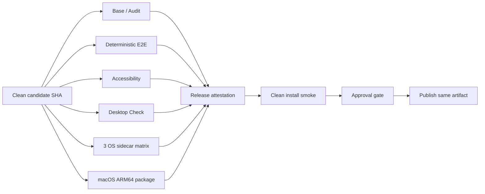

# 0.1.0 Release Stabilization / SHA Provenance 実装計画

## Status

implementation

## Implementation Progress

2026-07-10 時点で、repository内の実装は完了し、local verificationとCI待ちの段階にある。

### Implemented

- staleなTauri resource参照の除去とtracked resource readiness check
- packaged / debug desktop origin契約の分離とRust test
- backend bundle buildのVitest 5秒境界からDesktop verification taskへの移動
- macOS matrix targetのARM64整合とfrontend staging input追加
- secret allowlist型のDesktop preflight / postmortem diagnostics
- Accessibility / Desktop matrixのreusable workflow化とrelease check evidence
- required check ID、full SHA、workflow run / attemptを照合するrelease attestation
- source SHA、runner target、tool versions、attestation digestを持つartifact manifest v2
- attested artifactをdownloadして公開するだけのpublish job

### Local Validation

- `test:desktop-runtime`: 44 tests passed
- Rust desktop origin tests: 2 tests passed
- release / workflow contract tests: 23 tests passed
- `verify:release`: metadata、docs、typecheck、lint、Supervisor regression、全Vitest、
  deterministic E2E、demo、dependency audit、Desktop runtime / lint / build / smokeが成功
- deterministic E2E: required 37件中37件成功、P0 / weighted coverage 100%
- Accessibility: populated Project Qualityを含むrequired scenarioが成功
- `actionlint`: 成功
- Activity ledger: Task / Repository cascade削除前のqueue flushと大量batchの回帰テストが成功

### Validation Remaining

- GitHubへpushしていないため、macOS / Linux / Windows runnerのsame-SHA attestationは未実行である。
- `release` environmentのapproval ruleとmain branch protectionはrepository外部設定として未適用である。

上記は本計画のコード未実装ではない。CI実行とrepository設定が完了するまで
本計画をarchiveへ移動しない。

## Purpose

NightWorkers 0.1.0 の機能範囲を広げず、現在の実装を次の状態へ収束させる。

- clean な単一 Git SHA に対して必須 gate が成功する。
- Desktop の既知の決定論的失敗が解消される。
- 検証済み SHA と配布 artifact の対応を機械的に追跡できる。
- 受け入れ確認後に artifact を再 build せず、そのまま公開できる。
- 失敗時に、次の調査で必要になる最低限の診断情報が必ず残る。

本計画は新しい release 基盤を一から作るものではない。既存の
`scripts/verify.mjs`、Desktop scripts、release metadata、GitHub Actions を正本とし、
現在不足している契約と証跡だけを補う。

## Background

2026-07-10 の `db81a1bd` では、GitHub Actions の Base、E2E、Accessibility は成功し、
Desktop Check と Desktop matrix が失敗している。

確認済みの失敗は次のとおり。

1. production desktop bootstrap test が debug 用の
   `http://localhost:39174` を期待している。
2. `desktop-backend-bundle.test.ts` が process build を実行し、CIでは既定の5秒を超える。
3. Tauri resource に、clean checkout には存在しない
   `../api/services/procedures/builtin` が残っている。
4. Desktop matrix が frontend `dist` を作らずに sidecar staging を開始し、3 OSとも失敗する。
5. `macos-14` runner の実体は ARM64 だが、matrix の期待 target は `darwin:x64` である。

また、現在の release 実装には次の強みがある。

- `release:create` は検証前に clean worktree を要求する。
- `verify:release` の前後で HEAD と worktree が変化していないことを確認する。
- artifact manifest は version、tag、SHA-256、size、signing、notarization 状態を持つ。
- Desktop matrix は macOS、Linux、Windowsを独立 job とし、fail-fastを無効にしている。
- Accessibility は専用 workflow とシナリオ catalog を持つ。

したがって、既存機能を別実装で置き換えず、次の不足を埋める。

- Desktop gate の入力前提とenvironment契約の不一致。
- `verify:release` 単体では表現できない、同一SHAのcross-runner結果集約。
- artifact manifest における source SHA / workflow / runner provenance。
- staging開始前または途中で失敗した場合の診断artifact。

## Baseline Evidence

実装開始時に、以下をPR本文または実装runの証跡へ記録する。

```bash
git rev-parse HEAD
git status --short
node scripts/verify.mjs base --list
node scripts/verify.mjs desktop --list
node scripts/verify.mjs release --list
```

2026-07-10 の比較元:

- candidate以前のHEAD: `db81a1bdb344429f54c02161641c678ba70b5f9c`
- Desktop Check failure:
  `https://github.com/ugnoguchigxp/nightWorkers/actions/runs/29069795266`
- Desktop matrix failure:
  `https://github.com/ugnoguchigxp/nightWorkers/actions/runs/29069795224`
- Base success:
  `https://github.com/ugnoguchigxp/nightWorkers/actions/runs/29069795238`
- E2E success:
  `https://github.com/ugnoguchigxp/nightWorkers/actions/runs/29069795257`
- Accessibility success:
  `https://github.com/ugnoguchigxp/nightWorkers/actions/runs/29069795219`

このSHAやrun URLは変更後の成功証明ではなく、変更前の比較対象としてのみ扱う。

## Locked Decisions

1. 0.1.0 の配布対象は現在のrelease workflowと同じ macOS ARM64 とする。
2. Linux / Windows は0.1.0ではsidecar preparation、target manifest、readinessの互換性gateとし、
   package配布を本計画へ追加しない。
3. 3 OS配布へ変更する場合は、本計画の途中で暗黙に広げず、support matrixとpackaged smokeを
   別計画で追加してからrelease candidateを作り直す。
4. `verify:release` のclean worktree / HEAD固定契約は維持し、別のSHA固定機構を並立させない。
5. Cross-OS / Accessibility の成功は、単一macOS processへ詰め込まず、同じSHAをcheckoutした
   CI jobsの結果として集約する。
6. production packageではVite dev originを許可しない。
7. `127.0.0.1:39174` と `localhost:39174` はdebug desktop launcherが明示的に渡した場合だけ許可する。
8. bundle buildはUnit testの5秒契約で評価せず、Desktop verificationの明示的なbuild taskとして扱う。
9. 全release gateの3回連続実行は必須にしない。今回flakyの可能性があるbundle / sidecar stageだけを
   条件を変えて反復する。
10. mainをfeature freezeできる間は長期release branchを作らない。短期stabilization PRと
    required checksを使用する。
11. candidate acceptance後のpublishではartifactを再buildしない。
12. 巨大component分割、一般的なsecurity backlog、Windows / Linux packagingは対象外とする。

## Release Evidence Flow



`Release attestation` は文章による自己申告ではなく、job results、source SHA、artifact digestを
結び付ける機械可読JSONとする。

## Out of Scope

- 新機能追加。
- `ArtifactPane.tsx` や `PlanModeWorkspaceViewer.tsx` の分割。
- 全テストの一括リファクタリング。
- source string assertionの全件撤廃。
- Windows / Linux のinstaller作成と配布。
- Intel macOS packageの追加。
- code signing credential、notarization credential、Store submission。
- dependency policyの閾値変更。
- live LLM providerをrelease blockingにすること。
- release失敗時のgate bypass。
- worker runtime、Supervisor workflow、Run Control Kernelの機能変更。
- 現在進行中の別実装をrelease candidateへ自動的に含めること。

## Phase 0: Candidate Boundary / Baseline

### Goal

変更対象と候補SHAを混同せず、release stabilizationを開始できる状態にする。

### Tasks

1. 現在のdirty treeを機能単位で整理し、本計画の変更と同じcommitへ混ぜない。
2. `origin/main` とcandidateに含めるcommit一覧を確認する。
3. 上記Baseline Evidenceを保存する。
4. GitHub required checksに使用する安定したjob名を列挙する。
5. 0.1.0 support matrixが次であることをrelease noteと照合する。
   - macOS ARM64: package / packaged smoke対象。
   - Linux x64: sidecar compatibility対象。
   - Windows x64: sidecar compatibility対象。
6. baseline採取後に別機能がmergeされた場合、candidate SHAを更新してbaselineを採り直す。

### Stop Conditions

- candidateに含める変更が確定していない。
- dirty treeの所有境界が不明。
- 0.1.0で3 OS packageを配布するという別のproduct decisionがある。

## Phase 1: Desktop Contract Stabilization

### 1.1 Tauri resource contract

#### Problem

`src-tauri/tauri.conf.json` がclean checkoutにない
`../api/services/procedures/builtin` をresourceとして要求し、cargo/Tauri buildが失敗する。

#### Implementation

1. runtimeが現在利用しているresource rootを確認する。
2. Supervisor built-in skillへ統合済みで参照元がない場合、stale resource entryを削除する。
3. 実行時に必要なファイルがある場合だけ、正しいtracked pathへ置き換える。
4. `desktop:check:cross-platform` に次を追加する。
   - Tauri `bundle.resources` の各pathが存在する。
   - directoryの場合はtracked fileを1件以上含む。
   - `scripts/desktop/staged` のような生成先は、明示された例外として扱う。
5. resource pathの文字列だけを期待するテストは追加せず、filesystem上の成立性を検証する。

#### Candidate Files

- `src-tauri/tauri.conf.json`
- `scripts/desktop/check-cross-platform-readiness.mjs`
- `tests/runtime-paths.test.ts` または専用Desktop readiness test

#### Acceptance

- clean checkoutでDesktop lintがmissing resourceにより失敗しない。
- runtimeに必要なSupervisor skill resourcesがpackageへ残る。

### 1.2 Desktop origin policy

#### Problem

TypeScript bootstrap、Rust launcher、security testでdebug / productionの期待が一致していない。

#### Canonical Policy

| mode | API origin | Tauri origins | Vite dev origins |
| --- | --- | --- | --- |
| packaged production | dynamic `127.0.0.1:<api-port>` | `http://tauri.localhost`, `tauri://localhost` | deny |
| desktop debug | dynamic `127.0.0.1:<api-port>` | same as production | allow both `127.0.0.1:39174`, `localhost:39174` |
| non-desktop production | configured origin policy | none by default | deny |

#### Implementation

1. `ensureDesktopRuntimeBootstrap` はAPI origin、Tauri origins、明示された `CORS_ORIGIN` のmergeに限定する。
2. Rust desktop launcherはdebug build時だけ2つのVite originを `CORS_ORIGIN` へ渡す。
3. production testから暗黙の `localhost:39174` 期待を削除する。
4. configured originをbootstrapが失わないことを既存testで維持する。
5. debug / productionの表形式testを追加する。
6. unauthenticated non-loopback bind拒否の既存契約を変更しない。

#### Candidate Files

- `api/runtime/bootstrap.ts`
- `src-tauri/src/main.rs`
- `tests/runtime-bootstrap.test.ts`
- `tests/routes.security-hardening.test.ts`
- `tests/config-listen-security.test.ts`

#### Acceptance

- production packageがVite originを許可しない。
- debug desktopではViteのhost表記差により接続が壊れない。
- loopback / auth boundaryの既存testが成功する。

### 1.3 Backend bundle verification boundary

#### Problem

Vitest caseが実process buildを行うため、Unit test既定5秒の対象になっている。
build script自身はbundle生成とNode syntax validationをすでに行っている。

#### Implementation

1. `desktop-backend-bundle.test.ts` からbuild process executionを外す。
2. `scripts/verify.mjs` のDesktop phasesに `desktop-backend-build` taskを明示する。
3. taskは `bun run build:backend:desktop` を実行し、既存scriptのsyntax validationを利用する。
4. `test:desktop-runtime` はfast contract / runtime testsだけを実行する。
5. verify script testでDesktop targetにbuild taskが含まれ、build/smokeより前に実行されることを検証する。
6. timeoutを追加する場合はverify task全体の上限として設定し、5秒を任意の30秒へ置換するだけにしない。

#### Candidate Files

- `scripts/verify.mjs`
- `package.json`
- `tests/desktop-backend-bundle.test.ts`
- `tests/verify-script.test.ts`

#### Acceptance

- Desktop runtime testsがCIマシンのbuild速度に依存しない。
- backend bundle生成またはsyntax validation失敗はDesktop gateを確実に赤にする。
- bundle buildのstdout / stderrがverify failure出力へ残る。

### 1.4 Matrix staging prerequisites / target identity

#### Problem

Desktop matrixはfrontend `dist` を生成せずに `desktop:prepare-sidecar` を実行する。
また、macOS runnerの実archと期待targetが一致していない。

#### Implementation

1. matrixのPrepare sidecar前に `bun run build:frontend` を追加する。
2. `desktop:prepare-sidecar` を暗黙にfrontendもbuildするcommandへ変更しない。
   Tauriの `beforeBuildCommand` と二重buildになるため、stagingの入力契約を維持する。
3. macOS期待targetをrunnerの実体に合わせ `darwin:arm64` へ修正する。
4. 各jobの開始時に `process.platform` / `process.arch` とmatrix targetが一致するpreflightを実行する。
5. target manifest verificationは生成manifestを自己承認せず、matrixで宣言したexpected targetと比較する。
6. frontend build、backend build、staging、manifest verify、readiness smokeの境界をjob summaryへ残す。

#### Candidate Files

- `.github/workflows/desktop-matrix.yml`
- `scripts/desktop/platform-targets.mjs`
- `scripts/desktop/verify-target-manifest.mjs`
- `tests/desktop-matrix-workflow.test.ts`

#### Acceptance

- clean runnerのmacOS / Linux / Windowsでstaging source不足が発生しない。
- 各manifestのplatform / arch / native packages / Node executableが期待targetと一致する。
- 3 OS jobが独立して結果を残す。

### 1.5 Failure diagnostics

#### Implementation

1. staging前に常に `artifacts/desktop-preflight.json` を生成する。
2. preflightへ次を記録する。
   - `GITHUB_SHA` またはlocal HEAD。
   - workflow run ID / attempt（CIの場合）。
   - platform / arch / expected target。
   - Bun / Node / Rust / Cargo / Tauri version。
   - `dist` / `dist-api-desktop` / staged rootの存在状態。
3. job終了時に成功・失敗を問わずpostmortem情報を生成する。
   - staged manifest（存在する場合）。
   - staged file listと実行権限。
   - bundle directory list。
   - smoke log、desktop log、sidecar logの存在状態と末尾。
4. `actions/upload-artifact` は常に `artifacts/**` を対象にする。
5. primary logが存在しない場合でもpreflight / postmortemが最低1ファイル残るようにする。
6. secretを含む環境変数の値は保存せず、allowlistしたversion / path / target情報だけを出す。

#### Candidate Files

- `.github/workflows/desktop-check.yml`
- `.github/workflows/desktop-matrix.yml`
- `scripts/desktop/collect-diagnostics.mjs`（新規候補）
- diagnostics script test

#### Acceptance

- prepare-sidecar開始前に失敗してもdiagnostic artifactが空にならない。
- 失敗箇所、source SHA、runner target、入力artifactの有無をdownload後に判定できる。
- secret値がartifactへ含まれない。

## Phase 2: Same-SHA Gate Aggregation

### Goal

「各gateがどこかで成功した」ではなく、「同じcandidate SHAに対する必須結果が揃った」ことを
機械的に判定する。

### Required Check Groups

| group | required evidence |
| --- | --- |
| base | tracked artifact、typecheck、lint、Supervisor regression |
| audit | High / Critical dependency policy |
| e2e | required deterministic scenario IDs、pass rate、flake policy |
| accessibility | required `NW-E2E-A11Y-*` scenario IDs |
| desktop-check | runtime contracts、Rust fmt/clippy、backend build、macOS package smoke |
| desktop-matrix | macOS ARM64、Linux x64、Windows x64 sidecar readiness |
| package | macOS ARM64 artifact、checksum、packaged smoke |

### Implementation

1. release candidate用workflowを追加するか、現行release workflowをjob graphへ分割する。
2. すべてのjobはworkflow開始時に解決した同じfull SHAをcheckoutする。
3. tag名やbranch名ではなくfull SHAをattestationのsource identityとする。
4. final attestation jobはすべてのrequired jobsを `needs` で待つ。
5. required jobがcancel / skip / failureの場合、attestationをpassedにしない。
6. Accessibilityをlocal macOS `verify:release` processへ重複追加するのではなく、
   same-SHA required jobとして集約する。
7. E2E / Accessibilityの完全性はspec file数ではなくscenario catalogのrequired IDで判定する。
8. `verify:release` はlocal / single-runner deterministic gateとして維持する。
9. Cross-runner attestationを正式公開の追加条件にする。

### Candidate Files

- `.github/workflows/release.yml`
- `.github/workflows/release-candidate.yml`（分離する場合）
- `scripts/verify.mjs`
- `scripts/e2e-scenario-coverage.mjs`
- `tests/e2e-scenario-coverage.test.ts`
- workflow contract tests

### Attestation Contract

```ts
interface ReleaseAttestationV1 {
  schemaVersion: "nightworkers.release-attestation/v1";
  version: string;
  source: {
    repository: string;
    commitSha: string;
    workflowName: string;
    workflowRunId: string;
    workflowRunAttempt: number;
  };
  checks: Array<{
    id: string;
    jobId: string;
    commitSha: string;
    conclusion: "success";
    runnerOs: string;
    runnerArch: string;
    evidenceArtifact: string;
  }>;
  artifact: {
    filename: string;
    sha256: string;
    size: number;
    target: "darwin:arm64";
  };
  verification: {
    command: "bun run verify:release";
    status: "passed";
  };
  generatedAt: string;
}
```

### Validation Rules

- `commitSha` は40桁full SHAである。
- workflowがcheckoutしたSHAとmanifest / attestation SHAが一致する。
- 各required checkの `commitSha` がsource SHAと一致する。
- artifact manifestとattestationのversion、filename、SHA-256、sizeが一致する。
- required check IDに欠落・重複・unknownがない。
- required checkのconclusionはすべて `success` である。
- macOS artifact targetは実runnerと一致する。
- verification statusは外部入力だけで任意に `passed` にできない。

## Phase 3: Artifact Provenance / Publish Without Rebuild

### 3.1 Manifest extension

#### Implementation

1. `nightworkers.release-artifacts/v1` を後方互換で拡張するか、v2へ上げるかを決める。
2. 最低限次をartifact manifestへ追加する。
   - source commit SHA。
   - workflow run ID / attempt。
   - runner OS / arch / target triple。
   - Bun / Node / Rust / Tauri version。
   - attestation filename / digest。
3. CIでは `GITHUB_SHA`、localでは `git rev-parse HEAD` をsource SHAとする。
4. `verifyReleaseMetadata` でprovenance fieldと実artifactを検証する。
5. user supplied SHAだけを信用せず、checkout / Gitから解決した値と照合する。
6. CI publishでは `--verification-status passed` の自己申告だけを受理せず、
   検証済みattestation fileを入力にしてstatusとsource SHAを導出する。
7. local dry-runではattestation未作成を許容しても、tag / publishでは必須にする。

#### Candidate Files

- `scripts/release/create-artifact-manifest.mjs`
- `scripts/release/release-metadata.mjs`
- `scripts/release/create-release.mjs`
- `tests/p3-release-demo.test.ts`
- release metadata tests

### 3.2 Candidate and approval flow

1. package version `0.1.0` のclean candidate SHAからartifactを一度だけbuildする。
2. candidate artifact、manifest、attestation、SBOMを同じworkflow runに保存する。
3. clean環境で次のacceptance smokeを行う。
   - 新規install / 展開。
   - application起動。
   - sidecar readiness。
   - Project Folder登録。
   - credential-free demoまたはfixture run。
   - application終了とsidecar終了。
   - 既存DBコピーからの起動 / migration。
   - 強制終了後の再起動。
4. acceptance完了後、approval gateを通過したjobが同じartifactをpublishする。
5. publish jobはsourceを再checkoutして再buildしない。
6. publish直前にartifact / manifest / attestationのdigestを再検証する。
7. tagはattestationのsource SHAを指す。

### SemVer RCとの境界

`0.1.0-rc.1` をpackage versionとしてbuildし、その後 `0.1.0` へversion変更する場合、
最終artifactは同一ではない。その方式を採る場合はfinal buildを新しいcandidateとして全gateへ戻す。

同一artifact昇格を優先する本計画では、versionは `0.1.0` のまま、公開前のworkflow artifactまたは
draft release assetとして受け入れ確認する。

## Phase 4: Branch Protection / Stabilization Operation

### Implementation / Operation

1. Phase 1とPhase 2がgreenになるまでは、壊れたcheckをrequiredにして開発を完全停止させない。
2. green確認後、mainに次のrequired checksを設定する。
   - Base and dependency policy。
   - Deterministic E2E。
   - Accessibility。
   - Desktop Check。
   - Desktop matrix 3 jobsまたはaggregate job。
3. direct pushを禁止し、stabilization変更はPR経由にする。
4. feature PRは0.1.0 publishまでmergeしない。
5. release blocker fix以外が必要になった場合、release対象へ含める理由と追加gateを明示する。
6. mainでfeature開発を継続する必要が生じた場合だけ、candidate SHAから短命のrelease branchを作る。
7. branch protection / ruleset設定はrepository外部状態としてスクリーンショットまたはAPI結果を残す。

## Verification Strategy

### Focused verification during implementation

各変更の直後に、最小の関連検証を実行する。

```bash
bun run test:desktop-runtime
bun run desktop:check:cross-platform
node scripts/desktop/build-backend.mjs
node scripts/verify.mjs desktop --list
node scripts/verify.mjs release --list
```

変更したtest群は明示pathで実行し、失敗が既存dirty tree由来か対象変更由来かを分ける。

### Local integration verification

macOSで次を順に実行する。

```bash
bun run verify:base
bun run verify:desktop
bun run verify:e2e
node scripts/verify.mjs accessibility
bun run verify:audit
```

release candidateを作るclean treeでは次を実行する。

```bash
bun run verify:release
```

### CI verification

- Base、E2E、Accessibility、Desktop Check、Desktop matrixが同じfull SHAを記録する。
- matrixの3 OSが独立して成功する。
- final attestation jobがrequired check欠落時に失敗する。
- failure injectionで、1 job failureをaggregate successとして扱わない。
- artifact manifestのSHA改変、digest改変、target改変を検出する。

### Flake verification

全release workflowを無条件に3回実行しない。今回不安定性が疑われた境界だけを反復する。

1. backend bundle buildをcold cacheで3回成功させる。
2. macOS sidecar staging / readinessをcold cache 1回、warm cache 2回成功させる。
3. Linux / Windows sidecar readinessを少なくとも2回の別run attemptで成功させる。
4. 反復中に一度でも失敗した場合、単純rerunで緑にせず原因を分類する。
5. deterministic failureはflake統計へ逃がさず修正する。

## Test Cases

### Desktop resources

- tracked resource directoryは成功する。
- missing resourceはreadiness checkでbuild前に失敗する。
- empty untracked directoryをresource成功とみなさない。
- generated staged directoryは許可された例外として扱う。

### Origin policy

- packaged productionはdynamic API originとTauri originsだけを持つ。
- desktop debugは2つのVite originsを追加する。
- configured CORS originはmerge後も残る。
- duplicate originは1件に正規化される。
- unauthenticated non-loopback bindは拒否される。

### Bundle / staging

- backend build failureがDesktop phase failureになる。
- syntax invalid outputが成功にならない。
- frontend `dist` 不在時にstagingが明示的に失敗する。
- workflowはstaging前にfrontendをbuildする。
- target mismatchはmanifest verificationで失敗する。
- Windowsだけ `node.exe` を要求する。

### Diagnostics

- build前失敗でもpreflight artifactが残る。
- manifest未生成でもpostmortem artifactが残る。
- success時もsource SHA / tool versions / targetを追跡できる。
- envのsecret値が出力されない。

### Attestation / release

- required check欠落で失敗する。
- skipped / cancelled checkで失敗する。
- 異なるSHAのjob結果を混在させると失敗する。
- artifact digest改変で失敗する。
- runner targetとartifact target不一致で失敗する。
- verify failure時にtag / publishへ進まない。
- acceptance後のpublish jobがbuild commandを実行しない。

## Commit Boundaries

変更は次の順でレビュー可能なcommitへ分ける。

1. `fix(desktop): align packaged resources and origin contracts`
2. `test(desktop): move backend build out of vitest timeout boundary`
3. `fix(ci): provide desktop staging inputs and target preflight`
4. `chore(ci): persist desktop failure diagnostics`
5. `feat(release): aggregate required checks for one source sha`
6. `feat(release): attest artifact source and publish without rebuild`
7. `chore(release): enable required checks for stabilization`

各commitは前段の契約を壊さず、可能な範囲で単独revertできるようにする。
branch protectionの外部設定はコードcommitと混同せず、適用結果を別証跡に残す。

## Definition of Done

次のすべてを満たした場合だけ本計画を完了とする。

- candidate SHAがclean worktreeから確定している。
- Base、Audit、E2E、Accessibility、Desktop Check、Desktop matrixが同じSHAで成功している。
- macOS ARM64 packageとpackaged smokeが成功している。
- Linux x64 / Windows x64 sidecar readinessが成功している。
- required E2E / Accessibility scenario IDにunmapped、unexpected skip、flake違反がない。
- Desktop失敗時にpreflight / postmortem artifactが必ず残る。
- release attestationがsource SHA、required jobs、artifact digestを結び付けている。
- artifact manifestがsource SHA、workflow run、runner target、checksumを持つ。
- clean install / upgrade / shutdown smokeが候補artifactそのものに対して成功している。
- tagがattestationのsource SHAを指している。
- acceptanceからpublishまでartifactが再buildされていない。
- mainのrequired checksとdirect push制限が適用されている。
- release noteのsupport matrixが実際の配布範囲と一致している。
- 関係のない機能追加やcomponent refactorが混入していない。

## Rollback Rules

1. gate所要時間だけを理由に検査を削除しない。
2. Desktop matrixが不安定な場合、OS jobを非blockingに戻す前にfailure categoryを記録する。
3. diagnosticsがsecretを含む場合、artifact公開を停止してredactionを修正する。
4. attestationが異なるSHAを受理した場合、release automationを停止し、tag / publishを行わない。
5. publish without rebuildが成立しない場合、同一artifactであると表示せず、新buildを新candidateとして再検証する。
6. branch protectionが通常開発を不必要に停止する場合、required checkを削除するのではなく、
   workflow trigger / path filter / job dependencyを修正する。

## Post-Release Follow-ups

次は0.1.0公開後に別計画として扱う。

- Windows / Linux installerとpackaged smoke。
- Intel macOS artifact。
- signing / notarizationの本番credential投入。
- workspace traversal、symlink、command policy、secret leakageの包括的security regression拡張。
- source-text based testの全体監査。
- 巨大UI componentの責務分割。
- release latencyの最適化とartifact cacheの共有。

完了後、本計画書は検証結果と最終SHAを追記して `spec/archive/` へ移動する。
