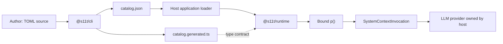

# S11t v0.1 実装計画

## Status

- Plan status: `ready_for_implementation_review`
- Document created: 2026-07-21
- Target repository: `/Users/y.noguchi/Code/S11t`
- Source proposal: `spec/docs/s11t-oss-project-proposal.md`
- Primary distribution: public npm packages
- Official runtime target: Node.js backend
- Authoring format: TOML
- Runtime artifact format: JSON
- Reference implementation: TypeScript

この文書を、S11tの最初の実装とnpm公開に対する実装正本とする。

構想書は将来のeval、experiment、promotion、optimizerまで含む。対して本計画は、利用者が
TOMLでSystemContextを編集し、CLIが決定的なJSON artifactとTypeScript型を生成し、実行時に
filesystem非依存のruntimeがJSON objectから型付き`p()`を提供するところまでに限定する。

## 1. 目的

次のdeveloper experienceを成立させる。

```text
contexts/*.context.toml
        │
        │ s11t lint / s11t build
        ▼
.s11t/catalog.json
.s11t/catalog.generated.ts
        │
        │ applicationがJSONを任意の方法で取得
        ▼
createCatalog(json)
        │
        │ request単位でlocaleをbind
        ▼
p("codingAgent:identity", { taskGoal })
        │
        ▼
SystemContextInvocation<string> + manifest
```

完了時には、次を満たす。

1. SystemContext編集者はTOMLだけを編集する。
2. application runtimeはTOMLをparseせず、生成済みJSON artifactだけを利用する。
3. runtime packageは`node:*` builtin、filesystem、process、databaseへ依存しない。
4. runtimeはJSONの保存場所や取得方法を所有しない。
5. SystemContext key、必須runtime値、output kindをTypeScriptで補助できる。
6. TypeScriptの構造的型付けだけに依存せず、runtimeでも入力を検証する。
7. 同じsourceとcompiler versionから同じJSON artifactとhashが生成される。
8. packしたnpm tarballを隔離consumerへinstallして利用できる。

## 2. 現状ベースライン

2026-07-21時点で、対象directory `/Users/y.noguchi/Code/S11t` は空であり、Git repositoryとして
初期化されていない。package、source、test、CI、release設定は存在しない。

既存の設計資料はNightWorkers repositoryの次の文書にある。

```text
/Users/y.noguchi/Code/nightWorkers/spec/docs/s11t-oss-project-proposal.md
```

NightWorkersのworktreeにはS11tと無関係な未コミット変更がある。本計画の実装では、それらを
取り込んだり、修正したり、破棄したりしない。NightWorkers integrationはpack済みtarballを
利用する独立したconsumer検証としてだけ扱う。

実装開始時に次を記録する。

```bash
test -d /Users/y.noguchi/Code/S11t
find /Users/y.noguchi/Code/S11t -maxdepth 2 -type f -print
git -C /Users/y.noguchi/Code/nightWorkers status --short --branch
```

## 3. Locked Decisions

### 3.1 Product boundary

1. S11tはbackend-firstなSystemContext authoring / compile / runtime libraryとする。
2. LLM provider呼び出し、Agent orchestration、authorization、tool実装を所有しない。
3. frontend integration、browser loader、browser exampleはv0.1で提供しない。
4. runtimeのpure TypeScript部分には不要なNode APIを混入させない。
5. browserでbundle可能な性質は依存規律として維持するが、browserを公式の主要用途にしない。

### 3.2 Package boundary

初期の公開packageは2つだけとする。

| Package | Responsibility | Node builtin |
| --- | --- | --- |
| `@s11t/runtime` | pure compiler、JSON artifact validation、catalog、locale解決、値のrender、`p()`、manifest | 使用しない |
| `@s11t/cli` | TOML読込、source validation、lint、compile、typegen、JSON/file出力 | 使用可 |

`@s11t/core`、`@s11t/node`、`@s11t/toml`は公開しない。runtime内部はmodule単位で分割するが、
npm package境界にはしない。

`@s11t/eval`、`@s11t/experiments`、`@s11t/optimizer`は対応する実装を開始するまで作成・公開しない。

`@s11t` scopeを取得できない場合のfallback名は公開前gateで決定する。scope未確定を理由にlocal
実装を止めないが、取得できていない名前でpublic publishしない。

### 3.3 Authoring and runtime formats

1. TOMLは人間が編集するauthoring sourceである。
2. JSONはCLIが生成するportable runtime artifactである。
3. TOMLをruntime artifactとして配布しない。
4. runtimeはTOML parserをdependencyに持たない。
5. JSON artifactはruntime値を展開する前のcompiled templateを保持する。
6. `taskGoal`等のrequest固有値、rendered SystemContext本文、user messageをartifactへ保存しない。
7. JSON artifactの取得はapplicationが所有する。filesystem、database、object storage、HTTP、
   static importのいずれもruntime contract外とする。

### 3.4 v0.1 feature boundary

v0.1に含める。

- 1 SystemContext ID = 1 TOML file。
- source localeとtranslationを同一fileに記述。
- simple text context。
- sectioned text context。
- `namespace:key`形式のID。
- `ja-JP`、`en-US`を含む任意のBCP 47 locale string。
- 明示的なlocale fallback。
- 必須runtime variable。
- `trusted` / `untrusted`分類。
- `raw`、`json-string`、`json-value` encoding。
- `[[variableName]]` interpolation。
- schema validation、lint、build、typegen。
- deterministic definition hash、artifact hash、release digest、catalog digest。
- 同期`p()`とimmutable manifest。

v0.1に含めない。

- message配列output。
- optional runtime variable。
- 条件分岐、pluralization、日付・数値format。
- locale別file分割。
- model profileによる本文override。
- remote registry、stable manifest、promotion、rollback。
- offline LLM eval、online A/B test、optimizer。
- provider adapter、database adapter、observability platform adapter。
- usage token、exposure commit、usage collector。
- watch mode、development server、hosted UI。
- frontend専用packageまたはbrowser loader。

`output = "messages"`、`required = false`、profile override等の予約fieldがsourceに現れた場合、
CLIは黙って無視せず、未対応を示す安定したdiagnostic codeで失敗する。

### 3.5 Module and platform policy

1. npm packageはESM-onlyとする。
2. TypeScript declarationを同梱する。
3. CLIのNode engineは`>=22`とする。
4. CIはNode 22とNode 24で実行する。
5. runtime packageも公式support matrixはNode 22 / 24とするが、sourceではNode builtinを使わない。
6. TypeScriptはstrict modeを有効にする。
7. buildは最初に`tsc -b`を使用し、bundle toolを必須にしない。
8. public exportは`package.json#exports`に列挙し、internal path importを許可しない。

Node 22 / 24は計画作成時点でNode.js公式のLTS lineであり、Node 20はEOLのため対象外とする。
support状況は[Node.js Releases](https://nodejs.org/en/about/previous-releases)を公開前に再確認する。

## 4. Target Architecture



責務境界は次の通りとする。

```text
CLI
  owns:
    - source file discovery
    - filesystem read/write
    - TOML parsing
    - authoring schema validation
    - source location付きcanonical definitionへの変換
    - artifact/type file emission

Runtime
  owns:
    - canonical definitionからJSON artifactを作るpure compiler
    - interpolation compilation
    - canonical JSON generationとhash
    - artifact object validation
    - catalog lookup
    - locale resolution
    - runtime value validation
    - encoding and rendering
    - invocation manifest generation

Host application
  owns:
    - artifact storage and retrieval
    - request/run locale selection
    - provider request assembly
    - provider call and retry
    - authorization and tool enforcement
    - trace persistence
```

## 5. Repository Layout

```text
s11t/
  .changeset/
  .github/
    workflows/
      ci.yml
      canary.yml
      release.yml
  docs/
    specification/
      artifact-v1.md
      authoring-v1.md
      diagnostics-v1.md
    guides/
      getting-started.md
      backend-integration.md
  examples/
    node-basic/
      contexts/
      src/
      package.json
  fixtures/
    valid/
      simple/
      sectioned/
      multilingual/
    invalid/
      duplicate-id/
      missing-locale/
      undeclared-variable/
      unsafe-untrusted-raw/
      unsupported-output/
  packages/
    runtime/
      src/
        artifact-schema.ts
        canonical-definition.ts
        catalog.ts
        compiler.ts
        diagnostics.ts
        encoding.ts
        hash.ts
        index.ts
        locale.ts
        render.ts
        types.ts
      tests/
      LICENSE
      NOTICE
      README.md
      package.json
      tsconfig.json
    cli/
      src/
        authoring-schema.ts
        bin.ts
        build-command.ts
        compile-source.ts
        config.ts
        diagnostics.ts
        discover.ts
        emit-artifact.ts
        emit-types.ts
        index.ts
        lint-command.ts
        toml-loader.ts
      tests/
      LICENSE
      NOTICE
      README.md
      package.json
      tsconfig.json
  schemas/
    s11t-artifact-v1.schema.json
    s11t-authoring-v1.schema.json
  test-consumer/
    esm-node/
  package.json
  pnpm-lock.yaml
  pnpm-workspace.yaml
  tsconfig.base.json
  tsconfig.json
  LICENSE
  NOTICE
  README.md
  SECURITY.md
  CONTRIBUTING.md
```

## 6. Source Contract

### 6.1 Project config

CLIはrepository rootの`s11t.config.toml`を既定で読む。

```toml
schema_version = 1
source_dir = "contexts"
out_dir = ".s11t"
required_locales = ["ja-JP", "en-US"]
default_locale = "ja-JP"
```

v0.1ではconfig探索をrepository rootから上位へ暗黙に行わない。commandのcurrent directoryにある
config、または`--config`で明示したfileだけを使用する。

### 6.2 Simple context

```toml
schema_version = 1

[context]
id = "structuredOutput:repair"
version = "1.0.0"
owner = "structured-output"
source_locale = "ja-JP"
required_locales = ["ja-JP", "en-US"]
output = "text"

[variables.rawText]
required = true
type = "string"
trust = "untrusted"
placement = "delimited-context"
encoding = "json-string"

[locales."ja-JP"]
text = '''
元の回答の意味を維持し、構文と契約違反だけを修復してください。

<ORIGINAL_RESPONSE_JSON_STRING>
[[rawText]]
</ORIGINAL_RESPONSE_JSON_STRING>
'''

[locales."en-US"]
text = '''
Preserve the original meaning and repair only syntax and contract violations.

<ORIGINAL_RESPONSE_JSON_STRING>
[[rawText]]
</ORIGINAL_RESPONSE_JSON_STRING>
'''
```

### 6.3 Sectioned context

```toml
schema_version = 1

[context]
id = "codingAgent:identity"
version = "1.0.0"
owner = "coding-agent"
source_locale = "ja-JP"
required_locales = ["ja-JP", "en-US"]
output = "text"

[variables.taskGoal]
required = true
type = "string"
trust = "untrusted"
placement = "delimited-context"
encoding = "json-string"

[[sections]]
id = "role.identity"
kind = "instruction"
severity = "must"
enforcement = "prompt"
optimizable = false

[sections.locales."ja-JP"]
text = "あなたはユーザーTaskを自動化するCoding Agentです。"

[sections.locales."en-US"]
text = "You are a Coding Agent that automates user tasks."

[[sections]]
id = "task.goal-context"
kind = "runtime-fact"
severity = "should"
enforcement = "prompt"
optimizable = false

[sections.locales."ja-JP"]
text = '''
<TASK_GOAL_JSON_STRING>
[[taskGoal]]
</TASK_GOAL_JSON_STRING>
'''

[sections.locales."en-US"]
text = '''
<TASK_GOAL_JSON_STRING>
[[taskGoal]]
</TASK_GOAL_JSON_STRING>
'''
```

section配列のsource orderをcompile orderとする。section間は単一のLFで結合し、最終textは
単一LFで終える。

### 6.4 Interpolation rules

1. 記法は`[[identifier]]`に固定し、設定可能にしない。
2. identifierは`^[A-Za-z][A-Za-z0-9_]*$`とする。
3. placeholderは宣言済みvariableだけを参照できる。
4. 宣言済みvariableは最低1箇所で参照されなければならない。
5. v0.1のvariableはすべて`required = true`とする。
6. `type`は`string`、`number`、`boolean`、`json`のいずれかを明示する。
7. 同じvariableの複数参照は許可する。
8. nested path、function call、condition、format指定を許可しない。
9. `[[`または`]]`をliteralとして記述するescape syntaxはv0.1で提供しない。必要なsourceは
   Unicode escape等で意図を明示する。

CLIはtextをruntimeで再parseさせず、literal segmentとvariable segmentの配列へcompileする。

```ts
type TemplateSegment =
	| { type: "literal"; value: string }
	| { type: "variable"; name: string };
```

### 6.5 Encoding rules

runtimeが公開するJSON value型は次に固定する。

```ts
type JsonValue =
	| null
	| boolean
	| number
	| string
	| JsonValue[]
	| { [key: string]: JsonValue };
```

| Encoding | Compatible variable type | Rendering |
| --- | --- | --- |
| `raw` | `string` | そのまま挿入 |
| `json-string` | `string` / `number` / `boolean` | string化後、quoteを含むJSON string literalとして挿入 |
| `json-value` | `string` / `number` / `boolean` / `json` | canonical JSONとして挿入 |

追加規則:

- `untrusted + raw`はlint error。
- `json-string`は`<`、`>`、`&`、U+2028、U+2029をUnicode escapeする。
- `json-value`はfunction、symbol、bigint、undefined、循環参照、非有限numberを拒否する。
- encodingはprompt injectionを防ぐsecurity boundaryではない。
- host側authorizationをSystemContextの記述へ委譲しない。

## 7. JSON Artifact Contract

### 7.1 Top-level artifact

runtime artifactはJSON-compatible valueだけで構成し、class、Date、Map、Set、functionを含めない。

```ts
type S11tCatalogArtifactV1 = {
	format: "s11t.catalog";
	schemaVersion: 1;
	compilerVersion: string;
	defaultLocale: string;
	createdFrom: {
		configPath: string;
		sourceFiles: string[];
	};
	contexts: Record<string, S11tCompiledContextV1>;
	catalogDigest: string;
};
```

`configPath`と`sourceFiles`はconfig directoryからのPOSIX形式relative pathとする。absolute path、
home directory、temporary directoryをartifactへ保存しない。provenance pathはhash対象から除外する。

### 7.2 Compiled context

```ts
type S11tCompiledContextV1 = {
	id: string;
	version: string;
	owner: string;
	output: "text";
	sourceLocale: string;
	requiredLocales: string[];
	variables: Record<string, {
		required: true;
		type: "string" | "number" | "boolean" | "json";
		trust: "trusted" | "untrusted";
		placement: "inline" | "delimited-context";
		encoding: "raw" | "json-string" | "json-value";
	}>;
	locales: Record<string, {
		sections: Array<{
			id: string;
			kind: "instruction" | "runtime-fact" | "tool-contract" | "output-contract" | "overlay";
			severity: "must" | "should" | "may";
			enforcement: "prompt" | "schema" | "host";
			optimizable: boolean;
			segments: TemplateSegment[];
		}>;
		artifactHash: string;
	}>;
	definitionHash: string;
	releaseDigest: string;
};
```

simple contextはCLIが内部的に安定したsection ID `context.text`を持つ1 sectionへ正規化する。
既定値は`kind = "instruction"`、`severity = "must"`、`enforcement = "prompt"`、
`optimizable = false`とする。runtimeはsimple / sectionedのsource差を知らない。

### 7.3 Runtime values are not persisted

次をJSON artifactへ含めない。

- runtime variable values。
- rendered text。
- rendered hash。
- invocation ID。
- usage token。
- provider request ID。
- experiment assignment。
- user ID、tenant ID、email等のapplication identity。

これらは`p()`呼出し時またはhost application側traceで生成・保存する。

## 8. Canonicalization and Identity

### 8.1 Normalization

1. TOML parser出力をauthoring schemaで検証する。
2. snake_case source fieldをcamelCase canonical objectへ変換する。
3. text newlineをCRLF / CRからLFへ正規化する。
4. section間の結合規則と最終LFを固定する。
5. object keyはcanonical JSON serializerで辞書順にする。
6. array orderは意味を持つためsource orderを維持する。
7. JSON bytesはUTF-8とする。
8. Unicode normalizationは行わない。NFCとNFDの差は意味のあるsource差としてhashへ反映する。
9. JSON output fileは可読性のため2-space indentと最終LFを持つが、hashはpretty JSONではなく
   canonical JSON bytesから計算する。

### 8.2 Hash domains

全hashはlowercase hexのSHA-256とし、`sha256:<64 hex>`で表す。

```text
definitionHash = sha256("s11t.definition.v1\0" + canonicalJson(definitionIdentityInput))
artifactHash   = sha256("s11t.artifact.v1\0"   + canonicalJson(localeTemplateInput))
releaseDigest = sha256("s11t.release.v1\0"    + canonicalJson(releaseIdentityInput))
catalogDigest = sha256("s11t.catalog.v1\0"    + canonicalJson(catalogIdentityInput))
renderedHash  = sha256("s11t.rendered.v1\0"   + utf8(renderedText))
```

hash入力から自身のhash fieldを必ず除外する。

`releaseIdentityInput`に含めるもの:

- SystemContext ID。
- SystemContext semantic version。
- schema version。
- compiler version。
- definition hash。
- localeとartifact hashのsorted pair。

`releaseIdentityInput`に含めないもの:

- `releaseDigest`自身。
- release ID。
- created time。
- source absolute path。
- Git commit。
- build machine情報。

`catalogIdentityInput`はschema version、compiler version、default locale、SystemContext IDと
release digestのsorted pairから構成する。provenance pathと生成時刻を含めない。

### 8.3 Hash implementation

runtimeの同期`p()`を維持するため、SHA-256は同期かつNode builtin非依存の実装を内部wrapper
`sha256Utf8()`越しに使用する。暗号実装を独自作成せず、browser-compatibleな監査実績のある
dependencyを選び、lockfileで固定する。

CLIとruntimeは同じhash wrapperを使用し、Node `crypto`版との実装差を作らない。

## 9. Runtime Public API

### 9.1 Pure compiler API

CLIとruntimeでcanonicalization、hash、artifact schemaを重複実装しない。TOMLとfilesystemを扱わない
pure compilerを`@s11t/runtime/compiler`から公開し、CLIはcanonical authoring definitionへ変換後に
このAPIを呼ぶ。

```ts
import { compileCatalog } from "@s11t/runtime/compiler";

const artifact = compileCatalog(canonicalDefinitions, {
	defaultLocale: "ja-JP",
	provenance: {
		configPath: "s11t.config.toml",
		sourceFiles: ["contexts/codingAgent/identity.context.toml"],
	},
});
```

`compileCatalog()`は同期かつ副作用なしとする。同じcanonical definitionsとoptionから同じartifact
objectを返し、filesystem、TOML parser、環境変数、current working directory、現在時刻を参照しない。
compiler versionは`@s11t/runtime/compiler`がbuild時に固定した定数を使用し、callerから任意文字列を
受け取らない。

`@s11t/runtime/compiler`はtooling向けpublic APIだが、通常のapplication runtimeはroot exportの
`createCatalog()`だけを使用する。

### 9.2 Catalog creation

```ts
import { createAppCatalog } from "./.s11t/catalog.generated.js";

const artifact: unknown = loadArtifactByApplication();
const catalog = createAppCatalog(artifact);
```

generated `createAppCatalog()`は、runtimeの`createCatalog()`へgenerated type contractと期待する
catalog digestを渡す。`createCatalog()`は入力を`unknown`として受け、artifact schema、期待digest、
全release digest、全artifact hashを検証する。不正なartifactや別世代のgenerated typeとの組合せを
部分的に受理しない。

### 9.3 Binding and lookup

```ts
const p = catalog.bind({
	instructionLocale: "ja-JP",
	fallbackLocale: "en-US",
});

const invocation = p("codingAgent:identity", {
	taskGoal: "認証機能を実装する",
});
```

global mutable localeを提供しない。`bind()`が返す関数はbindingをclosureに保持し、別requestの
localeと共有しない。

```ts
type SystemContextInvocation<K extends string = string> = {
	key: K;
	content: {
		kind: "text";
		text: string;
	};
	manifest: {
		id: string;
		version: string;
		catalogDigest: string;
		releaseDigest: string;
		definitionHash: string;
		artifactHash: string;
		renderedHash: string;
		requestedLocale: string;
		resolvedLocale: string;
		sourceLocale: string;
		fallbackUsed: boolean;
		sectionIds: string[];
		compilerVersion: string;
	};
};
```

### 9.4 Runtime validation

`p()`はTypeScript型に加えて、次をruntimeで検証する。

- keyがartifactに存在する。
- requested localeまたは明示fallback localeが存在する。
- 必須variableがすべて存在する。
- 未宣言variableが存在しない。
- variable値がencodingの許可型と一致する。
- `json-value`がJSON-compatibleである。
- artifact objectがcreate後にmutationされていない。

catalog生成時にartifactをdeep cloneしてdeep freezeするか、検証済みimmutable internal modelへ
変換する。callerが渡したobjectの後続mutationでcompile結果が変わらないようにする。

### 9.5 Error contract

public errorは安定したcodeとpathを持つ。

```ts
type S11tErrorCode =
	| "S11T_ARTIFACT_INVALID"
	| "S11T_ARTIFACT_DIGEST_MISMATCH"
	| "S11T_CONTEXT_NOT_FOUND"
	| "S11T_LOCALE_NOT_FOUND"
	| "S11T_VALUE_MISSING"
	| "S11T_VALUE_EXTRA"
	| "S11T_VALUE_INVALID";

class S11tError extends Error {
	readonly code: S11tErrorCode;
	readonly path: Array<string | number>;
}
```

error messageの文言ではなく`code`をprogrammatic contractとする。

## 10. Generated Type Contract

CLIは`.s11t/catalog.generated.ts`を生成する。

```ts
import type { CatalogContract, JsonValue } from "@s11t/runtime";
import { createCatalog } from "@s11t/runtime";

export const expectedCatalogDigest = "sha256:..." as const;

export type SystemContextKey =
	| "codingAgent:identity"
	| "structuredOutput:repair";

export type SystemContextValueMap = {
	"codingAgent:identity": {
		taskGoal: string;
	};
	"structuredOutput:repair": {
		rawText: string;
	};
};

export type SystemContextOutputMap = {
	"codingAgent:identity": "text";
	"structuredOutput:repair": "text";
};

export type AppCatalogContract = CatalogContract<
	SystemContextKey,
	SystemContextValueMap,
	SystemContextOutputMap
>;

export function createAppCatalog(artifact: unknown) {
	return createCatalog<AppCatalogContract>(artifact, {
		expectedCatalogDigest,
	});
}
```

generated fileは人間が編集しない。先頭にgenerated marker、compiler version、catalog digestを
記録する。絶対path、生成時刻を含めず、同じ入力からbyte-identicalにする。

variable typeからgenerated TypeScript型への対応は`string -> string`、`number -> number`、
`boolean -> boolean`、`json -> JsonValue`に固定する。

TypeScriptのexcess property checkは変数経由で完全ではないため、「余分な値を必ずcompile
errorにする」とは表明しない。直接object literalでは型補助し、全経路でruntime validationを
正本とする。

## 11. CLI Contract

### 11.1 Commands

```text
s11t lint [--config s11t.config.toml]
s11t build [--config s11t.config.toml] [--check]
s11t inspect <namespace:key> [--locale ja-JP]
```

`typegen`は`build`へ含め、artifactと型の世代ずれを防ぐ。独立commandはv0.1で提供しない。
`inspect`はmetadataとcompiled segmentを表示するread-only commandであり、runtime値の入力やrenderは
行わない。

### 11.2 `lint`

`lint`はfileを書き換えず、次を検証する。

- config schema。
- `.context.toml` discovery。
- TOML syntax。
- authoring schema version。
- ID formatと重複。
- SemVer。
- source localeとrequired locale。
- simple / sectioned本文の排他性。
- section IDの一意性。
- variable宣言と参照。
- unsupported field / feature。
- untrusted raw。
- required localeのsection対応。
- deterministic compile可能性。

### 11.3 `build`

`build`はlint成功後だけ次を出力する。

```text
.s11t/catalog.json
.s11t/catalog.generated.ts
```

staging directoryで両方を生成・相互検証してから、各fileを同じdirectoryのtemporary file経由で
置換する。各fileの置換はatomicにするが、2 fileを跨ぐ完全なtransactionとは表明しない。
generated TypeScriptに期待catalog digestを埋め込み、世代不一致は`createAppCatalog()`と
`build --check`で検出する。compileまたはstaging検証の失敗時は既存の成功artifactを保持する。

`--check`は生成せず、現在の出力がsourceから再生成したbytesと一致するか検証する。CIは
`s11t build --check`を使用し、stale artifactを検出する。

### 11.4 Diagnostics

CLI diagnosticは次を持つ。

```ts
type S11tDiagnostic = {
	code: string;
	severity: "error" | "warning";
	message: string;
	file: string;
	path: Array<string | number>;
	line?: number;
	column?: number;
};
```

human-readable outputと`--format json`を提供する。終了codeはsuccess `0`、source/config error `1`、
CLI misuse `2`、unexpected internal error `3`に固定する。

## 12. Package Metadata and Distribution

### 12.1 Runtime package

```json
{
  "name": "@s11t/runtime",
  "type": "module",
  "sideEffects": false,
  "files": ["dist", "README.md", "LICENSE", "NOTICE"],
  "exports": {
    ".": {
      "types": "./dist/index.d.ts",
      "import": "./dist/index.js"
    },
    "./compiler": {
      "types": "./dist/compiler.d.ts",
      "import": "./dist/compiler.js"
    }
  },
  "engines": {
    "node": ">=22"
  },
  "publishConfig": {
    "access": "public"
  }
}
```

### 12.2 CLI package

```json
{
  "name": "@s11t/cli",
  "type": "module",
  "files": ["dist", "README.md", "LICENSE", "NOTICE"],
  "bin": {
    "s11t": "./dist/bin.js"
  },
  "engines": {
    "node": ">=22"
  },
  "publishConfig": {
    "access": "public"
  }
}
```

CLIは`@s11t/runtime`の同じrelease lineへ依存する。workspace内では`workspace:*`を使用し、pack時に
実versionへ変換されることをconsumer testで確認する。

### 12.3 Release policy

- package managerはCorepackで固定したpnpmを使用する。
- Changesetsで2 packageのversionとchangelogを管理する。
- canaryはimmutable versionと`canary` dist-tagで公開する。
- `latest`はNightWorkers consumer testを通過したstable versionだけに使用する。
- npm provenance / trusted publishingを使用する。
- local machineのlong-lived npm tokenからstable publishしない。
- `npm pack --dry-run`と実tarball内容検査をrelease gateへ含める。

## 13. Implementation Phases

## Phase 0: Repository bootstrap

### S0-01 Dedicated repositoryを初期化する

成果物:

- Git repository。
- root package、pnpm workspace、TypeScript project references。
- Apache-2.0 `LICENSE`、`NOTICE`、`README`、`SECURITY`、`CONTRIBUTING`。
- runtime / CLI package skeleton。
- Node 22 / 24 CI matrix。

実装規則:

- NightWorkersのsourceをcopyしない。
- initial commitにapplication固有promptやprivate datasetを含めない。
- package scope未取得でも`private: true`のrootからlocal buildできるようにする。

検証:

```bash
pnpm install --frozen-lockfile
pnpm typecheck
pnpm test
pnpm build
```

期待結果:

- clean checkoutで全commandが成功する。
- `packages/runtime`のbuild outputに`node:*` importがない。
- CLI binaryが`--help`を終了code 0で返す。

失敗時:

- feature実装へ進まず、toolchain、exports、project referenceを修復する。

### Phase 0 Gate

- repositoryが独立したApache-2.0 boundaryを持つ。
- CIがNode 22 / 24でgreen。
- runtime / CLIのpack前package metadataがvalidate済み。

## Phase 1: Source and artifact contracts

### S1-01 Authoring schemaを実装する

成果物:

- config schema。
- simple / sectioned TOML canonical types。
- stable diagnostic code。
- valid / invalid fixtures。

検証:

```bash
pnpm --filter @s11t/cli test -- authoring-schema
pnpm --filter @s11t/cli test -- fixtures-invalid
```

期待結果:

- valid fixtureがcanonical authoring objectになる。
- invalid fixtureがfile、path、code付きで失敗する。
- unsupported v0.1 featureが無視されない。

### S1-02 Artifact schemaを実装する

成果物:

- TypeScript artifact type。
- runtime validator。
- public JSON Schema。
- schema / type drift test。

検証:

```bash
pnpm --filter @s11t/runtime test -- artifact-schema
pnpm test:schema-drift
```

期待結果:

- JSON Schema fixtureとTypeScript runtime validatorが同じvalid / invalid判定を返す。
- unknown schema versionを拒否する。

### S1-03 Canonicalizationとhash contractを実装する

成果物:

- canonical JSON serializer wrapper。
- portable synchronous SHA-256 wrapper。
- definition / artifact / release / catalog / rendered hash functions。
- golden vectors。

検証:

```bash
pnpm test -- hash
pnpm test -- canonicalization
pnpm test:cross-node
```

期待結果:

- Node 22 / 24でgolden hashが一致する。
- CRLF / LF sourceから同一hashが生成される。
- source pathと生成時刻を変えてもsemantic digestが変わらない。
- text、section order、locale本文、compiler versionを変えると該当digestが変わる。

### Phase 1 Gate

- authoring inputとruntime JSON artifactのschemaがreview済み。
- hash対象 / 非対象がgolden testで固定済み。
- self-referenceやtimestamp由来のdigest差がない。

## Phase 2: CLI lint and build

### S2-01 Source discoveryとTOML loadを実装する

成果物:

- config解決。
- deterministic file discovery。
- TOML parseとsource location mapping。

検証:

```bash
pnpm --filter @s11t/cli test -- discover
pnpm --filter @s11t/cli test -- toml-loader
```

期待結果:

- path orderやfilesystem enumeration orderにartifactが依存しない。
- TOML syntax errorにline / columnが付く。
- config directory外への意図しないpath traversalを拒否する。

### S2-02 Lint pipelineを実装する

成果物:

- ID / locale / section / variable / trust lint。
- text / JSON diagnostic renderer。
- documented exit codes。

検証:

```bash
pnpm exec s11t lint --config fixtures/valid/simple/s11t.config.toml
pnpm exec s11t lint --config fixtures/invalid/undeclared-variable/s11t.config.toml
pnpm exec s11t lint --format json --config fixtures/invalid/unsafe-untrusted-raw/s11t.config.toml
```

期待結果:

- valid fixtureは終了code 0。
- invalid fixtureは終了code 1とstable diagnostic code。
- JSON outputがmachine-readable schemaに一致する。

### S2-03 Template compilerとartifact emitterを実装する

成果物:

- placeholder tokenizer。
- simple contextのsection正規化。
- locale template compile。
- `@s11t/runtime/compiler`を利用するpure compile orchestration。
- atomic `catalog.json`出力。
- `build --check`。

検証:

```bash
pnpm exec s11t build --config fixtures/valid/multilingual/s11t.config.toml
pnpm exec s11t build --check --config fixtures/valid/multilingual/s11t.config.toml
pnpm --filter @s11t/cli test -- build-golden
```

期待結果:

- generated JSONがartifact schemaに一致する。
- buildを2回実行してbyte-identical。
- stale outputで`--check`が失敗し、再build後に成功する。
- build失敗時に以前の成功artifactが壊れない。

### Phase 2 Gate

- TOMLだけから決定的なJSON artifactを生成できる。
- runtime valueや絶対pathがartifactに混入しない。
- lint / buildのdiagnosticとexit codeが固定済み。

## Phase 3: Filesystem-independent runtime

### S3-01 `createCatalog()`を実装する

成果物:

- unknown JSON object validation。
- digest再検証。
- immutable internal catalog。
- `describe()` / `list()` read-only tooling API。

検証:

```bash
pnpm --filter @s11t/runtime test -- create-catalog
pnpm --filter @s11t/runtime test -- artifact-tampering
```

期待結果:

- valid artifactを受理する。
- text、hash、schema versionの改変を拒否する。
- callerが元objectを変更してもcatalog結果が変わらない。

### S3-02 Locale bindと`p()`を実装する

成果物:

- request-scoped `bind()`。
- key lookup。
- explicit fallback。
- section render。
- immutable invocation / manifest。

検証:

```bash
pnpm --filter @s11t/runtime test -- bind
pnpm --filter @s11t/runtime test -- locale-concurrency
pnpm --filter @s11t/runtime test -- rendering
```

期待結果:

- 併行requestでlocaleが混ざらない。
- fallback未指定の欠落localeは失敗する。
- fallback利用がmanifestに残る。
- section orderと最終LFがgolden outputに一致する。

### S3-03 Runtime value validationとencodingを実装する

成果物:

- missing / extra value detection。
- raw / json-string / json-value renderer。
- rendered hash。

検証:

```bash
pnpm --filter @s11t/runtime test -- values
pnpm --filter @s11t/runtime test -- encoding
pnpm --filter @s11t/runtime test -- unicode
```

期待結果:

- missing / extra / invalid valueがstable error codeで失敗する。
- delimiter文字、HTML-like文字、改行、Unicode separatorが規則通りencodeされる。
- rendered value自体はmanifestへ保存されない。

### S3-04 Node builtin非依存を検証する

成果物:

- dependency boundary test。
- browser-target bundle smoke。ただしbrowser APIは公開しない。

検証:

```bash
pnpm --filter @s11t/runtime test:no-node-builtins
pnpm --filter @s11t/runtime test:browser-bundle
```

期待結果:

- runtime source / dist / dependency graphに`node:*` importがない。
- browser targetでbundle解決できる。
- filesystem loaderやbrowser専用loaderは追加されていない。

### Phase 3 Gate

- applicationが取得したJSON objectだけで`p()`を利用できる。
- runtimeがfilesystem、TOML、Node builtinを要求しない。
- runtime validationとTypeScriptに依存しないnegative testがある。

## Phase 4: Type generation and developer experience

### S4-01 Generated typesを実装する

成果物:

- key union。
- values map。
- output map。
- catalog contract type。
- deterministic generated file。

検証:

```bash
pnpm --filter @s11t/cli test -- typegen-golden
pnpm test:type-fixtures
```

期待結果:

- unknown keyとmissing required valueがtype error。
- valid callがtypecheck成功。
- generated fileを2回生成してbyte-identical。
- runtime extra-value rejection testが別途成功。

### S4-02 Getting started exampleを完成する

成果物:

- TOML authoring。
- build command。
- application-owned JSON load。
- typed catalog creation。
- `p()` invocation。

検証:

```bash
pnpm --dir examples/node-basic build
pnpm --dir examples/node-basic start
```

期待結果:

- exampleが生成artifactを読み、期待する日本語 / 英語textとmanifestを出力する。
- example runtimeがTOMLを直接読まない。

### Phase 4 Gate

- READMEだけでTOML追加からtyped `p()`まで再現できる。
- generated artifactとgenerated typeの世代ずれを`build --check`で検出できる。

## Phase 5: npm packaging and consumer verification

### S5-01 Package tarballを検証する

成果物:

- runtime / CLI tarball。
- package content allowlist test。
- exports / bin smoke。

検証:

```bash
pnpm build
pnpm pack:all
pnpm test:package-contents
pnpm test:consumer
```

期待結果:

- source TOML fixture、private test data、workspace absolute pathがtarballに含まれない。
- isolated consumerがregistryやworkspace linkなしでtarballをinstallできる。
- ESM import、declaration、CLI binaryが動作する。
- CLIのruntime dependencyがtarball内で解決可能なversionへ変換される。

### S5-02 Canary workflowを実装する

成果物:

- Changesets設定。
- immutable canary version。
- `canary` dist-tag。
- npm provenance / trusted publishing workflow。

検証:

```bash
pnpm verify
pnpm release:dry-run
```

期待結果:

- dry-runがpublish対象package、version、files、tagを表示する。
- scope ownershipまたはtrusted publisher未設定ならpublish stepがfail-closeする。
- `latest` tagをcanary workflowが変更しない。

### S5-03 NightWorkers dogfood integration

NightWorkersの専用branchまたは隔離worktreeで、pack済みtarballだけをinstallする。S11t sourceへの
workspace importや`file:../S11t`をcommitしない。

検証対象:

- 既存SystemContext 1件をTOMLへ移す。
- NightWorkers build時にJSON artifactと型を生成する。
- NightWorkers runtimeでJSONをloadし、`p()`を1経路から利用する。
- 既存promptの意味、locale、runtime値が維持される。
- package tarballを差し替えてrollbackできる。

### Phase 5 Gate

- packした2 packageがclean consumerで利用可能。
- NightWorkersが公開package boundaryだけを通じてdogfoodできる。
- canaryが`latest`を汚染せず、provenance付きで公開可能。

## Phase 6: v0.1 stable release

### S6-01 Public API review

review対象:

- artifact schema v1。
- generated type contract。
- runtime exports。
- CLI command / exit code / diagnostic code。
- hash semantics。
- package metadataとlicense。

破壊的変更が必要な場合は`v0.1.0`公開前に行い、公開後はSemVerに従う。

### S6-02 Stable publish gate

次をすべて満たした場合だけ`latest`へ公開する。

```bash
pnpm install --frozen-lockfile
pnpm lint
pnpm typecheck
pnpm test
pnpm build
pnpm test:schema-drift
pnpm test:cross-node
pnpm test:no-node-builtins
pnpm test:browser-bundle
pnpm test:type-fixtures
pnpm test:consumer
pnpm release:dry-run
```

追加条件:

- Node 22 / 24、Linux / macOS / Windows CIがgreen。
- canaryをNightWorkersで検証済み。
- `@s11t` scope ownership確認済み。
- npm trusted publisher確認済み。
- README、SECURITY、LICENSE、NOTICEがtarballに含まれる。
- known critical / high dependency vulnerabilityが未解決でない。

## 14. Verification Matrix

| Concern | Primary verification | Expected evidence |
| --- | --- | --- |
| TOML authoring | CLI fixture tests | valid / invalid diagnostics |
| JSON artifact schema | runtime validator + JSON Schema drift test | same accept/reject matrix |
| Determinism | golden bytes / cross-Node / cross-OS | identical digest and artifact |
| Runtime portability | no-Node builtin / browser bundle smoke | dependency boundary pass |
| Locale isolation | concurrent bind tests | no cross-request contamination |
| Runtime input safety | missing / extra / encoding tests | stable error codes |
| Type generation | compile fixtures | valid pass / invalid fail |
| Package correctness | tarball consumer | ESM, types, bin pass |
| npm release | dry-run / provenance | expected package, tag, files |
| Dogfood | NightWorkers tarball integration | real invocation and rollback |

## 15. Risk Notes

### 15.1 JSONを正本と誤解する

編集正本はTOML、実行正本は特定compiler versionが生成したJSON artifactである。generated JSONを
直接編集しても次回buildで失われる。READMEとgenerated metadataに明記する。

### 15.2 Hashがpathや時刻に依存する

absolute path、created time、Git commitをsemantic digestへ含めない。hash対象をgolden vectorsで
固定し、field追加時はschema versionまたはcompiler version変更を要求する。

### 15.3 Runtime packageへNode依存が逆流する

CLIからruntimeへのdependencyは許可し、runtimeからCLIへのdependencyは禁止する。filesystem
convenience APIをruntime rootへ追加しない。必要性が実証された場合だけ別RFCで扱う。

### 15.4 Type safetyを過大表明する

TypeScriptはdeveloper assistanceであり、security boundaryではない。runtimeでmissing / extra /
invalid valuesを必ず検証する。

### 15.5 JSON artifactへ機密値が混入する

artifactはtemplateだけを持つ。runtime valueを受け取るcompile処理とartifact emit処理を別型にし、
test fixtureにsentinel secretを入れてoutputへ出ないことを検証する。

### 15.6 Package分割が早すぎる

内部module境界を維持し、npm packageはruntime / CLIの2つに留める。新package追加には独立consumer、
独立versioning、dependency削減のいずれかの実証を要求する。

### 15.7 Proposalの将来scopeがv0.1へ逆流する

eval、experiment、promotion、optimizerはartifact v1の拡張点として設計可能に留め、runtimeやCLIへ
未使用のpublic APIを先行追加しない。

## 16. Rollback Conditions

次の場合は次Phaseへ進まず、直前のcontractまたは実装を修正する。

1. 同じsourceからNode versionまたはOSにより異なるartifact / hashが生成される。
2. runtimeに`node:*` builtinまたはTOML parser dependencyが入る。
3. generated JSONへruntime value、absolute path、credentialが入る。
4. invalid artifactをruntimeが部分的に受理する。
5. build失敗で以前の成功artifactが破損する。
6. tarball consumerがworkspace環境なしでinstallできない。
7. CLIとruntimeのartifact schema判定が一致しない。
8. canary workflowが`latest`を変更する。
9. NightWorkers integrationのためにS11tがNightWorkers固有contractへ依存する。

## 17. Completion Criteria

v0.1は次をすべて満たした時だけ完了とする。

1. TOML simple / sectioned / multi-locale fixtureをlintできる。
2. TOMLからbyte-identicalな`catalog.json`とgenerated typesを生成できる。
3. JSON artifactが公開artifact schema v1に一致する。
4. runtimeがJSON objectだけからcatalogを生成できる。
5. runtimeがfilesystem、TOML、Node builtinへ依存しない。
6. request-scoped `p()`がlocale、runtime values、manifestを正しく扱う。
7. missing / extra / invalid valueをruntimeで拒否する。
8. definition / artifact / release / catalog / rendered hashがgolden contractに一致する。
9. generated keyとvalues型がconsumer TypeScriptで利用できる。
10. runtime / CLI tarballをisolated ESM consumerへinstallできる。
11. Node 22 / 24、Linux / macOS / Windows CIがgreenである。
12. canaryをNightWorkersから外部dependencyとして利用できる。
13. Apache-2.0 license、SECURITY、CONTRIBUTING、NOTICEが公開物に含まれる。
14. npm provenance付きstable releaseを作成できる。
15. eval、experiment、promotion、optimizer、browser integrationがv0.1へ混入していない。

## 18. First Implementation Handoff

最初の実装単位はPhase 0とPhase 1のschema fixtureまでとし、`p()`実装を同じ変更へ混ぜない。

実装担当への最初のhandoff:

1. `/Users/y.noguchi/Code/S11t`を独立Git repositoryとして初期化する。
2. pnpm workspaceとruntime / CLI skeletonを作る。
3. Node 22 / 24のCIを作る。
4. source contractとartifact contractをTypeScript type、validator、JSON Schemaで表現する。
5. simple、sectioned、multilingualのvalid fixtureを各1件作る。
6. duplicate ID、missing locale、undeclared variable、untrusted raw、unsupported messagesのinvalid
   fixtureを作る。
7. canonicalization / hash golden vectorsを作る。
8. Phase 1 Gateまで検証し、schemaとhash inputをreviewへ出す。

Phase 1 Gateが承認されるまで、CLI file emission、runtime `p()`、npm publish workflowへ進まない。
