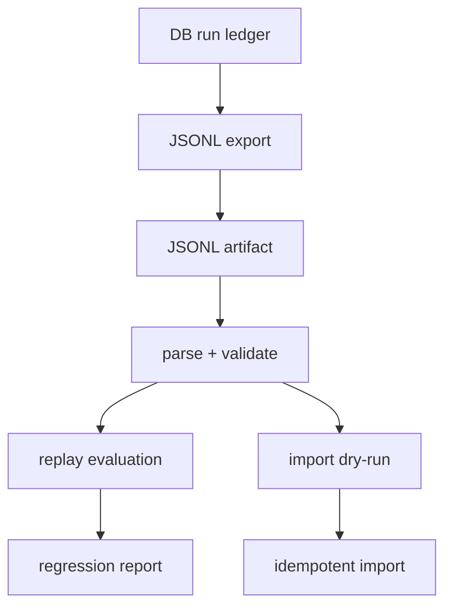

# JSONL Replay / Import Regression 実装計画

## 目的

NightWorkers の run ledger を JSONL として export するだけでなく、同じ JSONL を parse / replay / import / regression comparison に使えるようにする。

この計画のゴールは UI 追加ではない。run evidence を、後から検証できる portable artifact にすること。これにより、agent の成功/失敗、policy decision、review result、verification evidence を、live DB なしでも再評価できるようにする。

## 優先順位 6 位にする理由

優先順位 5 位の Agent Outcome E2E Harness は、実行中の run が期待 outcome に到達するかを検証する。

次に必要なのは、その run evidence を保存し、別のタイミングで読み直して同じ判定ができること。

- run が失敗した時、JSONL artifact だけで原因を再確認できる。
- RunEvent taxonomy の変更で過去 run の解釈が壊れていないか検証できる。
- ReviewResult や ToolPolicyGate の判定が replay で再評価できる。
- E2E の flaky failure を、live agent 再実行なしで regression fixture に変換できる。
- future import / migration の前に、idempotent な取り込み契約を固定できる。

## 現状の前提

### 既存実装

- `api/services/run-events/types.ts` に `RunEventBase`, `RunEventJsonlHeader`, `RunEventJsonlLine`, `RunSummaryJsonlLine` がある。
- `api/services/run-events/jsonl-export.ts` に `serializeRunToJsonl`, `serializeRunEventForJsonl`, `buildRunJsonlHeader`, `buildRunJsonlSummary` がある。
- `shared/schemas/nightworkers.schema.ts` に `runEventSchema` と `runEventJsonlLineSchema` がある。
- `api/services/run-events/normalizer.ts` は canonical RunEvent から legacy event field へ変換する。
- `spec/run-event-taxonomy-jsonl-export-implementation-plan.md` は JSONL の header / run_event / summary contract を定義している。
- `spec/review-result-schema-implementation-plan.md` は `payloadJson.reviewResult` を event-sourced に保存する方針を定義している。
- `spec/agent-outcome-e2e-harness-implementation-plan.md` は JSONL replay / fixture regression を後続 task としている。

### まだ足りないもの

- JSONL parser。
- JSONL validation result。
- replay evaluator。
- import dry-run。
- 重複防止付き import。
- fixture regression test。
- export と replay の contract drift を検出する test。

## 非ゴール

- UI import 画面は作らない。
- 他ツールの JSONL 形式を汎用的に取り込まない。
- Pi の session JSONL storage は移植しない。
- live agent の再実行はしない。
- replay で tool を再実行しない。
- replay で workspace を変更しない。
- retry / requeue / recovery は実装しない。
- DB schema migration は初回必須にしない。

## 設計方針

### Export と Replay の責務を分ける



- export: DB の事実を portable JSONL にする。
- parse: JSONL を typed line に戻す。
- replay: line sequence から outcome / policy / review を再評価する。
- import: JSONL を別 run ledger に取り込む。
- regression: replay 結果と expected fixture を比較する。

### Replay は tool 実行ではない

Replay は、過去の event evidence を読み直すだけにする。

- worker tool は呼ばない。
- shell command は実行しない。
- workspace file は書かない。
- LLM provider は呼ばない。
- outcome gate / policy interpretation / review interpretation だけを再評価する。

### Import は idempotent にする

同じ JSONL を複数回 import しても、重複 event を作らない。

初回は DB unique constraint なしで始める。

- imported event の `payloadJson.importMeta.sourceKey` を計算する。
- `sourceKey` が同じ event が target run に既にあれば skip する。
- `sourceKey` は `sourceRunId`, `line.type`, `seq`, `event.id`, `event.type` から作る。
- 将来必要になれば `import_batches` / `imported_event_sources` table に materialize する。

## JSONL Parser Contract

### ParsedRunJsonl

```ts
export type ParsedRunJsonl = {
  header: RunEventJsonlHeader;
  events: RunEventJsonlLine[];
  summary?: RunSummaryJsonlLine;
  diagnostics: JsonlDiagnostic[];
};
```

### JsonlDiagnostic

```ts
export type JsonlDiagnostic = {
  level: 'warning' | 'error';
  line: number;
  code:
    | 'invalid_json'
    | 'invalid_schema'
    | 'missing_header'
    | 'duplicate_header'
    | 'duplicate_summary'
    | 'event_before_header'
    | 'seq_out_of_order'
    | 'duplicate_seq'
    | 'run_id_mismatch'
    | 'unsupported_version';
  message: string;
};
```

### Validation Rules

- line 1 は `nightworkers_run` header である。
- `version` は 1 のみ許可する。
- `run_event.runId` は header runId と一致する。
- `run_event.event.runId` は header runId と一致する。
- `seq` は重複しない。
- `seq` は昇順であることが望ましい。崩れていたら error ではなく warning にし、replay 前に sort する。
- `run_summary` は 0 または 1 件。
- unknown line type は error。

## Replay Evaluation Contract

### ReplayResult

```ts
export type ReplayResult = {
  sourceRunId: string;
  eventCount: number;
  terminal: {
    status?: string;
    reason?: string;
    summary?: string;
  };
  evidence: {
    hasRuntimeStarted: boolean;
    hasRuntimeFinished: boolean;
    hasOutcomeDecided: boolean;
    hasDiff: boolean;
    hasVerification: boolean;
    hasPolicyBlock: boolean;
    hasReviewResult: boolean;
  };
  reviewResults: unknown[];
  policyEvents: RunEventBase[];
  verificationEvents: RunEventBase[];
  diagnostics: JsonlDiagnostic[];
};
```

Replay は final status を DB から読まない。JSONL の `run_summary` と `run.outcome_decided` event から再評価する。

## Import Contract

### Import Modes

```ts
export type JsonlImportMode =
  | 'validate_only'
  | 'replay_only'
  | 'import_snapshot';
```

- `validate_only`: parse と schema validation だけを行う。
- `replay_only`: parse 後に ReplayResult を返す。DB には書かない。
- `import_snapshot`: target run に event を取り込む。

### Import Result

```ts
export type JsonlImportResult = {
  mode: JsonlImportMode;
  sourceRunId: string;
  targetRunId?: string;
  parsedEventCount: number;
  insertedEventCount: number;
  skippedDuplicateCount: number;
  replay: ReplayResult;
  diagnostics: JsonlDiagnostic[];
};
```

### Import Target

初回の `import_snapshot` は新規 task/run 作成をしない。

方針:

- `targetRunId` を明示指定する。
- 指定 run に event を append する。
- source run metadata は `payloadJson.importMeta` に保存する。
- target run の status は自動変更しない。

理由:

- import と migration を混ぜない。
- 既存 task status を壊さない。
- まず regression fixture と support artifact import に使う。

## 実装ステップ

### Step 1: JSONL parser を追加する

対象:

- `api/services/run-events/jsonl-parse.ts`
- `tests/services.run-events-jsonl.test.ts`

実装:

- `parseRunJsonl(text: string): ParsedRunJsonl`
- `parseRunJsonlLines(lines: string[]): ParsedRunJsonl`
- `validateRunJsonlLine(value, lineNumber): ...`

受け入れ条件:

- valid JSONL を parse できる。
- invalid JSON line は diagnostic になる。
- schema error は diagnostic になる。
- header missing / duplicate summary / runId mismatch を検出する。
- seq out-of-order は warning として検出する。

### Step 2: shared canonical conversion を追加する

対象:

- `api/services/run-events/canonicalize.ts`

役割:

- `taskEvents.payloadJson.runEvent` から canonical event を取り出す。
- legacy `taskEvent` から canonical event へ fallback conversion する。
- JSONL parser / export / replay / import で同じ conversion を使う。

受け入れ条件:

- `jsonl-export.ts` の `fallbackRunEvent` を共有 utility に移す。
- export と replay で legacy mapping が二重実装にならない。
- RunEvent type 追加時の変更箇所が一箇所に寄る。

### Step 3: replay evaluator を追加する

対象:

- `api/services/run-events/replay.ts`
- `tests/services.run-events-replay.test.ts`

実装:

- `replayRunJsonl(parsed: ParsedRunJsonl): ReplayResult`
- event sequence から evidence flags を作る。
- `run.outcome_decided` event を terminal reason として読む。
- `run_summary` を terminal status fallback として読む。
- `payloadJson.reviewResult` または `human.review_submitted` event から review result を抽出する。
- policy event を抽出する。
- verification event を抽出する。

受け入れ条件:

- completed / needs_review / needs_human / policy_violation の fixture を評価できる。
- terminal quality decision と retryable recovery を混ぜない。
- diagnostics を ReplayResult に引き継ぐ。

### Step 4: import dry-run を追加する

対象:

- `api/services/run-events/importer.ts`
- `tests/services.run-events-import.test.ts`

実装:

- `prepareRunJsonlImport(input): JsonlImportResult`
- `mode: validate_only`
- `mode: replay_only`

受け入れ条件:

- DB 書き込みなしで import result を返せる。
- parsedEventCount と replay result が返る。
- invalid JSONL は diagnostics 付きで失敗扱いにできる。

### Step 5: idempotent import_snapshot を追加する

対象:

- `api/services/run-events/importer.ts`
- `api/modules/nightworkers/nightworkers.repository.ts`
- `tests/services.run-events-import.test.ts`

実装:

- `importRunJsonlToRun(targetRunId, text)`
- sourceKey を計算する。
- target run の既存 events から sourceKey を読み、重複を skip する。
- insert する event は `createTaskEvent` または `createRunEvent` を使う。
- `payloadJson.importMeta` に source metadata を保存する。

受け入れ条件:

- 同じ JSONL を 2 回 import しても inserted count は 1 回目だけ増える。
- target run の既存 native events は消さない。
- imported event の actor / type / eventType は normalizer mapping と整合する。
- target run status は変更しない。

### Step 6: fixture regression を追加する

対象:

- `tests/fixtures/run-events/*.jsonl`
- `tests/services.run-events-regression.test.ts`

初期 fixture:

- `basic-needs-review.jsonl`
- `policy-blocked-needs-human.jsonl`
- `review-completed.jsonl`
- `verification-failed.jsonl`

受け入れ条件:

- fixture replay result が expected snapshot と一致する。
- fixture の seq order / event count / terminal outcome を検証する。
- fixture は secret を含まない。

### Step 7: JSONL export round-trip test を追加する

対象:

- `tests/services.run-events-jsonl.test.ts`

実装:

- fake run + events を `serializeRunToJsonl` する。
- `parseRunJsonl` で読み直す。
- `replayRunJsonl` で outcome evidence を確認する。

受け入れ条件:

- export -> parse -> replay が同じ event count を返す。
- canonical event と legacy fallback event の両方で通る。
- run_summary の eventCount と replay eventCount が一致する。

### Step 8: route / CLI entrypoint は後段に切る

初回は service API と tests に留める。

後続候補:

- `POST /runs/:id/import.jsonl`
- `pnpm nightworkers:replay-jsonl <path>`
- `pnpm nightworkers:import-jsonl <path> --target-run <id>`

今回の実装計画では、route / CLI は非ゴールに近い optional とする。

理由:

- parser / replay / idempotency を先に固める。
- UI / operator workflow に引きずられない。

## 受け入れ条件

- JSONL parser が追加される。
- export / parse / replay が round-trip できる。
- replay は tool / LLM / workspace を実行しない。
- replay result が outcome evidence、policy evidence、review evidence を返す。
- import dry-run が DB 書き込みなしで動く。
- import_snapshot が同じ JSONL の再投入で重複 event を作らない。
- canonical conversion が export / replay / import で共有される。
- fixture regression test が追加される。
- telemetry / diagnostics は main parse / import をブロックしない。

## 検証コマンド

```bash
pnpm typecheck
pnpm test run tests/services.run-events-jsonl.test.ts
pnpm test run tests/services.run-events-replay.test.ts
pnpm test run tests/services.run-events-import.test.ts
pnpm test run tests/services.run-events-regression.test.ts
```

既存 run-events test と合わせる場合:

```bash
pnpm test run tests/services.run-events.test.ts
```

## リスクと対策

| リスク | 対策 |
| --- | --- |
| export と replay で legacy conversion がずれる | `canonicalize.ts` に共有化する |
| import が重複 event を増やす | `payloadJson.importMeta.sourceKey` で idempotency を担保する |
| replay が実行処理に寄って副作用を持つ | replay は evaluator のみ、tool/LLM/workspace 呼び出し禁止 |
| run summary と event outcome が矛盾する | diagnostic を出し、event outcome を優先する |
| fixture が古くなる | regression expected を明示し、schema version を fixture に含める |
| DB schema なしの idempotency が弱い | 初回は query-before-insert、必要なら後続で unique table を追加する |

## 後続タスクへの接続

この計画が完了すると、次の task が実装しやすくなる。

1. Browser / computer-use outcome harness。
2. sandbox runtime E2E。
3. LLM reviewer / rubric plugin の replay evaluation。
4. memory feedback long-run scenario。
5. imported run ledger viewer / support bundle import。

## 完了判定

この task は、NightWorkers が自分で export した run JSONL を読み直し、outcome / policy / review evidence を副作用なしで replay し、必要なら target run に重複なく import できる状態になったら完了とする。
