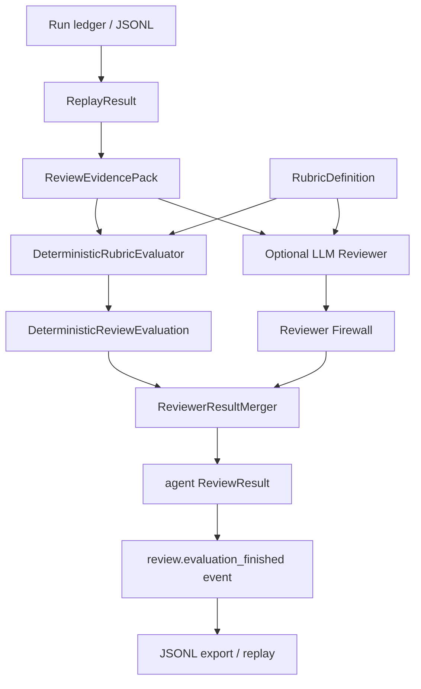

# LLM Reviewer / Rubric Replay Evaluation 実装計画

作成日: 2026-06-02

## 目的

NightWorkers の run ledger / JSONL replay / ReviewResult を使い、作業結果を rubric に沿って再評価できる reviewer layer を作る。

この計画の中心は、LLM reviewer を agent outcome の最終判定器にすることではない。

目的は次の 3 つである。

1. run evidence を rubric に照らして機械的に評価する。
2. 必要に応じて LLM reviewer に findings / callouts / follow-ups の草案を作らせる。
3. その評価結果を `ReviewResult` 互換の agent review として ledger / JSONL / replay 可能にする。

最終 outcome は引き続き Run Outcome Gate と human review が決める。LLM reviewer は、品質確認とレビュー補助のための evidence producer として扱う。

## 優先順位 8 位にする理由

優先順位 1-7 では次を固めている。

- `AgentRuntime`: 実行境界。
- `RunEvent` / JSONL export: 証跡形式。
- `ToolPolicyGate`: 安全境界。
- `ReviewResult`: human review の構造化。
- Agent Outcome E2E: outcome 検証。
- JSONL replay/import: 過去 run の再評価。
- Memory Feedback Long-Run: 学習候補が次 run に効いたかの検証。

次に必要なのは、run の品質を人間だけに頼らず、rubric と replay evidence から継続的に評価する仕組みである。

ただし、ここで LLM reviewer を最終判定にすると、agent の自己申告と同じ問題を別 LLM に移すだけになる。

そのため、優先度 8 では次を固定する。

- reviewer は補助判断であり、outcome gate を bypass しない。
- deterministic rubric checks を先に通す。
- LLM reviewer は structured finding 生成に限定する。
- evaluation result は ledger に残し、JSONL replay で再評価できる。
- provider credential なしで deterministic lane が通る。

## 現状

既存の計画・コードには次の前提がある。

- `spec/review-result-schema-implementation-plan.md`
  - `ReviewResult` を event-sourced に保存する方針。
  - LLM reviewer は非ゴールとして後続に分離済み。
- `spec/jsonl-replay-import-regression-implementation-plan.md`
  - JSONL から outcome / policy / review / verification evidence を replay する方針。
- `spec/memory-feedback-long-run-implementation-plan.md`
  - LLM reviewer / rubric plugin の replay evaluation を後続 task としている。
- `api/services/supervisor/llm-provider.ts`
  - supervisor 用 LLM call は存在する。
  - ただし schema は supervisor decision 専用で、reviewer へ直接流用すべきではない。
- `api/services/run-events/`
  - canonical RunEvent / JSONL export の実装が始まっている。

不足しているもの:

- rubric definition schema。
- rubric を safe data として読む loader。
- run replay result を reviewer input に変換する evidence pack。
- deterministic rubric evaluator。
- LLM reviewer 専用の provider adapter / prompt / schema。
- reviewer output firewall。
- reviewer evaluation を `ReviewResult` 互換に変換する builder。
- reviewer event を JSONL replay で復元する contract。
- replay fixture による regression test。

## この計画で作るもの

- RubricDefinition schema。
- safe rubric loader。
- ReviewEvidencePack builder。
- deterministic rubric evaluator。
- optional LLM reviewer adapter。
- reviewer output firewall。
- agent ReviewResult builder。
- reviewer run events。
- JSONL replay evaluation lane。
- deterministic test fixtures。

## この計画で作らないもの

- human review の置き換え。
- Run Outcome Gate の置き換え。
- LLM reviewer による自動 complete / reject。
- 任意コード実行 plugin。
- npm package plugin install。
- browser / computer-use review。
- PR review comment 投稿。
- external MCP tool の reviewer 内 tool call。
- multi-reviewer quorum。
- UI redesign。

## 設計方針

### LLM reviewer は最終判定器ではない

LLM reviewer は `ReviewResult.reviewer.type = 'agent'` の review evidence を作る。

ただし、次はしない。

- task/run status を直接変えない。
- `completed` に昇格しない。
- human review を省略しない。
- policy violation を許可しない。
- verification failure を上書きしない。

LLM reviewer の verdict が `approved` でも、run は human review または既存 outcome gate の判断を必要とする。

### Rubric plugin は executable plugin ではない

初期の rubric plugin は、Markdown / JSON / YAML 相当の data である。

やること:

- criteria を定義する。
- evidence selector を定義する。
- severity / blocking rule を定義する。
- optional LLM prompt hint を定義する。

やらないこと:

- JS/TS code を実行しない。
- shell command を実行しない。
- network access しない。
- core policy を bypass しない。
- workspace を読む tool を直接呼ばない。

### Replay evaluation を中心にする

reviewer は live run だけでなく、JSONL replay result に対しても実行できる必要がある。

理由:

- reviewer の判断が後から再検証できる。
- rubric 変更による差分を fixture で確認できる。
- provider credential なしの deterministic lane を維持できる。
- support bundle / imported ledger viewer へ後続接続しやすい。

### Deterministic first

rubric は 2 層に分ける。

- deterministic checks
  - diff があるか。
  - verification event があるか。
  - policy violation があるか。
  - required evidence が欠けていないか。
  - review result が存在するか。
- LLM-assisted checks
  - final report が evidence と整合しているか。
  - changes requested に十分な follow-up があるか。
  - human callout に漏れがないか。
  - risk explanation が妥当か。

deterministic blocking finding がある場合、LLM reviewer が `approved` と出しても final reviewer verdict は `changes_requested` に degrade する。

### Reviewer Firewall を置く

LLM reviewer の output は信用しない。

Firewall で次を検査する。

- JSON schema に合うか。
- finding severity が許可値か。
- evidenceRefs が存在する event / artifact / diff を指すか。
- unsupported action を返していないか。
- deterministic blocking finding を無視していないか。
- prompt injection 的に rubric を無効化していないか。
- raw secret / env / credential を output に含めていないか。

Firewall failure は `review.evaluation_finished` の `status: 'degraded' | 'failed'` として残す。

Firewall 後には、degraded reason、LLM verdict、deterministic blocking finding、自動 degrade 条件を再検証する。

この再検証結果は audit metadata として残し、後から「LLM reviewer が悪いのか」「rubric が厳しすぎるのか」「evidence pack が不足しているのか」を切り分けられるようにする。

### Reviewer は独自 tool loop を持たない

初期の reviewer は evidence pack だけを読む。

将来、LLM reviewer が structured tool call を返す設計に拡張する場合でも、reviewer 内に手動 tool loop を作らない。

tool 実行が必要になった場合は、既存の AgentRuntime / ToolPolicyGate / worker tool loop に委譲し、reviewer はその結果 event を evidence として読むだけにする。

## Architecture



## Event Taxonomy 追加

`RunEvent` に reviewer 用 event を追加する。

```ts
type ReviewerRunEventType =
  | 'review.rubric_loaded'
  | 'review.evaluation_started'
  | 'review.llm_started'
  | 'review.llm_finished'
  | 'review.evaluation_finished';
```

actor は初期実装では既存 enum を増やさず `system` にする。

`data.reviewer.kind = 'deterministic' | 'llm' | 'combined'` で主体を表す。

### `review.rubric_loaded`

```ts
type ReviewRubricLoadedData = {
  rubricId: string;
  rubricVersion: string;
  source: 'builtin' | 'repository' | 'inline';
  digest: string;
  criteriaCount: number;
};
```

### `review.evaluation_started`

```ts
type ReviewEvaluationStartedData = {
  evaluationId: string;
  rubricId: string;
  runId: string;
  mode: 'deterministic_only' | 'llm_assisted' | 'replay';
};
```

### `review.llm_started`

```ts
type ReviewLlmStartedData = {
  evaluationId: string;
  provider: string;
  model?: string;
  promptDigest: string;
  evidencePackDigest: string;
};
```

### `review.llm_finished`

```ts
type ReviewLlmFinishedData = {
  evaluationId: string;
  status: 'completed' | 'degraded' | 'failed';
  outputDigest?: string;
  errorCode?: string;
  firewallFindings?: string[];
};
```

### `review.evaluation_finished`

```ts
type ReviewEvaluationFinishedData = {
  evaluationId: string;
  rubricId: string;
  status: 'completed' | 'degraded' | 'failed';
  deterministicVerdict: ReviewVerdict;
  llmVerdict?: ReviewVerdict;
  finalReviewerVerdict: ReviewVerdict;
  reviewResultId: string;
  blockingFindingCount: number;
  degradedReasons: string[];
};
```

## Rubric Definition

### RubricDefinition

```ts
type RubricDefinition = {
  version: 1;
  id: string;
  title: string;
  description?: string;
  scope: {
    repositoryIds?: string[];
    paths?: string[];
    taskKinds?: string[];
  };
  criteria: RubricCriterion[];
  llm?: {
    enabledByDefault: boolean;
    promptHints?: string[];
    maxEvidenceChars: number;
  };
};
```

### RubricCriterion

```ts
type RubricCriterion = {
  id: string;
  title: string;
  severity: 'info' | 'warning' | 'blocking';
  evaluationMode: 'deterministic' | 'llm';
  evidenceSelectors: Array<
    | { kind: 'run_event_type'; type: string }
    | { kind: 'verification'; required?: boolean; passed?: boolean }
    | { kind: 'diff'; required?: boolean; maxBytes?: number }
    | { kind: 'policy'; allowViolations?: boolean }
    | { kind: 'review_result'; required?: boolean }
  >;
  rule?: {
    required: boolean;
    failWhenMissing?: boolean;
    failWhenPresent?: boolean;
  };
  llmPrompt?: string;
};
```

### Built-in Rubrics

初期 built-in rubric:

- `basic-coding-run`
  - diff evidence がある。
  - final report がある。
  - verification result がある。
  - policy violation がない。
  - tool failure が連続していない。
- `review-ready-run`
  - `needs_review` run に ReviewResult evidence が接続可能。
  - blocking finding がある場合は follow-up がある。
  - human callouts と blocking findings が分離されている。
- `memory-feedback-run`
  - memory candidate / injection / evaluation event が揃っている。
  - weak match だけで effective 判定していない。

repository-local rubric は後続でよい。初期は built-in のみで実装する。

## ReviewEvidencePack

LLM reviewer に run 全体を丸投げしない。

replay result / run ledger から、必要最小限の evidence pack を作る。

```ts
type ReviewEvidencePack = {
  version: 1;
  runId: string;
  taskId: string;
  status: string;
  outcome?: {
    status: string;
    reason?: string;
    summary?: string;
  };
  finalReport?: string;
  diff: {
    hasChanges: boolean;
    bytes: number;
    changedFiles: string[];
  };
  verification: Array<{
    eventId?: string;
    command?: string;
    passed?: boolean;
    summary?: string;
  }>;
  policy: Array<{
    eventId?: string;
    code?: string;
    message: string;
  }>;
  reviewResults: unknown[];
  selectedEvents: Array<{
    id?: string;
    seq?: number;
    type: string;
    severity: string;
    message: string;
  }>;
  diagnostics: string[];
};
```

Evidence pack は secret redaction を通す。

raw command output や raw LLM response 全文は初期では入れない。

## Reviewer Output Contract

LLM reviewer は `ReviewResult` を直接返さない。

まず `ReviewerDraft` を返し、Firewall と merger が `ReviewResult` に変換する。

```ts
type ReviewerDraft = {
  version: 1;
  verdict: 'approved' | 'changes_requested' | 'cancelled' | 'risk_accepted';
  summary: string;
  findings: Array<{
    severity: 'info' | 'warning' | 'blocking';
    title: string;
    body?: string;
    evidenceRefs: ReviewEvidenceRef[];
  }>;
  humanCallouts: Array<{
    severity: 'info' | 'warning' | 'blocking';
    title: string;
    body?: string;
    evidenceRefs: ReviewEvidenceRef[];
  }>;
  agentFollowUps: string[];
  suggestedNextTasks: string[];
};
```

Merger rules:

- deterministic blocking finding がある場合、final reviewer verdict は `approved` にしない。
- LLM が unknown evidence ref を返した場合、その finding は degraded finding に変換する。
- LLM failure 時も deterministic evaluation だけで agent ReviewResult を作れる。
- reviewer result は `ReviewResult.reviewer.type = 'agent'` として保存する。
- human review result とは別 event として保存する。

## Implementation Steps

### Step 1: rubric schema を追加する

対象:

- `shared/schemas/nightworkers.schema.ts`
- `api/services/review-rubrics/types.ts`
- `tests/services.review-rubrics.test.ts`

実装:

- `rubricDefinitionSchema`
- `rubricCriterionSchema`
- `reviewEvidencePackSchema`
- `reviewerDraftSchema`
- `reviewerEvaluationSchema`

受け入れ条件:

- invalid severity / evaluationMode を拒否する。
- executable field を持てない。
- unknown evidence selector を拒否する。

### Step 2: built-in rubric loader を追加する

対象:

- `api/services/review-rubrics/builtin.ts`
- `api/services/review-rubrics/loader.ts`
- `tests/services.review-rubrics.test.ts`

実装:

- `loadRubric(id: string): RubricDefinition`
- 初期は built-in rubric だけ。
- digest を計算する。
- `review.rubric_loaded` event に必要な metadata を返す。

受け入れ条件:

- unknown rubric id は typed error。
- loaded rubric は schema parse 済み。
- digest が deterministic。

### Step 3: ReviewEvidencePack builder を追加する

対象:

- `api/services/review-rubrics/evidence-pack.ts`
- `api/services/run-events/replay.ts`
- `tests/services.review-rubrics.test.ts`

実装:

- `buildReviewEvidencePackFromRun(runId)`
- `buildReviewEvidencePackFromReplay(replayResult)`
- redaction helper。
- evidence refs の existence map。

受け入れ条件:

- DB run と replay result の両方から pack を作れる。
- policy / verification / review / diff evidence が抽出される。
- secret-like values は pack に入らない。

### Step 4: deterministic evaluator を追加する

対象:

- `api/services/review-rubrics/deterministic-evaluator.ts`
- `tests/services.review-rubrics-evaluator.test.ts`

実装:

- `evaluateDeterministicRubric(rubric, evidencePack)`
- deterministic criterion だけ評価する。
- findings と degraded reasons を返す。

受け入れ条件:

- diff missing / verification missing / policy violation を blocking finding にできる。
- criteria ごとに evidenceRefs が付く。
- same input で same result。

### Step 5: reviewer event persistence を追加する

対象:

- `api/services/review-rubrics/events.ts`
- `api/services/run-events/types.ts`
- `api/services/run-events/normalizer.ts`
- `shared/schemas/nightworkers.schema.ts`
- `tests/services.review-rubrics.test.ts`

実装:

- reviewer event types を追加する。
- `review.rubric_loaded`
- `review.evaluation_started`
- `review.evaluation_finished`
- LLM enabled 時だけ `review.llm_started` / `review.llm_finished`

受け入れ条件:

- reviewer events が JSONL export に含まれる。
- replay で reviewer event を diagnostics なしに読める。
- legacy event mapping が一箇所に寄る。

### Step 6: ReviewerResultMerger を追加する

対象:

- `api/services/review-rubrics/merger.ts`
- `api/services/review-results/build-review-result.ts`
- `tests/services.review-rubrics.test.ts`

実装:

- deterministic result と optional LLM draft を merge。
- `ReviewResult` 互換の agent review を作る。
- deterministic blocking を LLM verdict より優先する。

受け入れ条件:

- LLM draft がなくても agent ReviewResult を作れる。
- deterministic blocking がある時、approved にならない。
- `reviewer.type = 'agent'` で保存できる。

### Step 7: LLM reviewer adapter を追加する

対象:

- `api/services/review-rubrics/llm-reviewer.ts`
- `api/services/llm-gateway/` または supervisor provider から分離した shared adapter
- `tests/services.review-rubrics-llm.test.ts`

実装:

- supervisor decision schema を流用しない。
- reviewer 専用 JSON schema を使う。
- provider call metadata を返す。
- provider disabled / credential missing は degraded result。
- raw output は digest と preview だけ audit に残す。

受け入れ条件:

- provider credential なしで test が degraded として通る。
- mocked provider で valid ReviewerDraft を返せる。
- invalid JSON / schema mismatch は Firewall へ渡る。

### Step 8: Reviewer Firewall を追加する

対象:

- `api/services/review-rubrics/firewall.ts`
- `tests/services.review-rubrics-firewall.test.ts`

実装:

- schema validation。
- evidence ref existence check。
- deterministic blocking override check。
- raw secret pattern check。
- rubric bypass phrase check。

受け入れ条件:

- unsupported action / verdict を拒否する。
- unknown evidenceRef を degraded finding にする。
- deterministic blocking を無視した approved を degrade する。
- secret-like output を failed/degraded にできる。

### Step 9: replay evaluation service を追加する

対象:

- `api/services/review-rubrics/replay-evaluation.ts`
- `tests/services.review-rubrics-replay.test.ts`

実装:

```ts
type RunReviewReplayEvaluationInput = {
  parsedJsonl?: ParsedRunJsonl;
  replayResult?: ReplayResult;
  rubricId: string;
  mode: 'deterministic_only' | 'llm_assisted';
};
```

- JSONL parse / replay result を受け取り、rubric evaluation を実行する。
- tool / workspace / command は実行しない。
- LLM assisted mode でも evidence pack だけを入力にする。

受け入れ条件:

- JSONL fixture から reviewer result を作れる。
- replay evaluation は DB 書き込みなしでも実行できる。
- deterministic mode は provider credential 不要。

### Step 10: API を追加する

対象:

- `api/modules/nightworkers/nightworkers.routes.ts`
- `api/modules/nightworkers/nightworkers.service.ts`
- `shared/schemas/nightworkers.schema.ts`
- `tests/routes.nightworkers-reviewer.test.ts`

API:

```http
GET /api/review-rubrics
POST /api/runs/:id/reviewer-evaluations
POST /api/runs/:id/reviewer-evaluations/replay
```

初期方針:

- default mode は `deterministic_only`。
- `llm_assisted` は explicit request。
- API は run status を変えない。
- response に `reviewResult` と `degradedReasons` を含める。

受け入れ条件:

- deterministic evaluation が run status を変更しない。
- reviewer event が task events に保存される。
- replay endpoint は DB 書き込みなし mode を持つ。

### Step 11: JSONL regression fixtures を追加する

対象:

- `tests/fixtures/reviewer-rubrics/`
- `tests/services.review-rubrics-replay.test.ts`

Fixtures:

- `basic-approved.jsonl`
- `missing-verification.jsonl`
- `policy-violation.jsonl`
- `review-followup-needed.jsonl`
- `llm-invalid-output.jsonl`

受け入れ条件:

- deterministic replay result が snapshot と一致する。
- missing verification は blocking finding。
- policy violation は LLM verdict に関係なく approved にならない。

### Step 12: minimal UI projection を追加する

対象:

- `src/modules/nightworkers/components/ThreadTimeline.tsx`
- `src/modules/nightworkers/types.ts`

実装:

- reviewer evaluation events を timeline に出す。
- full rubric UI は作らない。
- result detail は JSON/debug accordion でよい。

受け入れ条件:

- reviewer evaluation started / finished が timeline に見える。
- human review UI と混同しない label になる。
- status 変更 button には接続しない。

## API Scope

初期 API:

```http
GET /api/review-rubrics
POST /api/runs/:id/reviewer-evaluations
POST /api/runs/:id/reviewer-evaluations/replay
```

Request:

```ts
type CreateReviewerEvaluationRequest = {
  rubricId: string;
  mode?: 'deterministic_only' | 'llm_assisted';
  persist?: boolean;
};
```

Rules:

- `persist: false` は dry-run。
- `persist: true` は reviewer events と agent ReviewResult を保存する。
- `llm_assisted` は explicit。
- provider unavailable は degraded result。
- run status は変えない。

## Test Plan

### Unit

```bash
pnpm test run tests/services.review-rubrics.test.ts
pnpm test run tests/services.review-rubrics-evaluator.test.ts
pnpm test run tests/services.review-rubrics-firewall.test.ts
pnpm test run tests/services.review-rubrics-replay.test.ts
```

### Route

```bash
pnpm test run tests/routes.nightworkers-reviewer.test.ts
```

### Existing Regression

```bash
pnpm test run tests/services.run-events.test.ts
pnpm test run tests/services.run-events-replay.test.ts
pnpm test run tests/services.review-results.test.ts
```

### Full Gate

```bash
pnpm typecheck
pnpm lint
pnpm test run
```

`pnpm verify` は designSystem も含むため、最終確認で実行する。

## Acceptance Criteria

- rubric schema が追加され、executable plugin を受け付けない。
- built-in rubric を deterministic に load できる。
- run ledger / JSONL replay result から ReviewEvidencePack を作れる。
- deterministic rubric evaluator が diff / verification / policy / review evidence を評価できる。
- LLM reviewer は explicit mode でのみ動く。
- LLM reviewer failure は degraded として保存され、run status を変えない。
- Reviewer Firewall が invalid output / unknown evidence / deterministic blocking override を検出できる。
- reviewer result は `ReviewResult` 互換の agent review として保存できる。
- reviewer events は JSONL export / replay で復元できる。
- deterministic replay fixtures が provider credential なしで通る。

## Rollout Order

1. Rubric schema。
2. Built-in rubric loader。
3. ReviewEvidencePack builder。
4. Deterministic evaluator。
5. Reviewer event persistence。
6. ReviewerResultMerger。
7. LLM reviewer adapter。
8. Reviewer Firewall。
9. Replay evaluation service。
10. API。
11. JSONL regression fixtures。
12. Minimal timeline projection。

## Risks

| Risk | 対策 |
| --- | --- |
| LLM reviewer が最終判定器になってしまう | API と service で run status を変更しない |
| rubric plugin が任意コード実行になる | 初期は built-in data only、schema で executable field を拒否する |
| supervisor LLM schema と混ざる | reviewer 専用 adapter / schema を作る |
| LLM output が unstable | deterministic first、mocked provider、Firewall、digest audit |
| replay evaluation が副作用を持つ | tool / command / workspace access 禁止 |
| human review と UI 上で混同する | `agent reviewer` label と timeline event に限定 |
| deterministic blocking を LLM が上書きする | merger で deterministic blocking を優先 |

## 後続 task

この計画が完了すると、次の task が実装しやすくなる。

1. Browser / computer-use outcome harness。
2. sandbox runtime E2E。
3. imported run ledger viewer / support bundle import。
4. repository-specific skill / procedure injection。
5. repository-local rubric definition。
6. PR review comment export。

## 完了判定

この task は、NightWorkers が run ledger または JSONL replay result を built-in rubric で deterministic に評価し、必要に応じて LLM reviewer の draft を Firewall 越しに取り込み、最終 outcome を変更せずに `ReviewResult` 互換の agent review と reviewer events を保存・export・replay できる状態になったら完了とする。
