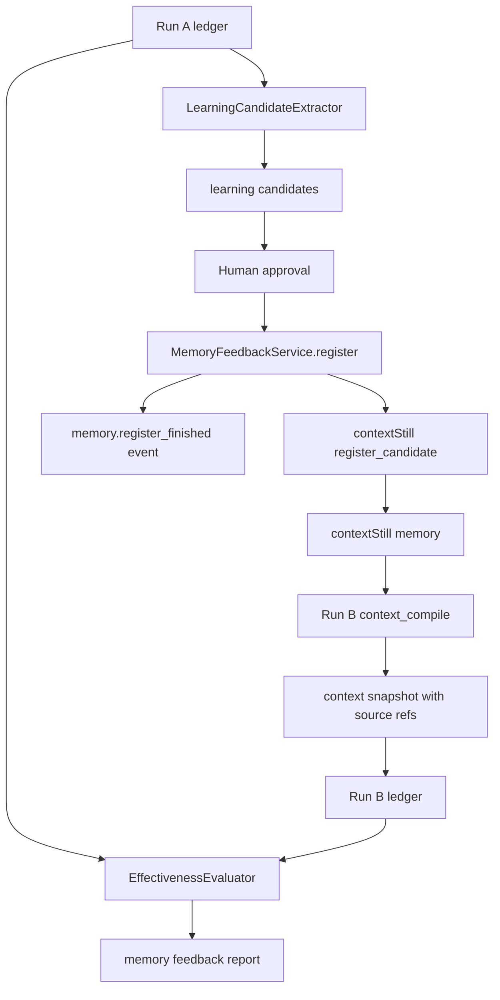

# Memory Feedback Long-Run Scenario 実装計画

作成日: 2026-06-02

## 目的

NightWorkers の run から得た知見を、次の run に戻し、その知見が実際に agent の挙動改善へ効いたかを検証できるようにする。

この計画の中心は contextStill / memoryRouter そのものの再実装ではない。NightWorkers 側で、次の循環を ledger 上で説明可能にすることである。

1. run が完了する。
2. run ledger、outcome、review から学習候補を作る。
3. 人間が候補を承認する。
4. 承認済み候補を contextStill へ登録する。
5. 類似 task の次 run で context compile に含まれたかを記録する。
6. 次 run の outcome / event / diff / review を比較し、知見が効いたかを評価する。

## 優先順位 7 位にする理由

優先順位 1-6 では、実行境界、event taxonomy、tool policy、review result、outcome E2E、JSONL replay/import を固めている。

次に必要なのは、個人利用の Manus / Devin 的な価値である「同じ失敗を繰り返さない」能力を検証可能にすること。

この段階で memory feedback を扱う理由は次の通り。

- run ledger と review がないと、何を学習すべきか判断できない。
- JSONL replay/import がないと、過去 run との差分を安定して比較できない。
- contextStill への登録だけでは、次 run に効いたかを NightWorkers 側で証明できない。
- memory feedback の効果が測れないと、context compile がただ長い prompt になり、agent 品質改善と区別できない。

## 現状

既存コードには、contextStill 連携の入口がある。

- `api/services/context-still/client.ts`
  - optional な MCP client。
  - `CONTEXT_STILL_ENABLED=true` の時だけ接続する。
- `api/services/context-still/adapter.ts`
  - `compileContext`
  - `evaluateContext`
  - `registerLessons`
- `api/modules/nightworkers/nightworkers.service.ts`
  - run 開始前に `compileContext` を呼ぶ。
  - run 完了後に `evaluateContext` を呼ぶ。
  - `compiledPrompt` を task / run context snapshot に保存する。

ただし、現状では次が不足している。

- context compile の入力 / 出力 contract が NightWorkers 側で固定されていない。
- compile result に、どの memory / procedure / source が入ったかを保存していない。
- run から作る learning candidate の schema がない。
- human approved candidate と自動生成 candidate が分かれていない。
- `register_candidate` 成功 / 失敗が run ledger event として残らない。
- 次 run がどの previous learning を受け取ったかを比較できない。
- memory feedback が outcome 改善に効いたかを判定する harness がない。

## この計画で作るもの

- Memory feedback 用の typed schema。
- context compile request / result の NightWorkers 内部 contract。
- learning candidate 生成 service。
- human approval 後の register service。
- run ledger event としての memory feedback 記録。
- 次 run の context snapshot に memory source refs を保存する仕組み。
- long-run scenario harness。
- memory feedback effectiveness report。

## この計画で作らないもの

- contextStill / memoryRouter の内部 DB 変更。
- contextStill の検索・蒸留・知識登録アルゴリズム。
- UI 上の本格的な knowledge management 画面。
- 任意の external MCP tool 解禁。
- Pi の session memory や extension system の移植。
- LLM reviewer / rubric plugin。
- 複数 agent の協調 memory。

初期実装は、NightWorkers 側の control plane と ledger evidence に限定する。

## 設計方針

### Memory は primary persistence ではない

NightWorkers の事実源は run ledger である。

contextStill への登録が成功しても失敗しても、NightWorkers では次を保存する。

- どの run から候補が作られたか。
- 候補を誰が承認したか。
- どの external tool に送ったか。
- 送信結果が成功 / degraded / failed のどれだったか。
- 次 run の context compile に同候補らしき source が含まれたか。

contextStill 側の保存状態を NightWorkers の成功条件にしない。

### 自動登録しない

agent が run 後に作った知見候補を、そのまま reusable memory として登録しない。

初期ルール:

- 自動生成は `candidate` まで。
- `register_candidate` は human approved candidate だけ。
- approval なしに durable memory へ送らない。
- failed / risky / policy violation run からの候補は、既定では `needs_review` にする。

### 次 run への注入を観測対象にする

memory feedback の目的は、登録することではない。

次 run に効いたかを見たいので、run context snapshot に次を残す。

- compile request。
- compile degraded reason。
- compiled context digest。
- included memory source refs。
- included candidate source run ids。
- context token / char estimate。
- memory source が task prompt とどの程度一致したかの rough score。

contextStill が source refs を返せない場合でも、NightWorkers 側で fallback diagnostic を残す。

### 効果判定は deterministic first にする

初期 harness では、provider credential に依存しない。

LLM が本当に賢くなったかではなく、次を deterministic に検証する。

- run A から candidate が生成された。
- human approval 後に registration event が記録された。
- run B の compile context に candidate/source ref が入った。
- run B の scenario assertion が candidate を使う前提で通る。
- run B の outcome evidence が run A より改善したと分類できる。

LLM 実行を伴う live long-run は、後続の optional lane に分ける。

## Architecture



## Event Taxonomy 追加

`RunEvent` に memory feedback 用 event を追加する。

```ts
type MemoryRunEventType =
  | 'memory.candidate_generated'
  | 'memory.candidate_approved'
  | 'memory.register_started'
  | 'memory.register_finished'
  | 'memory.context_injected'
  | 'memory.feedback_evaluated';
```

### `memory.candidate_generated`

run A から learning candidate を作った時に保存する。

```ts
type MemoryCandidateGeneratedData = {
  candidateId: string;
  sourceRunId: string;
  sourceEventIds: string[];
  kind: 'rule' | 'procedure' | 'warning' | 'verification';
  title: string;
  confidence: 'low' | 'medium' | 'high';
  requiresHumanApproval: true;
  status: 'draft';
};
```

### `memory.candidate_approved`

人間が候補を承認した時に保存する。

```ts
type MemoryCandidateApprovedData = {
  candidateId: string;
  sourceRunId: string;
  approvedBy: 'human';
  approvalNote?: string;
  approvedAt: string;
};
```

### `memory.register_started`

contextStill へ送信する直前に保存する。

```ts
type MemoryRegisterStartedData = {
  candidateId: string;
  sourceRunId: string;
  target: 'context-still';
  tool: 'register_candidate';
};
```

### `memory.register_finished`

contextStill 送信結果を保存する。

```ts
type MemoryRegisterFinishedData = {
  candidateId: string;
  sourceRunId: string;
  target: 'context-still';
  status: 'registered' | 'degraded' | 'failed';
  externalId?: string;
  errorCode?: string;
  errorMessage?: string;
};
```

### `memory.context_injected`

次 run の context compile に memory source が含まれた時に保存する。

```ts
type MemoryContextInjectedData = {
  runId: string;
  source: 'context-still' | 'fallback';
  degraded: boolean;
  compiledContextDigest: string;
  includedSourceRefs: Array<{
    kind: 'candidate' | 'memory' | 'procedure' | 'unknown';
    sourceRunId?: string;
    candidateId?: string;
    externalId?: string;
    title?: string;
  }>;
  charCount: number;
};
```

### `memory.feedback_evaluated`

run A と run B を比較して、memory feedback が効いたかを評価する。

```ts
type MemoryFeedbackEvaluatedData = {
  baselineRunId: string;
  followupRunId: string;
  candidateIds: string[];
  verdict: 'effective' | 'ineffective' | 'inconclusive' | 'not_injected';
  reasons: string[];
  evidenceEventIds: string[];
};
```

## Schema

### LearningCandidate

初期実装では DB table を急いで増やさず、event-sourced にする。

`payloadJson.memoryCandidate` として `task_events` に保存する。

```ts
type LearningCandidate = {
  id: string;
  version: 1;
  sourceRunId: string;
  sourceTaskId: string;
  sourceEventIds: string[];
  kind: 'rule' | 'procedure' | 'warning' | 'verification';
  title: string;
  body: string;
  appliesTo: {
    repositoryId?: string;
    repoPath?: string;
    domains?: string[];
    technologies?: string[];
    changeTypes?: string[];
  };
  confidence: 'low' | 'medium' | 'high';
  status: 'draft' | 'approved' | 'rejected' | 'registered' | 'failed';
  createdAt: string;
  approvedAt?: string;
  registeredAt?: string;
  externalRef?: {
    target: 'context-still';
    id?: string;
  };
};
```

### ContextCompileSnapshot

`task_runs.contextSnapshot` を拡張する。

```ts
type ContextCompileSnapshot = {
  compiledPrompt: string;
  source: 'context-still' | 'fallback';
  degraded: boolean;
  degradedReason?: string;
  request: {
    repositoryPath: string;
    taskTitle: string;
    taskDescriptionDigest: string;
  };
  result: {
    digest: string;
    charCount: number;
    sourceMetadata?: unknown;
    includedMemoryRefs: Array<{
      kind: 'candidate' | 'memory' | 'procedure' | 'unknown';
      sourceRunId?: string;
      candidateId?: string;
      externalId?: string;
      title?: string;
    }>;
  };
};
```

`compiledPrompt` の全文は既存互換のため残す。

ただし、比較や event では digest / source refs を優先し、長文 prompt を assertion の主対象にしない。

## ContextStill Adapter Contract

現状の adapter は MCP tool の引数と結果を直接 service に近い形で扱っている。

この計画では、NightWorkers 内部 contract を先に固定する。

```ts
type CompileContextRequest = {
  repositoryPath: string;
  taskTitle: string;
  taskDescription: string;
  taskId: string;
  runId: string;
  goal?: string;
  domains?: string[];
  technologies?: string[];
};

type CompileContextResponse = {
  compiledPromptText: string;
  degraded: boolean;
  degradedReason?: string;
  sourceMetadata?: unknown;
  includedMemoryRefs: ContextCompileSnapshot['result']['includedMemoryRefs'];
};
```

Adapter の責務:

- MCP tool 引数の揺れを adapter 内に閉じ込める。
- contextStill unavailable は throw ではなく degraded result に正規化する。
- source refs がない場合は空配列にする。
- compile result を `memory.context_injected` event と `contextSnapshot` に保存できる形で返す。

`runId` を compile request に含めるため、最終形では `startTaskRun` の順序を「run 作成 -> context compile -> runtime start」に寄せる。

現行コードのように compile が run 作成前に行われる状態から移行する場合は、Step 3 で run を `context_compiling` 相当の状態として先に作り、その run に `run.context_compiled` と `memory.context_injected` を append する。

## Implementation Steps

### Step 1: memory feedback schema を追加する

対象:

- `shared/schemas/nightworkers.schema.ts`
- `api/services/memory-feedback/types.ts`
- `tests/services.memory-feedback.test.ts`

実装:

- `learningCandidateSchema`
- `contextCompileSnapshotSchema`
- `memoryFeedbackEvaluationSchema`
- `memoryRunEventDataSchema`

受け入れ条件:

- schema が `safeParse` で valid / invalid を分類できる。
- unsupported candidate kind は落ちる。
- status transition に必要な型が定義される。

### Step 2: ContextStill adapter response を structured にする

対象:

- `api/services/context-still/adapter.ts`
- `api/services/context-still/client.ts`
- `tests/services.context-still.test.ts`

実装:

- `compileContext(request: CompileContextRequest): Promise<CompileContextResponse>` に寄せる。
- 旧 call site 互換 wrapper を一時的に残すか、service call を同時に移行する。
- contextStill disabled / unavailable / empty result を degraded result にする。
- `sourceMetadata` から possible source refs を抽出する helper を追加する。

受け入れ条件:

- contextStill disabled でも compile は成功し、fallback prompt を返す。
- MCP failure は run 開始を止めない。
- source refs がない場合も response shape は安定する。

### Step 3: run start で context injection event を保存する

対象:

- `api/modules/nightworkers/nightworkers.service.ts`
- `api/modules/nightworkers/nightworkers.repository.ts`
- `api/services/run-events/types.ts`
- `api/services/run-events/normalizer.ts`

実装:

- `startTaskRun` の順序を、run 作成前 compile から run 作成後 compile へ移す。
- run は `status: 'running'` のままでもよいが、event 上は context compile 中であることを表す。
- run 作成後に `memory.context_injected` event を保存する。
- `run.context_compiled` と責務を分ける。
- `run.context_compiled` は compile が完了した事実。
- `memory.context_injected` は memory source refs が含まれた事実。
- `task_runs.contextSnapshot` に `ContextCompileSnapshot` を保存する。

受け入れ条件:

- contextStill disabled の run でも `memory.context_injected` が degraded として残る。
- `contextSnapshot.result.digest` が保存される。
- JSONL export に memory event が含まれる。

### Step 4: LearningCandidateExtractor を追加する

対象:

- `api/services/memory-feedback/candidate-extractor.ts`
- `api/services/memory-feedback/types.ts`
- `tests/services.memory-feedback.test.ts`

実装:

- run ledger から candidate を作る pure function を追加する。
- 初期候補は deterministic rule だけにする。
- LLM で候補生成しない。

初期 extraction rules:

- policy violation がある場合、同じ task 種別で避けるべき warning candidate。
- verification failure がある場合、次回実行すべき verification procedure。
- human review で request changes がある場合、review finding 由来の procedure。
- outcome が completed で verification success がある場合、再利用可能な workflow procedure。

受け入れ条件:

- 同じ input events から同じ candidates が生成される。
- source event ids が必ず付く。
- failed run 由来 candidate は high confidence にならない。

### Step 5: candidate persistence を event-sourced にする

対象:

- `api/modules/nightworkers/nightworkers.repository.ts`
- `api/services/memory-feedback/candidate-store.ts`
- `tests/services.memory-feedback.test.ts`

実装:

- `createLearningCandidateEvent`
- `listLearningCandidatesForRun`
- `getLearningCandidateFromEvents`
- `updateLearningCandidateStatusEvent`

初期は DB table ではなく、`task_events.payloadJson.memoryCandidate` を source of truth にする。

受け入れ条件:

- run events だけから candidate list を復元できる。
- candidate status history を event 順で復元できる。
- JSONL replay/import 後も candidate が復元できる。

### Step 6: human approval API を追加する

対象:

- `api/modules/nightworkers/nightworkers.routes.ts`
- `api/modules/nightworkers/nightworkers.service.ts`
- `shared/schemas/nightworkers.schema.ts`
- `tests/routes.nightworkers.test.ts`

API:

```http
POST /api/runs/:id/memory-candidates
POST /api/runs/:id/memory-candidates/:candidateId/approve
POST /api/runs/:id/memory-candidates/:candidateId/reject
```

初期方針:

- candidate 生成は明示 API で行う。
- review API から自動呼び出ししてもよいが、登録は approval 後だけ。
- reject も event として残す。

受け入れ条件:

- approval なしでは register できない。
- rejected candidate は register 対象にならない。
- approval event が JSONL に含まれる。

### Step 7: MemoryFeedbackService.register を追加する

対象:

- `api/services/memory-feedback/register.ts`
- `api/services/context-still/adapter.ts`
- `tests/services.memory-feedback.test.ts`

実装:

- approved candidate を contextStill `register_candidate` へ送る。
- call 前に `memory.register_started` を保存する。
- call 後に `memory.register_finished` を保存する。
- contextStill failure は candidate status を `failed` または `degraded` にするが、API 全体を 500 にしない。

受け入れ条件:

- disabled contextStill では `degraded` event になる。
- contextStill error は run / task status を巻き戻さない。
- selected approved candidate だけ送信される。

### Step 8: next-run injection matching を追加する

対象:

- `api/services/memory-feedback/injection-matcher.ts`
- `api/services/context-still/adapter.ts`
- `tests/services.memory-feedback.test.ts`

実装:

- context compile result の source metadata から `includedMemoryRefs` を抽出する。
- source refs がない場合は、compiled text 内の candidate title / digest fragment で weak match する。
- weak match は `kind: 'unknown'` または `confidence: 'low'` として扱う。

受け入れ条件:

- exact source ref があれば candidateId / sourceRunId を復元できる。
- source ref がなくても diagnostic として weak match が残る。
- false positive を避けるため、weak match は effectiveness 判定で単独の成功根拠にしない。

### Step 9: effectiveness evaluator を追加する

対象:

- `api/services/memory-feedback/effectiveness.ts`
- `tests/services.memory-feedback-effectiveness.test.ts`

実装:

```ts
type EvaluateMemoryFeedbackInput = {
  baselineRun: ReplayResult | RunLedgerView;
  followupRun: ReplayResult | RunLedgerView;
  candidateIds: string[];
};
```

判定:

- `not_injected`
  - followup context に candidate/source が含まれていない。
- `inconclusive`
  - injected されたが outcome evidence が比較不能。
- `ineffective`
  - injected されたが同じ failure / review finding / policy violation が再発。
- `effective`
  - injected され、該当 failure が再発せず、verification または review が改善。

受け入れ条件:

- deterministic fixture で 4 verdict を再現できる。
- verdict には必ず reasons と evidenceEventIds が付く。
- LLM final answer text だけで effective にしない。

### Step 10: long-run scenario harness を追加する

対象:

- `tests/e2e/memory-feedback-long-run.spec.ts`
- `tests/e2e/helpers.ts`
- `tests/fixtures/memory-feedback/`

Lane:

1. provider-free deterministic lane。
2. JSONL replay lane。
3. optional live agent lane。

provider-free lane:

- baseline run event fixture を作る。
- candidate を生成する。
- candidate を approve/register する。
- followup run の compile snapshot に candidate ref を含める。
- effectiveness evaluator で `effective` を確認する。

JSONL replay lane:

- baseline JSONL と followup JSONL を読み込む。
- candidate / injection / evaluation event が replay で復元できることを確認する。

optional live agent lane:

- `@agent-live` tag。
- provider credential がある時だけ実行する。
- 実際の 2 run を作り、memory feedback の注入と outcome を確認する。

受け入れ条件:

- credential なしで deterministic lane が通る。
- JSONL replay/import 後も effectiveness report が一致する。
- live lane は skip 可能で、通常 CI を不安定にしない。

## API Scope

初期 API は internal / developer-facing でよい。

必要最小限:

```http
GET /api/runs/:id/memory-candidates
POST /api/runs/:id/memory-candidates
POST /api/runs/:id/memory-candidates/:candidateId/approve
POST /api/runs/:id/memory-candidates/:candidateId/reject
POST /api/runs/:id/memory-candidates/:candidateId/register
POST /api/runs/:id/memory-feedback/evaluate
```

本格 UI は後続。

ただし、API response は UI が後でそのまま使える形にする。

## UI Scope

この計画では UI は最小にする。

やる場合:

- run detail に memory feedback events を timeline 表示する。
- candidate の approve / reject / register button を debug section に置く。

やらない:

- knowledge base 管理画面。
- candidate editor。
- cross repository memory browser。
- memory search UI。

## Test Plan

### Unit

```bash
pnpm test run tests/services.memory-feedback.test.ts
pnpm test run tests/services.memory-feedback-effectiveness.test.ts
pnpm test run tests/services.context-still.test.ts
```

### Route

```bash
pnpm test run tests/routes.nightworkers-memory-feedback.test.ts
```

### Replay / JSONL

```bash
pnpm test run tests/services.run-events-replay.test.ts
pnpm test run tests/services.run-events-import.test.ts
pnpm test run tests/services.memory-feedback-jsonl.test.ts
```

### E2E

```bash
pnpm test:e2e --grep @memory-feedback
```

### Full Gate

```bash
pnpm typecheck
pnpm lint
pnpm test run
```

`pnpm verify` は designSystem も含むため、最終確認で実行する。

## Acceptance Criteria

- run から deterministic な learning candidate を生成できる。
- candidate は approval なしでは contextStill に登録されない。
- approved candidate の register started / finished が run ledger に残る。
- contextStill disabled / failed でも run completion と review action は失敗しない。
- 次 run の context snapshot に memory source refs または degraded diagnostic が残る。
- baseline run と followup run を比較し、memory feedback verdict を出せる。
- JSONL export / replay / import 後も candidate と effectiveness report を復元できる。
- provider credential なしで long-run deterministic scenario が通る。

## Rollout Order

1. Schema と pure evaluator を先に作る。
2. contextStill adapter を structured response にする。
3. run start で context snapshot / injection event を保存する。
4. candidate extraction を deterministic に作る。
5. event-sourced candidate store を作る。
6. approval / reject API を足す。
7. register service を足す。
8. injection matcher を足す。
9. effectiveness evaluator を JSONL replay と接続する。
10. long-run harness を追加する。

## Risks

| Risk | 対策 |
| --- | --- |
| contextStill tool contract が変わる | adapter 内部に閉じ込め、NightWorkers 内部型は固定する |
| memory 登録が noisy になる | human approval 必須にする |
| compiled prompt が長くなりすぎる | digest / source refs / char count を保存し、上限超過を diagnostic にする |
| 効果判定が LLM 出力に引きずられる | deterministic event / verification / review evidence を優先する |
| weak match が false positive になる | weak match 単独では effective にしない |
| event-sourced candidate が複雑になる | 初期は candidate table を作らず、必要になった時だけ materialized table を検討する |

## 後続 task

この計画が完了すると、次の task が実装しやすくなる。

1. LLM reviewer / rubric plugin の replay evaluation。
2. Browser / computer-use outcome harness。
3. sandbox runtime E2E。
4. imported run ledger viewer / support bundle import。
5. repository-specific skill / procedure injection。

## 完了判定

この task は、NightWorkers が run A の結果から human-approved learning candidate を作り、contextStill へ登録し、run B の context snapshot にその知見が入ったことを ledger で説明し、baseline / followup 比較によって memory feedback の効果を deterministic に評価できる状態になったら完了とする。
