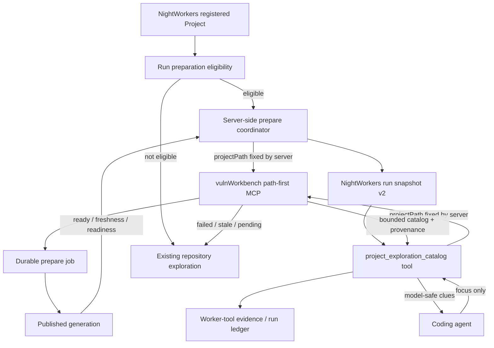

# projectPath-first vulnWorkbench 連携実装計画

## Status

- Plan status: `implemented_code_complete_rollout_pending`
- Priority: `P1`
- Document created: 2026-07-15
- Target repositories: `vulnWorkbench`、`NightWorkers`
- Producer dependency: `vulnWorkbench/spec/phase-44-project-path-first-static-intelligence-mcp-plan.md`
- Consumer scope: NightWorkers controlled pilot / native API implementation lane

## Implementation Progress (2026-07-15)

実装済み:

- vulnWorkbenchのpath-first prepare / status / catalog contract
- external security scannerを起動しないstructure-only preparation
- NightWorkers server-side prepare coordinatorとbounded status polling
- 内部IDを持たないrun availability snapshot version 2
- focusだけを受け取る`project_exploration_catalog` worker tool
- stale catalog clueの遮断、workspace mismatch、fail-open
- generic model-facing MCP bridgeからの明示的mutating tool拒否
- audit provenanceとmodel-safe payloadの分離
- preparation / catalog / fallback measurement
- producer responseのbounded schema化と、raw audit payloadからmodel projectionへの未知field漏えい防止
- catalog失敗callの計測、generic MCP read-only判定と実行のatomic化
- prepare前後のGit source再確認と、準備中source変更時のfail-open
- ready jobが指定したexact generationの選択、generation build後のsource再検査
- canonical path限定、symlink alias拒否、structure-only scan lifecycleのrunning/completed整合性
- prepare worker CLIからexternal security scan注入経路を削除
- focused testsとvulnWorkbench repository verify（NightWorkers全体verifyは既存未コミット変更のarchitecture/lint gate解消後に再実行）

rollout時に必要な運用作業:

- vulnWorkbench MCP processへ最小範囲の`STATIC_INTELLIGENCE_ALLOWED_PROJECT_ROOTS`を設定する
- 対象Projectだけfeature flagを有効化する
- native/API implementation laneのpaired runで削減率とquality非劣化を測定する

本書は、NightWorkers と vulnWorkbench の Static Intelligence 連携を、vulnWorkbench 内部の `projectId`、`scanRunId`、`generationId`、`rootRef` に依存する契約から、登録済み Project の `projectPath` を起点とする契約へ移行するための実装正本である。

vulnWorkbench 側の path-first producer が完成する前に NightWorkers の consumer を切り替えない。移行中も既存の project exploration pilot は既定 OFF、native API implementation lane 限定、MCP 障害時 fail-open を維持する。

## 1. Executive Decision

この変更は実施する。優先度は P1 とし、次の順序を固定する。

```text
vulnWorkbench contract freeze
  -> path resolver / prepare lifecycle / path-first query 実装
  -> vulnWorkbench end-to-end fixture と verify
  -> NightWorkers characterization tests
  -> server-side prepare coordinator
  -> run-scoped catalog adapter
  -> legacy internal-ID pinning の撤去
  -> controlled pilot と比較計測
  -> legacy consumer cleanup 判定
```

NightWorkers からの vulnWorkbench 呼び出しに使う project selector は `projectPath` だけとする。内部 ID は vulnWorkbench の DB relation と監査 provenance に残してよいが、NightWorkers の次回 request、run binding、foreign key、検索キー、prompt 固定値にはしない。

取得系 tool は read-only を維持し、scan または generation build を暗黙に開始しない。準備は明示的な `vuln_prepare_project_intelligence` だけが開始できる。

## 2. Current Baseline

### 2.1 NightWorkers

現在の project exploration pilot は run 作成前に次を行う。

1. 登録済み repository root を `realpath` へ正規化する。
2. canonical root の SHA-256 を `rootRef` とする。
3. `vuln_list_knowledge_sources({ rootRef })` で候補を取得する。
4. Git HEAD と readiness が一致する source を選ぶ。
5. `vuln_get_knowledge_source_manifest({ scanRunId, generationId })` で整合性を確認する。
6. `projectId`、`scanRunId`、`generationId`、`rootRef` を run snapshot に保存する。
7. LLM 向け guidance に `scanRunId` と `generationId` を埋め込み、generic `mcp_call_tool` から catalog を呼ばせる。

主要な現行箇所:

- `api/modules/ontology/exploration/project-exploration-source.service.ts`
- `shared/schemas/project-exploration-catalog.schema.ts`
- `api/modules/nightworkers/run-orchestration/start-task-run-runtime-context.ts`
- `api/modules/nightworkers/run-orchestration/start-task-run.ts`
- `api/services/agent-runtime/native-api-runner/native-api-tool-history.ts`
- `api/modules/ontology/exploration/project-exploration-measurement.ts`

この設計は immutable generation を固定できる一方、vulnWorkbench の内部 lifecycle と identifier を NightWorkers の consumer contract へ漏らしている。

### 2.2 vulnWorkbench

現在の Static Intelligence MCP は read-only で、既存 tool は `scanRunId`、`generationId`、`rootRef` を入力に使う。code structure と catalog は persisted generation を読むだけで、未生成時に scan または build を開始しない。

vulnWorkbench には既に次の再利用可能な基盤がある。

- `resolveProjectByPath()` による `realpath` と project 解決
- scan queue / process supervisor
- `buildStaticIntelligenceGeneration()`
- generation repository と source revision / source tree hash
- readiness / freshness 判定
- read-only MCP tool registry
- Phase 44 path-first producer 計画

ただし、現行 DB の project uniqueness は owner と `repoPath` の組み合わせであり、MCP の path-only resolution に必要な canonical path の大域的一意性は保証していない。また、現行 MCP server は全 tool に `readOnlyHint: true` を設定しているため、prepare action は tool 単位の annotation へ変更する必要がある。

## 3. Goals

1. NightWorkers が登録済み Project の `repoPath` だけで Static Intelligence を準備できる。
2. NightWorkers が内部 ID を解決、保持、再送せず catalog を取得できる。
3. project resolution、freshness、scan 選択、generation 選択を vulnWorkbench 内で完結させる。
4. 明示的 prepare と read-only query を分離する。
5. 同一 source state の generation と active prepare job を再利用する。
6. repository 更新後は stale を検出し、新しい prepare で再生成できる。
7. NightWorkers が管理する path 以外を LLM またはユーザー文言から渡さない。
8. MCP の失敗、pending、stale、unusable を既存探索への fail-open として扱う。
9. failed、stale、degraded、coverage gap を同じ「情報なし」へ畳み込まない。
10. controlled pilot の効果を tool call、source read、token、完了、verification で比較できる。

## 4. Locked Decisions

1. NightWorkers から vulnWorkbench へ渡す project selector は `projectPath` だけとする。
2. `projectId`、`scanRunId`、`generationId`、`rootRef` を NightWorkers request の必須・任意入力に含めない。
3. NightWorkers に内部 ID resolver API または vulnWorkbench DB access を追加しない。
4. ID resolution と MCP query の二段階 consumer contractを作らない。
5. `vuln_prepare_project_intelligence` は副作用を持つ action tool とし、`readOnlyHint: false`、`destructiveHint: false`、`idempotentHint: true` を設定する。
6. status、snapshot、catalog は read-only とし、未準備・stale 時に暗黙 prepare を開始しない。
7. prepare は NightWorkers server-side run preparation から呼び、LLM-visible tool として直接公開しない。
8. `projectPath` は `registeredProject.repoPath` から取得し、ユーザー本文、Task 文、LLM tool arguments を採用しない。
9. absolute `projectPath` と vulnWorkbench 内部 provenance を system prompt へ埋め込まない。
10. coding agent には NightWorkers 管理の `project_exploration_catalog` tool を公開し、入力は `focus` だけにする。
11. adapter が server ID と登録済み project path を run context から固定注入する。
12. generic `mcp_call_tool` から明示的に `readOnlyHint: false` の tool を実行させない。
13. exploration preparation は構造情報生成を目的とし、Semgrep、Gitleaks、OSV、Trivy 等の full security profile を必須実行しない。
14. source state が一致する既存 security scan generation は再利用してよい。存在しない場合は structure-only preparation を使う。
15. full security scan の開始、finding review、Security Oracle は本計画の prepare から分離する。
16. exploration catalog の `focus` は必須とし、`paths`、`modules`、`terms` の少なくとも一つを非空にする。
17. path-first facade は `focus.modules` を既存 producer の内部 `moduleIds` へ変換してよい。legacy ID-based tool schema は変更しない。
18. stale catalog clue は coding agent へ返さず、NightWorkers は通常探索へ戻す。
19. current source に対する code structure が available または usable degraded の場合だけ catalog を公開する。
20. coverage gap がある usable catalog は、gap と degraded reason を保持したまま返し、完全情報として扱わない。
21. NightWorkers の feature flag は既定 OFF のままにする。
22. 初期導入は native API implementation lane だけとする。
23. Codex SDK、planning、test、review、general answer lane は変更しない。
24. registered root と実 execution workspace の source revision が一致しない run は `workspace_mismatch` として fail-open する。
25. pilot 中は clean Git source を eligibility 条件として維持する。dirty / non-Git support は producer が対応しても consumer rollout を別判定にする。
26. run ledger には MCP provenance を監査 payload として保存してよいが、NightWorkers の relational key または次回 request source にしない。
27. llm-provider の責務を拡張しない。
28. ユーザー文言の正規表現・keyword 分類で tool 使用や fallback を決めない。
29. prompt 文言は日本語を維持する。
30. contextStill と canonical Ontology を変更しない。

## 5. Scope

### 5.1 In Scope

- vulnWorkbench Phase 44 path resolver と path-first schema
- prepare job の永続 lifecycle、dedupe、retry、restart recovery
- structure-only preparation と既存 generation reuse
- path-first status と catalog facade
- MCP tool annotation の action/query 分離
- NightWorkers の server-side prepare coordinator
- bounded status polling と timeout fail-open
- run-scoped catalog adapter
- model-visible payload と audit payload の分離
- internal-ID run pin schema の version 2 置換
- native API tool registration / guidance の変更
- project exploration measurement の更新
- focused、integration、concurrency、stale、security test
- README と pilot 運用手順

### 5.2 Out of Scope

- NightWorkers から vulnWorkbench DB を直接読むこと
- 内部 ID 解決専用 API
- rootRef を外部 project selector として維持すること
- arbitrary shell command MCP
- getter 内の暗黙 scan / generation
- full security profile の自動実行
- finding confirmation や vulnerability gate の再設計
- contextStill mutation
- canonical Ontology mutation
- Codex SDK / planning / test / review lane への展開
- project exploration UI の新設
- legacy ID-based vulnWorkbench service の即時削除
- task worktree が登録済み root と異なる source revision を持つ場合の自動登録

## 6. Cross-Repository Dependency Gate

NightWorkers 実装開始前に vulnWorkbench 側で次を満たす。

1. `vuln_prepare_project_intelligence` が登録されている。
2. `vuln_get_project_intelligence_status` が登録されている。
3. `vuln_get_project_exploration_catalog` の path-first schema が利用できる。
4. path-first input schema が `.strict()` で、内部 ID の余剰入力を拒否する。
5. prepare だけが non-read-only annotation を持つ。
6. allowed roots、canonicalization、symlink escape、file / missing path rejection が実装済みである。
7. same source state の concurrent prepare が一つの job へ収束する。
8. query 前後で project、scan、job、generation 件数が変わらない。
9. path-only end-to-end fixture が pass する。
10. vulnWorkbench の focused test と `bun run verify` が pass する。

producer が上記を満たさない場合、NightWorkers の existing rootRef-first pilot を削除しない。

## 7. External MCP Contract

### 7.1 Prepare

```ts
vuln_prepare_project_intelligence({
  projectPath: string;
})
```

NightWorkers は `createIfMissing`、profile、scanner、provider、generation option を送らない。project creation policy は vulnWorkbench の運用設定で決める。

推奨 policy:

```ts
type ProjectCreationPolicy =
  | "registered_only"
  | "create_within_allowed_roots";
```

既定値は `registered_only` とする。controlled fixture または明示設定時だけ `create_within_allowed_roots` を許可する。NightWorkers request から policy を上書きできないようにする。

prepare result の domain status:

```ts
type PrepareStatus =
  | "queued"
  | "running"
  | "ready"
  | "stale"
  | "failed"
  | "rejected";
```

`queued` / `running` は transport success であり、MCP error として扱わない。`retryAfterMs` は client hint とし、NightWorkers 側で安全範囲へ clamp する。

### 7.2 Status

```ts
vuln_get_project_intelligence_status({
  projectPath: string;
})
```

status query は read-only で、project 作成、scan 起動、job retry、generation build を行わない。

```ts
type IntelligenceStatus =
  | "not_prepared"
  | "queued"
  | "running"
  | "ready"
  | "stale"
  | "failed";
```

レスポンスは少なくとも次を分離する。

```ts
type ProjectIntelligenceStatusResult = {
  ok: true;
  status: IntelligenceStatus;
  stage: string;
  freshness: {
    status: "current" | "stale" | "unknown";
    reasonCodes: string[];
    sourceRevision?: {
      kind: "git" | "tree_hash_only";
      value: string;
    };
  };
  readiness: {
    codeStructure: "available" | "degraded" | "missing" | "failed" | "stale";
    explorationCatalog: "available" | "degraded" | "missing" | "failed" | "stale";
    reasonCodes: string[];
  };
  retryAfterMs?: number;
  retryable?: boolean;
  errorCode?: string;
  message?: string;
  provenance?: {
    projectId?: string;
    scanRunId?: string;
    generationId?: string;
    sourceTreeHash?: string;
    sourceStateHash?: string;
  };
};
```

provenance は audit 用であり、consumer が再送するための token ではない。

### 7.3 Exploration Catalog

```ts
vuln_get_project_exploration_catalog({
  projectPath: string;
  focus: {
    paths?: string[];
    modules?: string[];
    terms?: string[];
  };
})
```

次を保証する。

- `focus` の少なくとも一項目が非空。
- path は project-relative のみ返す。
- source body、snippet、absolute project root、raw artifact を返さない。
- current source と一致する published generation を一回の handler 内で選ぶ。
- stale の場合は stale status を返し、candidate list を current truth として返さない。
- degraded / coverage gap は reason code と影響範囲を返す。
- 同一入力・同一generationで決定的な順序と上限を維持する。

### 7.4 Stable Error Codes

最低限、次を固定する。

```text
PROJECT_PATH_REQUIRED
PROJECT_PATH_NOT_ABSOLUTE
PROJECT_PATH_NOT_FOUND
PROJECT_PATH_NOT_DIRECTORY
PROJECT_PATH_NOT_ALLOWED
PROJECT_PATH_UNREADABLE
PROJECT_PATH_TRAVERSAL_REJECTED
PROJECT_PATH_AMBIGUOUS
PROJECT_NOT_REGISTERED
PROJECT_NOT_PREPARED
PREPARE_ALREADY_RUNNING
PREPARATION_STALE
SCAN_FAILED
GENERATION_FAILED
CONTRACT_INVALID
INTERNAL_ERROR
```

NightWorkers は message 文言を regex / keyword 判定せず、status と error code だけで typed branch を選ぶ。

## 8. Target Architecture



LLM は `projectPath`、MCP server ID、vulnWorkbench internal ID を選択しない。LLM が決めるのは、catalog を使うかと `focus` だけである。

## 9. vulnWorkbench Implementation Plan

### 9.1 Gate V0: Characterization and Contract Freeze

1. Phase 43 の ID-based MCP test を characterization test として固定する。
2. Phase 44 schema を shared schema に追加する。
3. action/query annotation を tool definition 単位へ変更する。
4. path-first tool の response envelope、status、error code を固定する。
5. catalog の focus-required と response budget を固定する。

完了条件:

- legacy tool の出力が変わらない。
- path-first schema に内部 ID input がない。
- prepare 以外は read-only のままである。

### 9.2 Gate V1: Canonical Path Resolver

1. `projectPath` の長さ、NUL、absolute、存在、directory、readability を検証する。
2. 明示的な `..` segment を拒否する。
3. `realpath` で canonical path を取得する。
4. path boundary aware に allowed roots を検証する。
5. allowed root 外へ解決される symlink を拒否する。
6. canonical path 完全一致で project を検索する。
7. 同じ canonical path の複数 project を `PROJECT_PATH_AMBIGUOUS` として拒否する。
8. migration 前に duplicate audit を行い、安全に統合できない row を自動削除しない。
9. project creation policy を server setting から解決する。

完了条件:

- 任意 filesystem path を scan できない。
- Query は project を作成しない。
- NightWorkers request で creation policy を変更できない。

### 9.3 Gate V2: Durable Prepare Lifecycle

`static_intelligence_prepare_jobs` 相当の永続 state を追加する。

推奨 identity:

```text
projectId
+ source fingerprint
+ extractor / schema / build policy version
```

推奨 state:

```text
requested
  -> checking_freshness
  -> queued_structure
  -> building_structure
  -> building_generation
  -> publishing
  -> ready

any active state -> failed
```

実装要件:

- active identity の durable uniqueness
- compare-and-set claim または lease
- process restart 後の stale lease recovery
- same source の completed job / generation reuse
- redacted stable error
- retry attempt と terminal reason
- scan / generation internal ID の provenance 保存

structure-only preparation は external security scanner を起動しない。既存 current generation があれば再利用し、なければ source structure を抽出できる最小の内部 scan/source record を作成して generation builder へ渡す。

### 9.4 Gate V3: Path-First Read Facade

1. canonical path から project を一意解決する。
2. current source revision を probe する。
3. current source と一致する published generation を選ぶ。
4. code structure readiness と freshness を返す。
5. catalog builder へ exact selected generation を渡す。
6. handler 完了まで generation を選び直さない。
7. stale / missing 時に write を行わない。
8. internal ID は response provenance のみに置く。

初期 NightWorkers pilot で必須なのは status と exploration catalog とする。code structure snapshot、manifest、guardrail、finding facade は producer Phase 44 の後続 slice として追加できるが、catalog pilot の開始条件にはしない。

### 9.5 Gate V4: Producer Verification

- resolver unit test
- duplicate project migration test
- prepare concurrency test
- same source reuse test
- source update stale / regenerate test
- restart / lease recovery test
- query no-write test
- MCP annotation test
- path-only E2E fixture
- existing Phase 43 regression
- `bun run verify`

## 10. NightWorkers Data Contract

現行 `ProjectExplorationCatalogRunPin` version 1 を、内部 ID を持たない version 2 availability snapshot へ置き換える。

```ts
type ProjectExplorationAvailabilityV2 =
  | {
      version: 2;
      available: true;
      serverId: string;
      toolName: "vuln_get_project_exploration_catalog";
      preparedAt: string;
      preparationStatus: "ready";
      freshness: {
        status: "current";
        sourceRevisionKind: "git" | "tree_hash_only";
        sourceRevisionValue: string;
      };
      readiness: {
        codeStructure: "available" | "degraded";
        reasonCodes: string[];
      };
    }
  | {
      version: 2;
      available: false;
      reason:
        | "disabled"
        | "wrong_runtime_lane"
        | "server_missing"
        | "tool_missing"
        | "workspace_mismatch"
        | "revision_unavailable"
        | "preparation_pending"
        | "preparation_timeout"
        | "not_prepared"
        | "stale"
        | "degraded_unusable"
        | "contract_invalid"
        | "mcp_failed";
      retryable?: boolean;
    };
```

この snapshot に `projectPath` を重複保存しない。登録済み path は既存 repository/request context を source of truth とする。`serverId` は NightWorkers MCP 設定の ID であり、vulnWorkbench DB ID ではない。

## 11. NightWorkers Implementation Plan

### 11.1 Gate N0: Characterization Tests

変更前に次を test で固定する。

- feature flag OFF では MCP を呼ばない。
- native API implementation 以外では MCP を呼ばない。
- source selection failure は run を止めない。
- catalog call と探索削減 measurement が記録される。
- existing generic MCP / ontology path に回帰がない。

### 11.2 Gate N1: Path-First Client and Shared Contracts

1. prepare / status / catalog response schema を NightWorkers 側に追加する。
2. MCP JSON extraction と schema validation を共通関数へまとめる。
3. required tool list を path-first contract へ変更する。
4. status / error code を typed availability reason へ写像する。
5. message 文言による分類を追加しない。
6. version 1 pin reader は migration 中だけ compatibility reader として残す。

推奨 module:

```text
api/modules/ontology/exploration/
  project-intelligence-contract.ts
  project-intelligence-client.service.ts
  project-intelligence-preparation.service.ts
  project-exploration-catalog-tool.ts
```

既存 module に責務が収まる場合は、同等機能の parallel abstraction を増やさない。

### 11.3 Gate N2: Workspace Eligibility

prepare 前に NightWorkers 内で次を確認する。

1. feature flag が有効。
2. execution mode が implementation。
3. runtime lane が `native-api-runner`。
4. app-managed MCP server が enabled。
5. required path-first tools が存在する。
6. registered root が存在し `realpath` 可能。
7. registered root に pre-existing dirty path がない。
8. execution workspace に pre-existing dirty path がない。
9. registered root と execution workspace の Git HEAD が一致する。

task worktree が別 branch / commit の場合、base Project の intelligence を使用しない。`workspace_mismatch` を保存し、通常探索へ戻す。

### 11.4 Gate N3: Server-Side Prepare Coordinator

run 作成前の preparation で次を行う。

1. `repoInfo.localPath` を projectPath として一度だけ prepare を呼ぶ。
2. `ready` なら availability v2 を作る。
3. `queued` / `running` なら同じ path の status を poll する。
4. `retryAfterMs` を共通 policy の最小・最大へ clamp する。
5. bounded wait を超えたら `preparation_timeout` として fail-open する。
6. poll 中に prepare を再呼び出さない。
7. `failed` / `rejected` / `stale` を区別して run snapshot と event へ残す。
8. MCP transport / parse / schema failure は `mcp_failed` / `contract_invalid` へ分離する。

初期 policy 候補:

```ts
const PROJECT_INTELLIGENCE_PREPARATION_POLICY = {
  maxWaitMs: 30_000,
  minPollMs: 250,
  maxPollMs: 2_000,
};
```

値は一箇所の定数へ置き、prompt、service、test へ重複させない。実測で structure-only preparation が 30 秒を恒常的に超える場合、run startup を長時間 block せず、background preparation + 次回 run reuse を優先する。

### 11.5 Gate N4: Run-Scoped Catalog Tool

coding agent へ次の NightWorkers tool を公開する。

```ts
project_exploration_catalog({
  focus: {
    paths?: string[];
    modules?: string[];
    terms?: string[];
  };
})
```

adapter の責務:

- run snapshot v2 が available か確認する。
- server ID を snapshot から固定する。
- projectPath を registered Project context から固定する。
- `vuln_get_project_exploration_catalog` 以外を呼ばない。
- model input に server ID / projectPath / internal ID を要求しない。
- full MCP result を worker-tool evidence と run ledger に保存する。
- model projection から absolute path と internal provenance ID を除外する。
- likely file、related test、verification candidate、freshness、coverage gap だけを bounded response として返す。
- stale / not prepared / failure 時は agent に project-wide failure messageを固定表示せず、structured unavailable result を返して通常探索を許可する。

generic `list_mcp_tools` / `mcp_call_tool` は project exploration feature のためだけには公開しない。Ontology 等の別 capability が必要とする場合は既存公開を維持するが、明示的に `readOnlyHint: false` の MCP tool は model-facing generic dispatcher から拒否する。

### 11.6 Gate N5: Prompt and Snapshot Migration

1. internal-ID pin guidance を削除する。
2. catalog tool の focus-only guidance へ変更する。
3. trivial single-file task では省略可能な現行 policy を維持する。
4. catalog clue は source read 前の候補であり確定事実ではないと明記する。
5. `rootRef`、source hash、absolute path、provenance ID を prompt に含めない。
6. run 作成時の二つの snapshot に同じ availability v2 を保存する。
7. version 1 pin から version 2 への DB migration は行わない。既存 run は historical snapshot として読める状態を維持する。

### 11.7 Gate N6: Evidence and Measurement

measurement を generic `mcp_call_tool` 依存から `project_exploration_catalog` tool へ変更する。

記録する値:

- prepare status と待機時間
- reused / newly prepared
- catalog call count
- response bytes
- likely file / test / verification count
- freshness / readiness / coverage gap
- mutation 前の list / search / read call
- mutation 前の unique source read
- input / cached input token
- time to first mutation
- task completion / verification
- fallback reason

内部 generation ID は比較 join key にしない。必要な場合だけ event provenance として保持する。

### 11.8 Gate N7: Documentation and Controlled Pilot

1. README の required tool list と call flow を更新する。
2. feature flag 既定 OFF を維持する。
3. pilot 対象 Project と期間を明示する。
4. baseline run と catalog run を同等 Task で比較する。
5. quality 非劣化と探索削減の両方を判定する。
6. rollback 条件を満たしたら flag OFF だけで既存探索へ戻せることを確認する。

## 12. Target Files

### NightWorkers primary candidates

- `shared/schemas/project-exploration-catalog.schema.ts`
- `api/modules/ontology/exploration/project-exploration-source.service.ts`
- `api/modules/ontology/exploration/project-exploration-measurement.ts`
- `api/modules/nightworkers/run-orchestration/start-task-run-runtime-context.ts`
- `api/modules/nightworkers/run-orchestration/start-task-run.ts`
- `api/services/agent-runtime/native-api-runner/native-api-tool-history.ts`
- `api/services/agent-runtime/native-api-runner/native-api-tool-manifest.ts`
- `api/services/agent-runtime/native-api-runner/native-api-tool-registry.ts`
- `api/services/agent-runtime/native-api-runner/native-api-run-route-preparation.ts`
- `api/services/worker-tools/dispatcher.ts`
- `api/services/worker-tools/mcp-call-tool.ts`
- `api/services/mcp/mcp-client-manager.ts`
- `api/services/todo-context/types.ts`
- `README.ja.md`
- `README.md`

新規ファイル名は候補であり、既存 owner module に収まる場合はそちらへ統合する。

### NightWorkers test candidates

- `tests/project-exploration-source.service.test.ts`
- `tests/project-exploration-run-pinning.test.ts`
- `tests/project-exploration-native-api-runtime.test.ts`
- `tests/project-exploration-measurement.test.ts`
- `tests/project-exploration-settings.service.test.ts`
- path-first preparation coordinator test
- run-scoped catalog adapter test
- model-facing mutating MCP rejection test

### vulnWorkbench dependency candidates

- `shared/schemas/static-intelligence-exploration-catalog.schema.ts`
- `api/modules/static-intelligence/mcp-tool-schemas.ts`
- `api/modules/static-intelligence/mcp-tools.ts`
- `api/cli/static-intelligence-mcp-server.ts`
- `api/modules/scans/project-resolver.ts`
- `api/modules/scans/repositories.ts`
- `api/modules/static-intelligence/build-service.ts`
- `api/modules/static-intelligence/generation-repository.ts`
- `api/modules/static-intelligence/read-model-resolver.ts`
- DB schema / migration
- Phase 44 fixture / tests / README

## 13. Verification Matrix

### 13.1 Contract

- prepare request は `projectPath` だけ。
- status request は `projectPath` だけ。
- catalog request は `projectPath + focus` だけ。
- `projectId`、`scanRunId`、`generationId`、`rootRef` を余剰入力すると拒否される。
- focus が空なら `focus_required` になる。
- Query の前後で DB mutation がない。
- prepare だけが non-read-only annotation を持つ。

### 13.2 Path Security

- absolute existing directory を受理する。
- relative path を拒否する。
- explicit traversal を拒否する。
- missing path を拒否する。
- file path を拒否する。
- allowed root 外を拒否する。
- allowed root 内から外へ出る symlink を拒否する。
- canonical alias が同じ project へ解決される。
- duplicate canonical project は曖昧エラーになる。

### 13.3 Preparation

- fresh generation は scan / build なしで再利用される。
- 初回 structure-only prepare で generation が作られる。
- 同一 source の並行 prepare が一 job / generation へ収束する。
- queued / running 時に NightWorkers は status だけを poll する。
- source 更新後に stale となり、次の prepare で新 generation が作られる。
- failure が redacted stable code になる。
- restart 後に job が recovery または明示 failure へ進む。

### 13.4 NightWorkers Boundary

- projectPath は登録済み Project から取得される。
- LLM tool schema に projectPath がない。
- prompt に absolute path と internal ID がない。
- NightWorkers DB schema に vulnWorkbench internal ID column / foreign key を追加しない。
- full provenance は local evidence に残せる。
- model projection は provenance ID と absolute path を含まない。
- mutating prepare を generic model-facing MCP call から実行できない。

### 13.5 Freshness / Fallback

- same source state は ready。
- repository 更新後は stale。
- stale catalog clue は agent へ渡らない。
- degraded usable は reason code 付きで利用できる。
- coverage gap は no-data と区別される。
- pending / timeout / MCP unavailable は run を止めず既存探索へ戻る。
- workspace HEAD mismatch は catalog を使わない。

### 13.6 Repository Verification

vulnWorkbench:

```bash
bun test api/modules/static-intelligence/mcp-tools.test.ts
bun test api/modules/static-intelligence/build-service.test.ts
bun run verify
```

実装時に追加した path resolver / prepare job / E2E fixture の focused test も同時に実行する。

NightWorkers:

```bash
bun run test tests/project-exploration-source.service.test.ts tests/project-exploration-run-pinning.test.ts tests/project-exploration-native-api-runtime.test.ts tests/project-exploration-measurement.test.ts
bun run verify
```

repository の test runner が file 引数の渡し方を変更した場合は、package script を source of truth として同等の focused test を実行する。

## 14. Rollout Plan

### Stage 0: Producer only

- vulnWorkbench path-first tools を実装する。
- legacy consumer は変更しない。
- fixture と verify 完了まで NightWorkers flag は OFF。

### Stage 1: Shadow preparation

- NightWorkers は controlled Project で prepare / status だけを呼ぶ。
- coding agent には catalog tool をまだ公開しない。
- latency、reuse、stale、failure を記録する。
- existing exploration outcome を変更しない。

### Stage 2: Catalog pilot

- native API implementation lane の限定 Project で tool を公開する。
- baseline / catalog paired measurement を取る。
- stale / failure は即時 fallback する。

### Stage 3: Default decision

次を満たした場合だけ対象拡大を検討する。

- completion と verification が非劣化。
- exploratory calls または input token が有意に減る。
- wrong clue による rework が増えない。
- prepare latency と失敗率が運用許容内。
- path security / duplicate scan incident がない。

### Stage 4: Legacy cleanup

- NightWorkers の rootRef discovery と internal-ID guidance を削除する。
- vulnWorkbench legacy ID-based tool の削除は別計画で判断する。
- historical run snapshot の reader は必要な保持期間中維持する。

## 15. Rollback

第一の rollback は NightWorkers の feature flag OFF とする。DB rollback や generation 削除を必要としない。

rollback 条件:

- wrong project / wrong generation を一件でも返す。
- path boundary bypass が確認される。
- same source の duplicate scan が継続的に発生する。
- stale clue が current として agent へ渡る。
- task completion / verification が baseline より悪化する。
- run startup latency が許容値を超える。
- MCP failure が fail-open せず run failure へ波及する。

rollback 後も prepare job と generation は監査 evidence として保持し、自動削除しない。原因修正後に focused test と shadow stage から再開する。

## 16. Risks and Mitigations

| Risk | Impact | Mitigation |
| --- | --- | --- |
| 任意 filesystem 読み取り | 高 | allowed roots、realpath、boundary check、server-side fixed path |
| model が prepare を実行 | 高 | dedicated adapter、non-read-only generic call 拒否 |
| task worktree と base root の不一致 | 高 | HEAD / dirty eligibility、workspace_mismatch fail-open |
| duplicate project | 高 | canonical uniqueness audit、ambiguous rejection |
| duplicate scan / generation | 高 | durable idempotency key、unique constraint、lease |
| stale generation | 高 | current revision probe、stale catalog 非公開 |
| full security scan による遅延 | 中〜高 | structure-only preparation、security workflow 分離 |
| run startup 長時間化 | 中 | bounded polling、timeout fail-open、shadow measurement |
| 内部 ID 再流出 | 中 | strict input schema、focus-only tool、prompt test |
| absolute path の model 漏えい | 中 | audit/model projection 分離 |
| degraded を no-data と誤認 | 中 | typed readiness / coverage gap |
| legacy run 読み取り回帰 | 中 | versioned snapshot reader、historical migration なし |

## 17. Acceptance Criteria

1. NightWorkers は `projectPath` 以外の vulnWorkbench internal ID を request に含めない。
2. 初回 prepare は project を policy に従って解決し、必要な structure generation を開始する。
3. 二回目は同一 source state の job / generation を再利用する。
4. repository 更新後は stale を検出し、再 prepare で新 generation を生成する。
5. 別 folder / project の generation を返さない。
6. traversal、missing、file、allowed root 外、symlink escape を拒否する。
7. same source の concurrent retry で duplicate scan / generation を作らない。
8. prepare は明示的 action で、Query は read-only である。
9. NightWorkers の LLM-visible input に projectPath と内部 ID がない。
10. NightWorkers の DB に内部 ID を integration key として追加しない。
11. provenance、readiness、freshness、coverage gap が ledger に記録される。
12. pending、failed、stale、degraded、coverage gap が区別される。
13. MCP 未接続・timeout・contract failure 時は既存探索へ fail-open する。
14. pilot は native API implementation lane に限定される。
15. focused test と両 repository の `bun run verify` が成功する。

## 18. Reviewable PR / Change Slices

1. vulnWorkbench: contract + path resolver
2. vulnWorkbench: prepare job persistence + structure-only coordinator
3. vulnWorkbench: path-first status / catalog + E2E fixture
4. NightWorkers: characterization + v2 schemas / client
5. NightWorkers: server-side prepare + workspace eligibility
6. NightWorkers: focus-only catalog adapter + MCP mutation guard
7. NightWorkers: prompt / snapshot / measurement migration
8. docs + controlled pilot evidence
9. legacy cleanup decision

各 slice は focused test を同じ変更に含める。producer と consumer の未完成変更を一つの cross-repository commit にまとめない。

## 19. Definition of Done

本計画は、producer contract、NightWorkers consumer、security boundary、freshness、dedupe、evidence、controlled pilot がすべて実装・検証され、内部 ID なしの path-first flow が実 repository fixture で再現できた時点で完了とする。

```text
registered Project.repoPath
  -> explicit prepare
  -> bounded status polling
  -> ready/current readiness
  -> focus-only NightWorkers catalog tool
  -> path-first vulnWorkbench query
  -> model-safe clues + full local provenance
  -> targeted source read
  -> implementation / verification
```

完了後も、catalog は source code の代替ではなく探索 clue であり、worker は編集前に対象 source を読む。Static Intelligence が利用不能でも、NightWorkers の既存 repository exploration と task completion は継続できる。
