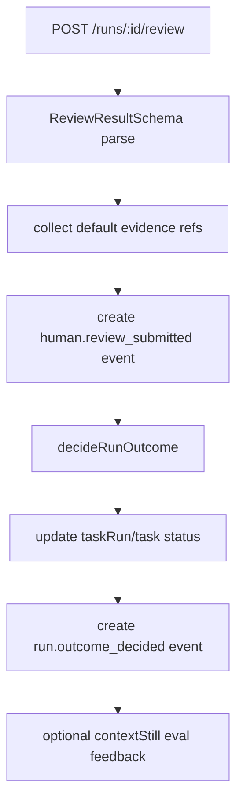

# ReviewResult Schema / Outcome Evidence 実装計画

## 目的

NightWorkers の human review を、単なる `action + note` から、outcome を確定する構造化された `ReviewResult` に引き上げる。

この計画のゴールは、review UI を豪華にすることではない。agent の自己申告、diff、verification、policy event、human 判断を分離し、最終 outcome がどの evidence に基づいて決まったかを ledger / JSONL / API で追跡できるようにすること。

## 優先順位 4 位にする理由

優先順位 1 位で `AgentRuntime` の実行境界を作る。優先順位 2 位で `RunEvent` と JSONL の証跡形式を作る。優先順位 3 位で `ToolPolicyGate` による安全判断を入れる。

次に必要なのは、agent の実行結果を人間がどう判断したかを、再現可能な形で残すこと。

- `completed` は agent の自己申告ではなく、review を通って確定する。
- `request_follow_up` は単なる status 変更ではなく、次 run に渡す修正指示を持つ。
- `accept_risk` は何の risk を受け入れたかを残す必要がある。
- `cancel` は差分破棄なのか、run 中止なのか、follow-up 不要なのかを区別する必要がある。
- policy block、verification failure、diff evidence を review 判断の材料として残す必要がある。

## 現状の前提

### 既存コード

- `api/modules/nightworkers/nightworkers.service.ts` の `reviewTaskRun` は `action` と `note` だけを受け取る。
- `reviewTaskRun` は `decideRunOutcome` に `humanAction` を渡し、`taskRuns.status` と `tasks.status` を更新する。
- review の保存は `taskEvents` に `state_change` と `run_outcome_decided` を作るだけで、structured review result はない。
- `shared/schemas/nightworkers.schema.ts` には review request / response schema が独立していない。
- `src/modules/nightworkers/types.ts` の `ReviewRunInput` は `runId`, `action`, `note` のみ。
- `src/modules/nightworkers/components/ChangeCard.tsx` と `NightWorkersShell.tsx` は主に `complete` action へ直結している。
- 旧 `src/routes/tasks.$id.tsx` には approve / discard の既存 UI がある。
- `api/services/run-control/run-outcome-gate.ts` は human action を outcome に変換できるが、review evidence は扱わない。
- `spec/run-event-taxonomy-jsonl-export-implementation-plan.md` では `human.review_submitted` と `run.outcome_decided` を canonical event として予定している。

### 前提とする未完了計画

この計画は以下の contract を前提にする。ただし実装時点で未完了なら、legacy `taskEvents` へ保存する fallback を使う。

- `RunEvent.type = 'human.review_submitted'`
- `RunEvent.type = 'run.outcome_decided'`
- `payloadJson.runEvent`
- JSONL export
- `tool.policy_blocked`
- `safety.policy_violation`

## 非ゴール

- PR 作成、merge、git commit はしない。
- diff apply / revert の自動化はしない。
- review 専用 DB table は初回必須にしない。
- LLM reviewer は実装しない。
- multi-reviewer approval flow は実装しない。
- UI redesign はしない。
- contextStill への学習登録を primary persistence にしない。

## 設計方針

### ReviewResult は event-sourced に始める

初回実装では DB migration を避ける。

- `taskEvents.payloadJson.reviewResult` に canonical `ReviewResult` を保存する。
- `human.review_submitted` event を review result の source of truth とする。
- `run.outcome_decided` event は review result id を参照する。
- 後続で必要になった場合だけ `task_reviews` table へ materialize する。



### ReviewResult と OutcomeGate を分ける

`ReviewResult` は人間の判断と evidence を表す。

`OutcomeGateResult` は task/run の最終状態を表す。

この 2 つを混ぜない。`ReviewResult.action` が outcome gate の input になり、`OutcomeGateResult` が review result に紐づく。

## ReviewResult Contract 案

### ReviewAction

既存 API 互換のため action 名は維持する。

```ts
export type ReviewAction =
  | 'complete'
  | 'request_follow_up'
  | 'cancel'
  | 'accept_risk';
```

### ReviewVerdict

UI / JSONL / review history では action より意味が読みやすい verdict を持つ。

```ts
export type ReviewVerdict =
  | 'approved'
  | 'changes_requested'
  | 'cancelled'
  | 'risk_accepted';
```

mapping:

| action | verdict | default next status |
| --- | --- | --- |
| `complete` | `approved` | `completed` |
| `request_follow_up` | `changes_requested` | `ready` |
| `cancel` | `cancelled` | `cancelled` |
| `accept_risk` | `risk_accepted` | `needs_review` |

`accept_risk` を `completed` にしない現状挙動は維持する。最終完了にしたい場合は別 action を後続で追加する。

### ReviewEvidenceRef

```ts
export type ReviewEvidenceRef =
  | { kind: 'run_event'; eventId: string; seq?: number; eventType?: string }
  | { kind: 'diff'; runId: string; bytes?: number; hasChanges?: boolean }
  | { kind: 'final_report'; runId: string }
  | { kind: 'verification'; eventId?: string; passed?: boolean; command?: string }
  | { kind: 'policy'; eventId?: string; code?: string; message?: string }
  | { kind: 'artifact'; artifactId: string; artifactKind?: string }
  | { kind: 'changed_file'; path: string; added?: number; deleted?: number };
```

### ReviewFinding

```ts
export type ReviewFindingSeverity = 'info' | 'warning' | 'blocking';

export interface ReviewFinding {
  severity: ReviewFindingSeverity;
  title: string;
  body?: string;
  filePath?: string;
  line?: number;
  evidenceRefs?: ReviewEvidenceRef[];
}
```

### ReviewResult

```ts
export interface ReviewResult {
  version: 1;
  id: string;
  runId: string;
  taskId: string;
  reviewer: {
    type: 'human' | 'system' | 'agent';
    id?: string;
    label?: string;
  };
  action: ReviewAction;
  verdict: ReviewVerdict;
  note?: string;
  statusBefore: string;
  statusAfter: string;
  outcome: {
    status: RunOutcomeStatus;
    reason: RunOutcomeReason;
    summary: string;
  };
  evidenceRefs: ReviewEvidenceRef[];
  findings: ReviewFinding[];
  humanCallouts: ReviewFinding[];
  agentFollowUps: string[];
  suggestedNextTasks: string[];
  riskAcceptance?: {
    acceptedRisk: string;
    reason?: string;
    evidenceRefs?: ReviewEvidenceRef[];
  };
  createdAt: string;
}
```

## API Contract

### Request

既存 request を後方互換で拡張する。

```ts
export const reviewRunRequestSchema = z.object({
  action: z.enum(['complete', 'request_follow_up', 'cancel', 'accept_risk']),
  note: z.string().optional(),
  evidenceRefs: z.array(reviewEvidenceRefSchema).optional(),
  findings: z.array(reviewFindingSchema).optional(),
  humanCallouts: z.array(reviewFindingSchema).optional(),
  agentFollowUps: z.array(z.string()).optional(),
  suggestedNextTasks: z.array(z.string()).optional(),
  riskAcceptance: z
    .object({
      acceptedRisk: z.string(),
      reason: z.string().optional(),
      evidenceRefs: z.array(reviewEvidenceRefSchema).optional(),
    })
    .optional(),
});
```

### Response

```ts
export const reviewRunResponseSchema = z.object({
  ok: z.boolean(),
  status: z.string(),
  outcome: outcomeGateResultSchema,
  reviewResult: reviewResultSchema,
});
```

既存 client が `{ ok, status }` だけを読む場合も壊さない。

## Default Evidence Collector

human が evidenceRefs を送らない場合でも、service が最低限の evidence を自動付与する。

対象:

- latest `final_report` event
- latest `run_outcome_decided` event があれば除外、review 前の outcome event は参照可
- `git.diff_collected` または legacy `final_report` / `tool_result` diff event
- `verification.finished` event
- `tool.policy_blocked` / `safety.policy_violation` event
- `taskRun.diffPatch` の有無と byte size
- `taskRun.finalReport` の有無

方針:

- evidence collector は read-only にする。
- collector failure は review 保存を失敗させない。
- collector failure は warning event として残す余地を持つが、初回は log に留める。

## 実装ステップ

### Step 1: ReviewResult type / schema を追加する

対象:

- `api/services/review-results/types.ts`
- `shared/schemas/nightworkers.schema.ts`

追加:

- `ReviewAction`
- `ReviewVerdict`
- `ReviewEvidenceRef`
- `ReviewFinding`
- `ReviewResult`
- `reviewRunRequestSchema`
- `reviewRunResponseSchema`

受け入れ条件:

- 既存 `action + note` request がそのまま通る。
- `reviewResultSchema` が OpenAPI に出る。
- `pnpm typecheck` が通る。

### Step 2: ReviewResult builder を追加する

対象:

- `api/services/review-results/build-review-result.ts`

役割:

- run、request、outcome、default evidence から `ReviewResult` を作る。
- action から verdict を決める。
- statusBefore / statusAfter を明示する。
- `id` と `createdAt` を生成する。

受け入れ条件:

- `complete` は `approved`。
- `request_follow_up` は `changes_requested`。
- `cancel` は `cancelled`。
- `accept_risk` は `risk_accepted`。
- `accept_risk` には `riskAcceptance` または note を要求するか、warning を返す方針が明示される。

初回方針:

- `accept_risk` は note なしでも通すが、`riskAcceptance.acceptedRisk` がない場合は note を acceptedRisk として扱う。

### Step 3: evidence collector を追加する

対象:

- `api/services/review-results/evidence-collector.ts`

役割:

- `taskRun` と `taskEvents` から default evidence refs を作る。
- canonical `RunEvent` があればそれを優先する。
- legacy event しかない場合は `eventType` / `type` から fallback する。

受け入れ条件:

- diff がある run は `kind: 'diff'` evidence を持つ。
- finalReport がある run は `kind: 'final_report'` evidence を持つ。
- policy event がある run は `kind: 'policy'` evidence を持つ。
- verification event がある run は `kind: 'verification'` evidence を持つ。

### Step 4: reviewTaskRun を structured persistence に移行する

対象:

- `api/modules/nightworkers/nightworkers.service.ts`
- `api/modules/nightworkers/nightworkers.repository.ts`

変更:

1. request を structured input として受ける。
2. run と events を読む。
3. default evidence refs を作る。
4. outcome を `decideRunOutcome` で決める。
5. `ReviewResult` を作る。
6. `human.review_submitted` event を作る。
7. taskRun/task status を更新する。
8. `run.outcome_decided` event を作る。

受け入れ条件:

- `payloadJson.reviewResult` に full ReviewResult が保存される。
- `run.outcome_decided` event は `reviewResultId` を参照する。
- 既存 legacy `eventType: 'state_change'` と `eventType: 'run_outcome_decided'` は維持される。
- contextStill feedback など補助処理が失敗しても review persistence は成功する。

### Step 5: run details に review results を含める

対象:

- `api/modules/nightworkers/nightworkers.service.ts`
- `api/modules/nightworkers/nightworkers.routes.ts`
- `shared/schemas/nightworkers.schema.ts`

方針:

- `GET /runs/:id` の response に `reviews` を追加する。
- `reviews` は `taskEvents` から `payloadJson.reviewResult` を抽出する。
- 既存 `events` は維持する。

受け入れ条件:

- review 未実施 run は `reviews: []`。
- review 済み run は sequence 順に review results が返る。
- 既存 client は `events` を引き続き読める。

### Step 6: route schema を更新する

対象:

- `api/modules/nightworkers/nightworkers.routes.ts`
- `shared/schemas/nightworkers.schema.ts`

変更:

- inline z.object の review request を `reviewRunRequestSchema` へ置き換える。
- response を `reviewRunResponseSchema` へ置き換える。

受け入れ条件:

- OpenAPI に structured review schema が出る。
- `{ action, note }` の最小 request は通る。
- invalid evidenceRefs は 400 になる。

### Step 7: frontend types と最小 UI を更新する

対象:

- `src/modules/nightworkers/types.ts`
- `src/modules/nightworkers/hooks/useNightWorkersWorkspace.ts`
- `src/modules/nightworkers/components/ChangeCard.tsx`
- 必要なら `src/modules/nightworkers/components/ThreadTimeline.tsx`

初回 UI 方針:

- 既存の `complete` ボタンは維持する。
- `ReviewRunInput` に optional structured fields を追加する。
- response type に `reviewResult` と `outcome` を追加する。
- debug timeline に `human.review_submitted` を表示できるようにする。

UI dialog は後続でもよい。まず API contract と persistence を固める。

受け入れ条件:

- 既存 `onReviewRun({ runId, action: 'complete' })` は壊れない。
- review 後に run details を再取得すると `reviews` が増える。
- review event が timeline に出る。

### Step 8: request_follow_up を次 run へ接続する準備を入れる

対象:

- `api/modules/nightworkers/nightworkers.service.ts`

初回方針:

- `request_follow_up` は現状通り task status を `ready` に戻す。
- `agentFollowUps` がある場合、次 run の user-visible message へ追加するかどうかは後続で実装する。
- 初回は `ReviewResult.agentFollowUps` に保存するだけにする。

受け入れ条件:

- follow-up 指示は失われない。
- status transition は現状互換。
- 次 run prompt への自動注入は非ゴールとして残る。

### Step 9: tests を追加・更新する

対象:

- `tests/services.review-results.test.ts`
- `tests/services.run-control.test.ts`
- `tests/routes.nightworkers.test.ts`
- 必要なら `tests/e2e/nightworkers-agent.spec.ts`

確認観点:

- minimal `{ action, note }` request で ReviewResult が作られる。
- `complete` review は status `completed` になる。
- `request_follow_up` review は task status `ready` になる。
- `accept_risk` review は risk accepted evidence を保存する。
- default evidence collector が diff/finalReport/policy/verification を拾う。
- `human.review_submitted` と `run_outcome_decided` event が保存される。
- `GET /runs/:id` に `reviews` が返る。
- contextStill feedback failure が review API を失敗させない。

## 受け入れ条件

- `ReviewResult` の type/schema が追加されている。
- `POST /runs/:id/review` は後方互換を維持したまま structured review を受け取れる。
- review 保存時に `human.review_submitted` event が作られる。
- outcome 決定時に `run.outcome_decided` event が reviewResultId を参照する。
- `payloadJson.reviewResult` に evidence refs を含む structured result が保存される。
- `GET /runs/:id` で review results を取得できる。
- review outcome と run outcome が分離されている。
- follow-up 指示、risk acceptance、blocking findings を失わない。
- JSONL export が review result を含められる形になっている。

## 検証コマンド

```bash
pnpm typecheck
pnpm test run tests/services.review-results.test.ts
pnpm test run tests/services.run-control.test.ts
pnpm test run tests/routes.nightworkers.test.ts
```

UI 表示まで触った場合:

```bash
pnpm test run tests/e2e/nightworkers-agent.spec.ts
```

## リスクと対策

| リスク | 対策 |
| --- | --- |
| review と outcome が混ざる | `ReviewResult` と `OutcomeGateResult` を別 type にする |
| DB table なしでは検索しづらい | 初回は event-sourced、必要になったら `task_reviews` table へ materialize |
| request_follow_up が status だけ戻して指示を失う | `agentFollowUps` を ReviewResult に保存する |
| accept_risk の意味が曖昧になる | `riskAcceptance` field を用意し、note fallback を明示する |
| contextStill 送信失敗で review が失敗する | contextStill feedback は primary persistence 後の non-blocking 処理にする |
| 旧 UI が壊れる | `{ action, note }` request と `{ ok, status }` response を維持する |

## 後続タスクへの接続

この計画が完了すると、次の task が実装しやすくなる。

1. Agent Outcome E2E Harness で review result を判定材料にする。
2. `request_follow_up` から次 run prompt を自動生成する。
3. ReviewResult を JSONL export / replay に含める。
4. policy block や verification failure の review dashboard を作る。
5. 将来の LLM reviewer / rubric plugin を `ReviewResult` に接続する。

## 完了判定

この task は、human review が structured `ReviewResult` として保存され、run outcome がその review result と evidence refs を参照し、既存 UI/API 互換を壊さずに review history を取得できる状態になったら完了とする。
