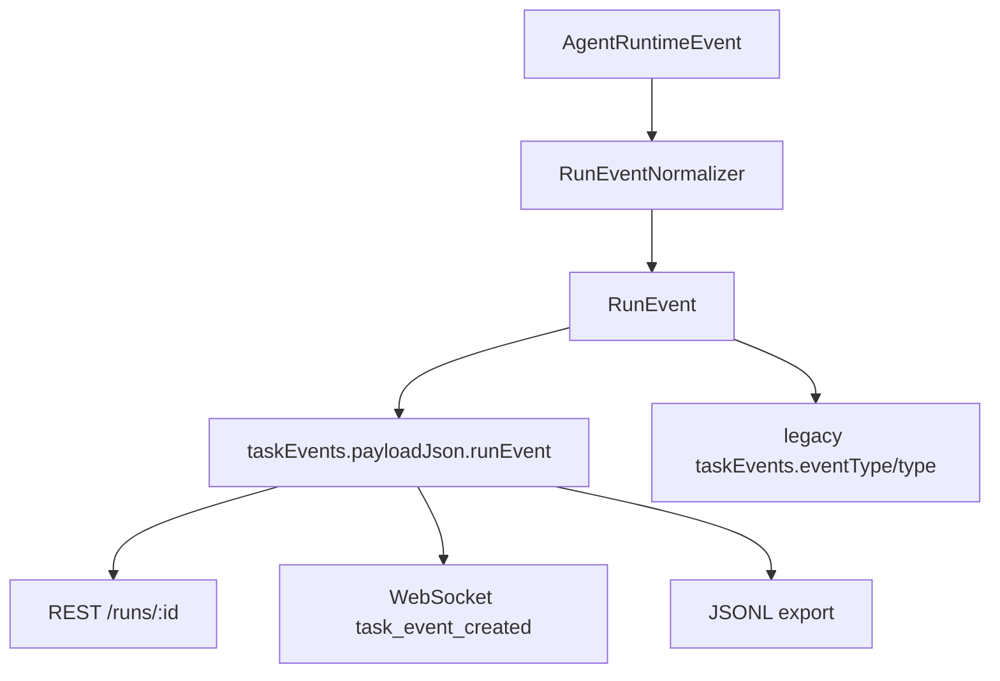

# RunEvent Taxonomy / JSONL Export 実装計画

## 目的

NightWorkers の run ledger を、DB、WebSocket、REST、JSONL export で同じ意味に読める event contract へ揃える。

この計画のゴールは、見た目の debug event を増やすことではない。agent の行動を後から検証、再生、比較、共有できるように、run event の語彙、順序、互換 mapping、export 形式を固定すること。

## 優先順位 2 位にする理由

優先順位 1 位の `AgentRuntime` は「実行する側の境界」を作る。次に必要なのは「実行で起きたことを正しく残す境界」である。

個人利用の Devin / Manus に近づけるには、agent が何をしたかを UI に流すだけでは足りない。以下が必要になる。

- 実行中に何が起きたかを時系列で説明できる。
- run が成功、失敗、停止、要レビューになった理由を event evidence として残せる。
- WebSocket で見た内容と REST で取得した ledger が一致する。
- JSONL として export でき、将来 replay / eval / regression test に使える。
- Pi や OpenHands などの外部実装を参考にしても、NightWorkers 側の product event 語彙に正規化できる。

## 現状の前提

### 既存コード

- `api/db/schema.ts` の `taskEvents` は `taskRunId`, `seq`, `actor`, `eventType`, `type`, `message`, `payloadJson`, `timestamp` を持つ。
- `api/modules/nightworkers/nightworkers.repository.ts` の `createTaskEvent` は run ごとに `seq` を採番し、`task_event_created` を WebSocket publish する。
- `api/services/realtime/nightworkers-ws.ts` は `task_event_created` に `taskId`, `runId`, `seq`, `timestamp` を載せる。
- `api/modules/nightworkers/nightworkers.service.ts` の `getTaskRun` は `events` を付けて run details を返す。
- `shared/schemas/nightworkers.schema.ts` の `taskEventSchema` は現状 loose で、canonical event schema を持たない。
- `src/modules/nightworkers/hooks/useNightWorkersWorkspace.ts` は `event.id` で dedupe し、`seq` 優先で sort する。
- `src/modules/nightworkers/components/ThreadTimeline.tsx` は `eventType` と `payloadJson` を直接見て debug 表示している。

### `../pi` から参考にする点

`../pi` は package として取り込まない。参照するのは以下のみ。

- agent lifecycle event の順序。
- tool execution event の start / update / end 分離。
- async event subscriber と event settlement の考え方。
- session JSONL の header + append-only line format。
- JSONL file path や session migration の失敗例から、format version と metadata を先に入れる設計。

NightWorkers では、Pi の event 名をそのまま保存しない。product としての `RunEvent` に変換する。

## 非ゴール

- Pi の JSONL session storage を移植しない。
- DB schema を大きく変更しない。
- replay runner は実装しない。
- UI redesign はしない。
- historical event の一括 migration はしない。
- event streaming の完全な token delta 表示は初回 scope に入れない。
- OpenHands / Pi adapter は作らない。

## 設計方針

### Producer event と persisted event を分ける

`AgentRuntimeEvent` は runtime が発行する producer event とする。

`RunEvent` は NightWorkers の ledger に保存され、REST、WebSocket、JSONL で露出する canonical event とする。



### 既存 DB column は互換 layer として使う

初回実装では DB migration を避ける。

- `taskEvents.eventType`: 既存 UI / e2e 互換の legacy category
- `taskEvents.type`: 既存 UI の severity / display category
- `taskEvents.message`: UI で読める短い説明
- `taskEvents.payloadJson.runEvent`: canonical `RunEvent`
- `taskEvents.payloadJson.legacyPayload`: 既存 payload を残す場所

これにより、旧 UI は壊さず、新 UI / export は canonical event を使える。

## RunEvent Contract 案

### 基本形

```ts
export type RunEventSeverity = 'debug' | 'info' | 'warning' | 'error' | 'checkpoint';

export type RunEventActor =
  | 'system'
  | 'runtime'
  | 'supervisor'
  | 'worker'
  | 'tool'
  | 'verifier'
  | 'human';

export interface RunEventBase<TType extends RunEventType = RunEventType> {
  version: 1;
  id?: string;
  runId: string;
  taskId?: string;
  seq?: number;
  timestamp: string;
  type: TType;
  severity: RunEventSeverity;
  actor: RunEventActor;
  message: string;
  data?: Record<string, unknown>;
}
```

`id` と `seq` は repository 保存後に確定するため、normalizer 入力では optional、REST / WS / JSONL 出力では必須として扱う。

### Event type

最初に固定する event type は以下に限定する。

```ts
export type RunEventType =
  | 'run.created'
  | 'run.context_compiled'
  | 'run.runtime_started'
  | 'run.runtime_finished'
  | 'run.outcome_decided'
  | 'run.recovered'
  | 'turn.started'
  | 'turn.finished'
  | 'model.request_started'
  | 'model.response_delta'
  | 'model.response_finished'
  | 'supervisor.decision'
  | 'tool.call_started'
  | 'tool.call_progress'
  | 'tool.call_finished'
  | 'tool.policy_blocked'
  | 'verification.started'
  | 'verification.finished'
  | 'git.status_collected'
  | 'git.diff_collected'
  | 'safety.budget_reached'
  | 'safety.policy_violation'
  | 'safety.repeated_failure'
  | 'human.review_submitted'
  | 'system.warning'
  | 'system.error';
```

増やす条件:

- UI 表示だけの都合では増やさない。
- export / replay / outcome evidence に意味がある場合だけ増やす。
- 既存 type で表現できる場合は `data.reason` や `data.phase` に寄せる。

## Legacy Mapping

`taskEvents.eventType` は当面残す。canonical `RunEvent.type` から legacy field へ一方向に変換する。

| RunEvent type | legacy eventType | legacy type |
| --- | --- | --- |
| `run.created` | `state_change` | `info` |
| `run.context_compiled` | `state_change` | `info` |
| `run.runtime_started` | `state_change` | `info` |
| `run.runtime_finished` | `state_change` | `checkpoint` |
| `run.outcome_decided` | `run_outcome_decided` | `info` |
| `run.recovered` | `state_change` | `warning` |
| `turn.started` | `supervisor_decision` | `info` |
| `turn.finished` | `supervisor_decision` | `info` |
| `model.request_started` | `supervisor_decision` | `info` |
| `model.response_delta` | `info` | `info` |
| `model.response_finished` | `supervisor_decision` | `info` |
| `supervisor.decision` | `supervisor_decision` | `info` |
| `tool.call_started` | `tool_call` | `info` |
| `tool.call_progress` | `tool_call` | `info` |
| `tool.call_finished` | `tool_result` | `info` or `error` |
| `tool.policy_blocked` | `error` | `error` |
| `verification.started` | `checkpoint` | `checkpoint` |
| `verification.finished` | `checkpoint` | `checkpoint` or `error` |
| `git.status_collected` | `tool_result` | `info` |
| `git.diff_collected` | `final_report` | `checkpoint` |
| `safety.budget_reached` | `error` | `error` |
| `safety.policy_violation` | `error` | `error` |
| `safety.repeated_failure` | `error` | `error` |
| `human.review_submitted` | `state_change` | `info` |
| `system.warning` | `warning` | `warning` |
| `system.error` | `error` | `error` |

## JSONL Export Contract

### 出力形式

JSONL は 1 行 1 JSON object とする。

1 行目は header。

```json
{"type":"nightworkers_run","version":1,"runId":"...","taskId":"...","repositoryId":"...","createdAt":"...","cwd":"...","workerKind":"native-local","exportedAt":"..."}
```

2 行目以降は event。

```json
{"type":"run_event","version":1,"runId":"...","seq":1,"event":{"version":1,"type":"run.runtime_started","severity":"info","actor":"runtime","message":"Runtime started","timestamp":"...","data":{}}}
```

最後に summary line を出す。

```json
{"type":"run_summary","version":1,"runId":"...","status":"needs_review","summary":"...","finalReport":"...","diffBytes":1234,"eventCount":42}
```

### 出力順

- header
- `seq` 昇順の event
- summary

`seq` がない event は export 対象として扱わない。保存済み ledger から export するため、通常は `seq` が必ず存在する。

### Redaction 方針

初回は secret scanner を作らない。ただし以下の field は export に含めない。

- repository `safetyPolicy`
- environment variables
- provider API key
- auth token

tool result payload は基本含める。ただし、将来 redaction が入れられるように `serializeRunEventForJsonl` を単一の出口にする。

## 実装ステップ

### Step 1: RunEvent type と schema を追加する

対象:

- `api/services/run-events/types.ts`
- `shared/schemas/nightworkers.schema.ts`

追加:

- `RunEventType`
- `RunEventSeverity`
- `RunEventActor`
- `RunEventBase`
- `runEventSchema`
- `runEventJsonlLineSchema`

受け入れ条件:

- DB migration はしない。
- `taskEventSchema` は既存 field を維持しつつ、`payloadJson.runEvent` を optional canonical event として扱える。
- `pnpm typecheck` が通る。

### Step 2: RunEvent normalizer を追加する

対象:

- `api/services/run-events/normalizer.ts`

役割:

- canonical `RunEvent` から legacy `createTaskEvent` input を作る。
- legacy payload を `payloadJson.legacyPayload` に保存する。
- canonical event を `payloadJson.runEvent` に保存する。
- `eventType` / `type` の mapping を一箇所に閉じ込める。

受け入れ条件:

- 既存 `eventType` を期待する UI / e2e が壊れない。
- severity が `error` の event は legacy `type: 'error'` になる。
- mapping に存在しない `RunEvent.type` は typecheck 上起きない。

### Step 3: repository に canonical writer を追加する

対象:

- `api/modules/nightworkers/nightworkers.repository.ts`

追加:

- `createRunEvent(event: RunEventBase, options?: { legacyPayload?: unknown }): Promise<TaskEvent>`

方針:

- 既存 `createTaskEvent` は残す。
- 新規コードは `createRunEvent` を使う。
- `createRunEvent` は normalizer を通して `createTaskEvent` を呼ぶ。
- `createTaskEvent` の `seq` 採番と WebSocket publish は既存通り使う。

受け入れ条件:

- 保存後の `payloadJson.runEvent.id` と `payloadJson.runEvent.seq` が task event と一致する。
- WebSocket payload に canonical event が含まれる。
- 既存 direct `createTaskEvent` 呼び出しは段階的移行対象として残せる。

### Step 4: AgentRuntime sink と supervisor event を接続する

対象:

- `api/services/agent-runtime/ledger-sink.ts`
- `api/services/supervisor/supervisor-loop.ts`
- `api/services/runner/NativeLocalRunner.ts` または `api/services/agent-runtime/NativeAgentRuntime.ts`

変更:

- `runtime_started` -> `run.runtime_started`
- `runtime_finished` -> `run.runtime_finished`
- `supervisor_decision` -> `supervisor.decision`
- tool call start -> `tool.call_started`
- tool result -> `tool.call_finished`
- git status -> `git.status_collected`
- git diff -> `git.diff_collected`
- budget stop -> `safety.budget_reached`
- repeated tool failure -> `safety.repeated_failure`
- run outcome decided -> `run.outcome_decided`

受け入れ条件:

- 主要 event の `payloadJson.runEvent` が埋まる。
- 旧 `eventType: 'tool_call' | 'tool_result' | 'supervisor_decision' | 'final_report'` は維持される。
- `GET /api/runs/:id` の events は seq 昇順で返る。

### Step 5: REST schema と frontend type を canonical 対応にする

対象:

- `shared/schemas/nightworkers.schema.ts`
- `src/modules/nightworkers/types.ts`
- `src/modules/nightworkers/components/ThreadTimeline.tsx`

変更:

- `TaskEvent.payloadJson?.runEvent` を型として表現する。
- UI は優先的に `payloadJson.runEvent.type` を読む。
- 旧 event は fallback として `event.eventType || event.type` を読む。

受け入れ条件:

- 既存 event も表示できる。
- canonical event は badge に `RunEvent.type` が出る。
- `showDebugEvents` の挙動は変えない。

### Step 6: JSONL serializer を追加する

対象:

- `api/services/run-events/jsonl-export.ts`

追加:

- `serializeRunToJsonl(input): string`
- `serializeRunEventForJsonl(event): string`
- `buildRunJsonlHeader(run, repository): object`
- `buildRunJsonlSummary(run, events): object`

方針:

- file write はしない。まずは pure serializer にする。
- export endpoint からも test からも使えるようにする。
- event は保存済み `taskEvents` から作る。

受け入れ条件:

- header / event / summary の順に出る。
- 各行が valid JSON。
- `seq` が昇順。
- legacy event でも `payloadJson.runEvent` がない場合は fallback conversion して export できる。

### Step 7: JSONL export endpoint を追加する

対象:

- `api/modules/nightworkers/nightworkers.routes.ts`
- `api/modules/nightworkers/nightworkers.service.ts`

追加 route:

- `GET /runs/:id/export.jsonl`

応答:

- `Content-Type: application/x-ndjson; charset=utf-8`
- `Content-Disposition: attachment; filename="nightworkers-run-{runId}.jsonl"`

受け入れ条件:

- 存在しない run は `404`。
- run と events を DB から読み、serializer で返す。
- secret field は含めない。
- export endpoint は run 実行中でも現在までの event を出せる。

### Step 8: tests を追加する

対象:

- `tests/services.run-events.test.ts`
- `tests/routes.nightworkers.test.ts`
- 必要なら `tests/e2e/nightworkers-agent.spec.ts`

確認観点:

- normalizer が legacy `eventType` を正しく出す。
- repository writer が `payloadJson.runEvent.id/seq` を保存後に補完する。
- JSONL serializer が header / event / summary を valid JSONL として出す。
- export endpoint が `application/x-ndjson` を返す。
- 既存 e2e の `tool_call` / `tool_result` / `supervisor_decision` expectations が壊れない。

## 受け入れ条件

- `RunEvent` の type/schema が追加されている。
- 新規 event writer は canonical event から legacy task event へ変換する。
- 既存 UI / e2e が依存する legacy `eventType` は維持される。
- `payloadJson.runEvent` に canonical event が保存される。
- REST / WS / JSONL が同じ canonical event を見られる。
- JSONL export endpoint が追加される。
- JSONL は header、seq 昇順 event、summary の順で出る。
- Pi 由来の設計は event order / JSONL append format の参考に留まり、package dependency は増えない。

## 検証コマンド

```bash
pnpm typecheck
pnpm test run tests/services.run-events.test.ts
pnpm test run tests/routes.nightworkers.test.ts
pnpm test run tests/e2e/nightworkers-agent.spec.ts
```

e2e が重い場合は、まず unit / route test で JSONL と mapping を固める。UI 表示順の確認は Realtime Event Reconciler task で深掘りする。

## リスクと対策

| リスク | 対策 |
| --- | --- |
| canonical event と legacy event が二重管理になる | normalizer を唯一の mapping 実装にする |
| DB migration なしでは query しにくい | 初回は payloadJson に保存し、検索最適化が必要になった時だけ migration を検討する |
| JSONL に機密情報が混ざる | serializer を単一出口にし、header から secrets/safetyPolicy/env を除外する |
| UI が旧 eventType 前提で壊れる | legacy field を維持し、UI は canonical 優先 + legacy fallback にする |
| event type が増えすぎる | 増やす条件を export/replay/outcome evidence に限定する |
| run 中 export と終了後 export で summary が違う | summary line に現在の run status を入れ、途中 export は snapshot として扱う |

## 後続タスクへの接続

この計画が完了すると、次の task が実装しやすくなる。

1. ToolPolicyGate を `tool.policy_blocked` / `safety.policy_violation` として記録する。
2. ReviewResult schema を `human.review_submitted` / `run.outcome_decided` と接続する。
3. Agent Outcome E2E Harness で JSONL fixture を使える。
4. Realtime Event Reconciler が canonical `RunEvent` を前提にできる。
5. 将来の replay / import / eval が run ledger ではなく JSONL contract に依存できる。

## 完了判定

この task は、NightWorkers の新規 run event が canonical `RunEvent` として保存され、既存 UI 互換を維持したまま、`GET /runs/:id/export.jsonl` で検証可能な JSONL を取得できる状態になったら完了とする。
