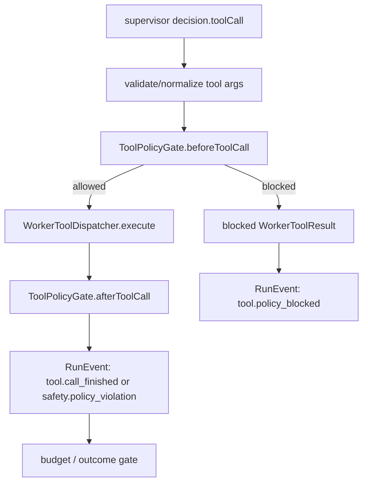

# ToolPolicyGate 実装計画

## 目的

NightWorkers の全 worker tool 実行を、共通の `ToolPolicyGate` に通す。

この計画のゴールは、`safetyPolicy` を「各 tool がそれぞれ努力して見る optional input」から、「実行直前と実行直後に必ず評価される runtime contract」へ引き上げること。

## 優先順位 3 位にする理由

優先順位 1 位の `AgentRuntime` は実行境界を作る。優先順位 2 位の `RunEvent` は実行証跡を正規化する。次に必要なのは、危険な tool 実行を境界で止め、止めた理由を ledger に残すこと。

個人利用の Devin / Manus を目指す場合、agent に強い権限を渡すほど、policy gate は必須になる。

- path policy が read/search/edit/run cwd に一貫して効く。
- command policy が shell 実行前に必ず効く。
- read-before-edit が edit tool 実行前に必ず効く。
- policy block が LLM error や tool crash ではなく、明示的な `tool.policy_blocked` として残る。
- tool 実行後にも、出力、diff、artifact、secret 混入を確認する入口ができる。

## 現状の前提

### 既存コード

- `api/services/worker-tools/tool-policy-enforcer.ts` に `enforcePathPolicy`、`enforceCommandPolicy`、`resolveCommandTimeout` がある。
- `api/services/worker-tools/path-policy.ts` は repoRoot 外、allowedPaths、deniedPaths を判定できる。
- `api/services/worker-tools/command-policy.ts` は destructive / unknown / chained command を拒否できる。
- `api/services/supervisor/supervisor-loop.ts` は `safetyPolicy` を worker tools に渡している。
- `api/services/supervisor/supervisor-loop.ts` は tool dispatch を巨大な `if/else` で直接実行している。
- `read_file`、`list_dir`、`find_file`、`search_files`、`apply_patch`、`replace_content`、`run_command` は一部 policy を個別実装している。
- `git_status`、`git_diff` は repoRoot を使うが、共通 policy gate は通っていない。
- `apply_patch` は target policy 判定前に temp patch file を repoRoot に書く。
- `search_files` は ripgrep 実行後に denied path の結果を filter しているため、preflight としては弱い。
- `api/services/agent-runtime/types.ts` には `AgentSafetyPolicy` が既にある。
- `spec/run-event-taxonomy-jsonl-export-implementation-plan.md` では `tool.policy_blocked` と `safety.policy_violation` を canonical event として予定している。

### `../pi` から参考にする点

`../pi` は package として取り込まない。参照するのは hook design のみ。

- `beforeToolCall` は tool args validation 後、tool 実行前に block できる。
- `afterToolCall` は tool result を event 化する前に補正できる。
- block は tool crash ではなく error tool result として扱う。
- terminate hint は runtime-only の判断であり、標準 tool result transcript とは分ける。

NightWorkers ではこれを `ToolPolicyGate.beforeToolCall` / `ToolPolicyGate.afterToolCall` として再解釈する。

## 非ゴール

- Pi の hook 実装を移植しない。
- OpenHands の sandbox policy を移植しない。
- 外部 MCP tool の全面解禁はしない。
- browser / computer-use policy は今回実装しない。
- network policy は型の余地だけ残し、初回実装では `run_command` の command policy に留める。
- tool の並列実行は導入しない。
- DB schema migration はしない。
- UI redesign はしない。

## 設計方針

### ToolPolicyGate は dispatcher の前後に置く



重要なのは、各 tool が個別に policy を見る前に、supervisor loop の tool dispatch 境界で必ず gate を通すこと。

既存 tool 内の policy check は削除しない。初回実装では defense-in-depth として残す。

### ToolPolicyGate は判断、tool は実行に寄せる

- Gate: 実行してよいかを判定する。
- Dispatcher: toolName と args から実際の tool 関数を呼ぶ。
- Tool: 実処理をする。既存 policy check は fallback guard として残す。
- RunEvent writer: policy decision と tool result を ledger に残す。

## Public Contract 案

### ToolName

```ts
export type WorkerToolName =
  | 'list_dir'
  | 'find_file'
  | 'read_file'
  | 'search_files'
  | 'apply_patch'
  | 'replace_content'
  | 'run_command'
  | 'run_verification'
  | 'git_status'
  | 'git_diff';
```

初回は既存 native tools だけを対象にする。外部 MCP tool は explicit allow されるまで対象外。

### ToolCallRequest

```ts
export interface ToolCallRequest {
  runId: string;
  iteration: number;
  toolName: WorkerToolName;
  args: Record<string, unknown>;
  repoRoot: string;
  safetyPolicy?: AgentSafetyPolicy;
  readFiles: string[];
}
```

### ToolPolicyDecision

```ts
export type ToolPolicyDecision =
  | {
      allowed: true;
      normalizedArgs: Record<string, unknown>;
      warnings?: string[];
      effectiveLimits?: {
        timeoutSeconds?: number;
      };
    }
  | {
      allowed: false;
      code:
        | 'ACCESS_DENIED'
        | 'COMMAND_BLOCKED'
        | 'UNKNOWN_COMMAND'
        | 'CHAINED_COMMAND_BLOCKED'
        | 'READ_BEFORE_EDIT_REQUIRED'
        | 'TOOL_NOT_ALLOWED'
        | 'INVALID_TOOL_ARGS'
        | 'POLICY_VIOLATION';
      message: string;
      evidence?: Record<string, unknown>;
    };
```

### ToolPolicyGate

```ts
export interface ToolPolicyGate {
  beforeToolCall(request: ToolCallRequest): Promise<ToolPolicyDecision>;
  afterToolCall(
    request: ToolCallRequest,
    result: WorkerToolResult<unknown>
  ): Promise<{
    result: WorkerToolResult<unknown>;
    policyViolation?: ToolPolicyDecision;
    warnings?: string[];
  }>;
}
```

`beforeToolCall` は実行可否を決める。`afterToolCall` は結果の安全性、redaction、artifact 記録可否、terminate hint の余地を扱う。

初回の `afterToolCall` は最小実装でよい。

- command output / diff の secret redaction が通っているか確認する。
- tool result が denied path を返していないか確認する。
- output size / artifact size の警告を返す。

## Tool 別 preflight policy

| Tool | Preflight |
| --- | --- |
| `list_dir` | `relativePath` が repoRoot 内、allowedPaths 内、deniedPaths 外 |
| `find_file` | `relativePath` が repoRoot 内、allowedPaths 内、deniedPaths 外 |
| `read_file` | `filePath` が repoRoot 内、allowedPaths 内、deniedPaths 外 |
| `search_files` | search root / glob が deniedPaths を横断しない。可能なら search root を allowedPaths に制限 |
| `apply_patch` | patch target file を実行前に抽出し、path policy と read-before-edit を確認 |
| `replace_content` | target file の path policy と read-before-edit を確認 |
| `run_command` | cwd path policy、command allowlist、blockedCommands、chain/expansion block、timeout cap |
| `run_verification` | `run_command` と同じ。ただし reason 必須 |
| `git_status` | repoRoot が valid allowed workspace |
| `git_diff` | repoRoot が valid allowed workspace。diff redaction postflight |

## Tool 別 postflight policy

| Tool | Postflight |
| --- | --- |
| `read_file` | payload content が過大でないこと、denied path 由来でないこと |
| `search_files` | matches に denied path が含まれないこと |
| `apply_patch` | changedFiles が preflight target と一致し、denied path を含まないこと |
| `replace_content` | filePath が preflight target と一致すること |
| `run_command` | stdout/stderr truncation、secret redaction hook、exitCode の扱い |
| `run_verification` | verified false を policy violation と混同しないこと |
| `git_diff` | diff redaction と size warning |

## 実装ステップ

### Step 1: 型を追加する

対象:

- `api/services/tool-policy/types.ts`

追加:

- `WorkerToolName`
- `ToolCallRequest`
- `ToolPolicyDecision`
- `ToolPolicyGate`
- `ToolPolicyViolationCode`

受け入れ条件:

- `AgentSafetyPolicy` は `api/services/agent-runtime/types.ts` から再利用する。
- 既存 worker tool の input/output type はまだ変更しない。
- `pnpm typecheck` が通る。

### Step 2: tool manifest を追加する

対象:

- `api/services/tool-policy/tool-manifest.ts`

役割:

- toolName ごとに required args、operation kind、path args、command args、mutation 有無を定義する。

例:

```ts
type ToolManifestEntry = {
  name: WorkerToolName;
  mutatesWorkspace: boolean;
  requiresReadBeforeEdit: boolean;
  pathArgs: string[];
  commandArg?: string;
  cwdArg?: string;
};
```

受け入れ条件:

- supervisor loop に hardcoded された toolName list と manifest が一致する。
- 未登録 tool は `TOOL_NOT_ALLOWED` で block される。

### Step 3: beforeToolCall を実装する

対象:

- `api/services/tool-policy/tool-policy-gate.ts`

実装:

- toolName が manifest にあるか確認する。
- args が object であることを確認する。
- path args を repoRoot 基準で解決し、`enforcePathPolicy` する。
- `apply_patch` は patch target を実行前に抽出する。
- `replace_content` / `apply_patch` は既存ファイルに対して `requireReadBeforeEdit` を確認する。
- `run_command` / `run_verification` は `enforceCommandPolicy` と timeout cap を適用する。
- `search_files` は deniedPaths を横断する検索を避けるため、検索 root / glob restriction を正規化する。

受け入れ条件:

- policy block 時に実 tool 関数は呼ばれない。
- block result は `WorkerToolResult` に変換できる。
- command の chained syntax、unknown command、blocked command は実行前に拒否される。

### Step 4: afterToolCall を実装する

対象:

- `api/services/tool-policy/tool-policy-gate.ts`

実装:

- result payload の path list に denied path が混ざっていないか確認する。
- `git_diff` / `run_command` の出力に secret-like pattern がないか確認し、必要なら warning または redaction hook を通す。
- `apply_patch.changedFiles` が preflight target と一致するか確認する。
- policy violation と通常の tool failure を区別する。

受け入れ条件:

- postflight violation は `safety.policy_violation` として event 化できる。
- 通常の test failure / command exitCode failure は policy violation にならない。
- 既存 tool result shape は維持される。

### Step 5: blocked WorkerToolResult builder を追加する

対象:

- `api/services/tool-policy/blocked-result.ts`

役割:

- `ToolPolicyDecision` から `WorkerToolResult` を作る。
- `ok: false`
- `error.code` は policy code
- `payload` は tool ごとの empty payload を返す。

受け入れ条件:

- `list_dir` など payload shape が必要な tool でも UI / tests が壊れない。
- block は throw ではなく normal tool result として supervisor loop に戻る。

### Step 6: WorkerToolDispatcher を追加する

対象:

- `api/services/worker-tools/dispatcher.ts`

役割:

- `toolName` と normalized args から既存 tool 関数を呼ぶ。
- supervisor loop の巨大な `if/else` を段階的に置き換える。
- readFiles 更新に必要な metadata を返す。

受け入れ条件:

- 既存 tool の呼び出し引数が維持される。
- `read_file` 成功時だけ `readFiles` が更新される。
- unsupported tool は dispatcher ではなく policy gate で block される。

### Step 7: supervisor-loop に gate を接続する

対象:

- `api/services/supervisor/supervisor-loop.ts`

変更:

1. `decision.toolCall` を `ToolCallRequest` に変換する。
2. `ToolPolicyGate.beforeToolCall` を呼ぶ。
3. blocked なら actual tool を呼ばず、blocked result を作る。
4. allowed なら dispatcher で tool 実行する。
5. `ToolPolicyGate.afterToolCall` を呼ぶ。
6. `tool.policy_blocked` / `tool.call_finished` / `safety.policy_violation` を ledger に残す。
7. budget controller には final result の `ok` を渡す。

受け入れ条件:

- 全 tool が同じ gate を通る。
- 既存 `tool_call` / `tool_result` legacy event は維持される。
- policy block は `needs_human` へ即時停止するか、tool failure budget に任せるかを明示する。

初回方針:

- `TOOL_NOT_ALLOWED`、`ACCESS_DENIED`、`COMMAND_BLOCKED`、`READ_BEFORE_EDIT_REQUIRED` は `needs_human` へ即時停止する。
- command exit failure や verification failure は通常 tool failure として扱う。

### Step 8: RunEvent と outcome gate に接続する

対象:

- `api/services/run-events/*`
- `api/services/run-control/run-outcome-gate.ts`
- `api/services/run-control/types.ts`

変更:

- `tool.policy_blocked` を emit する。
- `safety.policy_violation` を emit する。
- `SupervisorLoopResult.stoppedBy` に `policy` を追加する。
- `decideRunOutcome` に `safetyViolation` または `stoppedBy: 'policy'` を渡せるようにする。

受け入れ条件:

- policy violation は `OutcomeGateResult.reason: 'policy_violation'` になる。
- policy block と tool crash が区別される。
- JSONL export に policy evidence が残る。

### Step 9: worker tool 内 policy を defense-in-depth に整理する

対象:

- `api/services/worker-tools/*.ts`

方針:

- 初回では削除しない。
- 重複チェックは許容する。
- tool 内 policy error code を gate と合わせる。
- `apply_patch` の temp patch file は repoRoot 直下ではなく OS temp dir に置くか、target 抽出を pure parser に寄せる。
- `search_files` は deniedPaths を読む前に検索対象を絞る。

受け入れ条件:

- gate を bypass して直接 tool が呼ばれても最低限の path/command policy は効く。
- ただし通常経路では gate が先に block する。

### Step 10: tests を追加・更新する

対象:

- `tests/services.tool-policy-gate.test.ts`
- `tests/services.worker-tools.test.ts`
- `tests/services.supervisor.test.ts`
- 必要なら `tests/routes.nightworkers.test.ts`

確認観点:

- denied path の read/list/find/search/edit が preflight で block される。
- `apply_patch` は target file 未読なら実行前に block される。
- `replace_content` は target file 未読なら実行前に block される。
- `git push`、`curl`、`pnpm test && rm -rf .`、unknown command が実行前に block される。
- `maxCommandSeconds` が effective timeout に反映される。
- policy block は `tool.policy_blocked` / `safety.policy_violation` event になる。
- policy violation は outcome gate で `needs_human` / `policy_violation` になる。
- 既存 worker tool tests は通る。

## 受け入れ条件

- `ToolPolicyGate` の type と実装が追加されている。
- supervisor-loop の全 worker tool 実行が `beforeToolCall` を通る。
- supervisor-loop の全 worker tool result が `afterToolCall` を通る。
- policy block 時に actual tool は実行されない。
- blocked result は throw ではなく `WorkerToolResult` として扱われる。
- policy block と通常 tool failure が ledger / outcome で区別される。
- `tool.policy_blocked` と `safety.policy_violation` が RunEvent / JSONL に残る。
- 既存の tool 内 safety check は defense-in-depth として残る。
- Pi 由来の hook design は参考に留まり、package dependency は増えない。

## 検証コマンド

```bash
pnpm typecheck
pnpm test run tests/services.tool-policy-gate.test.ts
pnpm test run tests/services.worker-tools.test.ts
pnpm test run tests/services.supervisor.test.ts
pnpm test run tests/services.run-control.test.ts
```

policy event を route / JSONL まで接続した場合:

```bash
pnpm test run tests/routes.nightworkers.test.ts
```

## リスクと対策

| リスク | 対策 |
| --- | --- |
| 各 tool の個別 policy と gate が二重管理になる | 初回は defense-in-depth として許容し、mapping / code は gate に寄せる |
| search_files が deniedPaths を読んでから filter する | preflight で検索 root / glob を制限し、fallback scanner も同じ制限にする |
| apply_patch が policy 前に temp file を作る | target extraction を gate 側 pure parser に寄せ、temp file は OS temp dir に移す |
| command allowlist が厳しすぎる | block reason を ledger に残し、repository safetyPolicy で明示的に広げられる余地を後続で作る |
| policy violation と test failure が混ざる | command exit failure は tool failure、policy block は policy violation として分ける |
| UI が旧 `tool_result` 前提で見えなくなる | legacy `eventType` は維持し、canonical RunEvent を追加する |

## 後続タスクへの接続

この計画が完了すると、次の task が実装しやすくなる。

1. ReviewResult schema で policy block を human review の判断材料にする。
2. Agent Outcome E2E Harness で危険操作 fixture を検証する。
3. JSONL replay で policy decision を再評価できる。
4. browser / computer-use / external MCP tool の capability policy を追加できる。
5. sandbox runtime で OS レベルの制限と ToolPolicyGate を二重化できる。

## 完了判定

この task は、全 worker tool 実行が共通 `ToolPolicyGate` を通り、policy block が actual execution 前に止まり、ledger / RunEvent / outcome で通常失敗と区別できる状態になったら完了とする。
